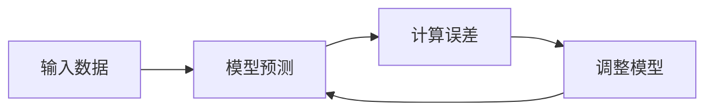
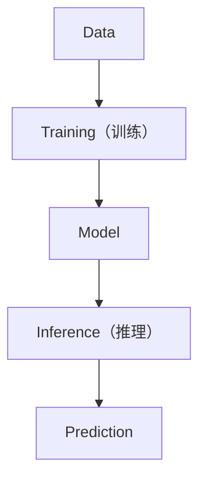

# Foundation 0：数据、模型与训练

> **阅读建议**
>
> 本节只介绍三个贯穿全书的重要概念：Data（数据）、Model（模型）、Training（训练）。它们几乎会出现在后面的每一个章节中。本节不会涉及复杂数学，也不会推导任何公式。

---

# F0.1 Data（数据）

如果让一个从未见过苹果的小朋友描述苹果，他一定不知道，因为**没有见过**。AI 也是一样：如果没有数据，模型什么也学不会。因此：

> **Data（数据）就是模型学习知识的来源。**

不同任务的数据形式差异很大：

| 任务 | 数据示例 |
| --- | --- |
| 房价预测 | 面积 80㎡ → 房价 300万；120㎡ → 450万；150㎡ → 580万 |
| 聊天机器人 | 用户："你好" → 助手："你好，请问有什么可以帮助你的？" |
| 翻译模型 | Hello → 你好 |
| 语言模型 | "I love AI" → 预测 "AI" 后面的 Token |

虽然这些数据形式不同，但本质完全一样：

> **数据就是模型观察世界的方式。**

---

# F0.2 Model（模型）

很多人第一次学习 AI，都会觉得模型（Model）非常神秘。其实可以把模型理解成：

> **一个根据输入产生输出的函数。**

| 任务 | 输入 → 模型 → 输出 |
| --- | --- |
| 房价预测 | 面积 → 模型 → 房价 |
| 图片识别 | 图片 → 模型 → 猫 |
| 语言模型 | 前面的文字 → 模型 → 下一个 Token |

不同 AI 模型，只是输入不同、输出不同，真正工作的方式其实非常相似。因此，本书后面提到的 Language Model、Vision Model、Large Language Model，它们都属于 **Model**。

---

# F0.3 什么叫训练（Training）？

模型刚创建出来的时候什么都不会。例如输入 `I love`，模型可能输出 `banana`，显然是错误的。于是模型需要不断修改自己：

不断重复，模型预测越来越准确，这个过程就叫：

> **Training（训练）**

训练结束以后，模型会得到一组能够完成任务的参数，以后再遇到新的输入，就可以直接进行预测。

---

# F0.4 什么叫推理（Inference）？

训练结束以后，模型进入另一种状态，叫 **Inference（推理）**。例如用户输入 `I love`，模型直接预测 `AI`。整个过程中，模型不会继续学习，也不会修改自己的参数。

因此，训练和推理最大的区别就是：

| | Training | Inference |
| --- | --- | --- |
| 是否学习 | 不断学习 | 只预测 |
| 是否修改参数 | 不断修改参数 | 不修改参数 |

这一点会在第一章再次详细介绍，这里只需要建立一个初步印象。

---

# F0.5 本书中的三个关键词

请牢记下面三个词：

- **Data**：模型学习知识的来源。
- **Model**：根据输入产生输出的程序。
- **Training**：利用数据不断调整模型。

几乎所有现代 AI 系统，都可以抽象成下面这张图：

后面的 Language Model、Transformer、GPT、Agent、VLA，都会不断重复这套流程，区别仅仅在于：数据不同、模型结构不同、任务不同。

---

# 本节总结

> **数据决定模型能够学到什么。模型决定如何完成预测。训练决定模型最终有多聪明。**

理解了这三个概念，后面的所有章节都会容易很多。下一章，我们将真正开始回答整本书的第一个问题：

> **什么是 Language Model（语言模型）？**
