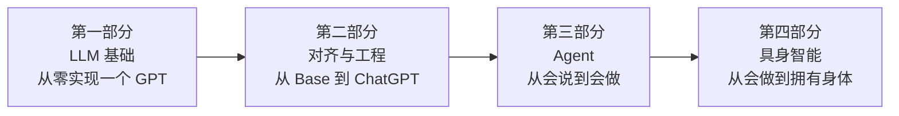

# 开始之前（Prelude）

> 这本书的目标是**普惠**：不需要昂贵的硬件，不需要任何境外付费服务，任何人都能跟着书里的代码把每一个实验亲手跑一遍——最终达到**能动手做、能讲清原理、能满足 LLM/多模态/Agent/具身智能应用开发**的程度。

---

## P0.1 这本书讲什么

一条主线，四个阶段：



- **第一部分**：从 Tokenizer 到 Transformer 到 GPT，逐行从零实现，讲清"模型怎么工作"；
- **第二部分**：SFT、偏好学习、推理、安全，以及支撑这一切的 GPU/训练/推理/评测工程；
- **第三部分**：Agent 开发与 RAG——Tool Calling、规划、记忆、多智能体、协议、运行时，以及求职必备的 RAG 和综合实战项目；
- **第四部分**：具身智能——把 LLM 与 Agent 的方法论应用到物理世界（运动学、强化学习、模仿学习、VLA），全部用仿真与 NumPy 完成，无需真实机器人。

## P0.2 这本书怎么用

每一章都遵循"讲清概念 → 给你一段可独立运行的代码 → 亲手跑出结果 → 提出思考题"的节奏。**所有实验代码都可以复制到一个 `.py` 文件中直接运行**，不需要跳转到其他文件找依赖。建议按顺序阅读，但每一章都尽量自包含——你可以随时跳到感兴趣的章节。

## P0.3 硬件门槛分级（重要）

本书的实验已经尽最大努力降低门槛，但不同部分对硬件的要求不同。这里给出**如实**的分级，你不需要一张高端卡也能学完大部分内容：

| 内容 | 硬件要求 | 说明 |
|---|---|---|
| 第一部分 1~12 章（语言模型基础） | **纯 CPU** 笔记本即可 | 模型只有几百万参数，几分钟跑完 |
| 第一部分 13 章（LLM 能力实验） | 建议 8GB 显存，CPU 可跑但慢 | 4-bit 量化加载 1.5B~7B 模型 |
| 第二部分（对齐与工程） | 建议 8GB 显存（QLoRA / vLLM 实验） | 部分实验（反向传播、RAG）纯 CPU 即可 |
| 第三部分（Agent 与 RAG） | 建议 8GB 显存 | RAG 检索、反向传播等实验纯 CPU 即可 |
| 第四部分（具身智能） | **纯 CPU** 笔记本即可 | 全部用仿真环境与 NumPy，无需任何机器人硬件 |

**没有 GPU 怎么办？** 三个免费/低成本方案：

1. **Google Colab**：免费提供 T4 GPU，每天有额度，足以跑完大部分实验；
2. **Kaggle Notebook**：免费 GPU（每周额度），和 Colab 类似；
3. **国内云 GPU（AutoDL 等）**：按小时计费、支持支付宝/微信，几元钱即可跑完一节需要 GPU 的实验——这是国内读者最省心的方案。

> 每个实验章节开头都标注了该实验的硬件要求（`> **硬件要求**：...`），照着做即可。

## P0.4 环境安装

```bash
# 建议使用 Python 3.10 或以上
python -m venv llm-venv
source llm-venv/bin/activate   # Windows: llm-venv\Scripts\activate
pip install torch transformers numpy   # 基础三件套
# 各实验章节开头会标注该实验额外需要的依赖（如 peft、trl、vllm 等），按需安装
```

**国内 pip 加速**：`pip install -i https://pypi.tuna.tsinghua.edu.cn/simple <包名>`

## P0.5 模型与网络（国内访问）

本书全部使用开源模型（Qwen 系列），在本地运行，**不需要注册任何境外付费 API**。国内网络的两个注意点：

1. **Hugging Face 直连很慢**：设置镜像 `export HF_ENDPOINT=https://hf-mirror.com`，或用 ModelScope（魔搭）下载模型；
2. **GitHub 拉取代码慢**：用国内镜像加速，或直接下载 ZIP。

## P0.6 版本声明与 API 漂移应对（与时俱进的关键）

**版本声明**：本书代码基于 2026 年初的生态版本编写与实跑验证（Python 3.10+、PyTorch 2.x、transformers 5.x、langgraph 0.x 等）。大模型生态迭代极快，**框架 API 可能在你阅读时已经变动**——这是所有技术书的共同挑战，不是错误。

**遇到"代码跑不通"时，按这个顺序排查**：

1. **先看报错信息**：90% 的问题能在报错里直接找到答案（缺依赖、版本不匹配、参数名改了）；
2. **查官方文档**：优先查该库的官方文档和 Release Notes，API 变更一定记录在那里；
3. **锁定版本**：如果希望完全复现本书结果，用 `requirements.txt` 锁定版本（各实验章节已给出关键依赖及其版本）；
4. **降级/升级**：多数报错是版本太新（API 改名）或太旧（没有新特性），`pip install 包==版本` 即可解决；
5. **搜索报错原文**：把报错原文放进搜索引擎，通常能找到对应 issue 和解决办法。

> **核心认知**：框架会变，但本书教你的**原理**（显存层级、算子融合、RAG 流程、Agent Loop、对齐目标函数）不会变。API 变了，你查一下文档就能改过来；原理没学会，换什么 API 都写不出东西。这正是"与时但进、学习成本低"的真义——**把精力花在不变的东西上，让变化的东西随时可查。**

---

## 开始阅读

准备好之后，从第一部分第 1 章开始，按顺序进入即可。祝你在读完这本书之后，真正掌握"从零构建到大模型、多模态、Agent、具身智能"的开发与应用能力。
