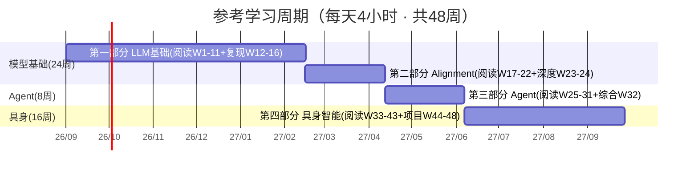

# 第三章 参考学习周期计划（Reference Study Plan）

> 本章给出一份**参考性**的 48 周学习排期，适用于"每天稳定投入约 4 小时、希望系统且扎实地学完全书四部分"的读者。它不是硬性要求——你可以根据自己的基础、可投入时间和目标，自由伸缩每一段的周数。排期的核心思想是：**不要把富余工时用来"赶进度"，而要用在"深度复现与自测"上**，因为这本书的掌握标准是"能动手做、能讲清原理"，不是"读完了"。

---

## 3.1 前提与整体节奏

| 项 | 设定 |
|---|---|
| 每日投入 | **4 小时**（精读 1h + 跑实验 2h + 思考/笔记 1h） |
| 每周投入 | 4 × 7 = **28 小时** |
| 总周期 | **48 周**（约 11 个月），合计约 **1344 小时** |
| 三段划分 | 第一部分 + 第二部分 = **24 周**；第三部分 Agent = **8 周**；第四部分 具身智能 = **16 周** |
| 覆盖内容 | 全书 158 个 `.md` 文件（含约 100 个动手实验），不含第 0 部分环境章与第 5/6 部分（规划中） |

> **为什么这样分**：第一部分（LLM 基础）是地基，逐行实现最耗理解力，给最多时间；第四部分（具身智能）数学最重（强化学习、运动学、控制论），节奏放到最慢（约 2 文件/周）；第三部分（Agent）最偏应用、与前序知识复利最强，节奏最快。每个阶段内部都嵌入了"复现 / 深度 / 自测周"，用来把工时真正转化为掌握度。

---

## 3.2 总览时间线

---

## 3.3 第一部分：LLM 基础（W1–W16，70 文件）

> 阅读集中在 W1–W11；W12–W16 为"蒙写复现 + 深度 + 自测"周，不引入新内容，专门把前面学过的东西真正写一遍、讲一遍。

| 周 | 类型 | 本周文件（编号即文件名前缀） | 重点产出 |
|---|---|---|---|
| W1 | 阅读+环境 | 0.前言、0.感谢名单；1、1.1、1.2、2、2.1 | 配好 HF 镜像/pip 源；跑通 Bigram；写字符 Tokenizer |
| W2 | 阅读 | 2.2、2.3、2.4、2.5、2.6、3、3.1 | 完成 Mini BPE 训练；理解 Embedding |
| W3 | 阅读 | 3.2、3.3、4、4.1、5、5.1、5.2 | 两层 MLP（Linear→Loss）；N-Gram 数据集 + 模型 |
| W4 | 阅读 | 6、6.1、6.2、7、7.1、7.2 | 神经 LM 前向/评估；反向传播 + 梯度下降训练 |
| W5 | 阅读 | 8、8.1、8.2、9、9.1、9.2、9.3 | AdamW + 初始化；WikiText-2 训练；RNN 起步 |
| W6 | 阅读 | 9.4、9.5、9.6、9.7、9.8、9.9、9.10 | 完整 RNN Cell→Unrolling；LSTM 门控 |
| W7 | 阅读 | 9.11、9.12、10、10.1、10.2、10.3、10.4 | RNN 收尾；Attention（分数/相似度/Softmax/加权） |
| W8 | 阅读 | 10.5、10.6、10.7、10.8、10.9、11、11.1 | QKV / Multi-Head；Transformer Block；**从零训 Mini-GPT** |
| W9 | 阅读 | 12、12.1、13、13.1、14、14.1 | RoPE / RMSNorm / SwiGLU；Stacking；架构家族对比 |
| W10 | 阅读 | 15、15.1、15.2、15.3、15.4 | Scaling Law / ICL / CoT；量化 + KV Cache 实战 |
| W11 | 阅读 | 16、16.1、17、17.1、17.2、18 | 多模态 Patch Embedding / VQ-VAE / 音频 Token；第一部分总结 |
| W12 | **复现** | 无新文件 | 蒙写 BPE + Mini-GPT（不查书），对照补漏 |
| W13 | **复现** | 无新文件 | 手写 Attention / RoPE，可视化注意力矩阵 |
| W14 | **复现** | 无新文件 | 从零写训练循环（SGD→AdamW），重跑 WikiText-2 |
| W15 | **深度** | 无新文件 | 补 Transformer 数学推导 + 章末思考题二刷 |
| W16 | **自测** | 无新文件 | Capstone：Tokenizer + GPT 小模型端到端 demo |

---

## 3.4 第二部分：Alignment 与训练工程（W17–W24，21 文件）

| 周 | 类型 | 本周文件 | 重点产出 |
|---|---|---|---|
| W17 | 阅读 | 1、1.1、2、2.1 | Base vs Aligned 行为差异；SFT 数据集 + Chat Template |
| W18 | 阅读 | 2.2、3、3.1 | **LoRA 微调** Base→Instruct；Reward Model 训练 |
| W19 | 阅读 | 3.2、4、4.1 | **DPO** 偏好优化；Reasoning Alignment 对比 |
| W20 | 阅读 | 5、5.1、6、6.1 | Safety 护栏（Llama Guard）；GPU/算子 + Triton 实战 |
| W21 | 阅读 | 7、7.1、8、8.1 | 训练栈（Accelerate / DeepSpeed）；推理栈（vLLM） |
| W22 | 阅读 | 9、9.1、10 | Evaluation / Benchmark / LLM-as-Judge；第二部分总结 |
| W23 | **深度** | 无新文件 | 端到端跑通 LoRA + SFT + DPO，写 PPO vs DPO 对比笔记 |
| W24 | **自测** | 无新文件 | Capstone：把一个 Base 模型对齐成能聊天的助手 |

> 第二部分多数实验（反向传播、RAG）纯 CPU 即可，但 LoRA / vLLM / Triton 建议 8GB 显存；W1 已配好云 GPU（AutoDL）方案，需要时随时调用。

---

## 3.5 第三部分：Agent（W25–W32，34 文件）

| 周 | 类型 | 本周文件 | 重点产出 |
|---|---|---|---|
| W25 | 阅读 | 1、1.1、2、2.1 | 最小 Agent Workflow；Tool / Function Calling |
| W26 | 阅读 | 3、3.1、4、4.1、4.2 | Planning + LangGraph；Memory + RAG（含最小 RAG 实战） |
| W27 | 阅读 | 5、5.1、6、6.1 | Reflection 循环；Agent Loop（LangGraph 复现） |
| W28 | 阅读 | 7、7.1、7.2、8、8.1 | Graph Engineering + Checkpoint；Multi-Agent（CrewAI） |
| W29 | 阅读 | 9、9.1、9.2、10、10.1 | MCP / A2A / AG-UI 协议；Skill 封装与自动加载 |
| W30 | 阅读 | 11、11.1、11.2、11.3、12、12.1 | Agent Runtime（部署/流式/评测）；执行沙箱 + 浏览器自动化 |
| W31 | 阅读 | 13、13.1、14、14.1、15 | Agentic Runtime / OS；**读 15.综合实践 指南** |
| W32 | **项目** | 15（落地构建） | Capstone：RAG + LLM + FastAPI 文档问答 Agent 端到端 |

---

## 3.6 第四部分：具身智能（W33–W48，33 文件，节奏最慢）

| 周 | 类型 | 本周文件 | 重点产出 |
|---|---|---|---|
| W33 | 阅读 | 1、2、2.1 | Physical AI 概念；二连杆正逆运动学实现 |
| W34 | 阅读 | 3、3.1、4 | MDP / Q-Learning 走迷宫；Behavior Cloning |
| W35 | 阅读 | 4.1、4.2、5 | DAgger；GAIL（逆强化）；机器人感知 / 深度图反投影 |
| W36 | 阅读 | 5.1、6、6.1 | 点云；Action Chunking / ACT；多模态坍缩修复 |
| W37 | 阅读 | 7、7.1、8 | VLA 零样本抓取；Reward Shaping（Sparse vs 势函数） |
| W38 | 阅读 | 8.1、8.2、9 | PPO 连续控制；World Model + 基于模型规划 |
| W39 | 阅读 | 9.1、10、10.1 | 动态模型规划；PyBullet CartPole 仿真 |
| W40 | 阅读 | 10.2、10.3、10.4 | MuJoCo / Isaac Lab / Genesis 仿真 |
| W41 | 阅读 | 10.5、11、11.1 | LeRobot 生命周期；Sim-to-Real 域随机化验证 |
| W42 | 阅读 | 12、12.1、13 | LLM Planner + Skill Library；数据飞轮 |
| W43 | 阅读 | 13.1、14、15 | 数据集清洗；硬件 / 算力；第四部分总结 |
| W44 | **深度** | 无新文件 | RL 数学二刷（贝尔曼 / 策略梯度推导） |
| W45 | **复现** | 无新文件 | 蒙写 ACT 或 Diffusion Policy 训练脚本 |
| W46 | **项目** | 无新文件 | VLA 抓取 / Sim2Real 小 demo |
| W47 | **项目** | 无新文件 | 长时程分层 Agent（LLM Planner + Skill）综合项目 |
| W48 | **总复习** | 无新文件 | 四部分知识地图串联 + 个人作品集整理 |

> 第四部分全部用仿真环境与 NumPy 完成，**纯 CPU 笔记本即可**，无需任何机器人硬件。

---

## 3.7 每日 4 小时怎么切（贯穿全程）

- **第 1 小时**：精读当天章节（主 `.md`），画结构图 / 记概念卡；
- **第 2–3 小时**：跑动手实验（`.1` / `.2`），改参数、看现象、调 bug——这是"掌握"和"知道"的分水岭；
- **第 4 小时**：章末思考题 + 用自己的话复述 + 给代码写注释小结。

---

## 3.8 三条关键提醒

1. **深度周（W12–16、W23–24、W44–48）最容易被跳过，但最值钱**。它们不读新内容、纯产出，决定你是"知道"还是"掌握"。请像对待正常周一样排进日历。
2. **环境前置**：W1 务必把 Hugging Face 镜像（`HF_ENDPOINT=https://hf-mirror.com`）、pip 清华源、可选云 GPU（AutoDL）调通。第二部分（W18/W20/W21）和第四部分仿真器都依赖它，中途卡环境会吞掉大量周次。
3. **技术会演进**：大模型生态迭代极快，你读到时部分 API（MCP/A2A、vLLM、VLA 模型等）可能已变动。每个阶段顺手补 1–2 篇同期论文或官方文档。**框架会变，原理不会变**——把精力花在不变的东西上（见前言 P0.6）。

> 这份计划覆盖的是"本书内容"的完整掌握。若想进一步追踪领域前沿，可在每段结束后用 1 个缓冲周阅读对应方向的近期论文（如 Transformer 架构、对齐算法、Agent 协议、VLA/World Model）。

---

*祝你在 48 周后，真正具备"从零构建大模型、多模态、Agent 到具身智能"的开发与应用能力。*
