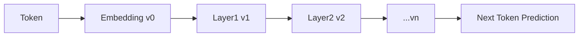
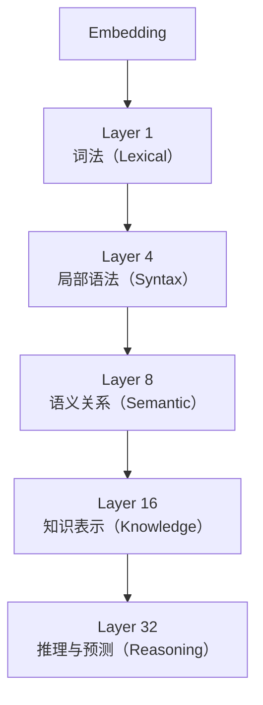

# 11. Stacking Transformer

## 为什么 Transformer 要堆叠很多层？

上一章，我们已经搭建了一个完整的 Transformer Block，它已经能够理解上下文、建立 Token 之间的关系、独立加工每个 Token、输出新的表示。那么为什么 GPT、BERT、LLaMA 都不是只用一个 Block，而要堆叠几十层甚至上百层？

**一个 Block 能理解什么？** 看一句简单的话 `Tom bought a red car yesterday.`。经过一个 Transformer Block，模型已经知道 `Tom` 是买的人，`car` 是被买的东西，`red` 修饰 `car`。这些关系已经能够建立，但这是否已经足够？其实还远远不够。

一个生活中的例子：假设你第一次阅读一本小说：第一遍只知道有哪些人物；第二遍开始理解人物之间的关系；第三遍发现很多伏笔；第四遍终于理解作者真正想表达什么。每读一遍，你看到的都是同一本书，但理解越来越深。Transformer 也是一样——**具体每一层分别在加深哪部分的理解，我们会在本章第三节详细拆解**，这里先解决一个更基础的问题：为什么不能一步到位？

**为什么不能用一个超大的 Block？** 既然需要更强能力，为什么不用一个特别大的 FFN 或 Attention？答案是：深层网络能够逐步建立层次化表示。计算机视觉也是类似规律——第一层识别边缘，第二层识别纹理，第三层识别物体，第四层识别场景。语言同样需要逐层抽象，而不是一步完成。

**GPT 为什么有几十层？** GPT-2 Small 有 12 层，GPT-2 XL 有 48 层，LLaMA 系列通常采用几十层 Transformer Block，更大的模型往往使用更多层和更宽的隐藏维度。随着层数增加，模型可以逐步建立更加复杂、更加抽象的表示，但层数增加也意味着训练成本显著提高。因此模型设计始终是在能力、效率、成本之间寻找平衡。

**本节小结**：✅ 一个 Transformer Block 已经可以理解上下文 ✅ 多层 Block 的价值在于不断深化表示 ✅ Transformer 本质上是一种层次化表示学习模型。一句话总结：**Transformer 不是靠某一层变聪明，而是靠一层一层不断深化理解。**

---

## Representation Learning——Transformer 真正学习的是什么？

上面，我们已经知道 Transformer 为什么要堆叠很多层。但还有一个问题：Transformer 到底在学习什么？很多初学者会认为 Transformer 学习的是 Token。其实不是，Transformer 真正学习的是：

> **Representation（表示）**

**什么叫 Representation？** 看一句话 `Apple released a new iPhone.`。请问 `Apple` 是什么？不同的人可能回答水果、公司、品牌，甚至股票。计算机应该怎么理解？

Tokenizer 首先把 `Apple` 变成一个编号，例如 `5821`，但编号没有任何语义，就像身份证号码不能说明一个人的性格。Embedding 把 `5821` 映射成向量 `[0.12,-0.38,0.77,...]`，这个向量就是 Apple 最初的表示。但这里仍然存在问题：`Apple released a new iPhone.` 和 `Apple tastes sweet.` 中，Embedding 得到的是**同一个向量**，因为 Embedding 不知道上下文。

**Representation 会不断变化。** Transformer 真正神奇的地方就在这里。第一层 Attention 开始阅读整个句子，于是 `Apple` 变成 `Apple'`——科技公司；第二层 FFN 继续加工，变成 `Apple''`——消费电子公司；第三层再结合 `iPhone`、`released`，最终变成 `Apple'''`——正在发布新品的科技公司。请注意，Token 始终没有变，变化的是内部表示。

一个生活中的例子：第一次别人告诉你 `Tom`，你只知道这是一个名字；后来知道 `Tom` 是软件工程师；再后来知道 `Tom` 在 OpenAI 做研究员；最后知道 `Tom` 正在研究 Agent。Tom 始终还是 Tom，变化的是你脑子里的认识。Transformer 也是这样工作的。

**每一层都在修改表示。** Embedding 得到 `v₀`，经过第一层得到 `v₁`，第二层得到 `v₂`，第三层得到 `v₃`……直到最后一层得到 `vₙ`。真正用于预测的是**最后一层表示**，而不是 Embedding。

**为什么叫 Representation Learning？** 因为模型并没有学习 "Apple" 这个单词，而是在学习：

> **如何用一个向量表示 Apple 当前的含义。**

这个过程就叫 **Representation Learning（表示学习）**。

**Transformer 为什么这么强？** 传统方法中，一个词只有一个固定向量表示；Transformer 完全不同，同一个词在不同上下文拥有不同表示——`Apple released iPhone` 中表示科技公司，`Apple tastes sweet` 中表示水果。Tokenizer 没有变化，Embedding 没有变化，真正变化的是 Transformer 不断更新的 Representation。

很多人认为 LLM 学习的是语言，更准确地说，LLM 学习的是：

> **语言在不同上下文中的表示。**

Prediction 只是最后一步，Representation 才是整个模型花费几十层不断优化的对象。

**本节小结**：✅ Token 只是离散编号 ✅ Embedding 提供初始表示 ✅ Transformer 每一层都在不断更新表示 ✅ 最终用于预测的是最后一层表示。一句话总结：**Transformer 并不是在学习 Token，而是在不断学习和优化 Token 的表示（Representation）。**

---

## Transformer 不同层到底学到了什么？

上面，我们知道 Transformer 真正学习的是 Representation，每经过一层，Representation 都会发生变化。新的问题来了：为什么 Transformer 会有几十层？这些层是不是都在做一样的事情？答案是不是——虽然每一层结构完全一样，但它们最终学会了不同层次的知识。

一个生活中的例子：第一次认识一个人，你首先注意到的是他长什么样；然后慢慢知道他叫什么、做什么工作、兴趣是什么；继续接触，又知道他的性格、价值观、思维方式。了解一个人并不是一次完成，而是越来越深入。Transformer 理解一句话，也是一样。

**第一层看到什么？** 例如 `The little cat is sleeping.`，第一层 Attention 最容易学习的是"哪些词经常一起出现？"——例如 `little → cat`，`is → sleeping`。因此第一层通常学习局部搭配、拼写模式、简单语法，这些信息离输入最近，也最容易获得。

**中间层开始理解语义。** 随着 Representation 越来越丰富，模型已经知道 `cat` 是动物，`sleeping` 是动作。于是开始建立更复杂的关系：谁在睡觉？动作属于谁？这个动作持续吗？这一阶段更多学习的是语义关系，而不是词本身。

**深层开始关注任务目标。** 继续向上，模型已经拥有整句话的丰富表示，此时模型更关心"下一步应该预测什么？"。例如 `The capital of France is`，最后几层会逐渐聚焦 `Paris`，因为模型已经开始为最终预测组织信息。

**为什么会自然形成这种分工？** Transformer 并没有规定第一层只能学语法、最后一层必须学推理，这些现象完全来自训练过程。原因很简单：第一层距离输入最近，最容易利用字符、单词、局部关系；最后一层距离输出最近，最容易直接影响预测结果。于是训练结束以后，自然形成了层次化分工。

**示例：不断完善同一个表示。** 输入 `bank`：第一层是英文单词；第二层是名词；第三层根据上下文判断是金融机构或河岸；第四层结合整句话，例如"正在讨论贷款"；最终模型知道这里一定表示银行。请注意，真正变化的是 Representation，不是 Token。

**Transformer 像一座工厂。** 可以把整个 Transformer 想象成一条流水线：第一道工序识别原材料，第二道工序加工零件，第三道工序组装产品，第四道工序质量检测。虽然每一个工位使用的设备几乎一样，但由于输入不同，承担的任务自然不同。Transformer 也是这样——每一层都是相同结构，却完成不同层次的信息加工。

请注意，这不是固定规则，不同模型、不同任务，层的功能可能有所不同，但整体上都会呈现**由浅入深、逐步抽象**的趋势。

**一个重要的发现。** 研究人员发现，如果把浅层直接删除，模型的拼写、语法通常受到影响；如果删除中间层，模型开始理解困难，实体关系下降；如果删除最后几层，模型预测能力明显下降。这说明不同层虽然结构相同，但已经形成了不同功能。

**本节小结**：✅ Transformer 每一层结构相同 ✅ 不同层会自然学习不同层次的信息 ✅ 浅层更关注局部模式和语法 ✅ 中层更关注语义和关系 ✅ 深层更接近推理和最终预测。一句话总结：**Transformer 的强大，不是来自某一层，而是来自多层不断深化 Representation，最终形成层次化理解。**

---

但光看理论还不够——"不同层学到不同信息"这个结论是否真实存在于一个真正训练好的模型中？下一节，我们将加载一个开源小模型，亲手把每一层的表示"挖"出来验证这个结论：**11.1 层层深入：探测不同层的表示**。

之后，我们将回答一个很多人都会疑惑的问题：Transformer 论文提出的是 `Encoder + Decoder`，为什么今天的大语言模型却几乎全部变成了 `Decoder Only`？Encoder 去哪了？下一章，我们正式进入 **Transformer 家族**。
