# 12. 大语言模型（LLM）

## Next Token Prediction——GPT 为什么只做一件事，却学会了世界知识？

到这里，我们已经学习了 Attention、Transformer、Transformer Block、Decoder。但还有最后一个谜团：GPT 为什么会这么聪明？很多人第一次接触 GPT 都会认为模型学习了语法、数学、代码、医学、法律，甚至推理。但事实上，GPT 整个训练过程几乎只做了一件事情：

> **预测下一个 Token（Next Token Prediction）。**

为什么只完成这一项任务，模型却学会了几乎所有知识？

`The capital of France is` 下一步应该输出 `Paris`。训练时 GPT 真正看到的是 `The capital of France is Paris`，但由于 Causal Mask，模型在预测 `Paris` 的时候只能看到 `The capital of France is`，于是它必须猜。

**每一个位置都在训练。** 很多人误以为一句话只训练一次，其实不是。例如 `I love artificial intelligence.` 会变成多个训练样本：`I → love`，`I love → artificial`，`I love artificial → intelligence`，`I love artificial intelligence → .`。一句话会产生多个训练样本。

一篇 1000 个 Token 的文章，训练时其实得到 999 次预测；一本几十万 Token 的书，就是几十万个训练样本；整个互联网数万亿 Token，意味着数万亿次 Next Token Prediction。这也是 GPT 能够利用海量数据不断学习的原因。

**为什么不用人工标注？** 传统机器学习通常需要"图片→猫"、"评论→积极"这样的人工标签，成本非常高。GPT 完全不同：`The capital of France is Paris.` 最后一个 Token 天然就是标签。因此互联网几乎所有文本都可以直接训练，不需要任何人工标注——这就是**自监督学习（Self-Supervised Learning）**。

**GPT 真正在学习什么？** 很多人认为 GPT 是在背答案，其实不是。来看三句话：`The capital of France is Paris.`、`Paris is the capital city of France.`、`France has its capital in Paris.`——写法不同，但如果模型想预测下一个 Token，它最终都必须学会 `France → Paris` 之间的关系，否则很多地方都会预测错误。为了做好预测，模型不得不学习语言规律、事实知识、实体关系，甚至逻辑推理。

一个类比：如果每天做几十亿道填空题（"中国的首都是（）"、"苹果公司的创始人是（）"），慢慢地你会发现，为了提高正确率，必须真正理解世界。GPT 也是一样，它不是为了学习知识而学习知识，而是为了提高预测准确率，不得不学习知识。

**Prediction 是目标，Knowledge 是结果。** 这是理解 GPT 最重要的一句话。模型真正优化的是 **Prediction Loss**，不是 Knowledge Loss，也不是 Reasoning Loss。知识、推理、数学、代码，都是为了降低 Prediction Loss 自然学会的能力。

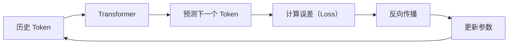

整个训练过程只是不断重复这一件事情，直到数万亿 Token 全部学习完成。

**本节小结**：✅ GPT 的训练目标只有一个：Next Token Prediction ✅ 一句话可以拆成多个训练样本 ✅ 互联网文本天然提供监督信号，因此无需人工标注 ✅ 为了提升预测准确率，模型逐渐学会语言、知识和推理。一句话总结：**GPT 并不是为了学习知识而训练，而是为了更准确地预测下一个 Token；知识，是这一训练目标自然产生的结果。**

---

## Scaling Law——为什么模型越大，能力越强？

上面，我们学习了 GPT 的训练目标只有一个：Next Token Prediction。但为什么大家一直在训练更大的模型？例如 GPT-2 → GPT-3 → GPT-4 → GPT-5，参数越来越多，训练数据越来越大，计算量越来越高。模型真的会一直变聪明吗？

一个简单的例子：假设有两个学生，第一个只有 100 个知识点，第二个掌握 10000 个知识点，谁更容易回答陌生问题？答案通常是第二个，因为更多知识意味着更多可能性。神经网络也是一样。

**什么是模型参数？** 很多同学第一次听到 `7B`、`13B`、`70B` 都会疑惑，`B` 表示 **Billion（十亿）**，例如 `7B` 表示 70 亿个参数。这些参数本质上就是神经网络中的权重（Weights），记录了模型在训练过程中学到的模式和规律。

可以把参数想象成一本笔记，模型训练时不断修改里面的内容。刚开始所有参数几乎都是随机数，经过数万亿 Token 训练之后，这些数字逐渐编码了语言规律、事实知识、代码模式、数学关系。参数并不是一句一句存储知识，而是用大量数值共同表示模型学到的能力。

**参数越多，为什么能力越强？** 假设只有 10 个参数，模型几乎什么都表示不了；增加到 1000 个，可以学习更多规律；增加到 100 万，能够表示更复杂的关系；增加到数十亿，模型终于可以同时学习语言、代码、数学、知识、推理。请注意，参数不是知识本身，而是**表示知识的容量**。

一个类比：一本 10 页的笔记本，学习一年很多内容只能删掉重写；如果给你 1000 页，就可以记录更多内容、整理更多知识、建立更多联系。模型参数就像这本越来越大的笔记本。

**训练误差会发生什么变化？** 研究人员不断扩大模型，发现一个有趣的现象：随着参数增加，训练误差并没有突然下降，而是稳定下降。模型越来越大，预测越来越准确。这种规律后来被称为 **Scaling Law（规模定律）**。

**什么是 Scaling Law？** Scaling 意思是扩大规模，Law 意思是规律。研究发现，如果同时增加参数、数据、算力，模型性能通常会持续提升，而且这种提升具有相当稳定的趋势。这就是 Scaling Law。

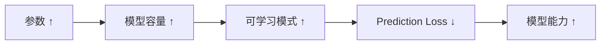

**注意：不是无限变大。** 很多同学容易产生一个误解：是不是模型越大越好？其实不是。如果参数越来越大，但训练数据没有增加，模型很容易过拟合；如果数据很多，但模型太小，又无法充分学习。因此真正重要的是**参数、数据和计算资源之间的平衡**。这也是 Chinchilla Scaling Law 研究的核心问题。

很多人认为 LLM 的成功来自更复杂的算法，实际上 Transformer 自 2017 年提出之后，核心结构变化并没有想象中那么大。真正推动 LLM 快速发展的三个因素是：更大的模型（Parameters）、更多的数据（Data）、更强的计算资源（Compute）。这三者共同构成了现代大语言模型发展的基础。

**本节小结**：✅ 参数本质上是模型学习得到的权重 ✅ 更多参数意味着更强的表示能力 ✅ Scaling Law 描述了模型规模与性能之间的规律 ✅ 模型能力不仅取决于参数，还取决于数据和计算资源。一句话总结：**Scaling Law 并不是"模型越大越好"，而是在参数、数据和计算资源共同增长时，模型能力会呈现稳定提升的规律。**

---

## Emergent Ability——为什么大模型会突然"开窍"？

上面，我们学习了 Scaling Law，模型随着参数、数据、算力增加，能力通常会持续提升。但研究人员后来又发现了一个更加神奇的现象：有些能力似乎并不是一点一点提高，而是在某个规模之后突然出现。这就是 **Emergent Ability（涌现能力）**。

一个有趣的例子：假设有三个模型：100M参数的模型，数学题几乎不会；1B 参数的模型，偶尔能够做对；100B 参数的模型，突然能够完成多步推理、代码生成、复杂问答。很多研究者第一次看到这些实验结果时，都觉得模型仿佛突然"开窍"了。

**什么叫Emergence？** Emergence 中文通常翻译为**涌现**。它描述的是一些能力在小模型上几乎观察不到，但模型规模增长后却开始表现得非常明显，例如多步数学推理、代码补全、常识推理、长文本理解、工具调用能力。这些能力似乎并不是人为添加进去的，而是在训练过程中自然形成。

一个类比：一个小朋友刚开始学数学只会`1+1`，后来慢慢学会乘法、方程、几何，某一天他突然能够自己证明一道题。这种能力往往建立在大量知识积累之上，模型也是类似的。

**为什么会出现这种现象？** 一种经典解释认为：随着模型容量增加，Representation 越来越丰富，不同知识之间开始建立更多联系。当这些联系足够复杂时，模型就能够完成以前做不到的任务，因此看起来像是能力突然出现。

**现代研究怎么看？** 近几年，越来越多研究发现，"涌现"并不一定意味着模型内部发生了某种神秘变化。还有另一种可能：**能力一直在缓慢提升，只是观察能力的方法存在阈值。** 例如一道考试规定 60 分及格，模型从 58 分提高到 61 分，在图表上看起来就像突然"学会了"，实际上能力一直都在增长，只是第一次超过了及格线。

假设模型能力真实变化是 `20,30,40,50,58,61,65,70`，如果评价标准是"≥60 表示会做"，那么实验结果会变成"不会、不会、不会、不会、不会、突然会了！"。真正变化的是评价方式，而不是能力本身。

**那么，涌现到底存不存在？** 今天学术界更普遍的看法是：对于某些任务，确实可能观察到非常明显的能力跃迁；但对于另一些任务，能力提升更接近连续变化。因此"涌现能力"更适合作为一种经验现象，而不是绝对规律。

无论能力是真正突然出现，还是连续增长，有一点已经得到广泛验证：随着模型规模扩大，模型能够完成越来越复杂的任务，例如更长链条推理、更复杂代码生成、更准确知识调用、更自然的人机对话。因此 Scaling 仍然是推动 LLM 能力发展的重要因素。

很多文章喜欢说"模型达到 XX 参数，就拥有推理能力"，更准确的说法应该是：**模型能力通常随着规模持续增强，而某些能力会在特定任务和评测方式下表现出明显的跃迁。** 这也是近年来学术界对 Emergent Ability 更加谨慎的理解。

**本节小结**：✅ Emergent Ability 描述了模型规模扩大后出现的新能力 ✅ 一些能力确实会在较大模型上变得明显 ✅ 现代研究认为，部分"涌现"可能来自连续能力增长与评测阈值的共同作用 ✅ 无论是否属于真正的"涌现"，更大的模型通常能够完成更复杂的任务。一句话总结：**所谓"涌现能力"，可以理解为模型能力不断积累后，在某些任务上首次跨越了可观察的能力门槛。**

Scaling Law 和 Emergent Ability 都只是"理论上应该如此"，不同参数规模的模型真的会表现出这种差异吗？下一节，我们将实际加载几个不同参数规模的开源模型，用同一批问题亲手对比它们的表现：**13.1 Scaling Law与 Emergent Ability——亲手对比不同参数规模的模型**。

---

## In-Context Learning——为什么 GPT 不训练，也能学习？

上面，我们学习了 Scaling Law 以及 Emergent Ability，模型越来越大，能力越来越强。但还有一个更加神奇的问题：为什么 GPT 不用重新训练，也能够"学新东西"？例如你告诉 GPT `苹果→Apple，香蕉→Banana，西瓜→？`，模型马上回答 `Watermelon`。这里没有训练、没有反向传播、没有更新参数，为什么模型却好像学会了一条新规则？

**一个传统机器学习的过程。** 过去，如果想让模型学习一种能力，通常需要"准备数据 → 标注数据 → 训练模型 → 更新参数 → 重新部署"，整个过程可能需要几小时、几天，甚至几个月。学习，意味着修改模型参数。

**GPT 为什么不用训练？** 来看一个简单例子：`请完成下面规律：1→2，2→4，3→6，4→？`，模型马上回答 `8`。训练数据里面未必出现过这道题，模型也没有更新参数，它只是阅读了当前上下文，然后推断出规律。

一个类比：假设老师告诉你"今天考试，所有数字都乘以10"，接着问"5应该写多少？"，你回答"50"。你的数学知识并没有改变，只是根据当前规则进行了推理。GPT 也是一样。

**什么叫 In-Context Learning？** Context 表示上下文，In-Context Learning 就是：**利用当前上下文完成学习。** 这里的"学习"不是修改参数，而是利用提示中的信息，建立临时规则，完成当前任务。

**Few-shot、Zero-shot、One-shot。** `英语：cat→猫，dog→狗，bird→鸟，fish→？` 模型能够继续回答"鱼"，因为前面的几个例子已经告诉模型当前任务到底是什么，这些例子叫 **Examples（示例）**。只给几个例子就能完成任务，叫 **Few-shot Learning**。

甚至很多时候一个例子都不用，例如"请把下面句子翻译成中文：I love AI."，模型直接回答"我喜欢人工智能。"这里没有示例，只有任务说明，这种方式叫 **Zero-shot Learning**。还有一种介于两者之间，只有一个示例，叫 **One-shot**。

**它真的在学习吗？** 如果参数没有变化，为什么还能叫 Learning？实际上，这里的 Learning 更准确地说是：**利用上下文建立临时任务表示。** 模型不是永久记住，而是临时理解提示词，一旦上下文结束，这些规则也会消失。

还记得上一章我们学习的 Representation Learning。这里其实发生的是另一件事情：输入"规则 + Examples + Question"，整个 Prompt 共同形成新的 Representation，模型根据这个表示完成预测。因此很多研究认为，In-Context Learning 本质上仍然是 Representation Learning，只是发生在推理阶段，而不是训练阶段。

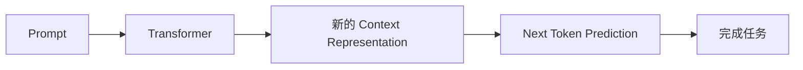

请注意，整个过程中参数完全没有变化，变化的是上下文表示（Context Representation）。

很多人认为 GPT 学会了一项新能力，更准确地说，是模型利用已有能力，快速适应新的任务。因此 In-Context Learning 更像**临时学习（Temporary Adaptation）**，而不是永久学习（Permanent Learning）。

**本节小结**：✅ In-Context Learning 不需要更新模型参数 ✅ GPT 可以根据 Prompt 建立临时规则 ✅ Few-shot、One-shot、Zero-shot 都属于 In-Context Learning ✅ 真正变化的是 Context Representation，而不是模型参数。一句话总结：**In-Context Learning 不是让模型变成了新的模型，而是让同一个模型在当前上下文中快速适应新的任务。**

下一节，我们将亲手对比 Zero-shot 和 Few-shot 在同一个模型上的真实表现差异，直观感受"给几个例子"到底能带来多大提升：**13.2 In-Context Learning——亲手体验 Few-shot ∕ Zero-shot**。

---

## Instruction Tuning——为什么 ChatGPT 听得懂人话？

上面，我们学习了 In-Context Learning，GPT 能够根据 Prompt 快速适应新的任务。但还有一个问题：早期 GPT 虽然知识丰富，却并不好用。例如输入"请介绍一下 Transformer。"，很多早期模型可能输出"User：请介绍一下 Transformer。Assistant："，或者继续生成"下面是一本教材……"。模型知道很多知识，却不知道**用户真正希望它做什么**。为什么？

**GPT 的原始训练目标。** 上面我们学习了，GPT 整个训练过程只有一个目标：Next Token Prediction。训练数据可能是"今天是一个好天气。→ 预测：。"或"Once upon a time...→ 预测：there"。训练过程中，模型从来没有学习"如何回答问题？如何执行命令？如何完成任务？"，它只是不断续写文本。

一个类比：一个孩子从小读了几百万本书，知识非常丰富，但从来没有人告诉他，别人说"请帮我写一封邮件"应该怎么办。于是第一次有人说这句话，他可能继续讲故事，也可能开始解释什么是邮件——并不是因为不会，而是不知道别人希望自己执行任务。

**GPT 擅长的是"续写"。** 训练数据经常出现"Question：......Answer：......"这样的格式。于是用户输入"Question：什么是 Transformer？Answer："，GPT 能够继续"Transformer 是……"，这是因为它在续写一种熟悉的模式，而不是真正理解"回答问题"。

**我们希望模型改变什么？** 如果用户输入"请把下面句子翻译成中文：I love AI."，我们真正希望模型直接输出"我喜欢人工智能。"，而不是"下面我来翻译……"或者继续写"User："。因此模型需要学习一种新的能力：**理解用户的指令（Instruction）。**

**什么是 Instruction Tuning？** Instruction 表示指令。Instruction Tuning 就是使用大量"用户指令 → 理想回答"这样的数据，继续训练模型。例如"Instruction：请总结下面文章。→ Response：......"或"Instruction：翻译成法语。→ Response：......"。模型逐渐学会用户是在提出任务，而不是邀请它继续写文章。

预训练：`输入：The capital of France is → 输出：Paris`

Instruction Tuning：`输入：请介绍法国。 → 输出：法国位于欧洲……`

请注意，Transformer 没有改变，Attention 没有改变，唯一变化的是训练数据。

**为什么叫 Fine-tuning？** 因为这里并不是重新训练整个模型，而是在已经完成 Pretraining 之后继续训练，因此叫 **Fine-tuning（微调）**。Instruction Tuning 就是一种 Fine-tuning。

**模型真正学会了什么？** 很多人认为 Instruction Tuning 增加了知识，其实不是。知识主要来自 Pretraining，Instruction Tuning 真正教会模型的是"什么时候回答？回答什么？回答到什么程度？采用什么格式？"，也就是说，模型学会了如何与人交流，而不是学习新的世界知识。

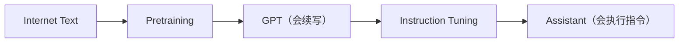

请注意，经过这一阶段，模型仍然可能回答得不够礼貌，也可能输出用户并不喜欢的内容，因此还需要下一步继续优化。

很多人认为 Instruction Tuning 让 GPT 变聪明了，更准确地说，它让 GPT 变得**更容易合作（Cooperative）**。模型拥有的知识几乎没有变化，真正变化的是它开始理解"用户正在给我一个任务。"

**本节小结**：✅ Pretraining 教会GPT 学会续写文本 ✅ Instruction Tuning 教会 GPT 理解和执行用户指令 ✅ Instruction Tuning 属于 Fine-tuning 的一种 ✅ 模型新增的不是知识，而是任务执行能力。一句话总结：**Pretraining 决定模型"知道什么"，Instruction Tuning 决定模型"如何帮助用户"。**

下一节，我们将用 **LoRA** 亲手微调一个真实的开源小模型，在 8GB 显存内完成一次完整的指令微调：**13.3 Instruction Tuning 实战——用 LoRA 微调**。

---

## Preference Learning——为什么 ChatGPT 越来越符合人类偏好？

上面，我们学习了 Instruction Tuning，经过这一阶段，GPT 已经能够理解用户指令。但新的问题来了：如果同一个问题存在很多答案，模型应该选择哪一个？

用户问"如何拒绝朋友的邀请？"，模型可能回答：①"不去。"；②"不好意思，今天有安排，下次一起。"；③"滚。"。三个答案语法都正确，甚至都符合 Next Token Prediction，但人类显然更喜欢第二种。为什么？因为除了正确，我们还希望礼貌、自然、有帮助。

**GPT 为什么不知道哪个好？** Pretraining 训练目标一直是"预测下一个 Token"，模型只知道哪个词更可能出现，它不知道哪个回答更受欢迎，也不知道哪个回答更加安全，更不知道哪个回答更符合人类价值观。因此模型需要学习另一件事情：**人的偏好。**

一个类比：两个学生都会解数学题，学生 A 只写"答案：42"，学生 B 写"答案：42，下面解释为什么。"虽然答案一样，但老师通常更喜欢第二个——原因不是更正确，而是更符合人的偏好。

**什么是 Preference Learning？** Preference 表示偏好。Preference Learning 就是让模型学习"人类更喜欢哪种回答"。训练数据不再是"问题 → 标准答案"，而是"问题 → 回答A、回答B → 人类选择：B更好"。模型不断学习什么样的回答更符合人的期待。

例如问题"请介绍 Transformer。"，回答A"Transformer 是一种神经网络。"，回答B"Transformer 是一种基于 Attention 的神经网络架构，它最初用于机器翻译，后来成为 GPT、BERT 等大语言模型的基础。"如果大多数标注者选择B，模型就会逐渐倾向于生成类似B的回答。

**RLHF 是怎么做的？** RLHF 全称 **Reinforcement Learning from Human Feedback**，大致过程是：①收集很多回答；②让人工标注哪个更好；③训练Reward Model，学习人的偏好；④利用强化学习不断优化模型回答。整个目标不是增加知识，而是让回答越来越符合人的偏好。

**为什么后来出现 DPO？** RLHF 效果很好，但训练过程比较复杂，需要 Reward Model，还需要强化学习。后来研究人员发现，很多情况下其实可以直接学习"A比B更好"，不用强化学习，于是出现了 **DPO（Direct Preference Optimization）**，以及 ORPO、SimPO、IPO 等。它们实现方式不同，目标却一致：学习人的偏好。

**因此，更重要的是 Preference Learning。** 今天越来越多论文不再强调 RLHF，而是 Preference Learning，因为 RLHF 只是一种实现，未来可能还会出现新的方法，但核心思想不会改变：**学习人类喜欢什么样的回答。**

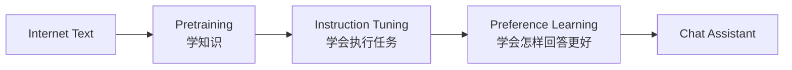

很多人认为ChatGPT 最大的突破来自 RLHF，更准确地说，真正改变的是模型开始**从"预测文字"走向"服务用户"。** 优化目标发生了变化，模型不仅要回答正确，还要回答得自然、礼貌、可靠、有帮助。

**本节小结**：✅ Preference Learning 的目标是学习人类偏好 ✅ RLHF 是 Preference Learning 的经典实现 ✅ DPO、ORPO 等方法属于新的偏好优化方法 ✅ Preference Learning 并不会增加知识，而是改善回答质量。一句话总结：**Pretraining 决定模型"知道什么"，Instruction Tuning 决定模型"做什么"，Preference Learning 决定模型"怎样做得更好"。**

下一节，我们将用比RLHF 更轻量的 **DPO** 亲手训练一次偏好对齐，直接对比模型微调前后的回答风格变化：**13.4 Preference Learning 实战——用 DPO 训练**。

---

## Chain of Thought——为什么"一步一步思考"能够提升推理能力？

上面，我们学习了 Preference Learning，模型已经能够理解用户、执行任务、按照人的偏好回答。但还有一个现象非常神奇：如果我们在 Prompt 中增加一句"Let's think step by step."，很多复杂问题模型竟然能够回答得更准确。为什么？难道一句话真的可以让模型变聪明？当然不是，真正改变的是**模型思考问题的方式。**

`小明有3个苹果，妈妈又给了他2个，后来吃掉1个，现在还有几个？` 很多人会直接回答"4"，因为脑子里已经完成了整个计算。但如果题目变得更复杂（涉及37、25、18、46、11这样的数字），很多人会开始一边计算一边记录中间步骤——因为问题变复杂了。

**人类也是一步一步思考。** 真正复杂的问题，很少有人一下得到答案。例如证明一道数学题、写一段程序、规划一次旅行，通常都是"第一步 → 第二步 → 第三步 → 最终答案"。中间过程帮助我们减少错误、整理思路。模型也是一样。

**什么是 Chain of Thought？** Chain 表示链条，Thought 表示思考。Chain of Thought 就是：**把中间推理过程显式写出来。** 例如不要直接回答"4"，而是写"3+2=5，5-1=4，答案：4"。请注意，最终答案没有变化，变化的是中间过程。

例如 `12×15=?`：方式一直接回答"180"；方式二写"12×10=120，12×5=60，120+60=180"。第二种更长，却通常更稳定——原因不是文字更多，而是复杂问题被拆成了多个简单问题。

**为什么有效？** 很多复杂任务本质上都不是一步完成的，例如数学证明、代码调试、逻辑推理，都需要多个中间状态。如果模型一次预测最终答案，任何一步出错都会导致整个答案错误。但如果先生成中间步骤，每一步都只解决一个小问题，整体成功率往往会提高。

**CoT 真正改变了什么？** 很多人认为 CoT 增加了模型能力，其实不是。模型参数没有变化，知识没有变化，真正变化的是**推理轨迹（Reasoning Trajectory）**。也就是说，模型把"输入 → 答案"变成了"输入 → 步骤一 → 步骤二 → 步骤三 → 答案"。

CoT 其实是不断生成新的 Token，这些 Token 又不断更新上下文表示，因此后面的推理拥有更加丰富的 Context Representation。也就是说，模型一边思考，一边创造新的思考条件。

很多人认为模型是在"脑子里"思考，其实 Transformer 没有隐藏的草稿纸，它真正的"思考过程"就是不断生成新的 Token，然后再阅读自己刚刚写出的内容，继续预测下一个 Token。因此对 Transformer 来说：**思考，就是生成。**

**CoT 的局限。** Chain of Thought 并不是万能的。如果模型本身没有相关知识，或者基础能力不足，再长的思考过程也无法得到正确答案。另外，更长的推理意味着更多 Token、更高成本，以及更长推理时间。因此什么时候需要显式推理，什么时候直接回答，也是现代推理模型的重要研究方向。

近几年，越来越多模型已经不再依赖用户输入"Let's think step by step."，而是自动决定什么时候展开推理，什么时候直接回答。也就是说，CoT 已经从一种 Prompt 技巧，逐渐发展成为模型内部推理能力的一部分。

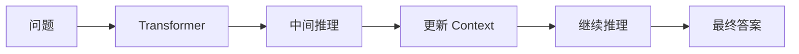

**本节小结**：✅ Chain of Thought 会显式生成中间推理过程 ✅ 复杂问题通常可以拆分为多个简单步骤 ✅ CoT 改变的是推理轨迹，而不是模型参数 ✅ 对 Transformer 来说，生成推理过程也是构建上下文表示的一部分。一句话总结：**Chain of Thought 并没有让模型学会新的知识，而是让模型能够利用生成出来的中间过程，逐步完成复杂推理。**

---

## Test-Time Scaling——为什么让模型多思考一会，能力还能继续提升？

上面，我们学习了 Chain of Thought，模型通过一步一步推理，能够解决更加复杂的问题。但新的问题来了：如果第一条推理路径就是错的，怎么办？人类遇到困难时，通常不会立刻放弃，而是重新思考、换一种方法、再次验证。模型能不能也这样？

**传统 LLM 是怎样回答问题的？** 早期 GPT 基本流程是"问题 → Transformer → 生成答案"，整个过程几乎只有一条推理路径。如果这条路径出错，最终答案通常也会出错。

**能不能多尝试几次？** 既然模型能够生成不同推理过程，为什么不让它多想几种可能？例如第一次得到方案A，第二次得到方案B，第三次得到方案C，最后选择最合理的一种。这就是 **Test-Time Scaling**。

**什么是 Test-Time Scaling？** Training 表示训练，Test Time 表示推理阶段，Scaling 表示增加资源。因此 Test-Time Scaling 就是：**在推理阶段投入更多计算资源，以提升模型能力。** 请注意，这里增加的不是模型参数，而是**推理计算量**。

一个类比：考试时老师说"还有一分钟，请检查答案"，很多同学都会发现一些原本没有注意到的错误——因为获得了更多思考时间。模型也是一样，如果允许它继续推理、继续验证、继续尝试，最终答案往往更加可靠。

**不只是"多生成"。** 很多人认为 Test-Time Scaling 就是生成更多内容，其实不是，真正增加的是推理过程，例如"思考 → 验证 → 反思 → 修正 → 重新推理"。这些额外计算都会提升最终答案质量。

**常见的 Test-Time Scaling 方法。** 现代推理模型通常会采用：**更长的 Chain of Thought**（允许模型展开更多步骤）、**多条推理路径**（同时尝试不同思路）、**自我验证（Self Verification）**（生成答案后重新检查是否一致）、**搜索（Search）**（探索多个可能状态，寻找更优解）。这些方法本质上都是增加推理阶段的计算。

**为什么叫 Scaling？** 前面 Scaling Law 增加的是参数、数据、算力，属于 **Training-Time Scaling**。而现在增加的是推理时间、推理步数、推理路径，因此称为 **Inference-Time Scaling**，或者 **Test-Time Scaling**。

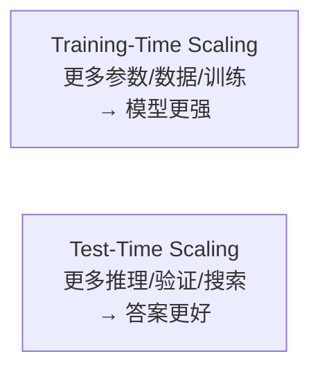

近几年，很多先进模型（Reasoning Models）已经开始自动决定：简单问题直接回答，复杂问题自动展开推理，甚至反复验证。因此模型不只是回答问题，更像真正解决问题。

过去大家认为模型能力主要来自训练。今天越来越多研究发现，推理阶段投入更多计算，同样能够显著提升能力。因此现代 Reasoning Model 已经从**训练时扩展（Training-Time Scaling）**逐渐发展到**推理时扩展（Inference-Time Scaling）**。

**本节小结**：✅ Test-Time Scaling 是在推理阶段增加计算资源 ✅ 增加的是推理过程，而不是模型参数 ✅ 更长推理、多路径推理、自我验证都属于 Test-Time Scaling ✅ 现代推理模型越来越依赖推理阶段的计算，而不仅仅依赖更大的模型。一句话总结：**Training-Time Scaling 让模型学得更多，Test-Time Scaling 让模型想得更多。**

下一节，我们将亲手对比"直接回答"与"Let's think step by step"在同一批问题上的真实准确率差异，并实现一个简化版的 Self-Consistency（多路径投票）：**13.5 Chain of Thought 与 Test-Time Scaling 实战**。

---

## Reasoning Model——为什么推理模型开始"先思考，再回答"？

上面，我们学习了 Test-Time Scaling，现代模型开始投入更多推理计算，尝试更多思路，验证更多可能。但新的问题来了：为什么近年来越来越多模型开始先思考，再回答？例如很多推理模型都会生成一段较长的推理过程，然后才输出最终答案。为什么？

`15×27=?` 第一种模型直接回答"405"；第二种模型先写"15×20=300，15×7=105，300+105=405"，再输出"405"。第二种通常更可靠，因为它拥有**中间状态**。

**传统 LLM 是什么？** 传统 GPT 更像一个语言预测器，流程是"Prompt → Transformer → Next Token → Next Token → Next Token"，整个目标都是生成下一个 Token。

**推理模型增加了什么？** 推理模型并没有改变 Transformer，真正增加的是**推理过程（Reasoning Process）**，例如"问题 → 分析 → 拆解 → 验证 → 修正 → 答案"。模型不是一次得到答案，而是在不断构造新的上下文。

一个类比：装修房子时，普通模型可能直接说"建议选择方案A"；推理模型会先分析预算、面积、家庭成员、采光、维护成本，最后再给出建议。两者最大的区别不是答案，而是决策过程。

**Reasoning Trajectory（推理轨迹）。** 现代研究越来越强调 Reasoning Trajectory，也就是模型在推理过程中经过的所有中间状态："Question → State1 → State2 → State3 → Answer"。这些 State 共同组成推理轨迹。真正复杂的问题往往需要较长的轨迹。

为什么推理轨迹重要？因为很多问题不是一步完成的，例如数学证明、代码调试、科研分析、Agent Planning，都需要不断产生新的中间状态。如果没有这些状态，模型很容易走错方向——就像走迷宫，如果直接预测出口几乎不可能，但如果每一步都记录当前位置、下一步方向、是否撞墙，最终找到出口的概率会高很多。

**推理模型真正改变了什么？** 很多人认为推理模型增加了新的知识，其实不是。真正改变的是**计算资源的分配方式**。普通模型更多计算发生在训练阶段，推理模型越来越多计算发生在推理阶段。因此现代模型越来越像"边思考，边生成"。

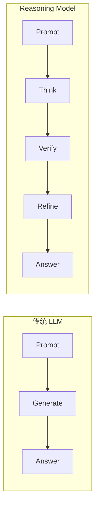

请注意，Transformer 没有改变，变化的是推理流程。

**推理模型一定更好吗？** 并不是。如果问题非常简单，例如"2+2=?"，复杂推理反而浪费时间。因此现代模型越来越倾向于自动判断：简单问题直接回答，复杂问题自动展开推理。这也是近年来推理模型发展的方向。

**从语言模型到推理模型。** 语言模型关注的是"生成语言"，推理模型关注的是"解决问题"。语言只是推理过程最终表达出来的形式，真正重要的是中间状态、搜索策略、验证机制，这些能力共同决定最终答案质量。

很多人认为 Reasoning Model 是一种新的模型结构，实际上目前大多数推理模型仍然基于 Transformer，真正变化的是训练目标、推理策略、数据形式，以及推理阶段的计算方式。因此推理模型更准确地说，是**一种新的模型使用范式**。

**本节小结**：✅ 推理模型关注的是推理过程，而不仅仅是最终答案 ✅ 推理轨迹（Reasoning Trajectory）是复杂任务的重要组成部分 ✅ 推理模型并未改变 Transformer，而是改变了推理方式 ✅ 现代模型越来越强调推理阶段的计算，而不仅仅依赖训练阶段。一句话总结：**语言模型关注"说什么"，推理模型关注"怎样得到这个答案"。**

---

## Long Context——为什么大模型开始拥有"超长记忆"？

上面，我们学习了 Reasoning Model，模型能够一步一步推理、不断验证，最终得到更加可靠的答案。但新的问题来了：如果模型只能记住很短的一段内容，那么再好的推理也没有意义。例如一本500页的书，模型如果一次只能看到第一页，还能总结全书吗？显然不能。于是新的挑战出现了：**如何让模型拥有更长的上下文？**

假设你正在阅读一本小说，第一页介绍人物，第二百页出现一个陌生名字，实际上这个人物就是第一页出现过的人。如果你已经忘记第一页，故事就无法理解。模型也是一样，如果上下文太短，很多任务都会失败。

**什么是 Context？** 前面讲过 In-Context Learning，模型每次回答问题都会看到整个 Prompt，例如用户问题、历史对话、系统提示、工具结果、文档内容。这些内容共同组成 **Context（上下文）**。Transformer 一次计算只能处理 **Context Window**，也就是上下文窗口。

可以把它想象成一张办公桌，桌子越大，一次可以摆放更多资料；桌子越小，很多资料只能放回书架。Context Window 决定了一次最多能够看到多少 Token。

**为什么早期模型窗口很小？** 早期 GPT 通常只有 2K、4K、8K Token。原因不是设计如此，而是 Transformer 的 Attention 计算量随着 Token 数量增加，增长得非常快——如果 Token 数量增加一倍，Attention 需要计算更多 Token 两两之间的关系，计算量会迅速增加。因此早期模型很难支持超长上下文。

一个类比：会议室里有10个人，每个人都需要和其他所有人交流，交流次数并不是10次，而是几十次；如果人数增加到100人，交流关系会急剧增加。Attention 也是类似的，每个 Token 都需要关注其它 Token，因此窗口越长，计算越昂贵。

**Long Context 是什么？** Long Context 就是让模型能够处理更长的上下文，例如从32K到128K到1M Token。这样模型可以一次阅读整本论文、完整代码仓库、长时间聊天记录，甚至多个文档。

上下文越长，模型能够完成更多复杂任务，例如阅读一本书并总结、分析整个代码仓库、多轮长时间对话、法律合同比对、长篇科研论文分析、Agent 长时间执行任务。这些任务都依赖模型持续保留大量上下文。

**Long Context 不等于长期记忆。** 这里很多同学容易混淆 Long Context 与 Memory。其实两者不同：Long Context 表示当前能够看到更多内容，一旦本次推理结束，这些内容就会消失；而长期记忆则意味着模型能够跨越不同对话，长期保存重要信息。因此 Long Context 更像一张更大的工作台，而不是永久存储空间。

**Long Context 面临的新挑战。** 窗口越来越长，并不是没有代价，主要挑战包括：Attention 计算成本增加、推理延迟增加、显存占用增加、模型未必真正利用全部上下文。因此近年来研究重点不仅是窗口更长，还包括如何更高效地利用长上下文。

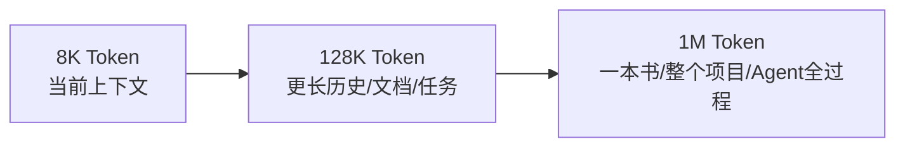

很多人认为 Long Context 就是"模型记忆更好了"，更准确地说，Long Context 只是扩大了模型一次能够处理的信息范围。真正的长期记忆，还需要 Memory、RAG，或者 Agent Memory 共同完成。

**本节小结**：✅ Context Window 决定模型一次能够处理多少 Token ✅ Long Context 扩大了模型可处理的上下文范围 ✅ 长上下文能够支持长文档、长对话和复杂任务 ✅ Long Context 并不等于长期记忆。一句话总结：**Long Context 让模型一次能够"看得更多"，但并不意味着它能够"永久记住更多"。**

---

## KV Cache——为什么大模型不会每生成一个 Token，都重新阅读整篇文章？

上面，我们学习了 Long Context，模型一次能够处理越来越长的上下文。但新的问题来了：假设模型已经读完了一篇100页的文章，现在准备生成第一个、第二个、第三个Token……难道每生成一个 Token，模型都重新阅读100页？如果真是这样，ChatGPT 几乎不可能实时聊天。为什么？

假设你正在写作文，已经写了1000个字，现在准备写第1001个字，你会不会重新阅读前1000字？有时候会回头看看，但绝不会重新逐字阅读，因为很多内容你已经知道了。模型也是一样。

**Transformer 原本是怎样工作的？** 回忆一下，Attention 中每个 Token 都会关注其它 Token。输入 `I love AI`，模型计算所有 Token 之间的关系，得到 Key、Value，输出 Attention 结果。

现在模型继续生成 `!`，如果没有优化，模型需要重新计算 `I love AI !` 所有 Token，包括前面三个 Token 也要重新计算。请注意，这些内容根本没有变化，重新计算非常浪费。

一个类比：老师已经点名50名学生，现在第51名学生走进教室，老师需要重新点前50人吗？当然不用，只需要记录第51个人即可。模型也是一样，前面的计算其实已经完成了，没有必要重新计算。

**什么是 KV Cache？** KV 表示 Key、Value，Cache 表示缓存。KV Cache 就是：**把已经计算好的 Key 和 Value 保存下来。** 下一次继续生成，只需要计算新的 Token，然后把新的 Key、新的 Value 追加进去，而不是重新计算所有历史 Token。

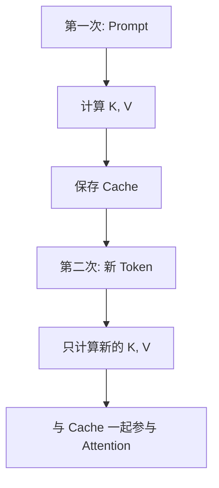

因此历史 Token 无需重复计算。

**没有 Cache 与使用 Cache 的对比。** **没有 Cache**：第一次计算 A；第二次重新计算 A、B；第三次重新计算 A、B、C……请注意，A 已经计算了很多次。

**使用 KV Cache**：第一次计算 A，缓存 A 的 K、V；第二次只计算 B，然后读取 A 的 Cache；第三次只计算 C，读取 A、B 的 Cache。这样历史 Token 始终只计算一次。

**为什么速度提升这么明显？** 因为生成回答时，模型属于**自回归（Autoregressive）生成**，一次只生成一个 Token。如果每一步都重新计算全部历史，成本会越来越高。而 KV Cache 保证历史部分永远不用重复计算，因此聊天速度可以提升数倍，甚至一个数量级。

**KV Cache 与 Long Context。** Long Context 解决的是"能够看多少"；KV Cache 解决的是"怎样更快地看"。因此两者关注的问题完全不同：一个提升能力，一个提升效率。

**KV Cache 的代价。** Cache 也不是免费的。上下文越长，保存的 Key、Value 就越多，因此 KV Cache 主要消耗 GPU 显存。例如128K Context 对应非常大的 Cache，如果多个用户同时聊天，显存压力会迅速增加。因此近年来又出现了 Paged Attention、KV Compression、KV Quantization、Sliding Window 等优化技术，它们都是为了降低 KV Cache 带来的成本。

很多人认为 ChatGPT 回答得快是因为 GPU 很强，实际上真正重要的是 Transformer 采用了 KV Cache。否则每生成一个 Token，都重新计算整个上下文，聊天几乎无法达到今天这样的速度。

**本节小结**：✅ KV Cache 保存历史 Token 的 Key 和 Value ✅ 历史 Token 无需重复计算 ✅ KV Cache 大幅提升了自回归生成速度 ✅ 长上下文带来了更大的 KV Cache 开销，因此需要进一步优化。一句话总结：**KV Cache 让 Transformer 学会了"记住已经计算过的内容"，从而避免重复计算，提高生成效率。**

---

## Mixture of Experts（MoE）——为什么参数越来越多，计算量却没有同步增加？

上面，我们学习了 Long Context、KV Cache，Transformer 已经能够处理更长上下文，并快速生成答案。但新的问题来了：近年来越来越多模型的参数数量不断增长，从几十亿、几百亿、数千亿，甚至到万亿参数。按理来说模型应该越来越慢，为什么今天的大模型速度却没有下降那么多？答案来自一种新的架构：**Mixture of Experts（MoE）**。

一个简单的问题：假设医院里有 100 位医生，如果每来一个病人，100 位医生全部一起看病，效率显然非常低。真正合理的方法应该是：感冒找内科，骨折找骨科，眼睛找眼科——不同问题交给不同专家。模型也是一样。

**什么是 MoE？** MoE 全称 **Mixture of Experts**，中文通常翻译为**专家混合模型**。它的核心思想非常简单：不是所有神经元一起工作，而是**每次只激活少数几个专家**。

**Transformer 原来的计算方式。** 传统 Transformer 每一层都会计算所有参数，无论输入是数学、代码还是文学，所有参数都会参与计算。

**MoE 怎么改变？** MoE 把一层拆成很多专家，例如 64 个 Expert，但每次只选择其中几个（例如 2 个）参与计算，其它 62 个完全不计算，因此计算量大幅下降。

**Router（路由器）。** 模型怎么知道应该选择哪些专家？答案是增加一个 **Router**：`Token → Router → 选择 Expert → 计算结果`。Router 会根据当前 Token 判断哪些专家最合适，例如数学问题更多激活数学专家，代码问题更多激活代码专家。

一个生活中的例子：大学拥有很多学院（计算机学院、数学学院、法学院、医学院），学习计算机的学生不会每天所有学院一起上课，而是根据专业进入对应学院。MoE 也是一样，不同 Token 进入不同专家。

**为什么参数可以越来越多？** 例如模型拥有 256 位专家，每位专家都有 100 亿参数，整个模型总参数达到 2.56 万亿。但每次 Router 只激活 2 位专家，真正参与计算的只有 200 亿参数。因此模型拥有万亿参数，却只计算很少一部分——这就是 **稀疏激活（Sparse Activation）**：传统 Dense Model 所有参数全部参与，MoE 属于 Sparse Model，每次只有少数参数参与计算，因此参数数量可以继续增长，计算成本却增长较慢。

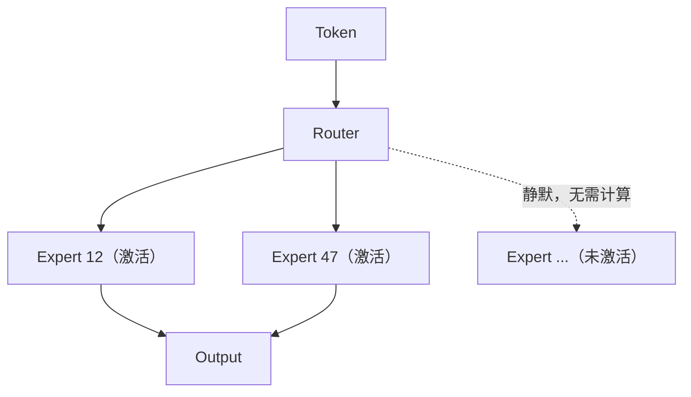

**MoE 的优势：** ①模型容量更大，能够学习更多知识；②推理计算增长较慢，速度更快；③不同专家逐渐形成不同能力（代码、数学、翻译、医学），形成专业化分工。

**MoE 的挑战：** ①Router 如何选择最合适的专家；②部分专家可能工作很多，部分专家几乎不用，造成负载不均衡；③多 GPU 部署更加复杂。因此现代 MoE 通常都会加入 Load Balancing、Expert Parallel、Expert Capacity 等优化方法。

请注意，MoE 真正变化的是**参数使用方式**，而不是 Transformer 的基本结构：Dense Model 是 `Token → 所有参数 → 输出`，MoE 是 `Token → Router → 少数 Expert → 输出`。

很多人认为 MoE 让模型变得更聪明，其实更准确地说，MoE 让模型**能够拥有更多参数，而不用付出同等计算代价**。因此它解决的是**模型规模（Model Capacity）**，而不是推理能力——推理能力仍然依赖训练数据、Reasoning，以及 Test-Time Scaling。

**本节小结**：✅ MoE 将模型划分为多个 Expert ✅ Router 根据输入选择少数 Expert ✅ 每次只激活部分参数，实现稀疏计算 ✅ MoE 让模型能够扩展到数千亿甚至万亿参数，同时保持较高的推理效率。一句话总结：**MoE 并没有减少模型参数，而是减少了每次真正参与计算的参数。**

上面这些理论最终都要落地到一个现实问题：一块 8GB 显存的消费级显卡，到底能不能跑动一个"看起来很大"的模型？下一节，我们将通过量化把一个 7B 模型塞进 8GB 显存，分别用 Hugging Face 生态和 llama.cpp/Ollama 两条路径完成本地部署，并亲手测量 KV Cache 与 Long Context 带来的真实开销：**13.6 量化、KV Cache 与本地推理加速实战**。

---

## 本章总结与全书回顾

经过 Next Token Prediction、Scaling Law、Emergent Ability、In-Context Learning、Instruction Tuning、Preference Learning、Chain of Thought、Test-Time Scaling、Reasoning Model、Long Context、KV Cache、MoE，我们已经理解了现代大语言模型从"预测下一个 Token"演化为"能推理、能长记忆、能高效扩展参数"的完整技术体系：

至此，我们已经完整走过了从 Language Model 到现代 LLM 的整个演进之路：

```mermaid
flowchart LR
A["Ch1 Language Model"] --> B["Ch2 Tokenizer"] --> C["Ch3 Embedding"] --> D["Ch4 神经网络"] --> E["Ch5-6 Neural LM"] --> F["Ch7 RNN/LSTM"] --> G["Ch8 Attention"] --> H["Ch9 Transformer Block"] --> I["Ch10 Stacking"] --> J["Ch11 Transformer 家族"] --> K["Ch12 LLM 训练与推理"]
```

从统计一个字符的下一个字符，到今天能够推理、思考、处理超长上下文、以稀疏方式扩展到万亿参数的大语言模型，每一步演进都是为了解决上一代技术留下的问题。这也是本书贯穿始终的核心理念：

> **技术为什么会出现，它解决了什么问题，又留下了哪些新的问题。**

但即使拥有推理能力、超长上下文、万亿参数，现代大模型仍然只能**回答问题**——它不会主动打开浏览器，不会操作文件，不会调用 API，不会完成真实世界任务。这也是为什么"Agent"被认为是大模型之后的下一次范式升级：**从会回答问题，到会完成任务。**
