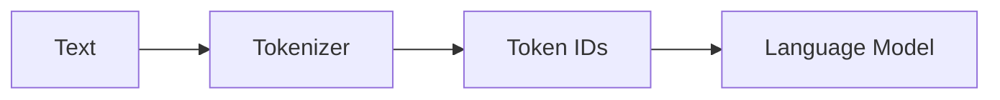
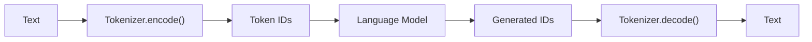

# 实验 2.1：实现第一个 Character Tokenizer

> **实验目标**
>
> 第一章中，我们一直直接使用字符串，Language Model 也是直接处理字符。这一节，我们**不修改 Language Model**，而是在它前面增加一个 Tokenizer。整个数据流正式升级为：



从这一节开始，后续所有实验都会复用这个 Tokenizer。

---

# 一、设计 CharacterTokenizer

Tokenizer 应该有哪些能力？至少应该支持 `文本 → Token ID` 以及 `Token ID → 文本`，因此它至少应该有三个函数：`build()`、`encode()`、`decode()`。

```python
class CharacterTokenizer:

    def __init__(self, text):
        self.build(text)

    def build(self, text):
        ...

    def encode(self, text):
        ...

    def decode(self, ids):
        ...
```

这比散落的几个函数更清晰，以后 WordTokenizer、BPETokenizer、SentencePieceTokenizer 都可以采用同样的接口——本节完成之后，你会发现这三个函数就是贯穿全书所有 Tokenizer 的统一骨架。

---

# 二、实现 build()

Tokenizer 的第一件事情是建立 Vocabulary（词表）：把训练文本里出现过的每一个字符，分配一个唯一的编号：

```python
class CharacterTokenizer:

    def __init__(self, text):
        self.build(text)

    def build(self, text):
        chars = sorted(set(text))                     # 去重后按顺序排列，保证每次运行结果一致
        self.stoi = {ch: i for i, ch in enumerate(chars)}  # string to id
        self.itos = {i: ch for ch, i in self.stoi.items()} # id to string
```

例如 `hello world` 得到：

```python
{' ': 0, 'd': 1, 'e': 2, 'h': 3, 'l': 4, 'o': 5, 'r': 6, 'w': 7}
```

---

# 三、实现 encode()

Tokenizer 最重要的功能就是 `Text → Token IDs`：

```python
def encode(self, text):
    return [self.stoi[ch] for ch in text]
```

测试：

```python
tokenizer = CharacterTokenizer("hello world")
print(tokenizer.encode("hello"))
```

输出：`[3, 2, 4, 4, 5]`。第一步完成。

**但这里藏着一个陷阱**：如果 `encode()` 遇到一个 Vocabulary 里从未出现过的字符（例如训练文本只有小写字母，测试时却传入一个数字或问号），`self.stoi[ch]` 会直接抛出 `KeyError`，整个程序崩溃。这不是一个可以忽略的边界情况——真实世界的文本几乎不可能覆盖所有字符，这个问题会在 2.3 节正式解决（**Unknown Token `<UNK>`**）。这一节我们先老实承认这个局限，暂不处理：

```python
def encode(self, text):
    # 暂不处理未知字符，遇到词表外的字符会直接报错——这个问题2.3节解决
    return [self.stoi[ch] for ch in text]
```

---

# 四、实现 decode()

反向恢复：

```python
def decode(self, ids):
    return "".join(self.itos[i] for i in ids)
```

测试：

```python
print(tokenizer.decode([3, 2, 4, 4, 5]))
```

输出：`hello`。说明整个 Tokenizer 已经工作正常。

---

# 五、完整的 CharacterTokenizer

```python
class CharacterTokenizer:

    def __init__(self, text):
        self.build(text)

    def build(self, text):
        chars = sorted(set(text))
        self.stoi = {ch: i for i, ch in enumerate(chars)}
        self.itos = {i: ch for ch, i in self.stoi.items()}

    def encode(self, text):
        return [self.stoi[ch] for ch in text]

    def decode(self, ids):
        return "".join(self.itos[i] for i in ids)
```

总代码**不到10 行**，但已经完成了第一个 Tokenizer。直接把这段代码粘贴到你的脚本最上面即可，不需要额外建立文件或目录。

---

# 六、测试 Tokenizer

```python
text = "hello world"
tokenizer = CharacterTokenizer(text)

print("Vocabulary:", tokenizer.stoi)

ids = tokenizer.encode("hello")
print("Encoded:", ids)
print("Decoded:", tokenizer.decode(ids))
```

运行结果：

```
Vocabulary: {' ': 0, 'd': 1, 'e': 2, 'h': 3, 'l': 4, 'o': 5, 'r': 6, 'w': 7}
Encoded: [3, 2, 4, 4, 5]
Decoded: hello
```

---

# 七、把 Tokenizer 接到第一章的 Language Model 上

现在把1.2 节结尾那个已经会输出概率分布的 Language Model，和刚刚写好的 Tokenizer拼在一起，得到一个**完整、可以从头跑到尾**的脚本——这也是本节唯一需要你真正复制运行的一段代码：

```python
import random

text = "hello world"

# ① 先用 Tokenizer 把文本转换成 Token ID
tokenizer = CharacterTokenizer(text)
ids = tokenizer.encode(text)
print("Token IDs:", ids)

# ② 训练阶段：统计 Bigram 频次（1.2节的逻辑，只是现在统计的对象换成了 Token ID，而不是字符）
model = {}
for i in range(len(ids) - 1):
    current, nxt = ids[i], ids[i + 1]
    if current not in model:
        model[current] = {}
    model[current][nxt] = model[current].get(nxt, 0) + 1

# ③ 生成阶段：按概率采样下一个 Token ID（比1.1节的 random.choice 更进一步，
#这里根据出现次数加权采样，出现次数越多的候选，被选中的概率越大）
def generate(start_id, max_length=20):
    result = [start_id]
    current = start_id
    for _ in range(max_length):
        if current not in model:
            break
        candidates = list(model[current].keys())
        weights = list(model[current].values())
        nxt = random.choices(candidates, weights=weights, k=1)[0]
        result.append(nxt)
        current = nxt
    return result

# ④ 从字符 'h' 对应的 Token ID 开始生成
start_id = tokenizer.encode("h")[0]
generated_ids = generate(start_id)
generated_text = tokenizer.decode(generated_ids)

print("Generated IDs:", generated_ids)
print("Generated Text:", generated_text)
```

运行结果（因为是按概率随机采样，每次运行结果都会不同，下面是某一次真实的运行输出）：

```
Token IDs: [3, 2, 4, 4, 5, 0, 7, 5, 6, 4, 1]
Generated IDs: [3, 2, 4, 4, 4, 1]
Generated Text: hellld
```

多跑几次会发现，生成经常会**提前停止**，而且很容易停在 `d` 这个字符上。原因并不难发现：`d` 是训练文本 `hello world` 的最后一个字符，它从来没有以"当前字符"的身份出现过，因此 `model` 里根本没有 `d` 对应的记录——一旦生成到 `d`，`generate()` 函数里的 `if current not in model: break` 就会触发，生成过程只能停止。这提醒我们：**这个极简的统计模型，能生成什么完全取决于训练数据里出现过什么组合**，这也是为什么 1.1 节强调"数据决定了模型能力的上限"。

对比 1.1/1.2 节的代码，**Language Model 本身的统计逻辑一行没有变**（还是"统计当前 Token 后面接了哪些 Token、接了多少次"），唯一的变化是：训练和生成时操作的对象，从**字符**换成了**Token ID**。这正是 Tokenizer 存在的全部意义——它是一层可以随意替换的"适配器"，模型完全不需要知道自己处理的原始输入是字符、单词还是别的什么。

---

# 八、本实验修改了什么？

相比第一章，新增了 `CharacterTokenizer`、`encode()`/`decode()`、`Vocabulary`；Language Model 的统计逻辑完全没变，只是输入从字符换成了 Token ID。整个系统升级为：



请注意，图里的 `encode()` 和 `decode()` 其实来自**同一个** Tokenizer 实例，并不是两个独立的 Tokenizer——只是编码和解码是两个方向相反的操作，画成两个节点方便观察数据流。第一次真正具有了现代 LLM 的雏形。

---

# 实验收获（Takeaways）

✅ 学会了设计一个真正可复用的 Tokenizer。
✅ 实现了 build()、encode()、decode() 三个核心接口。
✅ 亲手验证了 Language Model 的统计逻辑完全不需要修改，只需要换一层Tokenizer 作为适配器。
✅ 提前发现了 Character Tokenizer 的一个真实缺陷——遇到未知字符会直接报错，这个问题会在 2.3 节解决。

---

# 下一实验

下一节，我们不会继续升级 Language Model，而是升级 Tokenizer：从 Character Tokenizer 升级到 Word Tokenizer。你会第一次发现 Character Tokenizer 为什么效率很低，Word Tokenizer 又为什么无法应用到 GPT。这两个问题最终都会引出现代 LLM 使用的：

> **Subword Tokenizer（BPE）**
