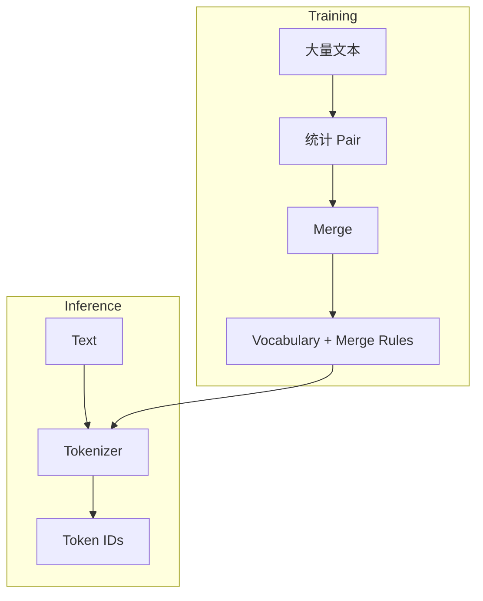
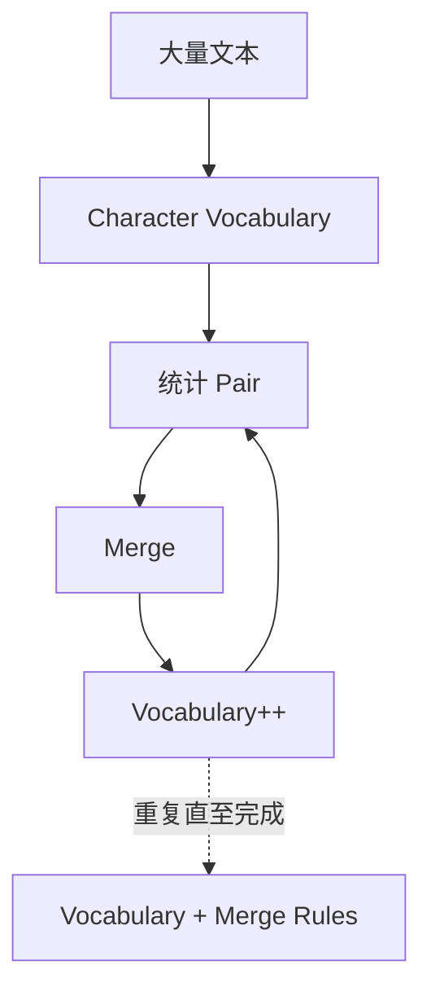
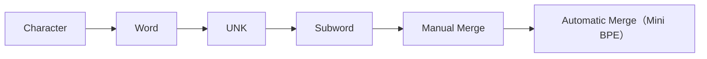

# 实验 2.6：训练一个 Mini BPE Tokenizer

> **实验目标**
>
> 上一节，我们已经手工完成了几次 Merge，但真实 GPT 不可能靠程序员手工决定 `l + o` 应该合并。本实验将让程序自己学习**哪些 Token 应该合并**，这就是 BPE Training。

---

# 一、重新认识 Tokenizer

到目前为止，我们一直把 Tokenizer 看成`Text → Token IDs`，其实这只是**Inference（推理）阶段**。真正的 GPT Tokenizer 在上线之前还有一个 **Training** 阶段：



Vocabulary 不是人工写出来的，而是**训练出来的**。

---

# 二、训练数据

为了方便观察，仍然采用极小数据集：

```python
corpus = ["low", "lower", "lowest", "lowing"]
```

真正 GPT 可能用到几十 TB 数据，但算法完全一样。

---

# 三、初始化 Vocabulary

第一步，Tokenizer 什么都不知道，因此 Vocabulary 只有字符：

```python
tokens = []
for word in corpus:
    tokens.append(list(word))
```

输出：`[['l','o','w'], ['l','o','w','e','r'], ['l','o','w','e','s','t'], ['l','o','w','i','n','g']]`。每一个字符都是一个 Token。

---

# 四、统计 Pair

```python
from collections import Counter

pairs = Counter()
for word in tokens:
    for i in range(len(word)-1):
        pair = (word[i], word[i+1])
        pairs[pair] += 1
```

输出 `pairs` 得到 `('l','o'):4, ('o','w'):4, ('w','e'):2, ('e','r'):1, ...`，是不是和上一节手工统计完全一致？现在程序已经能够自己统计。

---

# 五、寻找最常见 Pair

```python
best_pair = max(pairs, key=pairs.get)
print(best_pair)  # ('l', 'o')
```

程序第一次自己发现 `lo` 值得合并。

---

# 六、Merge

```python
def merge(tokens, pair):
    merged = []
    new_token = "".join(pair)
    for word in tokens:
        i = 0
        result = []
        while i < len(word):
            if (i < len(word)-1 and word[i]==pair[0] and word[i+1]==pair[1]):
                result.append(new_token)
                i += 2
            else:
                result.append(word[i])
                i += 1
        merged.append(result)
    return merged
```

执行 `tokens = merge(tokens, best_pair)`，输出：

```
[['lo','w'], ['lo','w','e','r'], ['lo','w','e','s','t'], ['lo','w','i','n','g']]
```

是不是已经完成了一次 Merge？

---

# 七、不断重复

真正 BPE 其实只有一句话：

```
repeat:
    找最高频Pair
    Merge
until Vocabulary 足够大
```

第一次`l o → lo`，第二次 `lo w → low`，第三次 `low e → lowe`，第四次 `lowe r → lower`……Vocabulary 不断成长。

---

# 八、保存训练结果

训练结束以后，Tokenizer 会得到两个东西：

**Vocabulary**：`l, o, w, lo, low, lower, ...`

**Merge Rules**：`l o → lo`；`lo w → low`；`low e → lowe`……

真正 GPT2 就是把它们保存成 `vocab.json` 和 `merges.txt`，后续所有 Encode 都依赖这两个文件。

---

# 九、完整训练流程



这一过程和第一章 Language Model 的训练非常相似：第一章学习 Probability，第二章学习 Vocabulary，本质上都是**从大量数据中自动学习规则**。

---

# 实验收获（Takeaways）

✅ 第一次实现了真正的 BPE Training。
✅ Vocabulary 不是人工编写，而是训练得到；Merge Rules 同样来自训练数据。
✅ GPT Tokenizer 本身也是一个"模型"。

---

# Code Evolution



下一节，我们将不再训练 Tokenizer，而是模拟 GPT 的真实工作流程：加载 `vocab.json` + `merges.txt` → Encode → Decode。至此，我们的 Tokenizer 将真正具备现代 LLM 的基本形态。
