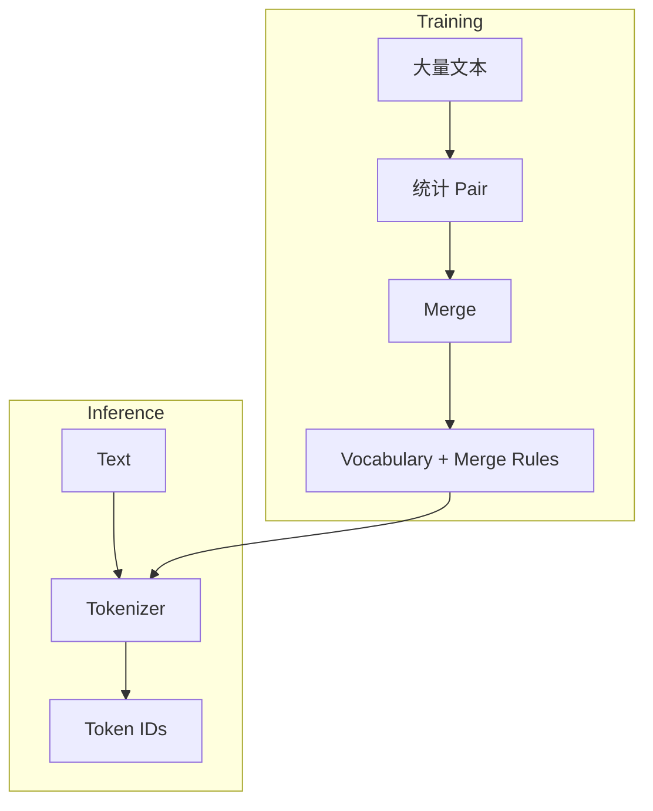
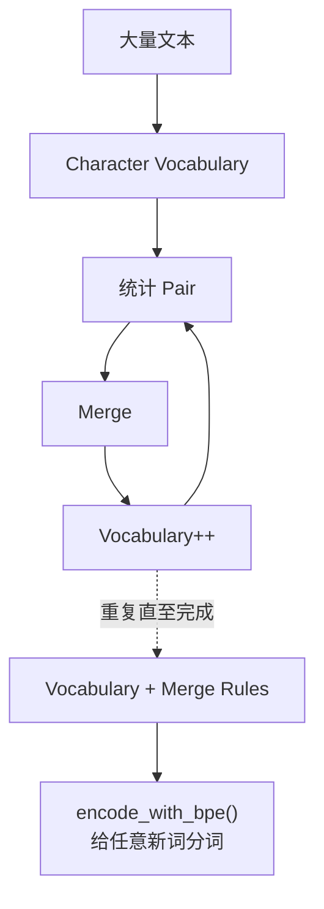
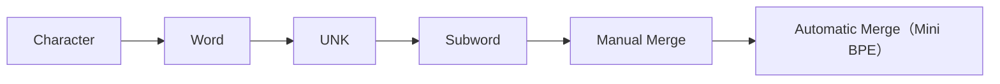

# 实验 2.6：训练一个 Mini BPE Tokenizer

> **实验目标**
>
> 上一节，我们已经手工完成了几次 Merge，但真实 GPT 不可能靠程序员手工决定 `l + o` 应该合并。本实验将让程序自己学习**哪些 Token 应该合并**，这就是 BPE Training。

---

# 一、重新认识 Tokenizer

到目前为止，我们一直把 Tokenizer 看成`Text → Token IDs`，其实这只是**Inference（推理）阶段**。真正的 GPT Tokenizer 在上线之前还有一个 **Training** 阶段：



Vocabulary 不是人工写出来的，而是**训练出来的**。

---

# 二、训练数据

为了方便观察，仍然采用极小数据集：

```python
corpus = ["low", "lower", "lowest", "lowing"]
```

真正 GPT 可能用到几十 TB 数据，但算法完全一样。

---

# 三、初始化 Vocabulary

第一步，Tokenizer 什么都不知道，因此 Vocabulary 只有字符：

```python
tokens = []
for word in corpus:
    tokens.append(list(word))
```

输出：`[['l','o','w'], ['l','o','w','e','r'], ['l','o','w','e','s','t'], ['l','o','w','i','n','g']]`。每一个字符都是一个 Token。

---

# 四、统计 Pair

```python
from collections import Counter

pairs = Counter()
for word in tokens:
    for i in range(len(word)-1):
        pair = (word[i], word[i+1])
        pairs[pair] += 1
```

输出 `pairs` 得到 `('l','o'):4, ('o','w'):4, ('w','e'):2, ('e','r'):1, ...`，是不是和上一节手工统计完全一致？现在程序已经能够自己统计。

---

# 五、寻找最常见 Pair

```python
best_pair = max(pairs, key=pairs.get)
print(best_pair)  # ('l', 'o')
```

程序第一次自己发现 `lo` 值得合并。

---

# 六、Merge

```python
def merge(tokens, pair):
    merged = []
    new_token = "".join(pair)
    for word in tokens:
        i = 0
        result = []
        while i < len(word):
            if (i < len(word)-1 and word[i]==pair[0] and word[i+1]==pair[1]):
                result.append(new_token)
                i += 2
            else:
                result.append(word[i])
                i += 1
        merged.append(result)
    return merged
```

执行 `tokens = merge(tokens, best_pair)`，输出：

```
[['lo','w'], ['lo','w','e','r'], ['lo','w','e','s','t'], ['lo','w','i','n','g']]
```

是不是已经完成了一次 Merge？

---

# 七、不断重复：写成一个真正能跑的训练函数

真正 BPE 的训练循环，翻译成代码就是：不断"统计 Pair → 找最高频 → Merge"，直到达到设定的合并次数。把前面几节的代码整理成一个完整的 `train_bpe()` 函数：

```python
from collections import Counter

def get_pairs(tokens):
    pairs = Counter()
    for word in tokens:
        for i in range(len(word) - 1):
            pairs[(word[i], word[i + 1])] += 1
    return pairs


def merge(tokens, pair):
    merged = []
    new_token = "".join(pair)
    for word in tokens:
        i = 0
        result = []
        while i < len(word):
            if i < len(word) - 1 and word[i] == pair[0] and word[i + 1] == pair[1]:
                result.append(new_token)
                i += 2
            else:
                result.append(word[i])
                i += 1
        merged.append(result)
    return merged


def train_bpe(corpus, num_merges):
    tokens = [list(word) for word in corpus]# 初始化：每个词拆成单个字符
    merge_rules = []                # 按顺序记录每一次的合并规则

    for step in range(num_merges):
        pairs = get_pairs(tokens)
        if not pairs:
            break   # 已经没有可以合并的 Pair了，提前结束
        best_pair = max(pairs, key=pairs.get)
        tokens = merge(tokens, best_pair)
        merge_rules.append(best_pair)
        print(f"第{step + 1}次合并: {best_pair} -> '{''.join(best_pair)}'")

    vocab = sorted(set(tok for word in tokens for tok in word))
    return tokens, merge_rules, vocab
```

运行：

```python
corpus = ["low", "lower", "lowest", "lowing"]
final_tokens, merge_rules, vocab = train_bpe(corpus, num_merges=6)

print("\n最终分词结果:", final_tokens)
print("Merge Rules:", merge_rules)
print("Vocabulary:", vocab)
```

输出：

```
第1次合并: ('l', 'o') -> 'lo'
第2次合并: ('lo', 'w') -> 'low'
第3次合并: ('low', 'e') -> 'lowe'
第4次合并: ('lowe', 'r') -> 'lower'
第5次合并: ('lowe', 's') -> 'lowes'
第6次合并: ('lowes', 't') -> 'lowest'

最终分词结果: [['low'], ['lower'], ['lowest'], ['low', 'i', 'n', 'g']]
Merge Rules: [('l', 'o'), ('lo', 'w'), ('low', 'e'), ('lowe', 'r'), ('lowe', 's'), ('lowes', 't')]
Vocabulary: ['g', 'i', 'low', 'lower', 'lowest', 'n']
```

和上一节手工合并的过程完全一致，但这一次是程序自己找出来的。

---

# 八、用训练好的 Merge Rules，给新词分词

训练结束后，真正有用的产出是 `merge_rules`——有了它，就可以给**任何词**（包括训练时从未见过的新词）分词：

```python
def encode_with_bpe(word, merge_rules):
    tokens = list(word)
    for pair in merge_rules:   # 严格按照训练时的合并顺序，依次尝试应用每一条规则
        new_token = "".join(pair)
        i = 0
        result = []
        while i < len(tokens):
            if i < len(tokens) - 1 and tokens[i] == pair[0] and tokens[i + 1] == pair[1]:
                result.append(new_token)
                i += 2
            else:
                result.append(tokens[i])
                i += 1
        tokens = result
    return tokens


print("lowest ->", encode_with_bpe("lowest", merge_rules))   # 训练数据里出现过的词
print("slow   ->", encode_with_bpe("slow", merge_rules))     # 训练时从没见过的新词
print("glow   ->", encode_with_bpe("glow", merge_rules))     # 训练时从没见过的新词
```

输出：

```
lowest -> ['lowest']
slow   -> ['s', 'low']
glow   -> ['g', 'low']
```

**`slow` 和 `glow` 训练数据里根本没出现过，却依然被正确地拆成了 `s + low` 和 `g + low`**——因为 `low` 已经作为一个 Subword 存在于Vocabulary 里，即使整个新词没见过，模型依然认识其中的 `low` 这个部分。这正是 2.4 节说的"Subword 既减少了 Token 数，又避免了 OOV"在代码层面的真实体现，也是本章 Tokenizer 系列实验最终想要证明的结论。

---

# 九、保存训练结果

真实的 GPT-2 Tokenizer，就是把上面这两个东西存了下来：

**Vocabulary**（对应 `vocab.json`）：`g, i, low, lower, lowest, n, ...`

**Merge Rules**（对应 `merges.txt`）：`l o`；`lo w`；`low e`；`lowe r`；`lowe s`；`lowes t`……

推理阶段（也就是真正使用 Tokenizer 时）不需要重新训练，只需要加载这两个文件，然后按顺序应用 Merge Rules，就是我们刚刚写的 `encode_with_bpe()` 函数在做的事情。

---

# 十、完整训练流程



这一过程和第一章Language Model 的训练非常相似：第一章学习 Probability，第二章学习 Vocabulary，本质上都是**从大量数据中自动学习规则**。

---

# 实验收获（Takeaways）

✅ 第一次实现了真正可以运行的 BPE Training 函数。
✅ Vocabulary 不是人工编写，而是训练得到；Merge Rules 同样来自训练数据。
✅ 用训练好的 Merge Rules，亲手验证了 Subword 对训练时从未见过的新词（`slow`、`glow`）依然有效——这正是 Subword 相比 Word Tokenizer 最大的优势。
✅ GPT Tokenizer 本身也是一个"模型"。

---

# Code Evolution



至此，Tokenizer 系列实验（2.1~2.6）全部完成：从最朴素的 Character Tokenizer，到 Word Tokenizer，到引入 `<UNK>`，再到亲手训练出一个真正会自动学习的 Mini BPE——我们的 Tokenizer 已经具备了现代 LLM 的基本形态。下一章，我们将解决下一个问题：Token ID 只是一个数字，模型要怎么才能"理解"它？这就是 **Embedding**。
