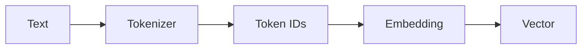
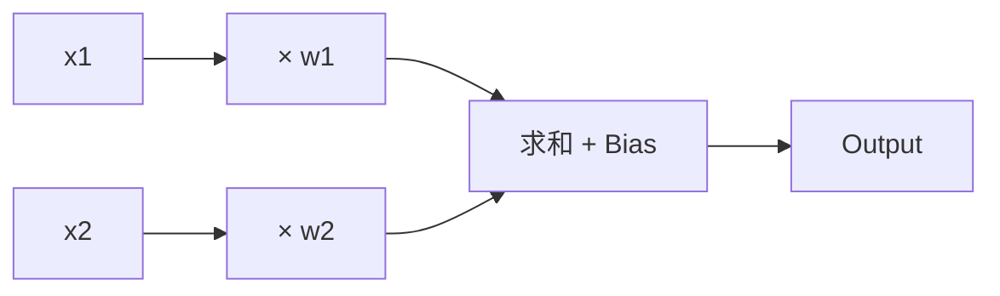
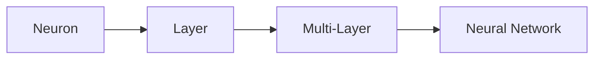
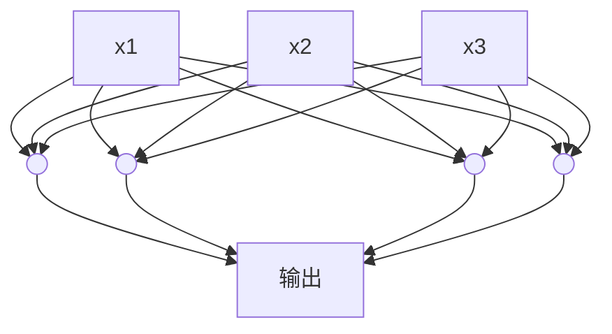
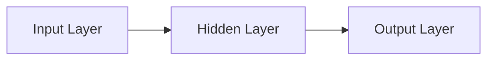
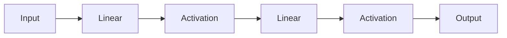
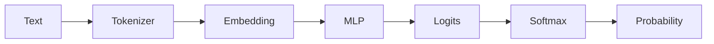
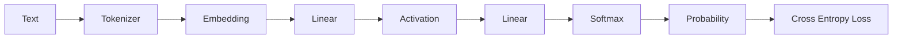

# 4. 神经网络——从神经元到 MLP

## Embedding 为什么还不能预测？

上一章，我们已经完成了：



例如 `cat` 可以表示成 `[0.28,0.73]`。现在我们已经拥有了 Token 的语义表示，那么是不是已经可以预测下一个 Token？答案是**还不能**。

为什么？假设输入 `I love AI`，Embedding 输出三个向量：`I → [0.11,0.42]`，`love → [-0.32,0.84]`，`AI → [0.92,-0.17]`。模型拥有了三个向量，但接下来应该预测 `.`、`today` 还是 `very`？Embedding 自己不知道，因为它的作用只有一个：

> **表示（Representation）**

它负责告诉模型"这个 Token 长什么样"，但不会思考下一步应该预测什么。因此我们需要一个新的模块，负责根据输入计算输出。这个模块就是：

> **Neural Network（神经网络）**

下面，我们将从一个神经元开始，亲手搭建第一个神经网络。

---

## 神经网络到底是什么？

假设有一个简单任务：**判断一句话是否积极**。例如 `I love AI` 应该输出 `Positive`，`I hate bugs` 应该输出 `Negative`。假设已经完成了 Tokenizer 和 Embedding，输入已经变成数字，例如 `I love AI` 变成 `[0.12,0.51], [-0.34,0.83], [0.91,-0.16]`。问题来了：**模型应该怎样利用这些数字做出判断？**

**最简单的方法：加权求和。** 假设只有两个输入 `x1=0.8, x2=0.3`。如果认为第一个输入更重要，可以给每个输入一个权重（Weight），例如 `w1=0.9, w2=0.2`。每一个输入先乘以自己的权重再相加：`0.8×0.9 + 0.3×0.2 = 0.72+0.06 = 0.78`。这就是**加权求和（Weighted Sum）**。

**Weight（权重）是什么？** Weight 可以理解成**模型认为某个输入的重要程度**。例如判断房价时，面积可能很重要，朝向可能稍微重要，是否靠近学校可能更重要——不同特征拥有不同 Weight。对语言模型来说，不同维度同样拥有不同 Weight，训练过程中这些 Weight 会不断更新。因此：

> **Weight 本质就是模型学到的经验。**

**Bias（偏置）是什么？** 只有 Weight 还不够，例如我们可能希望结果 `0.78` 整体再提高或降低一点，于是增加一个固定值 **Bias（偏置）**，例如 `0.78 + 0.10 = 0.88`。于是完整公式变成：

```
Output = Weighted Sum + Bias = x₁w₁ + x₂w₂ + b
```

推广到很多输入，就是深度学习中最著名的公式之一：

```
y = Wx + b
```

**一个神经元（Neuron）。** 现在我们可以画出第一个人工神经元：



这个神经元只做了三件事情：①每个输入乘以自己的 Weight；②全部相加；③加上一个 Bias。结束，没有任何神秘的地方。

**为什么神经元能够学习？** 刚开始 Weight 都是随机的（例如 `0.35, -0.17, 0.82`），模型预测错误。于是训练开始：训练会不断告诉模型"这个 Weight 太大了，那个太小了"，Weight 一点一点修改（`0.35 → 0.41 → 0.46 → 0.52`）。训练几百万次以后，Weight 就逐渐变成一组能够很好完成预测的参数。因此：

> **神经网络真正学习的，并不是知识，而是一组越来越好的 Weight。**

这也是为什么训练结束后我们通常说**保存模型参数（Model Parameters）**——这里的参数主要就是 Weight 和 Bias。

**一个神经元还不够。** 一个神经元只能完成非常简单的计算，而现实中的问题（判断情感、翻译、预测下一个 Token）都需要大量神经元共同工作。于是研究人员把很多神经元连接起来：



下面，我们将亲手实现一个真正的神经元，然后一步一步搭建第一个 Multi-Layer Perceptron（MLP）。

---

## 亲手实现第一个神经元

> **本节目标**：上面我们已经知道，一个神经元实际上只完成三件事情：①输入乘以 Weight；②全部相加；③加上 Bias。本节，我们将亲手实现这个过程。
>
> **本章将贯穿一个统一的例子**：假设我们想让模型学会"预测 `I love ___` 后面应该填什么词"，这里的输入 `x` 可以理解成 `love` 这个词的一份简化特征表示。下面所有代码和数字都会围绕这同一份输入，一步一步演进成完整的 `神经元 → 层 → 激活 → Softmax → Loss` 流水线。

本实验只需要 Python 3.10+ 和 NumPy：

```bash
pip install numpy
```

假设只有两个输入 `x1=0.8, x2=0.3`，对应权重 `w1=0.9, w2=0.2`，Bias `b=0.1`。根据上面的公式 `Output = x₁w₁ + x₂w₂ + b`，完整代码如下：

```python
import numpy as np

x = np.array([0.8, 0.3])   # 两个输入
w = np.array([0.9, 0.2])   # 两个权重
b = 0.1                    # Bias

y = np.dot(x, w) + b       # 神经元输出
print(y)
```

运行结果：`0.88`。整个神经元实际上只有一行核心代码：`y = np.dot(x, w) + b`。这里 `np.dot(x, w)` 表示 `0.8×0.9 + 0.3×0.2 = 0.72+0.06 = 0.78`，再加上 `b=0.10` 得到最终输出 `0.88`。

如果手动写 `y = x[0]*w[0] + x[1]*w[1] + b` 当然也可以，但如果输入变成 768 个或 4096 个数字，手写几乎不可能。因此神经网络几乎全部采用**向量乘法（Dot Product）**进行计算，`np.dot()` 就是实现这种计算最常见的方法。

神经元并不限制输入数量。例如把 `love` 的特征从2 维扩展成 3 维 `x = [0.8, 0.3, 0.5]`（这个 3 维向量，我们会在下面继续使用）：

```python
import numpy as np

x = np.array([0.8, 0.3, 0.5])
w = np.array([0.9, 0.2, -0.4])
b = 0.1

y = np.dot(x, w) + b
print(y)
```

整个代码没有任何修改，唯一变化的是输入变多了——这也是神经网络能够处理高维数据的重要原因。

把 `w = [0.9, 0.2]` 改成 `[0.2, 0.9]`，再改成 `[-1.0, 2.0]`，观察输出变化。你会发现：

> **Weight 决定了每一个输入的重要程度。**

把 `b = 0.1` 改成 `1.0` 或 `-0.5`，再次运行，你会发现 Bias 会整体移动输出结果，它相当于整个神经元的"基础分"。

虽然我们已经成功计算出了 `0.88`，但这个数字到底意味着什么——`Positive` 还是 `Negative`，或者"下一个 Token 是 AI"？目前神经元并不知道，因为它只是输出了一个普通数字。我们仍然需要一种方法，把这个数字转换成真正的预测结果。下面，我们将介绍**Activation Function（激活函数）**，让神经元第一次拥有"表达能力"。

**本节总结**：本节我们亲手实现了第一个神经元，整个神经元其实只有一句核心代码：

```python
y = np.dot(x, w) + b
```

其中 `x` 是输入数据，`w` 是模型学习得到的 Weight，`b` 是 Bias，`y` 是神经元输出。请记住一句话：

> **神经网络并不是神秘的黑盒，它只是由大量"加权求和"组成。**

后面的 MLP、Transformer，甚至 GPT，都建立在这一基础之上。

---

## 为什么一个神经元不够？

上面，我们亲手实现了一个神经元，整个计算过程非常简单：`输入 → 加权求和 → 输出`，例如 `y = np.dot(x, w) + b`。那么一个问题自然出现了：既然一个神经元已经可以计算，为什么还需要神经网络？

**一个神经元只能做一件事。** 假设任务是判断一句话的情感，例如 `I love AI`。一个神经元最终只能输出一个数字，如 `0.82` 或 `-1.36`，它只能学习一种简单规律，例如"love 出现 → 积极"。但现实远远没有这么简单：`I don't love AI` 虽然包含 `love`，整句话却是否定；`I absolutely love AI` 又加入了 `absolutely`，不同单词之间会互相影响。一个神经元很难同时学习所有这些复杂关系。

现实世界的问题通常包含很多特征：一个神经元可能只能关注面积，但实际影响房价的因素很多——面积、楼层、朝向、学区、地铁、建筑年代，这些因素之间还会互相影响。因此一个神经元显然不够。

**解决办法：增加神经元。** 最直接的方法就是**让多个神经元同时工作**：



不同神经元可以学习不同规律，例如第一个学习 `love`，第二个学习 `don't`，第三个学习 `AI`，最后把这些信息组合起来，得到最终预测。

**Layer（层）的概念。** 把很多神经元放在一起，就形成了一层（Layer）：



每一层都会完成一次"输入 → 计算 → 输出"，然后输出继续作为下一层的输入。随着层数越来越多，模型能够学习越来越复杂的规律。因此，神经网络（Neural Network）中的"Network"真正指的是：

> **很多层神经元连接在一起形成的网络。**

**MLP（Multi-Layer Perceptron）。** 多个神经元组成一层，多层神经元连接起来，形成 **Multi-Layer Perceptron（MLP）**，这是现代深度学习最经典的网络结构之一。GPT 中，除了 Attention，另一半几乎全部都是 MLP。因此，理解 MLP，也就是理解 GPT 的一半。

**本节总结**：请记住三个概念：一个神经元只能学习简单规律；多个神经元组成一层（Layer）；多层神经元连接起来，就形成了 MLP。下面，我们将把单个神经元扩展成真正的多层神经网络。

---

## 从一个神经元到一层神经元（Linear Layer）

> **本节目标**：上面我们已经知道，一个神经元只能学习一种简单规律；复杂任务需要多个神经元共同完成。本节，我们将把一个神经元扩展成一整层神经元，并理解深度学习中最常见的模块：**Linear Layer（线性层）**。

**多个神经元如何一起工作？** 上面只有一个神经元：`输入 → ○ → 输出`。如果增加到四个神经元，每个神经元拥有自己的 Weight，例如 `Neuron1: w=[0.2,0.5,-0.1]`，`Neuron2: w=[0.8,-0.3,0.7]`……也就是说，每一个神经元其实都在学习不同的规律。

**为什么叫 Linear Layer？** 一个神经元是 `y = Wx+b`，四个神经元就是 `y₁=W₁x+b₁, y₂=W₂x+b₂, y₃=W₃x+b₃, y₄=W₄x+b₄`。把它们放在一起，就得到 `Y = WX+b`，这里的 `W` 已经不再是一个向量，而变成一个矩阵（Matrix）：

```
输入 [x1,x2,x3] → Weight Matrix(4×3) → 4 个输出
```

因此，Linear Layer 其实就是**很多神经元一起计算**。

**矩阵到底是什么？** `Weight Matrix` 看起来复杂，其实可以理解成"很多 Weight 放在一起"。一个神经元是 `[0.2,0.5,-0.1]`，四个神经元就是：

```python
[[0.2,0.5,-0.1],
 [0.8,-0.3,0.7],
 [0.4,0.1,0.2],
 [0.6,0.8,-0.5]]
```

这就是 Weight Matrix，矩阵并没有增加新的数学知识，只是方便一次计算很多神经元。

**为什么必须使用矩阵？** 假设 GPT 一层有 4096 个神经元，如果逐个计算 `y1=..., y2=..., ..., y4096=...` 几乎不可能。因此 GPU 最擅长做的一件事情就是**矩阵乘法（Matrix Multiplication）**。现代深度学习几乎所有计算，最后都会转换成矩阵乘法，这也是 GPU 能够大幅加速 AI 的原因。

**NumPy 实现第一个 Linear Layer。** 继续使用上面扩展出的 3 维输入 `x = [0.8, 0.3, 0.5]`（`love` 的简化特征），用 NumPy 一次计算四个神经元：

```python
import numpy as np

x = np.array([0.8, 0.3, 0.5])  # 三维输入

W = np.array([  # 四个神经元
    [0.2, 0.5,-0.1],
    [0.8,-0.3, 0.7],
    [0.4, 0.1, 0.2],
    [0.6, 0.8,-0.5]
])

b = np.array([-0.5, 0.2, -0.6, 0.4])

y = W @ x + b
print(y)
```

输出：`[-0.24 1.10 -0.15 0.87]`。以前一个神经元输出一个数字，现在四个神经元输出四个数字，其中有两个是负数——这个细节我们会在下面用到。

目前 Linear Layer 只是进行了"输入 → 数学计算 → 输出数字"，例如 `[-0.24, 1.10, -0.15, 0.87]`。这些数字目前还没有任何实际意义，它们不是概率、分类或 Token，只是神经网络中的中间结果，后面的网络还会继续处理它们（下面我们会把这组数字原样接入 Activation Function）。

**Linear Layer 的局限。** 很多读者会认为"神经网络就是很多 Linear Layer 堆起来"。事实上，数学上可以证明：

> **多个 Linear Layer 连续相乘，本质上仍然只是一个 Linear Layer。**

也就是说 `Linear → Linear → Linear` 最终等价于一个更大的 Linear，模型并没有获得新的表达能力。那么为什么 GPT 可以学习如此复杂的语言规律？答案就在下面。

**本节总结**：一个神经元，就是一次加权求和；一层神经元，就是一个 Linear Layer；多个 Linear Layer 直接堆叠，并不能提升模型能力。因此，现代神经网络都会在 Linear Layer 之间加入一种新的模块：**Activation Function（激活函数）**，它将彻底改变神经网络的表达能力。

---

## 为什么需要 Activation Function（激活函数）？

> **本节目标**：上面，我们已经成功实现了 Linear Layer。现在一个新的问题出现了：**为什么几乎所有神经网络，都会在 Linear Layer 后面加入 Activation Function？**

假设有两层网络：`Input → Linear → Linear → Output`。很多人会觉得两层网络一定比一层网络更强，真的吗？第一层 `y = W₁x + b₁`，第二层 `z = W₂y + b₂`。把第一层代入第二层：

```
z = W₂(W₁x+b₁)+b₂ = (W₂W₁)x + (W₂b₁+b₂)
```

它仍然可以写成 `z = Wx+b`——两层 Linear，最后还是一个新的 Linear。

这意味着什么？假设第一层负责"英语 → 中文"，第二层负责"中文 → 法语"。如果两层完全都是 Linear，数学上可以证明它们其实可以直接合并成"英语 → 法语"，中间那一层并没有真正增加新的表达能力。因此，如果整个神经网络都是 Linear 堆叠，无论堆多少层，模型最终仍然只是一个更大的 Linear。

**模型为什么学不会复杂规律？** 一个经典例子：如果数据点可以用一条直线分开（●●● | ○○○），Linear 就能解决。但如果数据是交错分布的（●和 ○ 互相穿插），任何一条直线都无法正确分类。这种问题叫**非线性问题（Non-linear Problem）**。现实世界中的语言、图片、声音、视频，几乎全部都是非线性的，因此仅靠 Linear 远远不够。

**Activation 的作用。** 于是研究人员提出：每经过一次 Linear，不要直接进入下一层，而是增加一次 **Activation Function**：



Activation 最大的作用就是**引入非线性（Non-linearity）**，这样神经网络就能够学习更加复杂的规律。

**最常用的 Activation：ReLU。** 现代 GPT 几乎全部采用 ReLU 的变体（例如 GELU、SwiGLU），理解 ReLU 就足够了。ReLU 非常简单：

```
ReLU(x) = max(0, x)
```

| 输入 | -3 | -1 | 0 | 2 | 5 |
|------|---|---|---|---|---|
| 输出 | 0 | 0 | 0 | 2 | 5 |

负数全部变成 0，正数保持不变，图形是一条从原点开始向右上方延伸的折线。

**NumPy 实现 ReLU。** 继续使用上面 Linear Layer 算出来的那组输出 `y = [-0.24, 1.10, -0.15, 0.87]`：

```python
import numpy as np

y = np.array([-0.24, 1.10, -0.15, 0.87])
hidden = np.maximum(0, y)
print(hidden)  # [0.1.1  0.   0.87]
```

两个负数 `-0.24` 和 `-0.15` 被直接清零，正数 `1.10` 和 `0.87` 保持不变。这组 `hidden = [0, 1.10, 0, 0.87]`，我们会在下面继续用来计算 Softmax。整个 ReLU 实际上只有一行代码。

加入 Activation 后，网络变成 `Input → Linear → ReLU → Linear → Output`。ReLU 已经不是`Wx+b` 这种线性计算，因此两层网络再也不能简单合并，模型开始真正拥有学习复杂规律的能力。这也是现代深度学习真正成立的关键。

**为什么 GPT 不直接使用 ReLU？** 虽然 ReLU 已经非常优秀，但它仍然存在问题：负数全部变成 0，可能导致部分神经元长期失活。因此现代 Transformer 通常采用 GELU（GPT、BERT）或 SwiGLU（LLaMA、Qwen），它们都可以理解成 ReLU 的升级版本，思想完全一致：**在线性层之间加入非线性**。理解 ReLU，后面的所有 Activation 都会非常容易。

**本节总结**：Linear Layer 负责计算；多个 Linear 连续堆叠，本质仍然是一个 Linear；Activation Function 引入非线性；没有 Activation，就没有现代深度学习。

>💡 **Insight：Transformer 里的激活函数在哪里？** 阅读 GPT 或 LLaMA 的源码时，经常会看到：
>
> ```python
> self.fc1 = nn.Linear(hidden_size, intermediate_size)
> self.act = nn.GELU()
> self.fc2 = nn.Linear(intermediate_size, hidden_size)
> ```
>
> 现在你已经能够读懂它了：`输入 → Linear → Activation（GELU） → Linear → 输出`。这就是 Transformer 中 **Feed Forward Network（FFN）** 的核心结构。等学习到 Transformer 时，你会发现：**FFN 本质上就是本章实现的 MLP，只是规模更大、激活函数更先进。**

---

## Softmax：神经网络如何输出概率？

> **本节目标**：上面，我们已经构建了 `Embedding → Linear → Activation`，神经网络已经能够输出一组数字，例如 `[0, 1.10, 0, 0.87]`。但这些数字到底代表什么？为什么 ChatGPT 输出的是 `like 40%, love 28%, AI 12%...` 而不是这些原始数字？本节，我们将介绍 Softmax。

延续上面的结果：`hidden = [0, 1.10, 0, 0.87]`。这仍然只是一个 4 维的中间向量，还不能直接表示"下一个词是什么"。因此需要再接一层 Linear，把它映射到词表（Vocabulary）的 5 个 Token 上：`0:I, 1:love, 2:like, 3:AI, 4:NLP`。

```python
import numpy as np

hidden = np.array([0, 1.10, 0, 0.87])  # 来自上面

W2 = np.array([
    [0.1, 0.5, 0.2,-0.3],   # I
    [0.4, 0.9,-0.1, 0.6],   # love
    [0.2, 0.3, 0.5, 0.1],   # like
    [0.6, 1.2, 0.4, 0.8],   # AI
    [0.3, 0.4, 0.2, 0.5],   # NLP
])
b2 = np.array([0.1, 0.2, 0.0, 0.3, 0.1])

logits = W2 @ hidden + b2
print(logits)  # [0.389 1.712 0.417 2.316 0.975]
```

这组 `[0.389, 1.712, 0.417, 2.316, 0.975]` 就是神经网络最后一层的原始输出，还不是概率，它有一个专门的名字：

> **Logits（未归一化分数）**

Logits 可以理解成**模型对每一个 Token 的"偏好程度"**。这里只能说明 `AI`（2.316）分数最高，但到底"更可能"多少，不知道。

**为什么不能直接选择最大的数字？** 当然可以直接 `argmax → AI`，很多分类模型就是这样做的。但 Language Model 需要的不只是最大的 Token，而是**整个概率分布（Probability Distribution）**，例如：

```
I love → AI 45%, Python 30%, NLP 15%, you 5%, cats 5%
```

因为后面的 Sampling（采样）、Temperature、Top-k、Top-p 都需要完整概率。因此，我们必须把 Logits 变成概率。

一个合法的概率必须满足：①每一个值都 ≥ 0；②所有概率加起来必须等于 1（例如 `0.45+0.30+0.15+0.05+0.05=1.00`）。神经网络的原始输出显然不满足，因此需要一种转换方法。

**Softmax 是什么？** Softmax 的作用只有一句话：**把任意一组数字，转换成一组合法的概率。** 例如输入 `[0.389,1.712,0.417,2.316,0.975]`，输出 `[0.069,0.260,0.071,0.475,0.124]`——现在所有值都在 0~1 之间，且全部相加等于 1。

**Softmax 为什么能够做到？** Softmax 分两步：第一步把所有数字做指数运算 `e^x`（例如 `e² ≈ 7.39`），因为指数函数永远大于 0，负数也会变成正数；第二步除以所有值的总和，于是全部加起来一定等于 1。这就是 Softmax。

**NumPy 实现 Softmax：**

```python
import numpy as np

logits = np.array([0.389, 1.712, 0.417, 2.316, 0.975])  # 来自上面的 W2 @ hidden + b2
exp = np.exp(logits - np.max(logits))  # 减去最大值，数值更稳定
prob = exp / np.sum(exp)

print(prob)        # [0.069 0.260 0.071 0.475 0.124]
print(prob.sum())  # 1.0
```

现在模型终于拥有了真正意义上的概率：`I 6.9%, love 26.0%, like 7.1%, AI 47.5%, NLP 12.4%`——`AI` 概率最高，这也符合我们"预测 `I love ___`"的直觉。这组 `prob`，我们会在下面继续用来计算 Loss。

**为什么 Softmax 要减去最大值？** 如果 Logits 很大，例如 `[1000,1001,999]`，直接 `exp(1000)` 计算机会溢出（Overflow）。因此工程实现都会写成：

```python
exp = np.exp(logits - np.max(logits))
```

例如原来 `[1000,1001,999]` 减去最大值 1001，变成 `[-1,0,-2]`，Softmax 结果完全一样，但数值更加稳定。PyTorch、TensorFlow、JAX 全部都是这样实现的。

到目前为止，我们的模型已经变成：



请注意，真正决定输出哪个 Token 的，并不是 MLP，而是 Softmax 后得到的概率分布。后面的 Sampling、Temperature、Top-k、Top-p，都是在这里进行的。

**本节总结**：Linear 输出的是 Logits；Logits 不是概率；Softmax 把 Logits 转换成概率；Language Model 真正预测的是整个 Token 概率分布，而不是一个唯一答案。

> 💡 **Insight：为什么第一章的实验会预测 "like"？** 还记得第一章的 Mini Language Model 吗？当时模型输出类似 `like 40%, love 35%, AI 10%`。为什么没有直接输出 `like`？因为模型真正学习和输出的从来不是一个固定答案，而是一整个**概率分布**。推理时如果采用 **Greedy Decoding**，会直接选择概率最大的 `like`；如果采用 **Sampling**，即使 `love` 只有 35%，它仍然有机会被采样出来——这也是为什么同一个 Prompt 多次询问 ChatGPT，得到的回答可能会有所不同。Temperature、Top-k、Top-p 等采样策略，会在后面的 **Inference（推理）** 章节详细介绍。

---

## Cross Entropy Loss：模型如何知道自己预测错了？

> **本节目标**：上面，我们已经利用 Softmax，把模型输出转换成了概率：`I 6.9%, love 26.0%, like 7.1%, AI 47.5%, NLP 12.4%`。模型已经能够预测每个 Token 的概率，但一个新的问题出现了：**模型怎么知道自己的预测是对还是错？** 本节，我们将介绍深度学习中最重要的评价指标之一：**Cross Entropy Loss（交叉熵损失）**。

假设正在训练一个 Language Model，输入 `I love`，真实答案（Ground Truth）是 `AI`。

模型预测 A：`AI 0.73, Python 0.15, NLP 0.07, You 0.05` —— 预测得不错，因为正确答案 `AI` 拥有最高概率。

模型预测 B：`Python 0.70, AI 0.15, NLP 0.10, You 0.05` —— 虽然也是一组合法概率，但真正答案 `AI` 只有 15%，显然模型预测错了。

**模型需要一个"分数"。** 训练过程很像考试，老师会告诉学生答对了还是答错了。神经网络也一样，每预测一次都需要有人告诉它"这次预测得怎么样"，于是我们定义 **Loss（损失）**：

> **Loss 表示模型这一次预测有多差。**

Loss 越小，预测越好；Loss 越大，预测越差。因此训练目标只有一句话：**不断降低 Loss。**

**什么样的 Loss 才合理？** 真实答案都是 `AI`：模型 A 预测 `AI 95%`，模型 B 预测 `AI 20%`，显然 A 更优秀，Loss 应该更小；模型 C 预测 `AI 1%`，几乎完全预测错，Loss 应该非常大。因此一个好的 Loss 应该满足：

> **正确答案概率越高，Loss 越小；正确答案概率越低，Loss 越大。**

**Cross Entropy 的思想。** Cross Entropy 并不关心其它 Token 的概率，它只关心：**真实答案的概率是多少？** 例如正确答案 `AI` 预测为 `0.90`，Loss 很小；如果预测为 `0.05`，Loss 就会非常大。因此 Cross Entropy 本质上就是**奖励正确答案拥有更大的概率**。

**Cross Entropy 的公式。** 数学上，Cross Entropy 写成：

```
Loss = -log(P)
```

其中 `P` 表示真实答案对应的预测概率。例如 `P=0.9` 时 `Loss = -log(0.9) ≈ 0.105`；`P=0.5` 时 `Loss ≈ 0.693`；`P=0.1` 时 `Loss ≈ 2.303`。可以发现：

> **正确答案概率越低，Loss 增长得越快。**

这正是我们希望看到的效果。

**NumPy 实现 Cross Entropy。** 继续使用上面算出的概率分布，假设我们这次的真实答案（Ground Truth）就是 `AI`（索引 3，正好对应我们"预测 `I love___`"的例子）：

```python
import numpy as np

prob = np.array([0.069, 0.260, 0.071, 0.475, 0.124])  # 来自上面的 Softmax 输出
target = 3  # 正确答案：AI（索引 3）

loss = -np.log(prob[target])
print(loss)  # 0.744
```

模型给 `AI` 的概率是 47.5%，Loss 约为 `0.744`，属于"预测得还不错，但仍有提升空间"。

如果模型这次预测得很差，例如 `prob = [0.30, 0.40, 0.20, 0.05, 0.05]`（`AI` 只有 5%），再次运行会得到 `2.9957`，Loss 明显变大，说明模型几乎没有预测到正确答案。

**训练真正优化的是什么？** 很多初学者认为训练是在优化 Weight 或 Embedding，其实训练真正优化的是 **Loss**。整个训练流程可以概括成：


模型从来不知道什么是猫、什么是狗，它只知道**怎样才能让 Loss 更小**。随着训练不断进行，模型逐渐学会更准确地预测下一个 Token。

Loss 并不是真正"损失"了什么，它只是一个数字，用来衡量模型距离正确答案还有多远。因此 Loss 又常被称为**目标函数（Objective Function）**或**优化目标（Optimization Target）**。现代深度学习几乎所有训练过程，最终目标都只有一个：**最小化 Loss。**

**本节总结**：Softmax 输出的是概率；Loss 衡量预测有多差；Cross Entropy 只关心真实答案的概率；训练的目标，就是不断降低 Loss。

> 💡 **Insight：为什么大模型训练日志总是在看 Loss？** 查看 LLaMA、Qwen、DeepSeek 等模型的训练日志，经常会看到：
>
> ```text
> Step 1000  Loss = 2.34
> Step 5000  Loss = 1.78
> Step 10000 Loss = 1.21
> ```
>
> 研究人员真正关心的，不是某一个 Weight 是否变大，而是**Loss 是否持续下降**。Loss 持续下降，说明模型正在不断提高预测下一个 Token 的能力，这也是训练过程中最重要的指标之一。

到目前为止，我们已经完成了整个**前向传播（Forward Pass）**：



我们已经能够把文本转换成 Token，把 Token 转换成 Embedding，通过神经网络得到预测，使用 Softmax 得到概率，使用 Cross Entropy 评价预测质量。但一个关键问题仍未解决：

> **Loss 已经算出来了，模型到底应该如何修改 Weight，让下一次预测更准确？**

下一章，我们将先讨论 Context Window（上下文窗口），然后进入整个深度学习训练的核心：**Gradient Descent（梯度下降）**。
