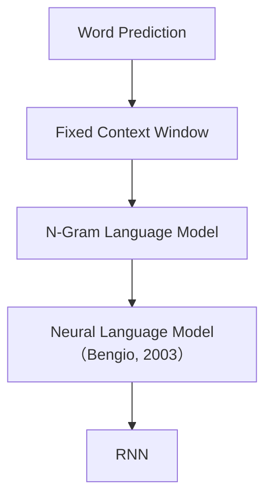

# Chapter 5：Context Matters（上下文为什么如此重要）

> **本章目标**
>
> 到目前为止，我们已经完成了 `Text → Tokenizer → Token IDs → Embedding → Neural Network → Probability`，拥有了一个能够预测下一个 Token 的神经语言模型。但它仍然存在一个大问题：**它几乎不知道一句话真正的含义。** 因为一个词真正的意义并不来自它自己，而来自它所处的上下文（Context）。
>
> 本章将学习：什么是 Context、为什么上下文决定语义、什么是 Context Window（上下文窗口）、第一个真正利用上下文的 Neural Language Model，以及为什么固定窗口最终走向了 RNN。

---

# 5.1 为什么同一个词会有不同含义？

看一句英文 `I sat by the bank.`——这里 `bank` 是"银行"还是"河岸"？仅凭这个单词无法确定。继续看 `I deposited money at the bank.`，因为 `money` 提供了上下文，几乎所有人都会理解 `bank` 表示银行；再看 `I sat by the river bank.`，`river` 又告诉我们 `bank` 表示河岸。

请注意，真正决定 `bank` 意义的，并不是 `bank` 自己，而是它周围出现的其它词，这就是**Context（上下文）**。

中文也是一样：`苹果很好吃` 中的"苹果"是水果，`苹果发布了新 MacBook` 中的"苹果"是科技公司。同样一个 Token，因为上下文不同，语义完全不同。因此，现代 Language Model 真正学习的并不是"一个 Token"，而是：

> **Token 在 Context 中的含义。**

---

# Token 本身没有意义

很多初学者会认为 Embedding 已经学习到了 `bank` 的语义，实际上 Embedding 学到的是 `bank` 在大量语料中的平均意义。真正使用时，模型仍然需要结合上下文，才能知道当前到底表示什么。因此：

- Embedding 回答的是：**这个 Token 通常是什么？**
- Context 回答的是：**这个 Token 在这一句话中是什么意思？**

---

# 5.2 Context Window（上下文窗口）

既然 Context 如此重要，模型应该看多大的上下文？最简单的方法是规定模型每次只能看前面的几个 Token。例如窗口大小为 2，句子 `I love AI today`，训练样本是 `[I, love] → AI`，接着 `[love, AI] → today`。模型始终只能看到最近两个 Token，这就是**Context Window（上下文窗口）**。

---

# 为什么叫 Window（窗口）？

可以想象成一个不断向前滑动的小窗口。例如 `I love AI today very much`，窗口大小为 3：`[I love AI] → today`，`[love AI today] → very`，`[AI today very] → much`。窗口不断向前移动，因此又叫**Sliding Window（滑动窗口）**。

---

# Experiment 5.1：构建 N-Gram 数据集

亲手实现一个固定窗口的数据集生成器。假设语料只有一句 `I love AI today`，窗口大小为 2：

```python
sentence = ["I", "love", "AI", "today"]
window_size = 2

samples = []
for i in range(window_size, len(sentence)):
    context = sentence[i-window_size:i]
    target = sentence[i]
    samples.append((context, target))

for x, y in samples:
    print(x, "->", y)
```

输出：

```text
['I', 'love'] -> AI
['love', 'AI'] -> today
```

这就是最早期 Language Model 的训练数据。请注意，整个训练集已经不再是 `Token → Next Token`，而变成 `Context → Next Token`。这是现代 Language Model 最重要的一次升级。

---

# Context Window 的优点与局限

固定窗口非常简单，容易实现、容易训练、可以并行生成训练样本，能够学习短距离依赖，因此早期很多语言模型都采用这种方式。

但问题也很明显：假设窗口大小为 3，句子 `The book that I bought yesterday is interesting.`，预测 `interesting` 时真正重要的信息是 `book`，但 `book` 距离 `interesting` 已经超过 3 个 Token，窗口已经看不到了，模型失去了最重要的信息。窗口越小，模型遗忘得越快；窗口越大，计算量又快速增长。因此固定窗口很快遇到了瓶颈。

---

# Historical Evolution

语言模型的发展，大致经历了下面几个阶段：



这一时期，研究者已经意识到"上下文决定语义"，但如何利用越来越长的上下文，仍然是一个巨大的挑战。

---

# Today's Takeaway

请记住五句话：Token 的意义来自 Context；Embedding 提供的是静态语义；Context 提供的是动态语义；固定窗口第一次让模型能够理解上下文；固定窗口虽然简单，但无法处理长距离依赖。

下一章，我们将亲手实现第一个真正利用上下文的语言模型——**Neural Language Model**，把Embedding、拼接、MLP、Softmax、Cross Entropy 这些模块一步步组装起来，训练出一个真正能感知上下文的模型。再往后，我们会继续追问：固定窗口终究还是"看多远、忘多远"，如果想让模型拥有真正的记忆，又该怎么办？那时我们会正式进入 **RNN（Recurrent Neural Network）**。
