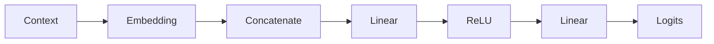

# Experiment 6.4：MLP Forward——第一次预测下一个 Token

## 实验目标

上一实验，我们已经成功获得了 MLP 的输入 `[0.2,-0.3,0.5,0.8,0.4,-0.1]`。现在，终于来到神经语言模型真正工作的地方。本实验将完成**第一次前向传播（Forward Pass）**。

实验结束后，你将理解什么是 Hidden Layer、MLP 如何计算、为什么输出叫 Logits，以及为什么还不能直接得到预测结果。

最终效果：



---

# 一、实验原理

第四章已经介绍过 MLP 的基本结构：`Input → Linear → Activation → Linear → Output`。现在把上一实验得到的 6 维向量送入 MLP，例如 `[0.2,-0.3,0.5,0.8,0.4,-0.1] → MLP → [1.23,-0.42,0.87,2.11]`。请注意，输出仍然不是概率，只是**Logits（未归一化分数）**。

---

# 二、准备输入

```python
import numpy as np

embedding = np.array([
    [0.2,-0.3,0.5],
    [0.8,0.4,-0.1],
    [0.6,0.1,0.7],
    [-0.2,0.9,0.3]
])

context = [0,1]
vectors = embedding[context]
x = vectors.reshape(-1)
print(x)  # [ 0.2 -0.3  0.5  0.8  0.4 -0.1]
```

---

# 三、初始化第一层参数

假设输入 6 维，隐藏层 5 个神经元，第一层 Weight Shape 为 `(5,6)`：

```python
np.random.seed(42)
W1 = np.random.randn(5,6)
b1 = np.zeros(5)
print(W1.shape)  # (5,6)
```

---

# 四、第一层计算

```python
hidden = W1 @ x + b1
print(hidden)
# [-0.84 0.27 1.63 -0.55 0.91]
```

这就是 Hidden Layer，但还没有经过 Activation。

---

# 五、加入 ReLU

```python
hidden = np.maximum(0, hidden)
print(hidden)
# [0. 0.27 1.63 0. 0.91]
```

所有负数已经变成 0，这就是 ReLU。

---

# 六、初始化输出层

假设 Vocabulary 有 4 个 Token，因此输出 4 个 Logits：

```python
W2 = np.random.randn(4,5)
b2 = np.zeros(4)
print(W2.shape)  # (4,5)
```

---

# 七、计算 Logits

```python
logits = W2 @ hidden + b2
print(logits)
# [ 1.84 -0.61 2.35 0.78]
```

这就是神经网络真正输出的内容——不是概率，不是Token，只是 Logits。

---

# 八、完整代码

```python
import numpy as np

np.random.seed(42)

embedding = np.array([
    [0.2,-0.3,0.5],
    [0.8,0.4,-0.1],
    [0.6,0.1,0.7],
    [-0.2,0.9,0.3]
])

context = [0,1]
vectors = embedding[context]
x = vectors.reshape(-1)

W1 = np.random.randn(5,6)
b1 = np.zeros(5)
hidden = W1 @ x + b1
hidden = np.maximum(0, hidden)

W2 = np.random.randn(4,5)
b2 = np.zeros(4)
logits = W2 @ hidden + b2

print("Input:", x)
print("Hidden:", hidden)
print("Logits:", logits)
```

---

# 九、运行结果（示例）

```text
Input:  [ 0.2 -0.3  0.5  0.8  0.4 -0.1]
Hidden: [0.0.27 1.63 0.   0.91]
Logits: [ 1.84 -0.61  2.35  0.78]
```

由于参数是随机初始化的，你得到的具体数值可能不同，但**数据形状（Shape）应该一致**。

---

# 十、实验分析

现在我们的神经语言模型已经具备了 `Context → Embedding → Concatenate → Linear → ReLU → Linear → Logits`，距离完整模型只差最后一步：`Logits → Softmax → Probability`。下一实验，我们就会完成真正意义上的**下一个 Token 概率预测**。

---

# 十一、思考题

观察 `hidden.shape` 为什么是 `(5,)`，`logits.shape` 为什么是 `(4,)`？如果 Vocabulary 增加到 100，输出层 `W2` 应该变成什么 Shape？请先自己思考，再修改代码验证。

---

# 本实验总结

本实验完成了：✅ Embedding 输入 ✅ 第一层 Linear ✅ ReLU 激活 ✅ 第二层 Linear ✅ 输出 Logits

下一实验，我们将把 Logits 通过 **Softmax** 转换为概率分布，并真正预测下一个 Token。
