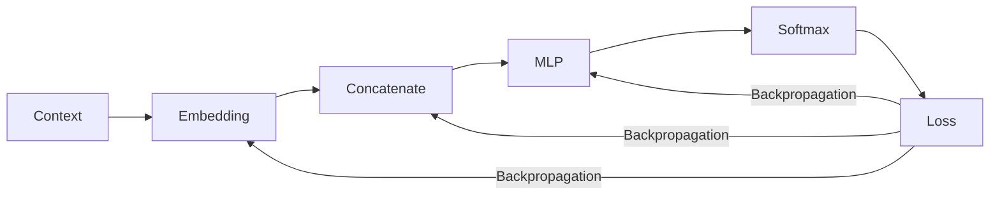

# Experiment 6.7：Gradient Descent——模型是如何学会的？

## 实验目标

上一实验，模型已经能够计算 Loss，知道自己预测得好还是不好。但仅仅知道"错了"还不够，模型还需要知道：**Weight 应该往哪个方向调整、调整多少，才能让 Loss 变小？** 本实验将实现深度学习中最核心的算法——**Gradient Descent（梯度下降）**。

---

# 一、一个简单的类比

假设你站在山坡上，想要走到山谷（Loss 最小的地方），但你看不见整座山，只能感觉脚下的坡度（Gradient，梯度）。于是你每一步都朝着坡度下降最快的方向走一小步，走了很多步以后，就会越来越接近谷底。这就是梯度下降的思想：

> **梯度（Gradient）指出了 Loss 增长最快的方向，我们只需要往相反方向走，就能让 Loss 变小。**

---

# 二、用一个最简单的例子理解梯度

假设 Loss 函数是 `L(w) = (w - 3)²`，当 `w=3` 时 Loss 最小（等于 0）。梯度就是 Loss 对 `w` 的导数：`dL/dw = 2(w-3)`。

```python
import numpy as np

def loss_fn(w):
    return (w - 3) ** 2

def gradient_fn(w):
    return 2 * (w - 3)

w = 0.0          # 初始值
lr = 0.1         # 学习率（Learning Rate）

for step in range(10):
    grad = gradient_fn(w)
    w = w - lr * grad
    print(f"step {step}: w={w:.3f}, loss={loss_fn(w):.3f}")
```

---

# 三、运行结果

```text
step 0: w=0.600, loss=5.760
step 1: w=1.080, loss=3.686
step 2: w=1.464, loss=2.359
step 3: w=1.771, loss=1.510
...
step 9: w=2.786, loss=0.046
```

可以看到 `w` 从 0 一步一步逼近 3，Loss 也不断变小。这就是梯度下降。

---

# 四、Learning Rate（学习率）的作用

`lr` 决定每一步走多远。如果 `lr` 太小（例如 0.001），需要走非常多步才能收敛；如果 `lr` 太大（例如 2.0），可能会在最优点附近来回跳动，甚至越走越远（不收敛）。因此 Learning Rate 是训练中最重要的超参数之一。

---

# 五、公式：Weight 更新规则

```
w_new = w_old - learning_rate × gradient
```

这条公式贯穿所有深度学习训练——无论是四层 MLP，还是千亿参数的 GPT，参数更新方式完全一样，唯一区别是参数数量多了几十亿倍。

---

# 六、梯度是如何计算出来的？

对于简单函数（如 `(w-3)²`），我们可以手动求导。但神经网络有成千上万个参数，手动求导几乎不可能。现代深度学习框架（PyTorch、TensorFlow）都实现了**自动求导（Automatic Differentiation）**，通过**反向传播（Backpropagation）**，从输出的 Loss 开始，沿着计算图反向逐层计算每一个参数的梯度。反向传播的数学细节不属于本书重点，你只需要记住：

> **反向传播能够自动计算出，每一个 Weight 应该朝哪个方向调整，才能让 Loss 变小。**

---

# 七、把梯度下降应用到 Neural Language Model

现在把这一思想代入我们的模型：



Loss 计算完成后，通过反向传播，Embedding、MLP 中每一个参数都会得到一个梯度，然后按照 `w_new = w_old - lr × grad` 更新。重复这一过程数千、数万次，模型的预测就会越来越准确。

---

# 八、完整训练循环（伪代码）

```python
for step in range(num_steps):
    context, target = get_batch()          # 1. 取一批数据
    logits = forward(context)               # 2. 前向传播
    loss = cross_entropy(logits, target)    # 3. 计算 Loss
    grads = backward(loss)                  # 4. 反向传播，计算梯度
    update_weights(grads, lr)               # 5. 更新参数
```

这五行伪代码，就是几乎所有深度学习模型训练的核心循环，GPT 的训练过程在本质上完全一样，只是规模大很多。

---

# 本实验总结

本实验完成了：✅ 理解梯度下降的直觉 ✅ 实现最简单的梯度下降 ✅ 理解 Learning Rate ✅ 理解反向传播的作用 ✅ 理解完整训练循环

现在我们已经拥有了训练一个真正 Neural Language Model 所需的全部组件。下一实验，我们将把前面所有实验组合起来，使用 PyTorch **真正训练**一个完整的 Neural Language Model。
