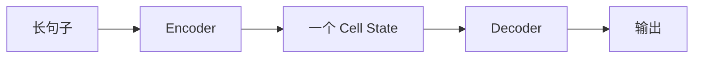
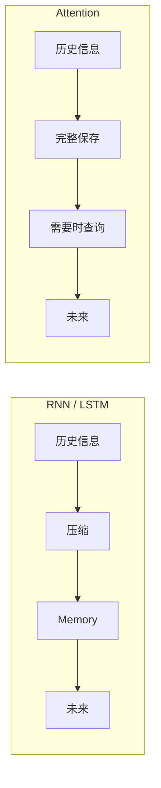

# 7.12 LSTM 的极限——为什么还需要 Attention？

到这里，我们已经完整学习了 LSTM。相比 RNN，它增加了 Cell State、Forget Gate、Input Gate、Output Gate，模型终于拥有了**长期记忆（Long-term Memory）**。但这是否意味着 LSTM 已经解决了所有问题？答案是：**没有。**

---

# 一个新的问题

来看一句很长的句子：`The little girl who was born in Shanghai, moved to Beijing, studied at Tsinghua University, worked at Google for five years, then joined OpenAI, finally published an important paper.`。最后的 `published` 真正对应的是 `The little girl`。虽然 LSTM 能比 RNN 记住更多内容，但它仍然需要一直维护**同一个 Cell State**——无论一句话是 10 个 Token 还是 1000 个 Token，真正保存历史信息的，始终只有这一个 Cell State。

---

# 一个形象的比喻

假设你在阅读一本500 页的书。RNN 要求你读完以后只能留下一张纸条，所有内容都必须压缩进去。LSTM 升级了一点，给你一张更大的纸，甚至可以擦除、修改、补充，但最后仍然只有这一张纸——一本 500 页的书，真的能够压缩到一张纸吗？当然不能。

---

# Information Bottleneck（信息瓶颈）

这种问题在机器学习中叫 **Information Bottleneck（信息瓶颈）**：



整个句子无论有多少信息，最后都必须经过同一个 Cell State，大量信息不得不被压缩。

---

# Experiment 7.14：体验信息压缩

```python
sentence = ["Alice", "毕业于清华", "加入 Google", "研究 Transformer", "获得最佳论文奖", "成为教授"]
memory = "Alice 很优秀"  # 假设只能保存一句摘要
```

请思考：`毕业于清华、加入 Google、Transformer、最佳论文、教授` 这些信息是否还在？答案：几乎全部丢失。

---

# Cell State 并不是无限大的

为什么不能把 Cell State 变得越来越大（128 → 512 → 2048 → 100000）？理论上当然可以，但代价越来越高，而且无论多大，最终仍然是**固定长度**。只要输入序列继续增长，信息压缩仍然不可避免。

---

# 更好的办法是什么？

阅读论文时，如果突然忘记第一页写了什么，你不会拼命回忆，而是直接翻回第一页。这是一个完全不同的思想：不是"记住所有东西"，而是"**需要的时候再去查看**"。

---

# 从 Memory 到 Retrieval



Attention 第一次提出：**不要把所有历史压缩到一个向量，而是保留整个历史，在需要时动态读取。** 模型不再依赖"记忆有多好"，而依赖"检索有多快"。

---

# 本章总结

本章，我们完成了 RNN 系列模型的学习：✅ 为什么需要 Hidden State ✅ RNN Cell 如何工作 ✅ Unrolling 与 Parameter Sharing ✅ 为什么 RNN 会遗忘 ✅ LSTM 如何通过 Gate 管理长期记忆 ✅ 为什么固定长度 Cell State 仍然存在信息瓶颈

请注意，LSTM 并没有失败，它只是把 Memory 做到了极致。而下一代模型选择了一条完全不同的道路：**既然记不住，就不要强行记；需要时，再回头看。** 这就是 **Attention**。

---

# 下一章预告

下一章，我们将学习深度学习历史上最重要的思想之一：**Attention（注意力机制）**。我们会重新提出一个问题：**如果模型能够随时查看历史 Token，还需要把所有信息压缩到 Memory 中吗？** 答案，将彻底改变整个 NLP 的发展方向。
