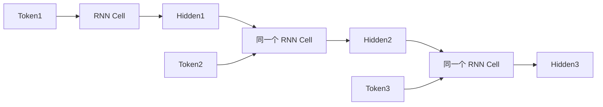

# 7.4 Unrolling——一个 RNN Cell 如何组成整个 RNN？

上一节，我们实现了一个真正的 RNN Cell：`hidden = tanh(Wx@token + Wh@hidden + b)`，它能够完成 `Previous Hidden + Current Token → New Hidden`。但一句话 `I love AI today` 有 4 个 Token，难道需要 4 个 RNN Cell？如果 100 个 Token，需要 100 个 Cell 吗？答案是**不需要**。

---

# 一个非常重要的思想

观察上一节的代码：

```python
for token in tokens:
    hidden = np.tanh(Wx @ token + Wh @ hidden + b)
```

这里并没有创建新的 Cell，`Wx`、`Wh`、`b` 全部只有一套，一直重复使用。也就是说，真正工作的其实只有**一个 RNN Cell**，它只是不断处理新的 Token。



这里真正变化的是 Hidden，不是 Cell。

---

# 为什么论文会画很多个方框？

很多论文会画出一排方框，很多初学者会误认为存在三个 Cell，其实不是——论文只是把**同一个 Cell**在时间轴上**展开（Unroll）**了。这三个方框参数完全一样，真正只有一套 `Wx, Wh, b`。

---

# 什么叫 Parameter Sharing？

RNN 最重要的特点就是：**所有时间步，共享同一套参数。** 无论处理 10 个 Token，还是 1000 个 Token，参数数量都不会增加，这就是 **Parameter Sharing（参数共享）**。

为什么必须共享参数？假设不共享，一句 100 Token 的话需要 100 套 Weight，另一句 200 Token 的话需要 200 套 Weight，模型根本无法处理不同长度的句子。因此 RNN 必须共享参数。

---

# Experiment 7.4：验证 Parameter Sharing

```python
import numpy as np

np.random.seed(42)
Wx = np.random.randn(2,2)
Wh = np.random.randn(2,2)
b = np.zeros(2)

hidden = np.zeros(2)
tokens = [np.array([1,0]), np.array([0,1]), np.array([1,1])]  # I, love, AI（与 7.2、7.3 节相同）

print(id(Wx))
for token in tokens:
    print(id(Wx))
    hidden = np.tanh(Wx @ token + Wh @ hidden + b)
```

输出中 `id(Wx)` 每次都完全一样，说明整个过程一直使用同一个 `Wx`。

---

# Experiment 7.5：手动展开 RNN（Unrolling）

为了直观理解 Unrolling，我们不用 `for` 循环，而是手动展开：

```python
hidden0 = np.zeros(2)
hidden1 = np.tanh(Wx @ tokens[0] + Wh @ hidden0 + b)
hidden2 = np.tanh(Wx @ tokens[1] + Wh @ hidden1 + b)
hidden3 = np.tanh(Wx @ tokens[2] + Wh @ hidden2 + b)
print(hidden3)
```

这段代码和 `for token in tokens:` 完全等价，只是我们手动把时间展开了。这就是论文里的 **Unrolling（时间展开）**。

---

# Time Step（时间步）

论文中经常看到 `t=1, t=2, t=3`。很多人会误以为 Time 表示现实时间，其实不是，这里 **Time Step 表示第几个 Token**，例如 `I → t=1`，`love → t=2`，`AI → t=3`，`today → t=4`。因此 RNN 是在 Token 序列上前进，不是在现实时间上前进。

---

# 本节总结

本节，我们理解了 RNN 最容易误解的几个概念：✅ 一个 RNN 只有**一个 Cell**；✅ 多个方框只是**时间展开（Unrolling）**；✅ 所有时间步共享同一套参数（Parameter Sharing）；✅ Time Step 表示 Token 的位置，而不是现实中的时间。这也是 RNN 能够处理任意长度序列的关键原因。

下一节，我们还有一个问题没有解决：**模型到底什么时候输出结果？** 不同任务的答案完全不同，我们将学习 RNN 的三种经典输出模式：**Many-to-One、One-to-Many、Many-to-Many**。
