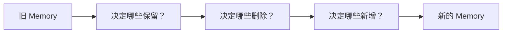
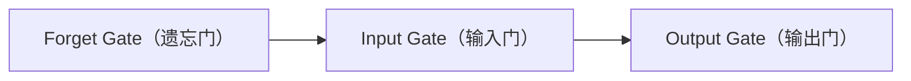

# 7.7 如果由你设计 Memory，你会怎么改？

上一节，我们发现 RNN 的 Memory 会越来越弱，原因不是模型没有 Memory，而是**它不会管理自己的 Memory**。上一节的更新方式 `memory = 0.8 * memory + token` 中，模型没有任何选择：它不知道哪些应该保留、哪些应该忘记、哪些应该加入。

---

# 一个生活中的例子

假设你的大脑只有一个笔记本，每天都往里面写东西：第一天"今天认识了 Alice"，第二天"今天吃了披萨"，第三天"今天下雨了"……如果每写一条都把前面内容擦掉一点，几年以后你可能已经忘了 Alice。但 Alice 真的应该被忘记吗？也许不应该。

---

# Memory 应该具备什么能力？

如果由你设计 Memory，你最希望它具备哪些能力？大多数人会想到：①重要的信息不要忘（例如 `Alice` 一直保存）；②无关的信息及时删除（例如"天气很好"不用一直记住）；③遇到新的重要信息，加入 Memory（例如"Alice 是教授"）；④输出的时候，只取当前需要的信息，而不是把全部 Memory 都说出来。

---

# 重新设计 Memory

Memory 更新不应该再是机械的 `memory = 0.8 * memory + token`，而应该变成：



这里第一次出现"决定（Decision）"——Memory 不再是机械更新，而是**可控制（Controllable）**。

---

# Experiment 7.7：手写一个"可控制"的 Memory

```python
memory = ["Alice"]

token = "天气很好"
if "天气" not in token:
    memory.append(token)
print(memory)  # ['Alice']

token = "Alice 是教授"
if "天气" not in token:
    memory.append(token)
print(memory)  # ['Alice', 'Alice 是教授']
```

当然，真正的神经网络不会写 `if "天气" in token` 这样的规则，而是通过训练自己学习哪些重要、哪些可以忘，但思想完全一样：**Memory 应该具有选择能力。**

---

# 三个动作

刚刚设计的 Memory实际上需要三个动作：**删除（Forget）**、**加入（Input）**、**输出（Output）**。1997 年，研究人员提出了一种新的网络，正是这样设计 Memory 的，它的名字叫：

> **LSTM（Long Short-Term Memory）**

LSTM 并没有推翻 RNN，它只是给 RNN 增加了三个"开关"：



从此，模型终于可以**决定什么该忘、什么该记、什么该输出**。
