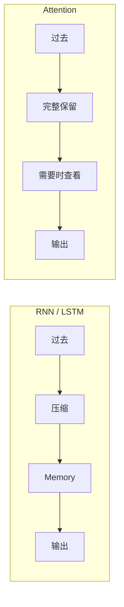

# Chapter 8：Attention

# 8.0 为什么还需要 Attention？

上一章，我们学习了 RNN 和 LSTM。LSTM 引入了 Cell State，能够保存长期记忆，相比普通 RNN 已经是巨大的进步。但还有一个问题没有解决。

---

# 一个翻译任务

来看一句英文：`The animal didn't cross the street because it was too tired.`——这里的 `it` 指的是谁？答案是 `The animal`。再看一句：`The animal didn't cross the street because it was too wide.`——现在 `it` 又是谁？答案是 `the street`。模型需要回头查看前面不同的位置，才能知道 `it` 真正指代谁。

LSTM 不能回头，它只能一直维护 Cell State：所有历史信息都必须不断压缩，最终存放到 Cell State，然后再依靠 Cell State 预测 `it`。

---

# 如果是人类呢？

想象你正在阅读一本书，突然看到 `he`，忘记是谁，你会怎么办？绝大多数人不会拼命回忆，而是直接翻回前面，找到 `John`，然后继续阅读。人类并没有把整本书一直压缩到一个 Memory，而是**需要的时候回头查看**。

---

# 一个大胆的想法

既然人可以回头查看，为什么神经网络不能？当读到 `it` 的时候，不依赖 Cell State，而是直接查看所有历史 Token：`The animal didn't cross the street because it`，然后自己决定最相关的是 `animal` 还是 `street`。

---

# 这就是 Attention

Attention 其实只有一句话：

> **不要强迫模型记住所有内容，而是在需要的时候，回头查看最相关的信息。**



---

# Experiment 8.0：如果允许回头查看

```python
sentence = ["The", "animal", "didn't", "cross", "the", "street", "because", "it"]
current = "it"
history = sentence[:-1]

print("Current:", current)
print("History:", history)
```

如果允许模型查看所有历史 Token，你认为应该关注哪几个？最可能是 `animal` 和 `street`，而不是 `didn't` 和 `because`。模型第一次拥有了**选择关注对象（Attention）的能力**。

---

# 本节总结

本节，我们第一次理解了Attention 的真正思想：✅ 不再把历史压缩到一个 Memory ✅ 保留全部历史 Token ✅ 在需要的时候回头查看。这也是 Transformer 与 RNN 最大的思想差异。

下一节，我们将亲手设计 **Attention Score（注意力分数）**，让模型第一次学会**衡量"谁更重要"**。
