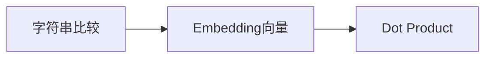

# 8.2 两个 Token 到底有多像？——从 Embedding 到 Dot Product

上一节，我们知道 Attention 需要比较 Embedding 之间的相似度，而不是字符串，并且约定用 `The cat is sleeping` 作为本章统一的例子。新的问题来了：**两个向量到底怎样才算"像"？**

---

# Dot Product（点积）计算 `cat` 与句中每个词的相似度

延续 8.1 节的例子 `The cat is sleeping`，用 `cat` 的 Embedding 分别和句子里每个 Token 的 Embedding 做点积：

```python
import numpy as np

embedding = {
    "The":      np.array([0.1, -0.2]),
    "cat":      np.array([1.0,  0.5]),
    "is":       np.array([-0.1, 0.1]),
    "sleeping": np.array([0.9,  0.6]),
}

query = embedding["cat"]
for word, vec in embedding.items():
    print(word, "->", np.dot(query, vec))
```

输出：

```text
The -> 0.0
cat -> 1.25
is -> -0.05
sleeping -> 1.2
```

`cat` 和自己（1.25）、和 `sleeping`（1.2）的点积明显更大，和 `The`（0.0）、`is`（-0.05）几乎没有关联——这符合直觉：`cat` 应该更关注 `sleeping`（谓语动作），而不是 `The`、`is` 这两个功能词。这组分数 `[0.0, 1.25, -0.05, 1.2]`，我们会在 8.3 节继续用来计算 Softmax。

---

# Dot Product 为什么会"骗人"？

点积不仅受方向影响，还受**长度**影响。如果某个 Token 的 Embedding 长度特别大（例如 `[-30, 50]`），即使方向不像，点积也可能特别大。因此直接使用 Dot Product，结果有时并不完全可靠。

---

# 一个更好的办法：Cosine Similarity

真正想比较的是**方向是否一致**，而不是谁的数字更大。Cosine Similarity（余弦相似度）会先消除长度影响，只保留方向。`music=[1,2]` 与 `songs=[2,4]` 方向完全一样，Cosine Similarity 就是 1.0；`banana` 方向不同，得分就会低很多。

---

# 那 Transformer 为什么不用 Cosine？

既然 Cosine 更合理，为什么 Transformer 使用 Dot Product？答案是：**因为 Dot Product 更容易进行矩阵并行计算。** 同时，Transformer会在后面加入一个缩放因子 `√d`，来减轻数值过大的问题，最终选择了 **Scaled Dot-Product Attention**，我们将在后面详细介绍。

---

# 本节总结

本节，我们完成了一个重要推导：



Dot Product 第一次让模型拥有了**自动计算 Token 相似度的能力**。请注意，到这里我们仍然没有出现 Q、K、V，因为目前讨论的只是"如何比较两个向量"。

---

# 下一节预告

现在我们已经能够计算 `cat` 对句子里每个 Token 的 Attention Score：`[0.0, 1.25, -0.05, 1.2]`。但这些分数既不是概率，也不能直接表示关注程度。下一节，我们将学习 **Softmax**，看看 Transformer 如何把任意分数变成真正的 **Attention Weight（注意力权重）**。
