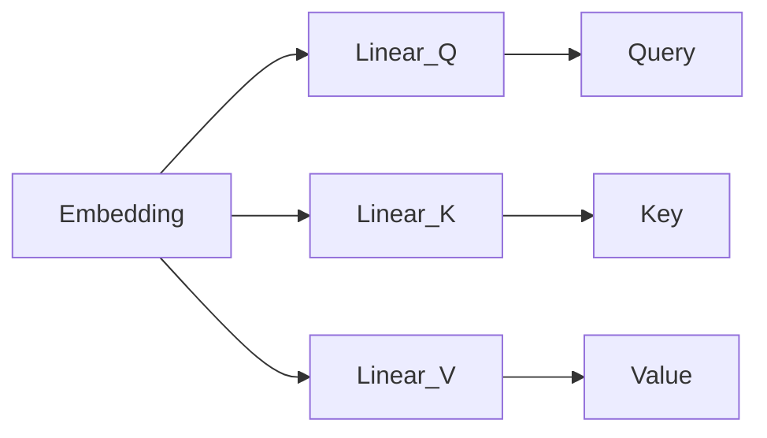
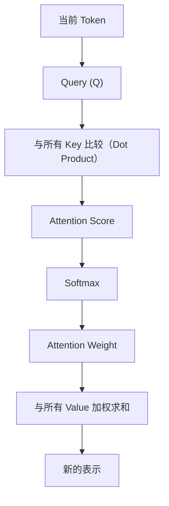

# 8.5 Q、K、V 到底是什么？

到这里，我们已经亲手完成了整个 Attention：`当前 Token → 与历史 Token 比较 → 得到 Score → Softmax → Weighted Sum → 新的表示`。整个过程中，我们从来没有使用 Q、K、V。那么 Transformer 为什么会出现这三个字母？答案很简单：**Q、K、V 并不是三个新知识，它们只是三个不同的角色。**

---

# 一个图书馆的类比

假设你去图书馆找一本书：①你脑子里先有一个问题，例如"Transformer"——这就是**"我要找什么？"**；②图书馆有很多索引（人工智能、数据库、Transformer……），你拿着问题去和索引比较，找到最匹配的一项；③真正拿到书的内容，例如"Transformer 原理"。

这里出现了三个角色：

**Query（Q）**：我要找什么？

**Key（K）**：每本书的索引，负责匹配，而不是保存内容。

**Value（V）**：真正返回的书的正文，才是真正提供信息的人。

一个更生活化的例子：手机通讯录搜索"Alice"——搜索框输入的内容是 **Query**；通讯录里每个人的姓名是 **Key**；点进去看到的电话、邮箱等信息才是 **Value**。名字负责找到人，信息负责提供内容，它们不是一回事。

---

# 回到 Attention

回顾 8.1~8.4 节 `The cat is sleeping` 的例子：`cat` 想知道该关注句子里的谁——这个"要去查询的 cat"就是 **Query**；被拿来跟 Query 做 Dot Product 比较的 `The/cat/is/sleeping` 四个向量，就是 **Key**；最后参与 Weighted Sum、真正提供内容的那四个向量，就是 **Value**。之前我们图省事，让 Query、Key、Value 都直接等于同一份 Embedding，这其实是 Self-Attention 最简化的版本——完整版会给 Q、K、V 分别过一层不同的 Linear，但 Dot Product → Softmax → Weighted Sum 这条计算流程完全不变。

---

# 为什么需要区分 Key 和 Value？

既然 Key 已经能表示 Token，为什么还需要 Value？因为**匹配的信息**和**真正输出的信息**未必一样。例如搜索"苹果"，Key 可能只有"苹果"，但 Value 却可以是"Apple Inc. 成立于1976年……总部位于……"。Key 负责匹配，Value 负责提供内容，Transformer 把这两件事情分开了。

---

# Query、Key、Value 从哪里来？

Transformer 把输入 Embedding 复制三份，分别经过三个不同的线性层：

它们最开始都是同一个 Token，只是后来承担了不同职责，因此需要不同参数。

---

# Q、K、V 的完整流程

论文里的公式 `Attention(Q,K,V) = Softmax(QKᵀ)V` 已经不再神秘，它只是把我们过去几节课一步一步完成的流程，浓缩成一行数学表达式。

---

# 本节总结

本节，我们理解了：✅ Query：当前要寻找什么 ✅ Key：用于匹配历史信息 ✅ Value：真正提供历史内容。更重要的是，**Q、K、V 并不是三种不同的数据，而是同一组 Token 在不同阶段承担的三种角色。**

---

# 下一节预告

我们一直假设当前 Token 去查看历史 Token，但 Transformer 论文真正提出的是 **Self-Attention（自注意力）**。为什么叫 Self？为什么一个 Token 既可以当 Query，又可以当 Key，还能当 Value？下一节，我们终于揭开 Self-Attention，也是 Transformer 最核心的创新。
