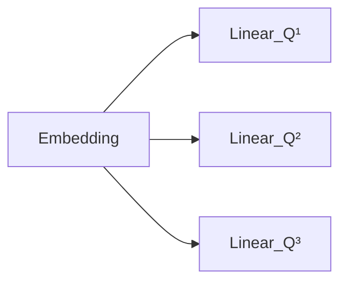
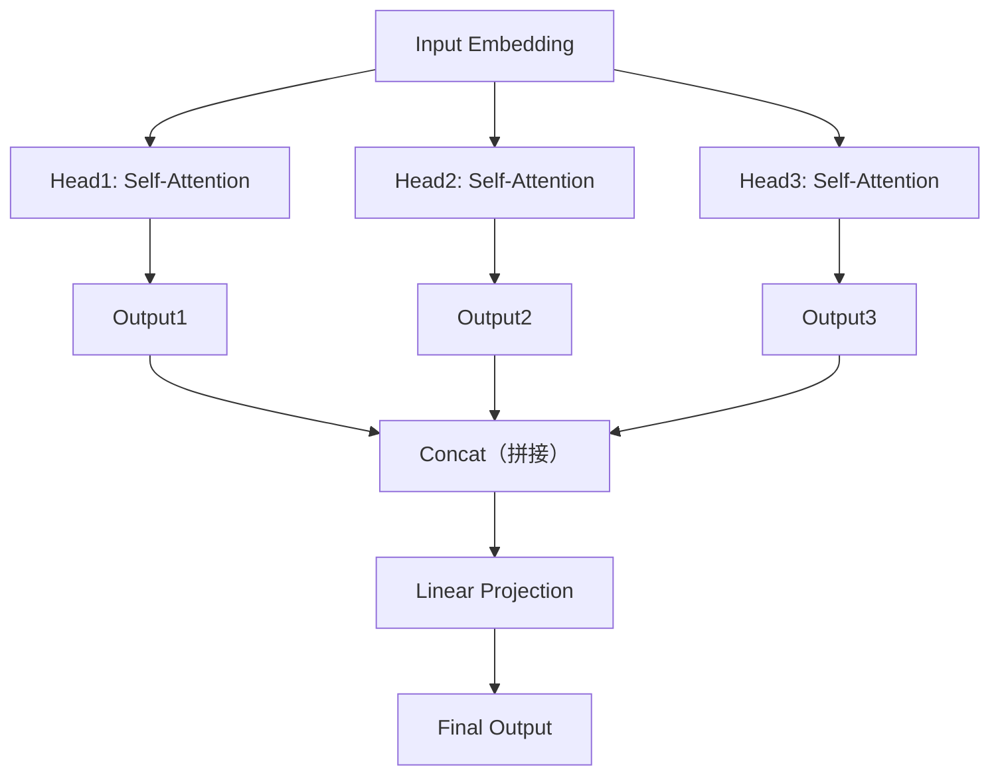

# 8.9 为什么需要 Multi-Head Attention？

上一节，我们学习了 Self-Attention，每一个 Token 都会查看整个句子，得到 Attention Matrix，看起来问题已经解决了。那么 Transformer 为什么还要提出 **Multi-Head Attention（多头注意力）**？

---

# 一个 Head 真的够吗？

看一句话：`Apple released a new iPhone yesterday.`。处理 `Apple` 时，Attention 应该关注谁？可能是 `released`（主谓关系），也可能是 `iPhone`（公司与产品的关系），甚至可能是 `yesterday`（时间关系）。同一个 Token，到底应该关注哪个？答案是：**都应该关注，只是角度不同。**

如果整个模型只有一个 Head，这一组参数只能学习一种主要模式，例如学会了主谓关系，就可能不擅长产品关系，因为两者是完全不同的模式。

---

# 一个生活中的例子

分析一场足球比赛：教练关注球员站位，解说员关注比赛节奏，裁判关注犯规，球迷关注进球——大家看的是同一场比赛，但关注点完全不同。如果把四个人的信息综合起来，是不是比一个人的分析更全面？这就是 Multi-Head Attention 的思想。

---

# Multi-Head 是怎么工作的？

Transformer 不是重复计算同一个 Attention，而是让每一个 Head 拥有不同的参数：

Key 和 Value 同样各自拥有不同的参数。虽然输入完全一样，不同 Head 最终学到的关注方式却完全不同——例如 Head1 学习语法关系，Head2 学习语义关系，Head3 学习时间关系。

---

# 每个 Head 都是一套完整的 Attention

一个 Head 不是 Attention 的一部分，而是一整套完整的 `Q → K → Score → Softmax → Weight → Weighted Sum`。如果有 8 个 Head，就相当于同时运行 8 个 Attention，最后得到 8 个输出。

例如 8.7 节我们亲手算出的那张 `The cat is sleeping` 的 Attention Matrix（`cat` 主要关注 `sleeping`），可以把它看作**Head 1** 学到的模式——更关注实义词之间的语义关系。同一句话，**Head 2** 完全可能用另一套Q/K/V 参数，学到不同的模式，比如更关注词序上紧邻的关系（`The→cat`、`is→sleeping`）。两个 Head 看的是同一句话，得到的却是两张不同的 Attention Matrix。

每一个 Head 都可以学习不同的关注模式，最终模型把所有 Head 的理解融合起来，形成更丰富的表示。

---

# Multi-Head 到底带来了什么？

只有一个 Head 时，模型可能只能回答"谁做了什么？"；增加多个 Head 后，模型可以同时理解：谁做了什么？谁和谁有关？什么时候发生？哪些词语互相修饰？哪些词具有相同语义？一句话会被从多个角度同时分析，这也是 Transformer 表达能力远强于传统 RNN 的重要原因之一。

---

# 本节总结

本节，我们理解了：✅ 一个 Head 只能学习一种主要关注模式 ✅ 多个 Head 可以学习不同类型的关系 ✅ 每个 Head 都是一套完整的 Self-Attention ✅ Multi-Head 的本质是"多角度理解同一句话"

到这里，Transformer 的两个核心创新已经全部出现：Self-Attention（每个 Token 都能看到整个上下文）与Multi-Head Attention（从多个不同角度理解上下文）。

---

# 下一节预告

现在我们已经拥有了Embedding、Positional Encoding、Self-Attention、Multi-Head Attention。但 Transformer 并不仅仅只有 Attention，Attention 后面还有两个模块：`Multi-Head Attention → Add & LayerNorm → Feed Forward Network（FFN）→ Add & LayerNorm`。为什么Attention 后面还需要一个看起来很普通的 MLP？下一节，我们将学习 **Feed Forward Network（FFN）**，看看为什么每一个 Token 在完成信息交流之后，还需要进行一次独立的深度加工。
