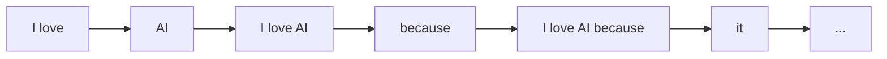
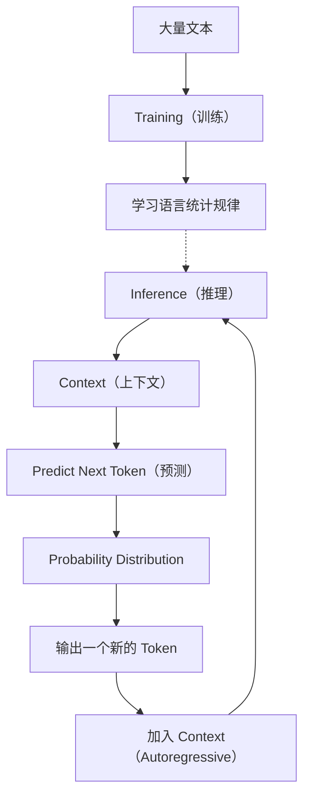

# Chapter 1 语言模型（Language Model）

---

> **本章目标**
>
> 本章不会介绍 Transformer，也不会介绍 Attention，更不会介绍神经网络。我们只回答一个问题：
>
> **什么是 Language Model（语言模型）？**
>
> 并亲手实现一个最简单、但真正可以工作的 Language Model。

---

## 本章学习目标

完成本章后，你应该能够回答下面几个问题：

* 什么是 Language Model？什么叫 Next Token Prediction？
* 什么是 Context（上下文）？什么是 Autoregressive（自回归）？
* Training 和 Inference 有什么区别？
* 为什么语言模型一次只能生成一个 Token，却能够不断生成整篇文章？

除此之外，你还将亲手实现一个约 **50 行代码**的 Character Bigram Language Model，它将成为整本书后续所有实验的基础。

---

## 1.1 为什么需要语言模型？

假设让你完成一句话：`I love ______`，你的脑海里可能会出现 `AI`、`Python`、`music`、`cats` 等答案。这是因为你的大脑已经阅读过大量文本，自然而然地知道在 "I love" 后面哪些词出现的概率更高。人类说话、写作、阅读，本质上都在不断预测后续内容。

例如看到 `今天天气很______`，会立刻想到"好、热、冷、不错"，而不会想到"键盘、苹果、锤子"。这是因为前面的内容已经限制了后续出现的可能性，这就是**语言的统计规律（Statistical Regularity）**。

现代大语言模型（Large Language Model，LLM）的核心目标，与人类非常相似：

> **根据已经看到的内容，预测下一个最可能出现的 Token。**

> **💡 Token、词级与字符级——先把这个概念说清楚**：**Token（词元）** = 文本被切分后的最小单元，可以是字符、单词或子词，它的完整处理是第 2 章 Tokenizer 的主题。本章为了让概念最简单，实验采用**字符级**（见实验 1.1），上面用"词"举的例子（`I love ___`、`hello → world`）只是为了给你直觉——实际实现中，模型看到的是一串字符，而不是单词。
>
> 如果你现在就想做**英文词级实验**（比如自己实现一个词级 embedding），最朴素的做法是正则分词 `re.findall(r"[a-z]+", text.lower())`——这正是第 2 章 Tokenizer 的起点。完全可以先跳到第 2 章学会分词，再回来做词级实践。

这句话几乎可以概括 GPT、Llama、Qwen、Gemini 等所有自回归大语言模型，后面内容几乎都是围绕这一句话不断展开。

---

## 1.2 什么是 Language Model？

Language Model 可以翻译为**语言模型**，它是**一个学习语言统计规律，并预测下一个 Token 概率的模型**。这里有三个关键词：

**Language（语言）**：这里的 Language 并不仅仅指中文或英文。对于模型来说 "I love AI" 和 "我喜欢AI" 没有本质区别，它们都只是一串有顺序的 Token。

**Model（模型）**：一个能够学习规律，并根据规律进行预测的数学模型。它可以非常简单（例如统计 hello 后面出现 world 的概率），也可以非常复杂（例如 GPT-5 包含数千亿参数），但目标完全一样：预测下一个 Token。

**Next Token Prediction（预测下一个 Token）**：这是全书最重要的一句话。模型真正做的事情不是回答问题、聊天或翻译，而是预测下一个 Token 是什么。例如输入 "I love"，模型内部真正计算的是：

| Token  | Probability |
| ------ | ----------: |
| AI     |        0.63 |
| Python |        0.17 |
| music  |        0.08 |
| cats   |        0.04 |
| ...    |         ... |

最后再从这些概率中选择一个 Token 进行输出（怎么选择——Greedy、Top-k、Temperature 等采样策略，会在第 6.5 节《第一次预测——从 Logits 到概率分布》里亲手实现）。本章只需要记住：

> **Language Model 输出的是一个概率分布，而不是一句完整的话。**

---

## 1.3 Training 与 Inference

语言模型学习知识和回答问题，是两个完全不同的阶段。

**Training（训练）**：模型阅读大量文本（Wikipedia、GitHub、News 等，大部分来自互联网），目标是学习语言中的统计规律。例如 `I love → AI` 出现很多次，模型就会逐渐学习到 `P(AI | I love)`。训练结束后，模型得到一组参数。

**Inference（推理）**：模型不再学习，只利用训练阶段学到的规律进行预测，一步一步预测下一个 token：

```
I love → AI → I love AI → very → I love AI very → much → I love AI very much
```

整个过程中，模型参数保持不变。

> **Training 是学习概率；Inference 是使用概率。**

---

## 1.4 Context（上下文）

如果只输入 `apple`，它可以表示苹果（水果）、苹果公司、苹果电脑、苹果操作系统。这时模型不知道应该输出什么，因为**Context 太少**。

如果输入 "I bought an apple yesterday."，模型更倾向水果；如果输入 "Apple released a new MacBook."，模型更倾向苹果公司。因此：

> **Context（上下文）就是模型在当前时刻能够看到的全部信息。**

Context 越丰富，预测通常越准确。原理会在第五章 Self-Attention 中得到真正解决。

---

## 1.5 Autoregressive（自回归）

用户输入 `I love`，模型预测 `AI`；新的输入变成 `I love AI`，模型继续预测 `because`；再变成 `I love AI because`，继续预测 `it`……整个过程如下：



这就是**Autoregressive（自回归）**，即：

> **每生成一个新的 Token，就把它加入 Context，继续预测下一个 Token。**

因此，语言模型虽然一次只能预测一个 Token，却能够不断生成小说、代码、论文、邮件，甚至一本书。

---

## 1.6 本章实验

理论已经结束，接下来进入实验部分，本章包含两个实验：

**实验 1.1：Character Bigram Language Model**——不使用任何 AI 框架，仅利用统计方法，实现第一个能够生成文本的 Language Model。

**实验 1.2：Bigram Probability Model**——将 Bigram 升级为真正的概率模型，理解 Language Model 输出的是"概率分布"，而不是唯一答案。

> **说明**：本章两个实验都是**字符级**（预测下一个字符），目的是用最小的数据讲清"语言模型在做什么"。如果你想用**英文词级语料**动手（词频统计、词级 bigram、词级 embedding——例如跟着配套的英文 Embedding 实践项目做），先读第 2 章的分词，或直接用最朴素的正则分词 `re.findall(r"[a-z]+", text.lower())` 即可，两者对概念的理解没有差别。

> **说明**：从这里开始，本书进入"代码演进模式"。后续所有章节的代码，都将在上一章基础上逐步升级，而不是重新开始。这也是本书的核心设计理念。

---

## 1.7 本章总结

本章我们建立了 Language Model 最核心的思想，请牢记下面五句话：

1. **Language Model 的目标是预测下一个 Token。**
2. **模型输出的是概率分布，而不是完整答案。**
3. **Training 用于学习统计规律；Inference 用于利用统计规律。**
4. **Context 是模型当前能够看到的信息。**
5. **Autoregressive 让模型能够不断生成新的内容。**

后面的所有技术——Tokenizer、Embedding、Transformer、Attention——都只是为了让这个"预测下一个 Token"的过程更加准确。

---

## 1.8 本章知识图谱



---

## 1.9 Checklist

完成本章后，请确认你已经能够回答：

* [ ] 什么是 Language Model？什么是 Next Token Prediction？
* [ ] 为什么模型输出的是概率，而不是答案？
* [ ] Training 与 Inference 有什么区别？
* [ ] 什么是 Context？什么是 Autoregressive？
* [ ] 为什么语言模型可以不断生成文本？

---

**第一章到这里结束。**下一部分将进入 **实验 1.1：Character Bigram Language Model**。从这一节开始，我们将亲手写代码，构建整本书的第一个语言模型，并且这份代码会一直演进，最终成长为一个完整的 Mini GPT。
