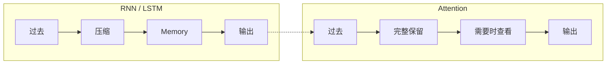
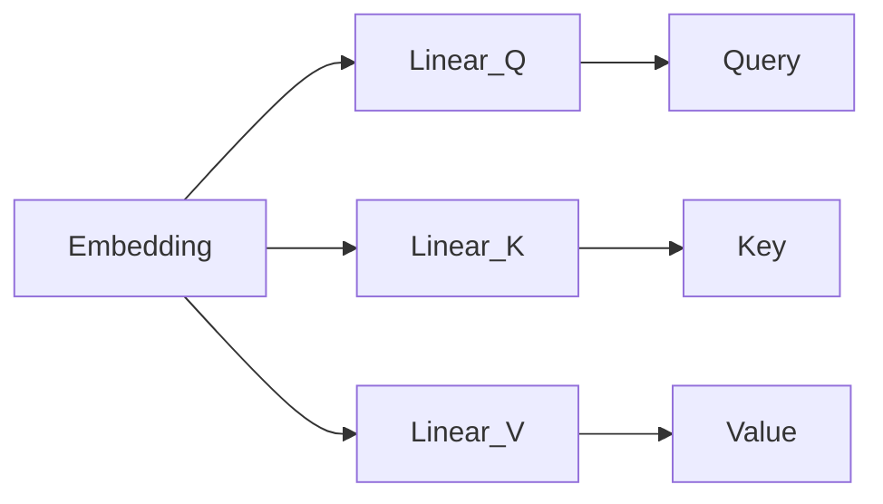
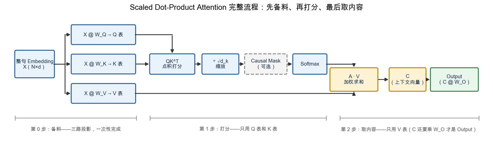
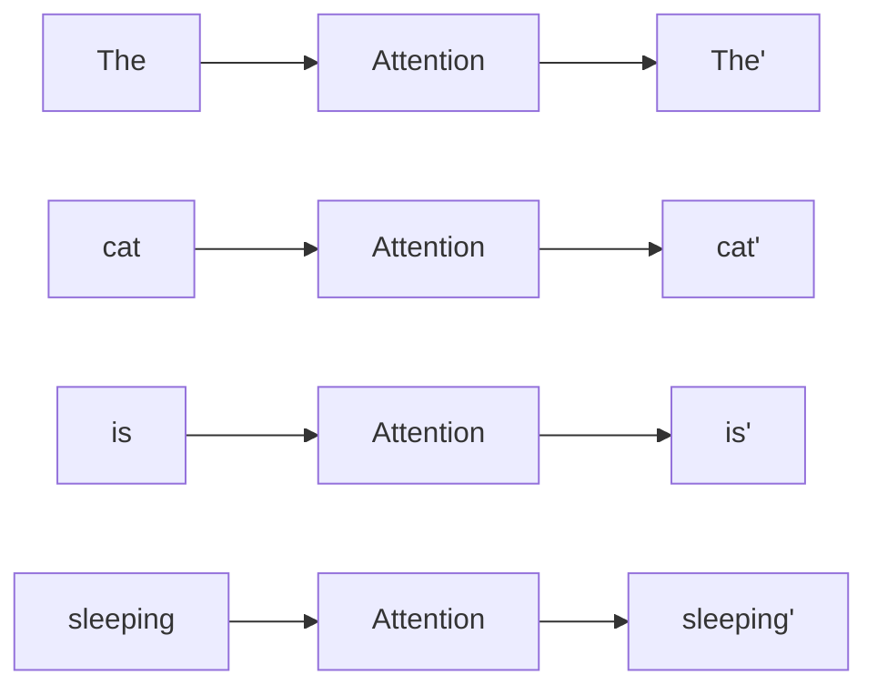
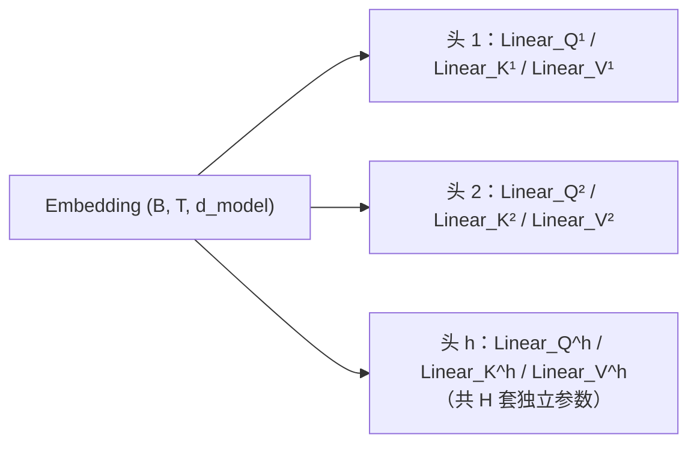
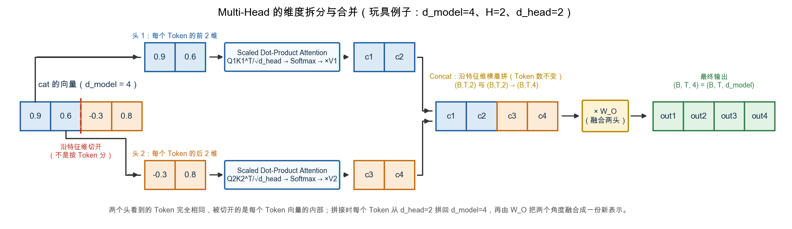
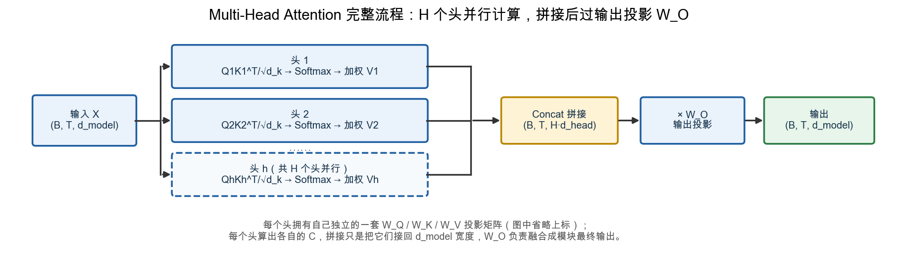
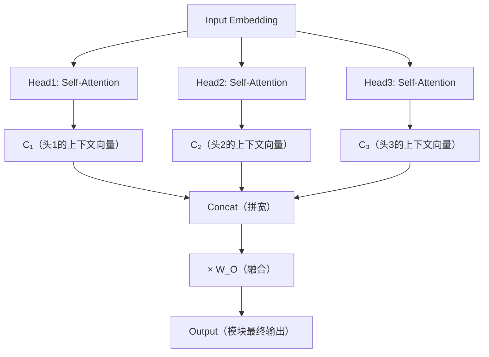

# 10. 注意力机制（Attention）

> **本章目标**
>
> 第 9 章指出 LSTM 的结构性限制：Cell State 是一个固定长度的向量，全部历史都要压缩进去。本章不再重复论证这个瓶颈，而是回答下一个问题：如果不压缩，替代方案是什么？
>
> 本章先从翻译任务里的代词指代引出 Attention 的核心思想——**不要强迫模型记住所有内容，而是在需要的时候，回头查看最相关的信息**。随后逐步展开：Attention Score（衡量谁更重要）、Q/K/V（先认识三个角色，紧接着讲清它们从哪来——Linear 投影）、Dot Product（向量相似度）、Softmax（分数转权重）、Weighted Sum（加权聚合）、Self-Attention（句子自己查看自己）、Attention Matrix（整句一次计算）、可视化，最后进入 Multi-Head Attention。与前面章节一致，概念在一节内讲完，实验放在 10.1～10.4 四个独立小节。

---

# 一、为什么还需要 Attention？

来看一句英文：`The animal didn't cross the street because it was too tired.`——这里的 `it` 指的是谁？答案是 `The animal`。再看一句：`The animal didn't cross the street because it was too wide.`——现在 `it` 又是谁？答案是 `the street`。模型需要回头查看前面不同的位置，才能知道 `it` 真正指代谁。

LSTM 不能回头，它只能一直维护 Cell State：所有历史信息都必须不断压缩，最终存放到 Cell State，然后再依靠 Cell State 预测 `it`。

如果是人类呢？想象你正在阅读一本书，突然看到 `he`，忘记是谁，你会怎么办？绝大多数人不会拼命回忆，而是直接翻回前面，找到 `John`，然后继续阅读。人类并没有把整本书一直压缩到一个 Memory，而是**需要的时候回头查看**。

于是产生一个大胆的想法：既然人可以回头查看，为什么神经网络不能？当读到 `it` 的时候，不依赖 Cell State，而是直接查看所有历史 Token，然后自己决定最相关的是 `animal` 还是 `street`。

这就是 Attention，其实只有一句话：

> **不要强迫模型记住所有内容，而是在需要的时候，回头查看最相关的信息。**



Attention 与 RNN 最大的思想差异在于：不再把历史压缩到一个 Memory，而是保留全部历史 Token，在需要的时候回头查看。（实验 10.1 会先用一段代码体会"允许回头查看"。）

---

# 二、Attention Score——衡量"谁更重要"

Attention 的核心是根据当前 Token，从上下文中聚合相关信息。对于 `The animal didn't cross the street because it ...`，处理 `it` 时，模型需要判断 `animal`、`street` 等位置分别有多相关。这里要澄清一点：标准 Dense Attention 仍会对所有 Key 计算分数，并不会因为"重点关注"就跳过其它位置；Attention Score 的作用是**分配不同权重**，而不是直接降低全量计算复杂度。真正减少计算量需要 Sparse Attention、Local Attention 等额外结构。

**Attention Score 就是每个历史 Token 的重要程度**，例如当前是 `it`：`The 0.02, animal 0.83, didn't 0.05, cross 0.10, street 0.76`。分数越高，说明模型越关注。

一个类比：有人问"谁喜欢音乐？"，你的脑海里不会重新回忆所有内容，而是快速找到"音乐"附近的信息，例如 `Tom likes basketball / Alice likes music`，你自然会重点关注 `music、Alice`，忽略 `basketball`。Attention 就是把这个过程交给神经网络完成。

但真正的大模型不会手写 `scores["animal"] = 0.95`，而是自己计算。最简单的规则是字符串匹配：`query = "music"`，在历史里找相等的词。这带来一个明显的问题：如果 Query 变成 `songs`，历史只有 `music`，字符串匹配立即失效（`songs != music`），但人类知道 `songs ≈ music`。说明 Attention 不能比较字符串，而应该比较**语义（Semantic Similarity）**。

于是第 3 章学习的 Embedding 派上用场：过去比较 `music == songs`，现在比较 `Embedding("music")` 和 `Embedding("songs")`。如果两个向量很接近，那么 Attention Score 就应该更高。

**本章的统一例子**：从本节开始，本章用同一个句子 `The cat is sleeping` 贯穿到底，给每个 Token 一份 2 维玩具 Embedding：

| 词元（Token） | 嵌入向量（Embedding） |
| ------------ | --------------- |
| `The`      | `[0.1, -0.2]` |
| `cat`      | `[1.0, 0.5]`  |
| `is`       | `[-0.1, 0.1]` |
| `sleeping` | `[0.9, 0.6]`  |

我们一直站在 `cat` 这个 Token 的视角（它想知道该关注句子里的谁）。接下来会先认识 Q/K/V 这三个角色、讲清它们怎么从 Embedding 投影而来，再走完 Dot Product → Softmax → Weighted Sum 的完整计算，最后进入 Attention Matrix 和 Multi-Head。全程用同一组数字算到底。

---

# 三、Q、K、V——三个角色，以及它们从哪来

## Attention 实际在执行一个双重循环

上一节说过，`The cat is sleeping` 这句话里，每个 Token 都要"回头看看该关注句子里的谁"。完整地说，这件事要对**每一个** Token 都做一遍，写成伪代码就是：

```text
for 当前Token in [The, cat, is, sleeping]:      # 外层循环：轮到谁发问
    for 历史Token in [The, cat, is, sleeping]:   # 内层循环：拿谁来比较
        算一个"当前Token 和 历史Token 有多相关"的分数
    把这一圈分数做 Softmax，按权重取回历史Token们的内容，汇总成"当前Token"的新表示
```

这段伪代码里已经出现了三个不同的角色，只是还没有起名字：

- **外层循环里，正在发问的那个 Token**——它没有具体要找的答案，只是带着"自己当前的信息"去问一圈"你们谁跟我相关"。这个角色就叫 **Query（Q）**。
- **内层循环里，被拿来跟 Query 逐一比较、计算相关分数的那个 Token**——它的职责只是"回答：我和你的相关程度是多少"。这个角色就叫 **Key（K）**。
- **算完分数之后，真正被按权重取回、汇总进新表示的那份内容**——同样是内层循环里那些 Token，只是这一次它们不负责"打分"，而是负责"提供真正被拿走的内容"。这个角色就叫 **Value（V）**。

**关键的一点，看完这段伪代码就很清楚了：** 外层循环转一圈，每一个 Token 都会轮流当一次 Query；而不管当前 Query 是谁，内层循环永远是同一句话里全部四个 Token 挨个上——**Key 和 Value 用的是同一组 Token，只是内层循环里"打分"和"被取走"这两件事分别叫 Key 和 Value**。Q、K、V 从来不是三种不同的向量来源，而是**同一批 Token，在计算的不同环节里被赋予的三个临时角色**。

## 用表格把整个过程摆出来：谁在什么时候扮演什么角色

外层循环有 4 次（Query 依次是 `The、cat、is、sleeping`），每一次内层循环又要过一遍全部 4 个 Token（Key/Value）。把这 4×4 次比较全部摆成一张表，正好预告了第八节要讲的 **Attention Matrix**：

| 外层：当前 Query ↓ \ 内层：被比较的 Key/Value → | `The` | `cat`                        | `is` | `sleeping` |
| ------------------------------------------------- | ------- | ------------------------------ | ------ | ------------ |
| Query =`The`                                    | 打分    | 打分                           | 打分   | 打分         |
| **Query = `cat`**                         | 打分    | **打分（自己和自己比）** | 打分   | 打分         |
| Query =`is`                                     | 打分    | 打分                           | 打分   | 打分         |
| Query =`sleeping`                               | 打分    | 打分                           | 打分   | 打分         |

**只看 `cat` 这一行（外层循环轮到 `cat` 发问的那一刻）：** 此刻 `cat` 扮演着唯一的 **Query**；这一行要挨个跟 `The、cat、is、sleeping` 四个 Key 比较——注意表格里加粗的那一格，`Key = cat` 意味着 `cat` 此刻又被拿来扮演 **Key**，去跟刚才扮演 Query 的、同样是 `cat` 的那个位置比较。**这不是同一个向量在跟自己"对话"，而是同一句话里的 `cat`，在计算的两个不同环节里，分别被套上了"发问者"和"被比较者"这两个不同的角色标签。** 比较完之后，这一行会算出 4 个分数，再依权重从 `The、cat、is、sleeping` 四份 **Value**（角色又切换成"被取走内容"）里各拿一部分，汇总成 `cat` 的新表示。

**一句话总结这张表：** Query 每次只有一个（当前轮到谁发问），Key 和 Value 永远是全部 Token（被拿来打分、被拿来取内容），而**同一个 Token，会在表格的不同格子里，分别以 Query、Key、Value 三种身份出现**——这才是 Q、K、V 真正的关系，不是三种不同的东西，而是同一批 Token 在计算流程里被赋予的三个阶段性角色。

## Q、K、V 从哪来：三个线性投影

角色定义清楚了，但还有一个关键问题没回答：**扮演这些角色的向量，是 Token 的 Embedding 本身吗？**

不是。这里有一个重要的层次区别：

- **Embedding** 是第 3 章讲的、token 从词表里查出来的"身份向量"，回答"这个词是什么"；
- **Q、K、V** 是 Attention 计算**内部**的三个中间量，回答"这个向量在'发起比较 / 被比较 / 提供内容'三种场合下，分别应该长成什么样"。

两者之间隔着一道工序：**Embedding 要先"投影"成 Q、K、V**。同一个 Token 的 Embedding，要分别乘三个不同的权重矩阵 `W_Q`、`W_K`、`W_V`，得到三个不同的向量：



这一步叫**线性投影**，三条支路互不依赖、不分先后，是**并行**的。把它接回本节开头那段双重循环伪代码，整句话的 Attention 在时间上是分三个阶段依次执行的：

```text
第 0 步（备料，进入循环之前一次性完成）：
    The、cat、is、sleeping 各自的 Embedding
    → 分别乘 W_Q、W_K、W_V
    → 一次性生成三张表：Q 表（4 个）、K 表（4 个）、V 表（4 个）
    （此刻还没有发生任何"查询"或"打分"）

第 1 步（打分）：轮到某个 Token 当 Query 时，
    拿它的 q 去和 K 表的每一行做点积——只用 K 表，不碰 V 表

第 2 步（取内容）：Softmax 得到权重后，
    按权重把 V 表的各行加权求和——只用 V 表，不碰 K 表
```

注意这个结构：**K 和 V 是同一个 Embedding 的两个并列投影，谁也不是由谁变来的**。打分开始之前，每个 Token 的 k 和 v 就已经同时备好；打分环节只查 K 表，取内容环节只查 V 表，两张表各司其职、互不转换。第八节会把"逐个 Query 的循环"压成一次矩阵乘法（Attention Matrix），但三个阶段的先后关系不变：**先备料（`X@W_Q`、`X@W_K`、`X@W_V`），再打分（`QKᵀ`），最后取内容（`AV`）**。

下面用真实数字把备料这一步看清楚。本章继续用 2 维的玩具例子，投影矩阵也是 2×2：

```text
W_Q = [[1.0, -0.1],      W_K = [[0.8, 0.2],      W_V = [[0.5, 0.5],
       [0.3, 0.8]]              [-0.2, 1.0]]              [-0.5, 1.0]]
```

**这三个矩阵就是 `W_Q`、`W_K`、`W_V`。** 认清它们的三个要点：① 它们是**矩阵**（不是向量），每一个都是 `2×2`；② 里面每个数字都是**可学习的参数**——不是人手工设的，而是训练时靠反向传播一点点调出来的；③ 它们的作用是**线性变换**，也就是第 4 章讲过的 `y = Wx + b`（本章玩具例子聚焦矩阵部分、省略偏置 `b`），把输入的 Token 向量"乘"成 Q、K、V 三个新向量。

### 为什么是 2×2？

投影矩阵为什么是 `2×2`？答案藏在矩阵乘法的形状规则里。以 `cat = [1.0, 0.5]` 为例，它是一个 2 维行向量，形状是 `1×2`：

```text
q_cat = [1.0, 0.5] @ W_Q      # (1×2) @ (2×2) = (1×2)
```

想让输出仍是 2 维（玩具例子不扩维），输出形状就是 `1×2`；而矩阵乘法要求"左边矩阵的列数 = 右边矩阵的行数"，所以中间的 `W_Q` 必须是 `2×2`。**"2×2"完全由"输入 2 维、输出也 2 维"决定**——真实 GPT 里每个 Token 是 768 维，投影矩阵就是 `768×768`。核心结论先记住：**投影不改变向量的维度，改变的是它的方向**（下面马上看到）。

### 投影做了什么：同一个向量，转出三个方向

把 `cat = [1.0, 0.5]` 分别乘三个矩阵：

```text
q_cat = [1.0, 0.5] @ W_Q = [1.15, 0.30]
k_cat = [1.0, 0.5] @ W_K = [0.70, 0.70]
v_cat = [1.0, 0.5] @ W_V = [0.25, 1.00]
```

**同一个输入向量，乘三个不同的矩阵，得到三个数值不同、方向也不同的新向量。** 这就是"投影"的字面含义：把向量旋转、拉伸到另一个方向，等于"换个角度重新看它"。三个矩阵是三面不同的镜片，`cat` 透过不同镜片，呈现出的"形象"各不相同。

### 把整句话的 Value 都备齐

刚才只算了 `cat` 一个 Token 的三份投影，但备料要备的是**整句话**：每个 Token 都要各自乘一遍 `W_V`，得到自己的 Value（Q 表和 K 表同理，每个 Token 也各有一份）。计算方式和刚才的 `q_cat`、`k_cat` 完全一样，只是换成 `W_V`：

```text
v_token = embedding_token @ W_V
```

把 `The cat is sleeping` 的四个 Embedding 依次代入，就得到完整的 Value 表：

| Token | 计算 | Value |
|---|---|---|
| `The` | `[0.1, -0.2] @ W_V` | `V_The = [0.15, -0.15]` |
| `cat` | `[1.0, 0.5] @ W_V` | `V_cat = [0.25, 1.00]` |
| `is` | `[-0.1, 0.1] @ W_V` | `V_is = [-0.10, 0.05]` |
| `sleeping` | `[0.9, 0.6] @ W_V` | `V_sleeping = [0.15, 1.05]` |

这张 V 表此刻只是安静地待在一边——第 1 步打分完全用不到它，要等到第 2 步取内容时才会第一次被查用（第六节）。

### 为什么需要三个不同的投影？——三种功能，需要三种表示

最后一个、也是最根本的问题：**为什么不直接让 Q = K = V = Embedding，非要乘三个矩阵？**

关键在于，Q、K、V 在计算里干的是**三件性质完全不同的事**：

- **Q 是点积里"发起比较"的一方**——它拿着向量去和每个 Key 点积，问"谁跟我相关"；
- **K 是点积里"接受比较"的一方**——它等在那里被点积，回答"我和你的相关度是多少"；
- **V 是被加权求和的内容**——它根本不参与打分，只在最后按权重贡献自己的信息。

这三件事对向量的要求不同：Q 要突出"我想找的特征"，K 要突出"我是什么特征"，V 要保留"我能提供的信息"。如果让三者共用原始 Embedding 这一个固定样子，模型就没有任何自由度去分别调整——**用一个角度应付三种场合，结果三种场合都做不精**。

三个投影矩阵正是模型手里的三个"旋钮"：训练中，模型自己学会 `W_Q`、`W_K`、`W_V` 分别把向量调成"最会提问""最会被查找""最适合作内容"的样子。**这才是注意力最重要的学习自由度**——模型学到的"该关注什么"，本质上就藏在这三组投影里，也是第十节 Multi-Head Attention 能学出"多种注意力模式"的地基。

最后预告一个细节：完整的 Attention 模块其实有**四个**投影矩阵——除了这里输入侧的 `W_Q、W_K、W_V`，还有一个输出侧的 `W_O`。前三个现在就登场，`W_O` 则要等注意力算完、信息汇总之后再出场（第六节）。先记下它的存在：**它同样是可学习参数**，而且单头、多头都必须要乘这一步——漏掉它，后面读实现代码时会奇怪"这个矩阵是从哪冒出来的"。

---

# 四、从 Q 到 Dot Product——用点积衡量相关度

备料阶段结束，三张表都已就位，现在进入第 1 步"打分"。这一步只用 Q 表和 K 表，V 表完全不上场。要解决的问题是：**Query 和 Key 两个向量，到底怎样才算"像"？** 最直接的方法就是 **Dot Product（点积）**——两个向量做点积，得到一个**分数（一个数字）**：数字越大，表示两个向量越"像"、越相关。

以 `cat` 为例，它作为 Query 的向量是 `q_cat = [1.15, 0.30]`。把四个 Token 投影后的 K 都算出来（`K = X @ W_K`），再让 `q_cat` 分别和每个 K 做点积（`a·b = a1b1 + a2b2`）：

```text
The      K = [0.12, -0.18]
cat      K = [0.70, 0.70]
is       K = [-0.10, 0.08]
sleeping K = [0.60, 0.78]

q_cat · K_The      = 1.15×0.12 + 0.30×(-0.18) = 0.084
q_cat · K_cat      = 1.15×0.70 + 0.30×0.70    = 1.015
q_cat · K_is       = 1.15×(-0.10) + 0.30×0.08 = -0.091
q_cat · K_sleeping = 1.15×0.60 + 0.30×0.78    = 0.924
```

于是 `cat` 对四个词的分数是：

```text
The -> 0.084
cat -> 1.015
is -> -0.091
sleeping -> 0.924
```

`cat` 和自己（1.015）、和 `sleeping`（0.924）的点积明显更大，和 `The`（0.084）、`is`（-0.091）几乎没有关联——这符合直觉：`cat` 应该更关注 `sleeping`（谓语动作），而不是 `The`、`is` 这两个功能词。这组分数 `[0.084, 1.015, -0.091, 0.924]`，会在后面继续用来计算 Softmax。

## Dot Product 为什么会受长度影响？

点积同时受方向和**长度**影响。以 `cat=[1.0, 0.5]` 为 Query：`sleeping=[0.9, 0.6]` 与它几乎同方向，点积为 `1.20`；另一个长向量 `[3.0, -1.0]` 的方向相似度较低，但点积反而达到 `2.50`。因此，不能把点积直接等同于只衡量方向的相似度。

## Cosine Similarity：消除长度影响

如果只想比较**方向是否一致**，可以使用 Cosine Similarity（余弦相似度）。它先用向量长度归一化点积：

```math
\cos(\theta)=\frac{a\cdot b}{\lVert a\rVert\lVert b\rVert}
```

**这个公式的作用**：用两个向量夹角衡量方向接近程度，并除掉向量长度的影响。`a·b` 是点积，`‖a‖、‖b‖` 是两个向量的长度，输出范围为 `[-1,1]`。

`music=[1,2]` 与 `songs=[2,4]` 方向完全相同，Cosine Similarity 为 `1.0`；方向不同的向量得分更低。下图把同一组数字画在坐标系中，并并列比较点积和余弦相似度：


图中 `[3.0,-1.0]` 的点积更高，但 `sleeping` 的余弦相似度更接近 `1`。这说明点积回答的是"方向与长度共同作用后有多大"，余弦相似度回答的是"方向有多接近"。生成脚本见 [`vector_similarity_geometry.py`](./assets/vector_similarity_geometry.py)。

## 那 Transformer 为什么不用 Cosine？

既然 Cosine 更合理，为什么 Transformer 使用 Dot Product？有两个原因：**① 点积直接对应矩阵乘法，可以一次性并行计算所有 Token 两两之间的分数；② 点积的方差是可控的，配合缩放因子就能保持数值稳定**——最终形成了 **Scaled Dot-Product Attention**。

下面用 `q` 表示 Query 向量、`k` 表示 Key 向量（就是上面投影出来的 Q、K）。

### 问题从哪来：点积会随维度"越算越大"

先只看一个现象：如果 `q`、`k` 的每个分量都是独立随机数（均值为 0、方差为 1，可以理解为训练初期、还没学到任何规律时的状态），维度 `d_k` 越大，点积 `q·k` 的数值波动范围就越大。原因很直接——点积 `q·k = q1k1 + q2k2 + ... + q_{d_k}k_{d_k}` 是 `d_k` 个"零均值随机项"加起来，加的项越多，累积起来的波动自然越大；这就像多掷几次硬币，正面次数的波动范围也会变大。用统计的语言严格表达就是：

- 单个分量乘积的方差：`Var(q_i k_i) = Var(q_i)Var(k_i) = 1`（因为方差都设为 1）；
- `d_k` 个独立分量的和，方差直接相加：`Var(q·k) = d_k`；
- 所以点积的**标准差是 `√d_k`**——维度越高，点积典型的波动范围越大。

这不是一个纯理论推导，用真实数字随机采样就能验证：


**左图**验证了上面的结论——分别在 `d_k = 2, 8, 32, 128, 512` 下随机采样几千组 `q、k`，统计点积的标准差（红线），和理论值 `√d_k`（灰色虚线）几乎完全重合：`d_k` 从 2 涨到 512，点积的波动范围从 `1.4` 涨到 `22.8`，涨了约 16 倍——这正好是 `√512/√2 = √256 = 16`。

### 波动范围变大，为什么是个问题：Softmax 会"饱和"

点积波动范围变大，直接后果是**分数之间的差距被成倍放大**。**右上图**是一个具体例子：四个 Key 与 Query 的真实语义相似度（余弦相似度）其实很接近，只相差 `0.05~0.10`（`+0.15、+0.10、+0.05、-0.05`）——这是很正常的情况，语义上"相关但不悬殊"。但在 `d_k=64` 时，这么小的相似度差异，点积（橙色柱）已经被放大到 `-3.81` 到 `11.44`，跨度接近 15。

分数被放大之后，Softmax 会怎么反应？**右下图**给出了答案：对这组被放大的原始分数做 Softmax（橙色柱），几乎全部权重（`0.98`）都压在了相似度最高的 Key 上，其余三个 Key 分到的权重加起来还不到 `0.02`——这就是 **Softmax 饱和**：输入的分数差距一旦过大，Softmax 输出会迅速逼近 one-hot（只有一个位置接近 1，其余接近 0），此时 Softmax 对输入的梯度也会趋近于 0（想象一下 Sigmoid/Softmax 曲线两端几乎是平的），模型几乎学不到东西——**明明四个 Key 语义上只是"稍微更相关"，却被误判成"唯一正确答案"**。

### 解决方案：除以 √d_k，把分数"缩"回合理范围

既然问题的根源是"点积的标准差随 `√d_k`增长"，解决办法就很直接——**把点积除以 `√d_k`，让标准差重新变回 1**，分数不再随维度膨胀：

```math
\text{Attention Score}=\frac{q\cdot k}{\sqrt{d_k}}
```

**这个公式的作用**：`q、k` 是 Query 与 Key 向量，`d_k` 是它们的维度；除以 `√d_k` 相当于把点积按其"典型波动范围"重新标定，不会改变几个候选之间谁大谁小的**排序**，但会显著改变 Softmax 的**尖锐程度**。这就是"Scaled"（缩放）一词的数学来源。

回到右上图的蓝色柱：同样四个分数，除以 `√64=8` 后，跨度从 15 缩小到约 1.9（`-0.48` 到 `1.43`）。右下图的蓝色柱是缩放后的 Softmax 结果：`[0.46, 0.29, 0.18, 0.07]`——四个权重差距回到了合理范围，与"语义上相关但不悬殊"这个前提相符，梯度也能正常流动。**一句话总结：缩放不改变模型认为谁更相关，只是不让这份"相关"的差距在数值上被 `d_k` 不成比例地放大。**

本章玩具例子 `d_k = 2`，所以要把刚才那组点积除以 `√2`，得到缩放后的分数：`[0.059, 0.718, -0.064, 0.653]`——这组数字会在下一节继续用来做 Softmax。

---

# 五、为什么需要 Softmax——从分数到注意力权重

上一节算出了 `cat` 对 `The cat is sleeping` 每个词的分数（缩放后）：`[0.059, 0.718, -0.064, 0.653]`。这些分数可以直接使用吗？答案是不能，原因有三：

**问题一：数字没有范围。** 不同句子的 Score 可能是 `8.3, 5.1` 也可能是 `120, 95, 40`，没有任何统一范围，模型越来越难训练。

**问题二：不能直接解释为分配比例。** 原始 Score 可以为负，也不保证总和为 1；我们需要把同一个 Query 对各个 Key 的分数转换为一组非负、和为 1 的权重。

**问题三：点积分数可能随维度变大。** 当 Query、Key 的各维方差相近时，点积的典型幅度会随 `d_k` 增长，使 Softmax 过早饱和、梯度变小。Scaled Dot-Product Attention 因此先除以 `√d_k`。注意，Softmax 对整体缩放并不保持比例不变；把 `[8,4,2]` 乘 10 会得到更尖锐的分布。

**一个直接的想法：归一化。** 把分数变成百分比：`8,4,2 → 57%,29%,14%`，现在立刻知道模型主要关注谁。所有数字都在 0~1，加起来等于 1，已经很像概率。但如果 Score 里出现负数，例如 `[-5, 3, 10]`，直接除以总和会出现**负权重**——Attention 不能出现负关注。

**Softmax 做了什么？** 它必须满足：①所有结果 > 0；②所有结果加起来 = 1；③大的分数应该变得更大，小的分数应该变得更小。做法分两步：第一步把所有分数变成指数（`e^x`），指数永远大于 0，因此不会再出现负权重；第二步做归一化（为数值稳定，通常先减去最大值再求指数）。对缩放后的分数 `[0.059, 0.718, -0.064, 0.653]` 做 Softmax，结果约为：

```text
The 17.8%, cat 34.3%, is 15.7%, sleeping 32.2%
```

`cat` 主要关注自己和 `sleeping`（合计约 66%），几乎不理会 `The` 和 `is` 这两个功能词。这组权重 `[0.178, 0.343, 0.157, 0.322]`，会在下一节继续用来做 Weighted Sum。（完整代码见实验 10.1。）

---

# 六、Weighted Sum——注意力输出的加权聚合

现在已经算出 `cat` 对每个词的 Attention Weight：`The 0.178, cat 0.343, is 0.157, sleeping 0.322`。模型已经知道谁重要、谁不重要，接下来怎么办？

**第一种想法：只看最大的。** 找到最大权重 `cat: 0.343`，只读取 `cat` 自己。看起来省事，但这样 Attention 就白算了——`cat` 完全没有从 `sleeping` 那里获得任何新信息，等于什么都没改变。

**一个更好的办法：全部利用，按权重分配。** 重要的多看一点，不重要的少看一点，这一步的结果就是所有 Token 的**加权平均（Weighted Sum）**。要取回的内容，就是第三节"备料阶段"就已算好的那四份 Value（`V = Embedding @ W_V`，见第三节的计算表）——打分环节全程只用了 K 表，到这里才第一次用到 V 表。按权重求和：

```text
V_The      = [0.15, -0.15]
V_cat      = [0.25, 1.00]
V_is       = [-0.10, 0.05]
V_sleeping = [0.15, 1.05]

cat' = 0.178·V_The + 0.343·V_cat + 0.157·V_is + 0.322·V_sleeping
     = [0.145, 0.663]
```

得到新的 `cat' = [0.145, 0.663]`，比原来的 `cat = [1.0, 0.5]` 在第一维上明显变小、在第二维上变大——略微"偏向" `sleeping` 所在的方向。这正是 Attention 的效果：`cat` 的新表示已经融合了 `sleeping` 带来的上下文信息，而不再是一个孤立的词向量。（代码见实验 10.1。）

**为什么叫 Attention？** 模型不是全部平均，也不是只选择一个，而是**按照注意力大小，对所有历史信息进行加权聚合**。这就是 Attention 名字的真正含义。一个类比：老师问"介绍一下 Transformer"，你的脑海里不会随机回忆所有知识，而是不同内容占据不同权重（Attention 45%、Self-Attention 30%、GPT 15%……），最后融合起来形成回答。

**从 Attention Score 到 Attention 输出。** 回顾整个推导：①保存全部历史 Token；②各自投影出 Q、K、V；③用 Q 和 K 的 Dot Product 计算相关程度，得到 Attention Score；④经过 Softmax，得到 Attention Weight；⑤按权重融合所有 Value，得到新的表示。整个过程没有任何神秘公式，只是一步一步自然推导出来的。

这最后一步算出的新表示（上面的 `cat'`）有个专门的名字：**Context（上下文向量）**，记作 **`C`**——它是当前 Token 按注意力权重、从整个上下文里取回的一份融合信息，前文反复说的"带上了邻居信息的新表示"就是它。

但 `C` 还不是 Attention 模块的终点——**不管单头还是多头，`C` 都要再右乘一个输出投影矩阵 `W_O`，得到的才是模块的最终输出（Output）：`Output = C @ W_O`**。`W_O` 就是第三节预告过的第四个可学习投影：单头时，它给取回的信息再提供一次线性变换；多头时（第十节），它还承担更关键的职责——把多个头各自取回的信息融合成一份。本章玩具推导聚焦注意力的核心计算，这一步先不在数字上展开，第十节会看到 `W_O` 的用武之地。

从 `cat` 到 `C` 再到 Output，向量始终保持 2 维——**Attention 不改变向量的维度，只改变它的内容**（把上下文信息"拌"进去）。这个"输出维度 = 输入维度"的性质非常关键：它是 Attention 能一层层堆叠、能写进下一章 `x = x + Attention(x)` 残差连接的前提。

现在终于可以看懂论文中的公式：

```text
Attention = Softmax(Score) × Value
```

如果把 Score 换成 Dot Product，就可以写成下面的矩阵公式。这里的 `Kᵀ` 读作“`K` 的转置”：它把 `K` 的行和列交换，目的是让 `Q` 的每一行都能与 `K` 的每一行做点积，得到所有 Query 对所有 Key 的分数矩阵。

```text
Attention(Q, K, V) = Softmax(QK^T / sqrt(d_k)) V
```

注意这条公式描述的是**注意力的核心计算**，返回值正是上一段定义的 `C`；模块层面还要再接一步 `C @ W_O`，才是最终输出。

把这条公式画成结构流程图，三阶段的先后关系一目了然——先备料（三路投影出 Q/K/V）、再打分（Q 与 K）、最后取内容（权重作用于 V）：



生成脚本见 [`attention_full_pipeline_diagram.py`](./assets/attention_full_pipeline_diagram.py)。

这已经不是新知识，只是把刚才的五个步骤写成一行数学表达式——正是论文原文的名字 **Scaled Dot-Product Attention（缩放点积注意力）**。至此，本章推导出的每一步都已经对应上了论文公式里的每一个符号。下面这张数值版流程图把整条流水线一次画全（输入 X → Q/K/V → 分数 → Softmax 权重 → 输出）：


图中各矩阵的行始终对应四个 Token。`Q`、`K`、`V` 的 Shape 都是 `(4,2)`，但数值不同：`q_cat` 与四行 `K` 做点积、再除以 `√d_k` 得到分数，Softmax 后变成权重 `[0.178, 0.343, 0.157, 0.322]`，最后对四行 `V` 加权求和，得到 `cat` 的新表示 `[0.145, 0.663]`。**注意分工：决定"该关注谁"的权重由 `Q、K` 算出，最终被聚合的内容来自 `V`。** 生成脚本见 [`qkv_numeric_pipeline.py`](./assets/qkv_numeric_pipeline.py)。

---

# 七、Self-Attention——句子自己查看自己

理解了 Attention 的完整流程：`Embedding → 投影出 Q/K/V → Q·K → Score → Softmax → Weight → 加权 V → C → × W_O → Output`。但还有一个问题：Attention 为什么叫 **Self（自）Attention**？

**先回顾最早的 Attention。** Attention 最早诞生于 Seq2Seq 模型，例如机器翻译：`I love machine learning.` → `我 热爱 机器 学习`。这类模型分成两半：**Encoder（编码器）是"读入端"，负责把整句英文读进来、压缩成一份内部表示（Memory）；Decoder（解码器）是"生成端"，负责一个词一个词地把中文写出来**。Attention 最早就是 **Decoder 回头查看 Encoder**：Decoder 准备生成"猫"时，去查看 Encoder 读到的英文，找到最相关的 `cat`。这里 Query 来自 Decoder（正在生成的一方），Key/Value 来自 Encoder（被查看的一方），它们并不是同一批数据。（Encoder/Decoder 的完整结构会在后续 Transformer 架构章节展开，这里只需先记住"一个读入、一个生成"。）

**Transformer 做了一件大胆的事情。** 它提出一个问题：为什么一定要等 Decoder 来查？例如 `The cat is sleeping.`，模型处理 `sleeping` 的时候，其实也需要知道 `cat`。因此即使没有 Decoder，一句话内部是不是也可以互相查看？答案是当然可以。

于是：处理 `sleeping` 时可以关注 `cat`；处理 `cat` 时也可以关注 `sleeping`；甚至处理 `The` 时可以查看整个句子。整个过程都是**这一句话自己查看自己**，因此叫 **Self-Attention（自注意力）**。

**为什么还要关注自己？** 很多人会问：为什么 Token 还要关注自己？例如 `cat` 关注 `cat` 是不是没有意义？其实很有意义，因为当前 Token 自己的信息通常也是最重要的信息之一，例如处理 `Apple` 当然需要保留 `Apple` 本身。Self-Attention 允许模型自己决定自己占多少权重，例如 `Apple 0.65, Inc. 0.20, iPhone 0.15`——有时候自己就是最大的贡献者。

**每一个 Token 都执行一次 Attention。** 真正的 Transformer 不是只有最后一个 Token 做 Attention，而是**整个句子所有 Token 一起计算**：



每一个 Token 都会融合整个句子的上下文，因此 Transformer 输出的已经不是原来的 Token，而是**带上下文信息的新表示（Contextual Representation）**。

**为什么 Self-Attention 如此强大？** RNN 只能一步一步传递信息：`Token1 → Token2 → Token3 → Token4`；而 Self-Attention 中，任意两个 Token 都可以直接建立联系，距离不再重要，模型可以一步建立全局关系。这也是 Transformer 能够解决长距离依赖的重要原因。

---

# 八、Attention Matrix——整句一次计算

前面我们始终站在**一个 Token 的视角**。而 Transformer 真正计算的时候，不是一个一个算，而是**整个句子一次完成**。

假设句子有 4 个 Token：`The cat is sleeping`。每一个 Token 作为 Query，都会对所有 Token 计算一次注意力，把结果排成一张表：

```text
                被关注(Key)
             The  cat  is  sleeping
Query  The    ?    ?    ?      ?
       cat    ?    ?    ?      ?
       is     ?    ?    ?      ?
  sleeping    ?    ?    ?      ?
```

这就是 **Attention Matrix（注意力矩阵）**，矩阵中每个数字表示**当前 Query 对某个 Token 的关注程度**。

标准 Self-Attention 先投影，再做缩放点积：

```text
Q = XW_Q,  K = XW_K,  V = XW_V
A = softmax(QKᵀ / √d_k)
C = AV                ← 按权重融合 V，得到 Context
Output = C @ W_O      ← 输出投影：单头、多头都有这一步
```

其中 `X∈ℝ^(N×d_model)`，`Q,K∈ℝ^(N×d_k)`，`V∈ℝ^(N×d_v)`，所以 `A∈ℝ^(N×N)`。每一行沿 Key 维做 Softmax，行和为 1。

## Full Attention 与 Causal Attention

Encoder 的双向 Self-Attention 通常允许每个 Query 查看整段序列，称为 **Full Attention**。Decoder-only 语言模型还会在未来位置加入 **Causal Mask**，使位置 `i` 只能查看 `j≤i` 的 Key，避免训练时偷看答案。两者的区别只在 Mask：Full Attention 没有屏蔽位置，Causal Attention 的严格上三角权重为 0。

## 为什么叫 Matrix？

之前计算的是"一个 Query → 所有 Key"，现在变成"所有 Query → 所有 Key"。若序列有 `N` 个 Token，需要形成 `N×N` 个分数；每次点积还要处理 `d_k` 个维度，因此分数计算量约为 `O(N²d_k)`，Attention Matrix 本身占用 `O(N²)` 内存。常说 Attention 对序列长度是"平方复杂度"，指的就是这个 `N²` 因子。

## Transformer 为什么能并行？

RNN 必须 `Token1 → Token2 → Token3` 一步一步计算，不能跳过，因为后一个 Hidden State 依赖前一个。而 Transformer 的 Attention Matrix 一次计算"所有 Query × 所有 Key"，整个句子可以一次送进 GPU 统一完成。这就是 Transformer 能够高效并行训练的根本原因。（完整 QKV + Mask 实现见实验 10.2。）

---

# 九、Attention 可视化

Self-Attention 最终会得到一个 Attention Matrix。但如果全部都是数字，其实很难理解模型到底在关注什么。因此研究人员通常会把它画成**热力图（Heatmap）**：颜色越深，表示 Attention Weight 越大；颜色越浅，表示权重越小。

继续用 `The cat is sleeping` 的教学例子：`cat` 这一行对自己和 `sleeping` 的权重较大。这里的矩阵来自人工指定的二维向量，并没有经过训练，因此它只能演示"如何读取热力图"，不能据此声称模型学到了语法或语义关系。

在真实的已训练模型中，某些 Head 可能对依存关系、相邻位置或标点呈现统计上的偏好，但需要在大量样本上验证，不能凭单张图下结论。严谨地说，Attention Weight 也不等同于完整的因果解释；严谨分析需要跨样本统计，并结合消融等方法。（画热力图的代码见实验 10.3。）

---

# 十、Multi-Head Attention——多个角度理解上下文

一个 Head 真的够吗？看一句话：`Apple released a new iPhone yesterday.`。处理 `Apple` 时，Attention 应该关注谁？可能是 `released`（主谓关系），也可能是 `iPhone`（公司与产品的关系），甚至可能是 `yesterday`（时间关系）。同一个 Token，到底应该关注哪个？答案是：**都应该关注，只是角度不同。**

单个 Head 也可能混合多种模式，但所有匹配与聚合都受限于同一组投影和同一个注意力分布。多个 Head 提供多个并行的表示子空间，使模型能组合更丰富的特征；它们不保证与"主谓""时间"等人工概念一一对应。

一个生活中的例子：分析一场足球比赛，教练关注球员站位，解说员关注比赛节奏，裁判关注犯规，球迷关注进球——大家看的是同一场比赛，但关注点完全不同。如果把四个人的信息综合起来，是不是比一个人的分析更全面？这就是 Multi-Head Attention 的思想。

**Multi-Head 是怎么工作的？** Transformer 不是重复计算同一个 Attention，而是让每一个 Head 拥有不同的参数：



Key 和 Value 同样使用各 Head 的投影参数。不同 Head 因而可以形成不同的注意力分布和输出特征，但不会预先指定为"语法 Head"或"时间 Head"。

前面几节都在手算 `(4,2)` 这种二维小矩阵。真实实现会一次处理很多条句子，所以张量会多出两维。先约定几个符号：

| 符号        | 含义                                          | 例子                             |
| ----------- | --------------------------------------------- | -------------------------------- |
| `B`       | Batch Size，一次同时处理几条序列              | `32`                           |
| `T`       | 每条序列有几个 Token                          | `4`（`The cat is sleeping`） |
| `d_model` | 每个 Token 向量的维度                         | 前面例子里是 2，GPT-2 是 768     |
| `H`       | Head 数量                                     | `12`                           |
| `d_head`  | 每个 Head 分到的维度，通常等于`d_model / H` | `768/12=64`                    |
| `W_O`     | 输出投影矩阵，作用于加权求和结果 `C`（单头、多头都要乘） | Shape`(d_model, d_model)` |

下面按主流工程实现（PyTorch 的 `nn.MultiheadAttention`、GPT-2 都是这个流程）的**五个步骤**走一遍，以 GPT-2 的 `d_model=768`、`H=12`（于是 `d_head=768/12=64`）、`B=32` 为例：

**第 1 步：线性投影（整体计算）。** 输入 `(B, T, 768)` 分别右乘三个大矩阵 `W_Q / W_K / W_V`（各 `768×768`），一次得到三份 `(B, T, 768)` 的 Q、K、V。注意这一步还没有任何"头"的概念——12 个头共用这一次矩阵乘法，"先整体投影、再拆头"与论文里"每头一套小投影"写法的等价性，见本节最后一段。

**第 2 步：拆分多头（关键变形）——切的是特征维，不是 Token。** 把每个 Token 的 768 维向量**沿最后一维切成 12 段、每段 64 维**，第 1 段交给头 1，第 2 段交给头 2… ：

```text
某个 Token 的 768 维 Q 向量：
[ x1 ... x64 | x65 ... x128 | ...... | x705 ... x768 ]
  └── 头 1 ──┘ └── 头 2 ──┘          └── 头 12 ─┘
```

用玩具数字演示（`d_model=4`、`H=2`、`d_head=2`，仍以 `cat` 这一个 Token 为例）：

```text
cat 的 Q 向量（4 维）：   [ 0.9  0.6 | -0.3  0.8 ]
                          └─ 头 1 ─┘  └─ 头 2 ─┘
头 1 拿到：               [ 0.9  0.6 ]    ← 每个 Token 向量的前 2 维
头 2 拿到：               [ -0.3  0.8 ]   ← 每个 Token 向量的后 2 维
```

拆完做两小步形状变形：先 `view` 成 `(B, T, 12, 64)`，再 `transpose(1, 2)` 交换中间两维得到 `(B, 12, T, 64)`——把"头"提到批次维旁边，为下一步的合并做准备。

**第 3 步：合并批次与头数（核心高效操作）。** 把前两维折叠成一个维度：`(B, 12, T, 64) → (B·12, T, 64)`。这一步是工程实现里真正的效率关键：折叠后的张量里躺着 `32 × 12 = 384` 份完全独立的 `(T, 64)` 小矩阵，彼此没有任何数据依赖，正好塞给一次批量矩阵乘法（`torch.bmm` / `matmul`）同时算完。这就是"所有头并行"的具体机制——不是写 12 层循环，而是把头变成批量维的一部分，让 GPU 一次吃下全部计算。

**第 4 步：处理 Mask（变长序列填充，可选）。** 一个 Batch 里的句子常常长短不一，短句要用无效 Token 补齐（padding）才能堆成矩形张量。这些填充位置不该被任何 Token 关注，所以在 `scores = QK^T / √d_head` 算出 `(B·12, T, T)` 之后、Softmax 之前，把"列方向是填充位置"的分数加上一个巨大的负数（如 `-1e9`），Softmax 之后这些位置的权重就变成 0。前面"Full Attention 与 Causal Attention"一节里的 Causal Mask（每个 Token 只能看左边）也是在这一步用同样的方式加上去的（NumPy 实操见 10.2）。本章玩具句子的 4 个 Token 等长，暂时用不到 Mask。

**第 5 步：加权求和与恢复形状。** 先把注意力的核心计算收尾——分数（第 4 步的 `QK^T/√d_head`）在这里走完第五、六节的老三样，只是全部作用在折叠后的 `(B·12, T, ·)` 张量上：`weights = softmax(scores)` 把加过 Mask 的分数变成权重（`(B·12, T, T)`，每行和为 1）；`head_ctx = weights @ V` 对 `(B·12, T, 64)` 的 V 加权求和——第六节的 `C`，现在是每个头各一份（记作 `C_h`），点积、Softmax、加权求和，一个都不少。然后按第 2、3 步的逆序把形状变回去：先拆回 `(B, 12, T, 64)`，再 `transpose(1, 2)` 把 `T` 提回前面得到 `(B, T, 12, 64)`，最后 `view` 成 `(B, T, 768)`——这就是 Concat：**沿特征维横着拼回去**，Token 数 `T` 不变，是每个 Token 的向量从 64 维拼回 `12×64=768` 维。注意拼接方向——不是把 12 份输出上下堆叠（那会变成 12T 个 Token），而是每个 Token 自己的 12 段首尾相接：

```text
头 1 的 C（每个 Token 64 维）：[ c1  ......  c64 ]
头 2 的 C（每个 Token 64 维）：[ c65 ...... c128 ]
             ......                      ↓ 沿特征维横着接，T 不变
Concat 结果（每个 Token 768 维）：[ c1 ...... c64 | c65 ...... c128 | ...... | c705 ...... c768 ]
```

但拼接只是"并排摆放"——头 1 和头 2 的结果还没有发生过任何交流。最后右乘**输出投影 `W_O`（768×768）**，让最终向量的每一维都能同时看到 12 个头的 `C`，把多个角度真正**混合**成一份新的表示。一句话记住分工：**每头的 `C_h` 各自算，Concat 负责"拼宽"，`W_O` 负责"融合"**。

把 4 维玩具例子的"拆与合"画成图——一个 4 维向量切成两半分给两个头，各算各的 Attention，再沿特征维拼回 4 维、过一次 `W_O`：



生成脚本见 [`multi_head_dim_split_merge_diagram.py`](./assets/multi_head_dim_split_merge_diagram.py)。

于是整套多头计算的 Shape 变化是：

```text
Q, K, V = X @ W_Q/W_K/W_V: (B, T, d_model)
view: (B, T, H, d_head) → transpose(1,2): (B, H, T, d_head)
reshape: (B·H, T, d_head)              ← 合并批次与头数
scores = Q @ Kᵀ / √d_head: (B·H, T, T)
scores += mask（可选：填充位/因果位置大负数，Softmax 前加）
weights = softmax(scores): (B·H, T, T)
head_ctx（C_h）= weights @ V: (B·H, T, d_head)   ← 每头的 Context
reshape: (B, H, T, d_head) → transpose(1,2): (B, T, H, d_head)
concat: (B, T, H·d_head) = (B, T, d_model)
output = concat @ W_O: (B, T, d_model)            ← 模块最终输出
```

**两条等价的实现路线。** 回头看本节开头的流程图（每个头一套独立的 `Linear_Q^h / Linear_K^h / Linear_V^h`，论文原版的写法）和上面的 Shape 表（一次大投影再 reshape，PyTorch / GPT-2 的工程写法），它们其实是同一件事：把 `768×768` 的大 `W_Q` **按列切成 12 块**，第 h 块正好就是头 h 的 `768×64` 小投影矩阵。工程实现选择后者，是因为一次大矩阵乘法远快于 12 次小矩阵乘法，而且四维张量 `(B, H, T, d_head)` 让所有头能一次并行算完。（五步的完整 NumPy 实现与两种写法的对照验证见实验 10.4。）

最后把上面的五步收成一张总览图——输入送到每个头，各头用自己独立的投影算一遍单头 Attention，再把 H 份 `C` 沿特征维拼接、过一次输出投影 `W_O`：



生成脚本见 [`multi_head_full_pipeline_diagram.py`](./assets/multi_head_full_pipeline_diagram.py)。

## 每头的 C、Concat、W_O：模块的最终输出

第六节已经定义：注意力的核心计算产出 **`C`（Context，加权求和的结果）**，它还要再乘 `W_O` 才是模块的最终输出——这一点单头、多头完全一样。到了多头，这条链条多了一层展开：**每个头各自算出自己的一份 `C`**（头 h 的记作 `C_h`，形状 `(B, T, d_head)`），然后走两步收尾：

1. **Concat（拼接）**：把 `H` 份 `C_h` 沿特征维首尾相接，得到 `(B, T, d_model)`。宽度对了，但只是"并排摆放"，头与头之间还没有任何交流；
2. **× W_O（输出投影）**：右乘 `W_O`，让结果的每一维都能同时看到所有头的贡献，把 `H` 个角度真正融合成一份——这一步之后得到的，才是 Multi-Head Attention 模块的**最终输出（Output）**，也就是能写进 `x = x + Attention(x)`、交给下一层的东西。

一句话分工：**每头的 `C_h` 各自算，Concat 拼宽度，`W_O` 做融合。**

因此一个 Multi-Head Attention 模块一共有**四个可学习投影**：输入侧三个 `W_Q、W_K、W_V`（负责"从哪个角度看、比、取"），输出侧一个 `W_O`（负责把 `H` 份 `C_h` 融合成 Output）——正是第三节预告过的完整阵容。最终输出的 Shape 恒为 `(B, T, d_model)`，所以能写进 `x = x + Attention(x)`、能一层层堆叠。11.1 节实践里 `nn.MultiheadAttention` 返回的 `attn_output`，就是这个 Output。

**每个 Head 都执行一套 Scaled Dot-Product Attention**，`Q_h K_hᵀ / √d_head → Softmax → 加权 V_h`，但它只处理总通道的一部分。也正因为 Output 是 `H` 个头融合的结果，不能把某个 Head 单独等同于一种人类命名的语言关系。



**Multi-Head Attention 的作用。** 相较单头，Multi-Head Attention 为相同输入提供多组独立投影与注意力分布，再通过 `W_O` 联合这些子空间。它增加了表示容量，但具体收益由训练决定；不能保证每个 Head 都形成清晰、互不重叠的人类可解释功能。

到这里，Transformer 的两个核心创新已经全部出现：Self-Attention（每个 Token 都能看到整个上下文）与 Multi-Head Attention（从多个不同角度理解上下文）。

---

# 十一、本章总结

回顾整个第 10 章：

- ✅ Attention 的核心思想：保留历史，需要时回头查看，而不是压缩进一个 Memory
- ✅ Attention Score 衡量 Token 之间的相关性
- ✅ Q、K、V 是三种计算角色（Query 查询 / Key 匹配 / Value 提供内容），它们由 Embedding 经三个 Linear 投影得到，而不是直接等于 Embedding
- ✅ Dot Product 计算向量相似度，`√d_k` 缩放保证数值稳定
- ✅ Softmax 把任意分数变成非负、和为 1 的注意力权重
- ✅ Weighted Sum 按权重聚合 Value，得到新的上下文表示
- ✅ Self-Attention 让句子内部互相查看，任意 Token 直接建立联系
- ✅ Attention Matrix 一次计算整句，复杂度 O(N²)，可以并行
- ✅ Multi-Head Attention 用多组投影从多个角度理解上下文

---

# 本章路线

- [10.1 从零实现 Attention](<./10.1%20从零实现%20Attention.md>)：从"允许回头查看"到人为打分、Dot Product、Softmax、Weighted Sum，逐步手写 Attention 的核心计算流程；
- [10.2 实现 Scaled Dot-Product Attention 与 Causal Mask](<./10.2%20实现%20Scaled%20Dot-Product%20Attention%20与%20Causal%20Mask.md>)：用 NumPy 实现完整的 QKV 投影、缩放点积与 Full/Causal Mask，观察 Attention Matrix；
- [10.3 Attention 可视化](<./10.3%20Attention%20可视化.md>)：把 Attention Weight 矩阵画成热力图，并说明解读边界；
- [10.4 实现 Multi-Head Attention](<./10.4%20实现%20Multi-Head%20Attention.md>)：按五步工程流程实现多头注意力（含 padding Mask），并验证与逐头循环写法等价。

完成本章后，我们拥有了 Embedding、Self-Attention 和 Multi-Head Attention（位置信息还没有讲，第 11 章末与第 12 章会补上）。但 Transformer 并不只有 Attention，它后面还有两个模块：`Multi-Head Attention → Add & LayerNorm → Feed Forward Network（FFN）→ Add & LayerNorm`。为什么 Attention 后面还需要一个看起来很普通的 MLP？下一章 **第 11 章 Transformer Block** 会先学习 **Feed Forward Network（FFN）**，看看为什么每个 Token 在完成信息交流之后，还需要一次独立加工。

---

# 参考资料

- 李宏毅《机器学习》（Self-Attention / Transformer 经典入门讲解）：https://space.bilibili.com/3546866876680925
- Sebastian Raschka《Build a Large Language Model (From Scratch)》配套代码与全书资源：https://github.com/rasbt/LLMs-from-scratch
