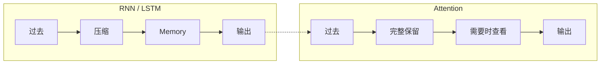
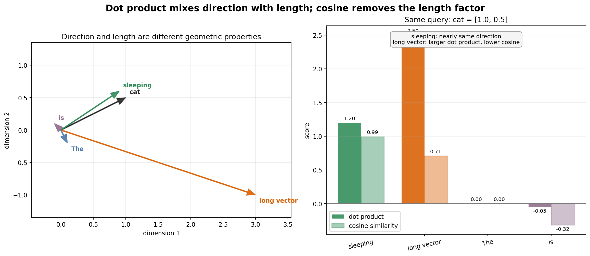
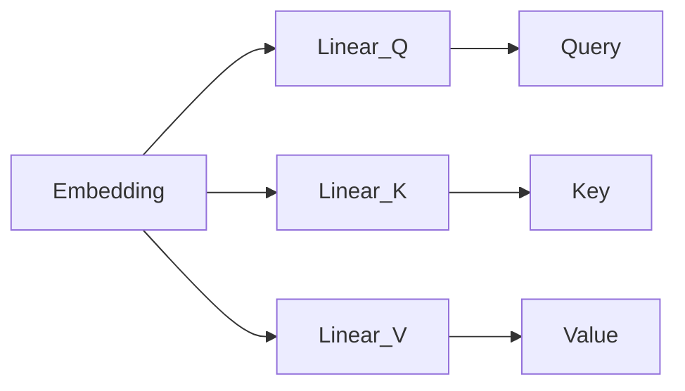
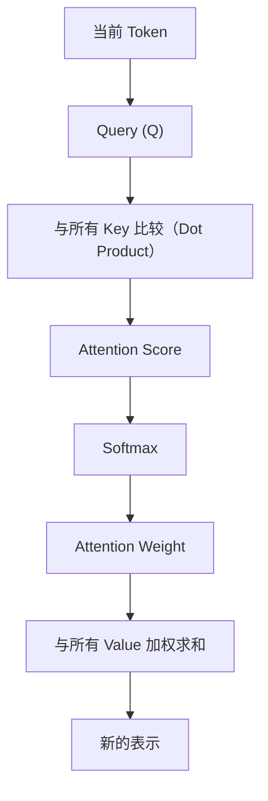
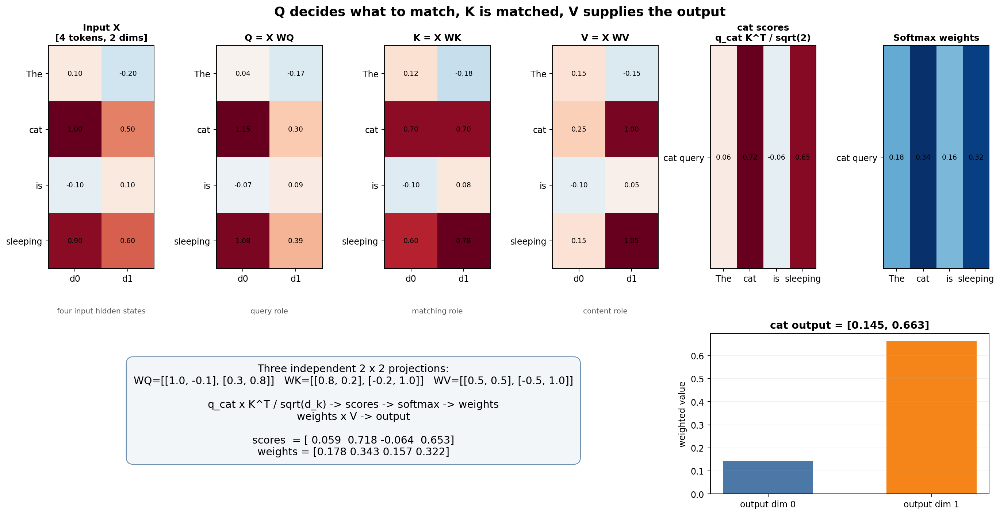
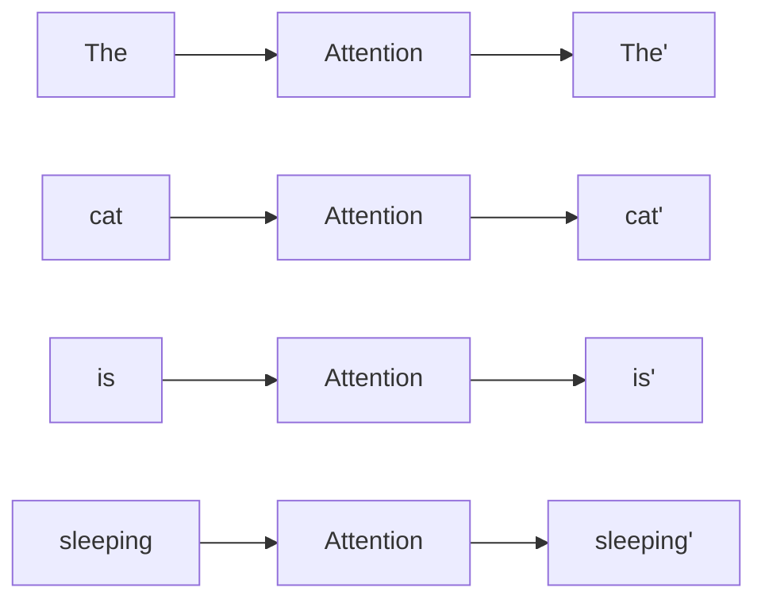
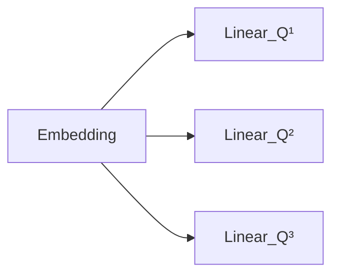
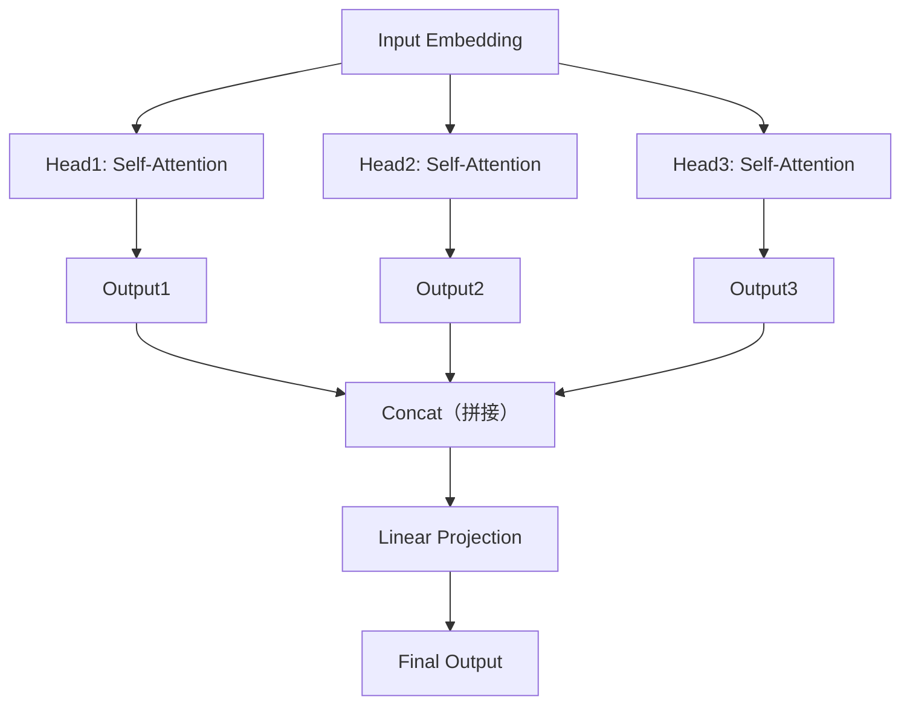

# 10. Attention

> **本章目标**
>
> 第 9 章指出 LSTM 的结构性限制：Cell State 是一个固定长度的向量，全部历史都要压缩进去。本章不再重复论证这个瓶颈，而是回答下一个问题：如果不压缩，替代方案是什么？
>
> 本章先从翻译任务里的代词指代引出 Attention 的核心思想——**不要强迫模型记住所有内容，而是在需要的时候，回头查看最相关的信息**。随后逐步展开：Attention Score（衡量谁更重要）、Dot Product（向量相似度）、Softmax（分数转权重）、Weighted Sum（加权聚合）、Q/K/V（三种计算角色）、Self-Attention（句子自己查看自己）、Attention Matrix（整句一次计算）、可视化，最后进入 Multi-Head Attention。与前面章节一致，概念在一节内讲完，实验放在 10.1～10.3 三个独立小节。

---

# 一、为什么还需要 Attention？

来看一句英文：`The animal didn't cross the street because it was too tired.`——这里的 `it` 指的是谁？答案是 `The animal`。再看一句：`The animal didn't cross the street because it was too wide.`——现在 `it` 又是谁？答案是 `the street`。模型需要回头查看前面不同的位置，才能知道 `it` 真正指代谁。

LSTM 不能回头，它只能一直维护 Cell State：所有历史信息都必须不断压缩，最终存放到 Cell State，然后再依靠 Cell State 预测 `it`。

如果是人类呢？想象你正在阅读一本书，突然看到 `he`，忘记是谁，你会怎么办？绝大多数人不会拼命回忆，而是直接翻回前面，找到 `John`，然后继续阅读。人类并没有把整本书一直压缩到一个 Memory，而是**需要的时候回头查看**。

于是产生一个大胆的想法：既然人可以回头查看，为什么神经网络不能？当读到 `it` 的时候，不依赖 Cell State，而是直接查看所有历史 Token，然后自己决定最相关的是 `animal` 还是 `street`。

这就是 Attention，其实只有一句话：

> **不要强迫模型记住所有内容，而是在需要的时候，回头查看最相关的信息。**



Attention 与 RNN 最大的思想差异在于：不再把历史压缩到一个 Memory，而是保留全部历史 Token，在需要的时候回头查看。（实验 10.1 会先用一段代码体会"允许回头查看"。）

---

# 二、Attention Score——衡量"谁更重要"

Attention 的核心是根据当前 Token，从上下文中聚合相关信息。对于 `The animal didn't cross the street because it ...`，处理 `it` 时，模型需要判断 `animal`、`street` 等位置分别有多相关。这里要澄清一点：标准 Dense Attention 仍会对所有 Key 计算分数，并不会因为"重点关注"就跳过其它位置；Attention Score 的作用是**分配不同权重**，而不是直接降低全量计算复杂度。真正减少计算量需要 Sparse Attention、Local Attention 等额外结构。

**Attention Score 就是每个历史 Token 的重要程度**，例如当前是 `it`：`The 0.02, animal 0.83, didn't 0.05, cross 0.10, street 0.76`。分数越高，说明模型越关注。

一个类比：有人问"谁喜欢音乐？"，你的脑海里不会重新回忆所有内容，而是快速找到"音乐"附近的信息，例如 `Tom likes basketball / Alice likes music`，你自然会重点关注 `music、Alice`，忽略 `basketball`。Attention 就是把这个过程交给神经网络完成。

但真正的大模型不会手写 `scores["animal"] = 0.95`，而是自己计算。最简单的规则是字符串匹配：`query = "music"`，在历史里找相等的词。这带来一个明显的问题：如果 Query 变成 `songs`，历史只有 `music`，字符串匹配立即失效（`songs != music`），但人类知道 `songs ≈ music`。说明 Attention 不能比较字符串，而应该比较**语义（Semantic Similarity）**。

于是第 3 章学习的 Embedding 派上用场：过去比较 `music == songs`，现在比较 `Embedding("music")` 和 `Embedding("songs")`。如果两个向量很接近，那么 Attention Score 就应该更高。

**本章的统一例子**：从本节开始，本章用同一个句子 `The cat is sleeping` 贯穿到底，给每个 Token 一份 2 维玩具 Embedding：

| Token | Embedding |
|-------|-----------|
| `The` | `[0.1, -0.2]` |
| `cat` | `[1.0, 0.5]` |
| `is` | `[-0.1, 0.1]` |
| `sleeping` | `[0.9, 0.6]` |

我们一直站在 `cat` 这个 Token 的视角（它想知道该关注句子里的谁），把 Dot Product → Softmax → Weighted Sum → Q/K/V → Attention Matrix 全部用这同一组数字算一遍。

---

# 三、从 Embedding 到 Dot Product——向量相似度

现在的问题变成：**两个向量到底怎样才算"像"？** 最直接的方法就是 **Dot Product（点积）**。用 `cat` 的 Embedding 分别和句子里每个 Token 的 Embedding 做点积（`a·b = a₁b₁ + a₂b₂`），会得到：

```text
The -> 0.0
cat -> 1.25
is -> -0.05
sleeping -> 1.2
```

`cat` 和自己（1.25）、和 `sleeping`（1.2）的点积明显更大，和 `The`（0.0）、`is`（-0.05）几乎没有关联——这符合直觉：`cat` 应该更关注 `sleeping`（谓语动作），而不是 `The`、`is` 这两个功能词。这组分数 `[0.0, 1.25, -0.05, 1.2]`，会在下一节继续用来计算 Softmax。

## Dot Product 为什么会受长度影响？

点积同时受方向和**长度**影响。以 `cat=[1.0, 0.5]` 为 Query：`sleeping=[0.9, 0.6]` 与它几乎同方向，点积为 `1.20`；另一个长向量 `[3.0, -1.0]` 的方向相似度较低，但点积反而达到 `2.50`。因此，不能把点积直接等同于只衡量方向的相似度。

## Cosine Similarity：消除长度影响

如果只想比较**方向是否一致**，可以使用 Cosine Similarity（余弦相似度）。它先用向量长度归一化点积：

```math
\cos(\theta)=\frac{a\cdot b}{\lVert a\rVert\lVert b\rVert}
```

**这个公式的作用**：用两个向量夹角衡量方向接近程度，并除掉向量长度的影响。`a·b` 是点积，`‖a‖、‖b‖` 是两个向量的长度，输出范围为 `[-1,1]`。

`music=[1,2]` 与 `songs=[2,4]` 方向完全相同，Cosine Similarity 为 `1.0`；方向不同的向量得分更低。下图把同一组数字画在坐标系中，并并列比较点积和余弦相似度：



图中 `[3.0,-1.0]` 的点积更高，但 `sleeping` 的余弦相似度更接近 `1`。这说明点积回答的是"方向与长度共同作用后有多大"，余弦相似度回答的是"方向有多接近"。生成脚本见 [`vector_similarity_geometry.py`](./assets/vector_similarity_geometry.py)。

## 那 Transformer 为什么不用 Cosine？

既然 Cosine 更合理，为什么 Transformer 使用 Dot Product？有两个原因：**① 点积直接对应矩阵乘法，可以一次性并行计算所有 Token 两两之间的分数（`Q @ K.T` 就是一次 GEMM）；② 点积的方差是可控的，配合缩放因子就能保持数值稳定**——最终形成了 **Scaled Dot-Product Attention**。

**为什么除以 √d_k？** 设 `q`、`k` 是维度为 `d_k` 的向量，各分量独立同分布、均值为 0、方差为 1。则：

- 单个分量乘积的方差：`Var(q_i k_i) = Var(q_i)Var(k_i) = 1`（零均值独立变量）
- 点积是 `d_k` 个独立分量的和，方差相加：`Var(q · k) = d_k`
- 所以点积的标准差是 `√d_k`——**分数会随维度增长而变大**

不缩放会怎样？分数进入 Softmax 的**饱和区**（Softmax 输入绝对值很大时，输出接近 one-hot，梯度趋近于 0，模型学不动）。除以 `√d_k` 后，方差恢复为 1，分数保持在 Softmax 的"温和区"，梯度正常流动：

```math
\text{Attention Score}=\frac{q\cdot k}{\sqrt{d_k}}
```

**这个公式的作用**：在 Query、Key 维度增大时，把点积尺度拉回较稳定范围。`q、k` 是 Query 与 Key 向量，`d_k` 是它们的维度；除以 `√d_k` 不改变候选之间的排序，但会改变 Softmax 的尖锐程度。这就是"Scaled"（缩放）一词的数学来源。

---

# 四、为什么需要 Softmax——从分数到注意力权重

上一节算出了 `cat` 对 `The cat is sleeping` 每个词的分数：`[0.0, 1.25, -0.05, 1.2]`。这些分数可以直接使用吗？答案是不能，原因有三：

**问题一：数字没有范围。** 不同句子的 Score 可能是 `8.3, 5.1` 也可能是 `120, 95, 40`，没有任何统一范围，模型越来越难训练。

**问题二：不能直接解释为分配比例。** 原始 Score 可以为负，也不保证总和为 1；我们需要把同一个 Query 对各个 Key 的分数转换为一组非负、和为 1 的权重。

**问题三：点积分数可能随维度变大。** 当 Query、Key 的各维方差相近时，点积的典型幅度会随 `d_k` 增长，使 Softmax 过早饱和、梯度变小。Scaled Dot-Product Attention 因此先除以 `√d_k`。注意，Softmax 对整体缩放并不保持比例不变；把 `[8,4,2]` 乘 10 会得到更尖锐的分布。

**一个直接的想法：归一化。** 把分数变成百分比：`8,4,2 → 57%,29%,14%`，现在立刻知道模型主要关注谁。所有数字都在 0~1，加起来等于 1，已经很像概率。但如果 Score 里出现负数，例如 `[-5, 3, 10]`，直接除以总和会出现**负权重**——Attention 不能出现负关注。

**Softmax 做了什么？** 它必须满足：①所有结果 > 0；②所有结果加起来 = 1；③大的分数应该变得更大，小的分数应该变得更小。做法分两步：第一步把所有分数变成指数（`e^x`），指数永远大于 0，因此不会再出现负权重；第二步做归一化（为数值稳定，通常先减去最大值再求指数）。对未缩放分数 `[0.0, 1.25, -0.05, 1.2]` 做 Softmax，结果约为：

```text
The 11.4%, cat 39.8%, is 10.9%, sleeping 37.9%
```

`cat` 主要关注自己和 `sleeping`（合计约 78%），几乎不理会 `The` 和 `is` 这两个功能词。这组权重 `[0.114, 0.398, 0.109, 0.379]`，会在下一节继续用来做 Weighted Sum。（完整代码见实验 10.1。）

---

# 五、Weighted Sum——注意力输出的加权聚合

现在已经算出 `cat` 对每个词的 Attention Weight：`The 0.114, cat 0.398, is 0.109, sleeping 0.379`。模型已经知道谁重要、谁不重要，接下来怎么办？

**第一种想法：只看最大的。** 找到最大权重 `cat: 0.398`，只读取 `cat` 自己。看起来省事，但这样 Attention 就白算了——`cat` 完全没有从 `sleeping` 那里获得任何新信息，等于什么都没改变。

**一个更好的办法：全部利用，按权重分配。** 重要的多看一点，不重要的少看一点，最终输出就是所有 Token 的**加权平均（Weighted Sum）**。对 `The cat is sleeping` 的四个 Embedding 按权重求和，得到新的 `cat' = [0.74, 0.415]`，比原来的 `cat = [1.0, 0.5]` 略微"偏向" `sleeping = [0.9, 0.6]` 的方向——这正是 Attention 的效果：`cat` 的新表示已经融合了 `sleeping` 带来的上下文信息，而不再是一个孤立的词向量。（代码见实验 10.1。）

**为什么叫 Attention？** 模型不是全部平均，也不是只选择一个，而是**按照注意力大小，对所有历史信息进行加权聚合**。这就是 Attention 名字的真正含义。一个类比：老师问"介绍一下 Transformer"，你的脑海里不会随机回忆所有知识，而是不同内容占据不同权重（Attention 45%、Self-Attention 30%、GPT 15%……），最后融合起来形成回答。

**从 Attention Score 到 Attention 输出。** 回顾整个推导：①保存全部历史 Token；②用 Dot Product 计算相关程度，得到 Attention Score；③经过 Softmax，得到 Attention Weight；④按权重融合所有 Value，得到新的表示。整个过程没有任何神秘公式，只是一步一步自然推导出来的。

现在终于可以看懂论文中的公式：

```text
Attention = Softmax(Score) × Value
```

如果把 Score 换成 Dot Product `QKᵀ`，并补上缩放，就变成：

```text
Attention(Q, K, V) = Softmax(QKᵀ / √d_k) V
```

这已经不是新知识，只是把刚才的五个步骤写成一行数学表达式——正是论文原文的名字 **Scaled Dot-Product Attention（缩放点积注意力）**。至此，本章推导出的每一步都已经对应上了论文公式里的每一个符号。

---

# 六、Q、K、V——三种计算角色

到这里，我们已经亲手完成了整个 Attention：`当前 Token → 与历史 Token 比较 → 得到 Score → Softmax → Weighted Sum → 新的表示`。整个过程中，我们从来没有使用 Q、K、V。那么 Transformer 为什么会出现这三个字母？答案很简单：**Q、K、V 并不是三个新知识，它们只是三个不同的角色。**

**一个图书馆的类比。** 假设你去图书馆找一本书：①你脑子里先有一个问题，例如"Transformer"——这就是**"我要找什么？"**；②图书馆有很多索引（人工智能、数据库、Transformer……），你拿着问题去和索引比较，找到最匹配的一项；③真正拿到书的内容，例如"Transformer 原理"。

这里出现三个角色：

- **Query（Q）**：我要找什么？
- **Key（K）**：每本书的索引，负责匹配，而不是保存内容。
- **Value（V）**：真正返回的书的正文，才是真正提供信息的人。

一个更生活化的例子：手机通讯录搜索"Alice"——搜索框输入的内容是 **Query**；通讯录里每个人的姓名是 **Key**；点进去看到的电话、邮箱等信息才是 **Value**。名字负责找到人，信息负责提供内容，它们不是一回事。

**回到 Attention。** 回顾 `The cat is sleeping` 的例子：`cat` 想知道该关注句子里的谁——这个"要去查询的 cat"就是 **Query**；被拿来跟 Query 做 Dot Product 比较的 `The/cat/is/sleeping` 四个向量，就是 **Key**；最后参与 Weighted Sum、真正提供内容的那四个向量，就是 **Value**。之前我们图省事，让 Query、Key、Value 都直接等于同一份 Embedding，这其实是 Self-Attention 最简化的版本——完整版会给 Q、K、V 分别过一层不同的 Linear，但 Dot Product → Softmax → Weighted Sum 这条计算流程完全不变。

**为什么需要区分 Key 和 Value？** 因为**匹配的信息**和**真正输出的信息**未必一样。例如搜索"苹果"，Key 可能只有"苹果"，但 Value 却可以是"Apple Inc. 成立于1976年……总部位于……"。Key 负责匹配，Value 负责提供内容，Transformer 把这两件事情分开了。

**Query、Key、Value 从哪里来？** 在 Self-Attention 中，Q、K、V 都由同一输入序列的隐藏表示分别经过三个线性投影得到：



因此，同一位置的三个向量共享输入隐藏表示，但投影参数不同。Cross-Attention 则不同：Q 来自目标端（Decoder）的隐藏状态，K、V 来自源端（Encoder）输出或外部上下文。Q、K、V 表示计算角色，不要求来自同一组 Token。

**Q、K、V 的完整流程：**



下面继续使用 `The cat is sleeping` 的 2 维表示，并分别乘三个不同的 `2×2` 投影矩阵。图中只展开 `cat` 这一行作为 Query 的计算：



图中各矩阵的行始终对应四个 Token。`Q`、`K`、`V` 的 Shape 都是 `(4,2)`，但数值和职责不同：`q_cat` 与四行 `K` 计算得到 Score，经 Softmax 得到权重 `[0.178, 0.343, 0.157, 0.322]`，再对四行 `V` 加权求和，得到 `cat` 的新表示 `[0.145, 0.663]`。这说明 Attention Weight 由 `Q、K` 决定，最终被聚合的内容来自 `V`。生成脚本见 [`qkv_numeric_pipeline.py`](./assets/qkv_numeric_pipeline.py)。

---

# 七、Self-Attention——句子自己查看自己

理解了 Attention 的完整流程：`Query → Key → Score → Softmax → Weight → Value → Output`。但还有一个问题：Attention 为什么叫 **Self（自）Attention**？

**先回顾最早的 Attention。** Attention 最早诞生于 Seq2Seq 模型，例如机器翻译：`I love machine learning.` → `我 热爱 机器 学习`。Encoder 负责阅读英文并压缩成 Memory，Decoder 负责根据 Memory 生成中文。Attention 最早就是 **Decoder 回头查看 Encoder**：Decoder 准备生成"猫"时，去查看 Encoder，找到 `cat`。这里 Query 来自 Decoder，Key 来自 Encoder，它们并不是同一批数据。

**Transformer 做了一件大胆的事情。** 它提出一个问题：为什么一定要等 Decoder 来查？例如 `The cat is sleeping.`，模型处理 `sleeping` 的时候，其实也需要知道 `cat`。因此即使没有 Decoder，一句话内部是不是也可以互相查看？答案是当然可以。

于是：处理 `sleeping` 时可以关注 `cat`；处理 `cat` 时也可以关注 `sleeping`；甚至处理 `The` 时可以查看整个句子。整个过程都是**这一句话自己查看自己**，因此叫 **Self-Attention（自注意力）**。

**为什么还要关注自己？** 很多人会问：为什么 Token 还要关注自己？例如 `cat` 关注 `cat` 是不是没有意义？其实很有意义，因为当前 Token 自己的信息通常也是最重要的信息之一，例如处理 `Apple` 当然需要保留 `Apple` 本身。Self-Attention 允许模型自己决定自己占多少权重，例如 `Apple 0.65, Inc. 0.20, iPhone 0.15`——有时候自己就是最大的贡献者。

**每一个 Token 都执行一次 Attention。** 真正的 Transformer 不是只有最后一个 Token 做 Attention，而是**整个句子所有 Token 一起计算**：



每一个 Token 都会融合整个句子的上下文，因此 Transformer 输出的已经不是原来的 Token，而是**带上下文信息的新表示（Contextual Representation）**。

**为什么 Self-Attention 如此强大？** RNN 只能一步一步传递信息：`Token1 → Token2 → Token3 → Token4`；而 Self-Attention 中，任意两个 Token 都可以直接建立联系，距离不再重要，模型可以一步建立全局关系。这也是 Transformer 能够解决长距离依赖的重要原因。

---

# 八、Attention Matrix——整句一次计算

前面我们始终站在**一个 Token 的视角**。而 Transformer 真正计算的时候，不是一个一个算，而是**整个句子一次完成**。

假设句子有 4 个 Token：`The cat is sleeping`。每一个 Token 作为 Query，都会对所有 Token 计算一次注意力，把结果排成一张表：

```text
                被关注(Key)
             The  cat  is  sleeping
Query  The    ?    ?    ?      ?
       cat    ?    ?    ?      ?
       is     ?    ?    ?      ?
  sleeping    ?    ?    ?      ?
```

这就是 **Attention Matrix（注意力矩阵）**，矩阵中每个数字表示**当前 Query 对某个 Token 的关注程度**。

标准 Self-Attention 先投影，再做缩放点积：

```text
Q = XW_Q,  K = XW_K,  V = XW_V
A = softmax(QKᵀ / √d_k)
O = AV
```

其中 `X∈ℝ^(N×d_model)`，`Q,K∈ℝ^(N×d_k)`，`V∈ℝ^(N×d_v)`，所以 `A∈ℝ^(N×N)`。每一行沿 Key 维做 Softmax，行和为 1。

## Full Attention 与 Causal Attention

Encoder 的双向 Self-Attention 通常允许每个 Query 查看整段序列，称为 **Full Attention**。Decoder-only 语言模型还会在未来位置加入 **Causal Mask**，使位置 `i` 只能查看 `j≤i` 的 Key，避免训练时偷看答案。两者的区别只在 Mask：Full Attention 没有屏蔽位置，Causal Attention 的严格上三角权重为 0。

## 为什么叫 Matrix？

之前计算的是"一个 Query → 所有 Key"，现在变成"所有 Query → 所有 Key"。若序列有 `N` 个 Token，需要形成 `N×N` 个分数；每次点积还要处理 `d_k` 个维度，因此分数计算量约为 `O(N²d_k)`，Attention Matrix 本身占用 `O(N²)` 内存。常说 Attention 对序列长度是"平方复杂度"，指的就是这个 `N²` 因子。

## Transformer 为什么能并行？

RNN 必须 `Token1 → Token2 → Token3` 一步一步计算，不能跳过，因为后一个 Hidden State 依赖前一个。而 Transformer 的 Attention Matrix 一次计算"所有 Query × 所有 Key"，整个句子可以一次送进 GPU 统一完成。这就是 Transformer 能够高效并行训练的根本原因。（完整 QKV + Mask 实现见实验 10.2。）

---

# 九、Attention 可视化

Self-Attention 最终会得到一个 Attention Matrix。但如果全部都是数字，其实很难理解模型到底在关注什么。因此研究人员通常会把它画成**热力图（Heatmap）**：颜色越深，表示 Attention Weight 越大；颜色越浅，表示权重越小。

继续用 `The cat is sleeping` 的教学例子：`cat` 这一行对自己和 `sleeping` 的权重较大。这里的矩阵来自人工指定的二维向量，并没有经过训练，因此它只能演示"如何读取热力图"，不能据此声称模型学到了语法或语义关系。

在真实的已训练模型中，某些 Head 可能对依存关系、相邻位置或标点呈现统计上的偏好，但需要在大量样本上验证，不能凭单张图下结论。严谨地说，Attention Weight 也不等同于完整的因果解释；严谨分析需要跨样本统计，并结合消融等方法。（画热力图的代码见实验 10.3。）

---

# 十、Multi-Head Attention——多个角度理解上下文

一个 Head 真的够吗？看一句话：`Apple released a new iPhone yesterday.`。处理 `Apple` 时，Attention 应该关注谁？可能是 `released`（主谓关系），也可能是 `iPhone`（公司与产品的关系），甚至可能是 `yesterday`（时间关系）。同一个 Token，到底应该关注哪个？答案是：**都应该关注，只是角度不同。**

单个 Head 也可能混合多种模式，但所有匹配与聚合都受限于同一组投影和同一个注意力分布。多个 Head 提供多个并行的表示子空间，使模型能组合更丰富的特征；它们不保证与"主谓""时间"等人工概念一一对应。

一个生活中的例子：分析一场足球比赛，教练关注球员站位，解说员关注比赛节奏，裁判关注犯规，球迷关注进球——大家看的是同一场比赛，但关注点完全不同。如果把四个人的信息综合起来，是不是比一个人的分析更全面？这就是 Multi-Head Attention 的思想。

**Multi-Head 是怎么工作的？** Transformer 不是重复计算同一个 Attention，而是让每一个 Head 拥有不同的参数：



Key 和 Value 同样使用各 Head 的投影参数。不同 Head 因而可以形成不同的注意力分布和输出特征，但不会预先指定为"语法 Head"或"时间 Head"。

前面几节都在手算 `(4,2)` 这种二维小矩阵。真实实现会一次处理很多条句子，所以张量会多出两维。先约定几个符号：

| 符号 | 含义 | 例子 |
|---|---|---|
| `B` | Batch Size，一次同时处理几条序列 | `32` |
| `T` | 每条序列有几个 Token | `4`（`The cat is sleeping`） |
| `d_model` | 每个 Token 向量的维度 | 前面例子里是 2，GPT-2 是 768 |
| `H` | Head 数量 | `12` |
| `d_head` | 每个 Head 分到的维度，通常等于 `d_model / H` | `768/12=64` |
| `W_O` | 输出投影矩阵，把各 Head 结果重新混合 | Shape `(d_model, d_model)` |

于是整套多头计算的 Shape 变化是：

```text
Q, K, V: (B, T, d_model)
reshape + transpose: (B, H, T, d_head)
scores = Q @ Kᵀ / √d_head: (B, H, T, T)
head_output = softmax(scores) @ V: (B, H, T, d_head)
concat: (B, T, H·d_head) = (B, T, d_model)
final = concat @ W_O: (B, T, d_model)
```

注意最后两行：拼接只是把各 Head 的输出接回 `d_model` 宽度，因此多头没有改变输入输出维度，只改变了中间的计算方式。

**每个 Head 都执行一套 Scaled Dot-Product Attention**，`Q_h K_hᵀ / √d_head → Softmax → 加权 V_h`，但它只处理总通道的一部分。`H` 个结果沿特征维拼接，再经过输出投影 `W_O` 融合；因此不能简单把一个 Head 等同于一种人类命名的语言关系。



**Multi-Head Attention 的作用。** 相较单头，Multi-Head Attention 为相同输入提供多组独立投影与注意力分布，再通过 `W_O` 联合这些子空间。它增加了表示容量，但具体收益由训练决定；不能保证每个 Head 都形成清晰、互不重叠的人类可解释功能。

到这里，Transformer 的两个核心创新已经全部出现：Self-Attention（每个 Token 都能看到整个上下文）与 Multi-Head Attention（从多个不同角度理解上下文）。

---

# 十一、本章总结

回顾整个第 10 章：

- ✅ Attention 的核心思想：保留历史，需要时回头查看，而不是压缩进一个 Memory
- ✅ Attention Score 衡量 Token 之间的相关性
- ✅ Dot Product 计算向量相似度，`√d_k` 缩放保证数值稳定
- ✅ Softmax 把任意分数变成非负、和为 1 的注意力权重
- ✅ Weighted Sum 按权重聚合 Value，得到新的上下文表示
- ✅ Q、K、V 是三种计算角色（Query 查询 / Key 匹配 / Value 提供内容）
- ✅ Self-Attention 让句子内部互相查看，任意 Token 直接建立联系
- ✅ Attention Matrix 一次计算整句，复杂度 O(N²)，可以并行
- ✅ Multi-Head Attention 用多组投影从多个角度理解上下文

---

# 本章路线

- [10.1 从零实现 Attention](./10.1%20从零实现%20Attention.md)：从"允许回头查看"到人为打分、Dot Product、Softmax、Weighted Sum，逐步手写 Attention 的核心计算流程；
- [10.2 实现 Scaled Dot-Product Attention 与 Causal Mask](./10.2%20实现%20Scaled%20Dot-Product%20Attention%20与%20Causal%20Mask.md)：用 NumPy 实现完整的 QKV 投影、缩放点积与 Full/Causal Mask，观察 Attention Matrix；
- [10.3 Attention 可视化](./10.3%20Attention%20可视化.md)：把 Attention Weight 矩阵画成热力图，并说明解读边界。

完成本章后，我们拥有了 Embedding、Self-Attention 和 Multi-Head Attention（位置信息还没有讲，第 11 章末与第 12 章会补上）。但 Transformer 并不只有 Attention，它后面还有两个模块：`Multi-Head Attention → Add & LayerNorm → Feed Forward Network（FFN）→ Add & LayerNorm`。为什么 Attention 后面还需要一个看起来很普通的 MLP？下一章 **第 11 章 Transformer Block** 会先学习 **Feed Forward Network（FFN）**，看看为什么每个 Token 在完成信息交流之后，还需要一次独立加工。

---

# 参考资料

- 李宏毅《机器学习》（Self-Attention / Transformer 经典入门讲解）：https://space.bilibili.com/3546866876680925
- Sebastian Raschka《Build a Large Language Model (From Scratch)》配套代码与全书资源：https://github.com/rasbt/LLMs-from-scratch
