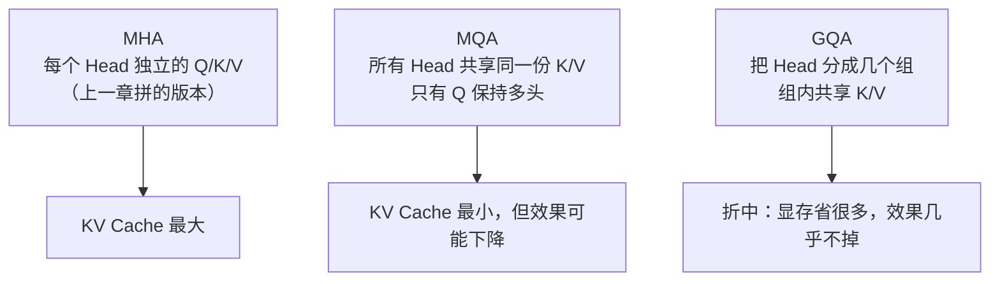
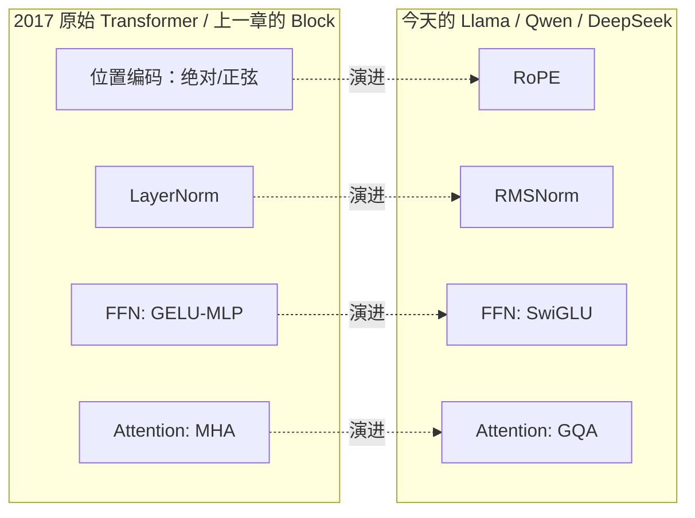

# 10. 现代 Transformer 架构演进——从 2017 论文到 Llama/Qwen

## 上一章的 Block，其实是"简化版"

上一章，我们亲手拼出了一个完整的 Transformer Block：`Multi-Head Attention + FFN + Residual + LayerNorm + Dropout`。这个版本已经能跑通、能训练，9.1 节的 Mini GPT 也确实用它学会了写故事。但如果你去读Llama、Qwen、DeepSeek 这些今天真正在用的模型的源码，会发现它们用的 Block 和我们拼的这一版，有几个地方明显不一样：

| 组件 | 上一章的写法 | 今天主流开源模型的写法 |
|---|---|---|
| 位置信息 | `nn.Embedding` 学一份位置向量（9.1节代码里悄悄用了，但我们从来没解释过它是什么、为什么需要它） | RoPE（旋转位置编码） |
| 归一化 | LayerNorm | RMSNorm |
| FFN激活 | `Linear → GELU → Linear` | SwiGLU |
| Attention | 每个 Head 都有自己独立的 K、V | GQA / MQA（多个 Head 共享 K、V） |

这一章，我们就把这四处差异一次讲清楚——尤其是第一个：**位置编码到底是什么、为什么Attention 必须要有它**，这是上一章一直没有兑现的承诺。

---

## 为什么 Attention 需要额外告诉它"顺序"？

先问一个问题：`Attention(Q, K, V) = Softmax(QKᵀ/√d)V` 这个公式里，哪里出现过"谁在前、谁在后"这件事？

答案是：**完全没有出现过。** 回顾一下 Attention 的计算过程——每个 Token 的 Query 和所有 Token 的 Key 做 Dot Product，得到 Score，再 Softmax、再加权求和 Value。这个过程只关心"两个 Token 的内容像不像"，从头到尾都没有用到"这是第几个 Token"这个信息。

这会带来一个真实的问题：**如果把句子里的 Token 顺序打乱，只要每个 Token 还能配对到同一批 Key/Value，Attention 算出来的结果本质上是一样的（只是顺序被打乱）。** 也就是说，纯粹的 Self-Attention 分不清`"猫追狗"` 和 `"狗追猫"`——它只知道句子里出现了"猫、追、狗"这三个东西，却不知道谁在前面。这个性质有一个专门的名字：**Permutation Invariant（排列不变性）**。

对于语言来说，顺序显然至关重要。因此我们必须**额外**给模型注入一份"位置信息"——这就是**位置编码（Positional Encoding）**存在的全部理由。上一章的 9.1 节代码里，我们其实已经在用它了（只是没有解释）：

```python
# 9.1 节代码片段回顾
self.position_embedding = nn.Embedding(block_size, d_model)
```

这行代码给每一个位置（0, 1, 2, ..., block_size-1）分配一个可学习的向量，直接加到 Token 的 Embedding 上。这是最简单的一种位置编码方式，但绝不是唯一的方式，也不是今天主流大模型的选择。

---

## 方案一：绝对位置编码（Learned Positional Embedding）

就是上面9.1 节用的办法：给每个位置学一个向量，`最终输入 = Token Embedding + Position Embedding`。

**优点**：简单、直接、效果够用，GPT-2、GPT-3 都用的是这种方式。

**缺点**：**外推能力差。** 假设训练时设定的最大长度是 2048，位置 0~2047 的向量都被充分训练过；但如果推理时输入长度达到 3000，位置 2048~2999 的向量模型从来没见过、没训练过，效果自然无法保证。这也是为什么早期 GPT 类模型很难简单地"扩展上下文长度"。

## 方案二：正弦位置编码（Sinusoidal Positional Encoding）

2017 年原始 Transformer 论文用的是另一种办法：不学习，而是用固定的正弦/余弦函数直接"计算"出每个位置的编码：

```python
import numpy as np

def sinusoidal_pe(position, d_model):
    pe = np.zeros(d_model)
    for i in range(0, d_model, 2):
        angle = position / (10000 ** (i / d_model))
        pe[i] = np.sin(angle)
        pe[i + 1] = np.cos(angle)
    return pe
```

不同维度用不同频率的 sin/cos 波形，波形本身是无限延伸的函数，所以**任意长度的位置都能直接算出编码，不需要训练**，理论上比 Learned Embedding 的外推能力更好。但它仍然是"加"在 Embedding 上的一份独立信息，效果也仍然有限——这也是为什么后来的研究一直在寻找更好的位置编码方式。

## 方案三：RoPE（Rotary Position Embedding）——今天的标准答案

Llama、Qwen、Mistral、DeepSeek……几乎所有 2023 年之后的主流开源大模型，用的都是同一种位置编码：**RoPE（旋转位置编码）**。它的思路和前两种完全不同：**不是把位置信息"加"到 Embedding 上，而是根据位置，把 Query 和 Key 向量"旋转"一个角度。**

**一个直觉：把向量的每两个维度看成一个二维平面上的点。** 一个二维向量 `(x, y)` 旋转角度 `θ` 之后，会变成：

```
x' = x·cos(θ) - y·sin(θ)
y' = x·sin(θ) + y·cos(θ)
```

RoPE 做的事情就是：**Token 在第几个位置，就把它的 Q、K 向量按这个位置对应的角度旋转一下**，越靠后的位置，旋转角度越大。用代码直观感受一下：

```python
import numpy as np

def rotate(vec, theta):
    # 把一个二维向量按角度 theta 旋转
    x, y = vec
    x_new = x * np.cos(theta) - y * np.sin(theta)
    y_new = x * np.sin(theta) + y * np.cos(theta)
    return np.array([x_new, y_new])

q = np.array([1.0, 0.0])   # 某个 Token 的 Query（简化成二维）
theta_per_position = 0.5   # 每往后一个位置，多转0.5 弧度

for position in range(4):
    q_rotated = rotate(q, theta_per_position * position)
    print(f"位置 {position}旋转后的 Q: {np.round(q_rotated, 3)}")
```

**为什么这样做是聪明的？** 关键在于一个数学性质：**两个都被旋转过的向量做 Dot Product，结果只和它们的"旋转角度差"有关，而与它们各自的绝对位置无关。** 也就是说，位置 5 的 Query 和位置 8 的 Key 的点积，只取决于 `8 - 5 = 3`这个相对距离，换成位置 105 和位置 108（同样相对距离3），点积结果的规律是完全一样的。**RoPE 因此天然获得了"相对位置编码"的效果，却不需要额外设计任何相对位置的机制**——这正是它比前两种方案更优雅的地方，也带来了更好的长度外推能力（后续章节提到的 YaRN、位置插值等长上下文扩展技术，也都是在 RoPE 的旋转角度上做文章）。

---

## RMSNorm——比 LayerNorm 更省一步计算

回顾一下上一章的 LayerNorm：拿到一组数字，先减去均值，再除以标准差，最后乘一个可学习的缩放参数、加一个可学习的偏置。

```python
import torch

x = torch.tensor([100.0, 120.0, 140.0])
layernorm = torch.nn.LayerNorm(3)
print(layernorm(x))
```

**RMSNorm（Root Mean Square Normalization）做了一个简化：不减均值，也不要偏置项，只用"均方根"来缩放数据：**

```python
import torch

def rmsnorm(x, eps=1e-6):
    # 只计算均方根（Root Mean Square），不减均值
    rms = torch.sqrt(torch.mean(x ** 2) + eps)
    return x / rms

x = torch.tensor([100.0, 120.0, 140.0])
print(rmsnorm(x))
```

**为什么可以省掉"减均值"这一步？** LayerNorm 减均值的目的是让数据以0 为中心，但后续研究发现：**真正对训练稳定性起关键作用的是"控制数值的整体尺度（Scale）"，而不是"是否以0为中心"**——只做 RMS 缩放，同样能达到差不多的稳定效果，却少了一次计算（减均值）和一组参数（偏置项）。少算一步，在千亿参数、万亿 Token 的训练规模下，省下来的时间和显存并不是一个小数字。这正是 Llama、Qwen、DeepSeek 等模型都用 RMSNorm 替代 LayerNorm 的原因：**几乎不损失效果，却更快、更省。**

---

## SwiGLU——比 GELU-MLP 更强的 FFN

回顾上一章的 FFN：`Linear → GELU → Linear`，先升维，激活，再降维。

**SwiGLU 是 GLU（Gated Linear Unit，门控线性单元）的一个变体**，结构上多了一条"门控"分支：

```python
import torch
import torch.nn as nn
import torch.nn.functional as F

class SwiGLU(nn.Module):
    def __init__(self, d_model, d_ff):
        super().__init__()
        self.gate_proj = nn.Linear(d_model, d_ff)   # 门控分支
        self.up_proj = nn.Linear(d_model, d_ff)     # 内容分支
        self.down_proj = nn.Linear(d_ff, d_model)   # 投影回原始维度

    def forward(self, x):
        gate = F.silu(self.gate_proj(x))# SiLU/Swish 激活，充当"门"
        content = self.up_proj(x)# 普通的线性变换
        return self.down_proj(gate * content)   # 门控值逐元素相乘，再降维
```

**核心区别**：普通 FFN 只有一条数据通路（升维 → 激活 → 降维）；SwiGLU 有两条并行的 Linear，一条经过 Swish（SiLU）激活后充当"门控"，逐元素控制另一条内容分支里每个维度**允许通过多少信息**，两者相乘后再投影回原始维度。这种"门控"机制让网络可以更灵活地决定"这个特征该不该被放大或抑制"，而不是像普通 MLP 那样对所有维度一视同仁地做非线性变换。多项实验证明，同样参数量下 SwiGLU-FFN 的效果通常优于 GELU-MLP，代价是需要多一组参数（因为多了一条门控分支），因此 Llama 等模型通常会相应调小 `d_ff` 的比例，让总参数量基本持平。

---

## GQA / MQA——推理时怎么省下大量 KV Cache

13.6节我们体验过 KV Cache：每个 Attention Head 都要为每个历史 Token 保存自己的 Key 和 Value，Head 数越多、序列越长，KV Cache 占用的显存就越大。**GQA 和 MQA 就是专门为了压缩这部分显存而设计的架构改动。**



| 方案 | K/V 的数量 | 特点 |
|---|---|---|
| MHA（Multi-Head Attention） | 每个 Head 一份（假设8个Head，就是8份） | 效果最好，KV Cache 最大 |
| MQA（Multi-Query Attention） | 全局只有1份，所有 Head 共享 | KV Cache 最小（缩小到 1/Head数），但表达能力受限，效果有时会下降 |
| GQA（Grouped Query Attention） | 分成几个组，组内共享（例如8个Head分成2组，就是2份） | 显存介于MHA和MQA之间，实践中效果几乎和MHA一样好 |

**用一个简单的数字感受差异**：假设一个模型有 32 个 Attention Head，用 MHA 需要存32 份 K 和 32 份 V；如果换成 GQA、分成 4 组，只需要存 4 份 K 和 4 份 V——**KV Cache 直接缩小到 1/8**，这意味着同样的显存可以支持更长的上下文、或者更大的 Batch Size。Llama 2 70B、Llama 3、Qwen2 及之后的版本，都采用了 GQA，正是因为它几乎是"免费的午餐"：**用很小的效果代价，换来推理阶段大幅降低的显存占用**，而 13.6 节讨论过的"KV Cache 为什么会成为长上下文的瓶颈"这一问题，GQA/MQA 正是从架构设计层面给出的直接回应。

---

## 一张图总结这次改造



请注意，这四处改动都遵循同一个原则：**几乎不损失效果，却在训练效率、推理速度或显存占用上带来实实在在的收益**——这正是今天开源大模型架构演进的主旋律：不是靠更复杂的数学，而是靠对每一个细节的持续打磨。

---

想亲手实现并对比这四处改动，可以看这一节实验：**10.1 亲手实现 RoPE / RMSNorm / SwiGLU / GQA，并对比显存与效果差异**。

---

## 本章总结

本章我们理解了：

✅ Attention 本身是"排列不变"的，完全不知道 Token 的顺序，必须额外注入位置信息 ✅ 绝对位置编码简单但外推能力差，正弦位置编码不需要训练但仍是"加"上去的信息 ✅ RoPE 通过旋转 Q/K 向量，让点积结果天然只依赖相对位置，是今天主流大模型的标准选择 ✅ RMSNorm 去掉减均值和偏置项，用更少的计算达到接近的训练稳定效果 ✅ SwiGLU 用门控机制让 FFN 能更灵活地控制信息通过量，效果优于传统 GELU-MLP ✅ GQA/MQA 通过让多个 Head 共享 K/V，大幅压缩推理阶段的 KV Cache 占用

> **今天的大模型架构，不是推翻了 2017 年的 Transformer，而是在每一个组件上做了一次"效果几乎不变、效率大幅提升"的精细化改造。**

## 下一章预告

理解了单个 Block 内部的现代化改造之后，我们回到一个更基础的问题：一个 Block 已经能够理解上下文了，为什么 GPT、BERT、LLaMA 都要把这样的 Block 堆叠几十层甚至上百层？不同的层到底学到了什么？下一章，我们将进入：

> **第11章 Stacking Transformer**

---

# 参考资料

- Andrej Karpathy《Neural Networks: Zero to Hero》系列（micrograd / makemore / Let's build GPT / nanoGPT）：https://www.youtube.com/@AndrejKarpathy
- Sebastian Raschka《Build a Large Language Model (From Scratch)》配套代码与全书资源：https://github.com/rasbt/LLMs-from-scratch
