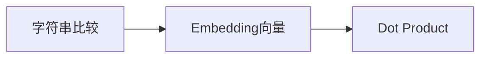

# 10.2 Token 表示的相似度——从 Embedding 到 Dot Product

上一节，我们知道 Attention 需要比较 Embedding 之间的相似度，而不是字符串，并且约定用 `The cat is sleeping` 作为本章统一的例子。新的问题来了：**两个向量到底怎样才算"像"？**

---

# Dot Product（点积）计算 `cat` 与句中每个词的相似度

延续 10.1 节的例子 `The cat is sleeping`，用 `cat` 的 Embedding 分别和句子里每个 Token 的 Embedding 做点积：

```python
import numpy as np

embedding = {
    "The":      np.array([0.1, -0.2]),
    "cat":      np.array([1.0,  0.5]),
    "is":       np.array([-0.1, 0.1]),
    "sleeping": np.array([0.9,  0.6]),
}

query = embedding["cat"]
for word, vec in embedding.items():
    print(word, "->", np.dot(query, vec))
```

输出：

```text
The -> 0.0
cat -> 1.25
is -> -0.05
sleeping -> 1.2
```

`cat` 和自己（1.25）、和 `sleeping`（1.2）的点积明显更大，和 `The`（0.0）、`is`（-0.05）几乎没有关联——这符合直觉：`cat` 应该更关注 `sleeping`（谓语动作），而不是 `The`、`is` 这两个功能词。这组分数 `[0.0, 1.25, -0.05, 1.2]`，我们会在 10.3 节继续用来计算 Softmax。

---

# Dot Product 为什么会受长度影响？

点积同时受方向和**长度**影响。以 `cat=[1.0, 0.5]` 为 Query：`sleeping=[0.9, 0.6]` 与它几乎同方向，点积为 `1.20`；另一个长向量 `[3.0, -1.0]` 的方向相似度较低，但点积反而达到 `2.50`。因此，不能把点积直接等同于只衡量方向的相似度。

---

# Cosine Similarity：消除长度影响

如果只想比较**方向是否一致**，可以使用 Cosine Similarity（余弦相似度）。它先用向量长度归一化点积：

$$
\cos(\theta)=\frac{a\cdot b}{\lVert a\rVert\lVert b\rVert}
$$

`music=[1,2]` 与 `songs=[2,4]` 方向完全相同，Cosine Similarity 为 `1.0`；方向不同的向量得分更低。下图把同一组数字画在坐标系中，并并列比较点积和余弦相似度：


图中 `[3.0,-1.0]` 的点积更高，但 `sleeping` 的余弦相似度更接近 `1`。这说明点积回答的是“方向与长度共同作用后有多大”，余弦相似度回答的是“方向有多接近”。生成脚本见 [`vector_similarity_geometry.py`](./assets/vector_similarity_geometry.py)。

---

# 那 Transformer 为什么不用 Cosine？

既然 Cosine 更合理，为什么 Transformer 使用 Dot Product？有两个原因：**① 点积直接对应矩阵乘法，可以一次性并行计算所有 Token 两两之间的分数（`Q @ K.T` 就是一次 GEMM）；② 点积的方差是可控的，配合缩放因子就能保持数值稳定**——最终形成了 **Scaled Dot-Product Attention**。

## 💡 为什么除以 √d_k？(Karpathy nanoGPT 视频中的数学推导)

设 `q`、`k` 是维度为 `d_k` 的向量，各分量独立同分布、均值为 0、方差为 1。则：

- 单个分量乘积的方差：$\mathrm{Var}(q_i k_i) = \mathrm{Var}(q_i)\mathrm{Var}(k_i) = 1$（零均值独立变量）
- 点积是 $d_k$ 个独立分量的和，方差相加：$\mathrm{Var}(q \cdot k) = d_k$
- 所以点积的标准差是 $\sqrt{d_k}$——**分数会随维度增长而变大**

不缩放会怎样？分数进入 Softmax 的**饱和区**（Softmax 输入绝对值很大时，输出接近 one-hot，梯度趋近于 0，模型学不动）。除以 $\sqrt{d_k}$ 后，方差恢复为 1，分数保持在 Softmax 的"温和区"，梯度正常流动：

$$
\text{Attention Score} = \frac{q \cdot k}{\sqrt{d_k}}
$$

这就是"Scaled"（缩放）一词的数学来源。我们将在 10.5 节正式实现它。

---

# 本节总结

本节，我们完成了一个重要推导：



Dot Product 第一次让模型拥有了**自动计算 Token 相似度的能力**。请注意，到这里我们仍然没有出现 Q、K、V，因为目前讨论的只是"如何比较两个向量"。

---

# 下一节预告

现在我们已经能够计算 `cat` 对句子里每个 Token 的 Attention Score：`[0.0, 1.25, -0.05, 1.2]`。但这些分数既不是概率，也不能直接表示关注程度。下一节，我们将学习 **Softmax**，看看 Transformer 如何把任意分数变成真正的 **Attention Weight（注意力权重）**。
