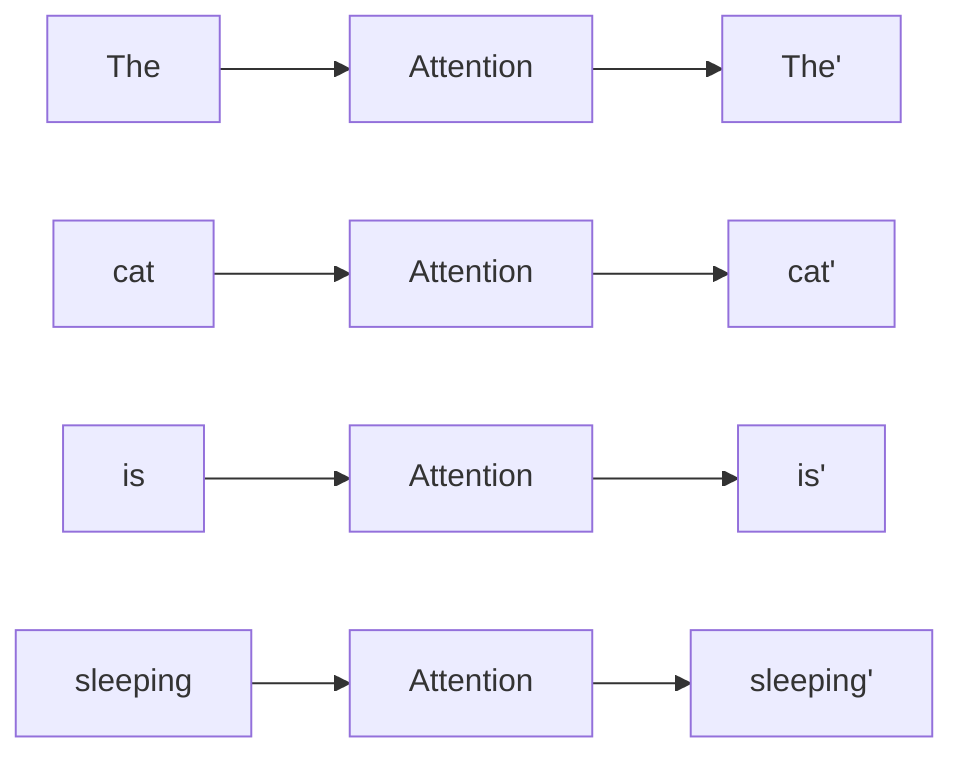

# 10.6 为什么叫 Self-Attention？

上一节，我们理解了 Attention 的完整流程：`Query → Key → Score → Softmax → Weight → Value → Output`。这个过程已经能够完成"回头查看历史信息"，但还有一个问题：Attention 为什么叫 **Self（自）Attention**？

---

# 先回顾最早的 Attention

Attention 最早诞生于 Seq2Seq（序列到序列）模型，例如机器翻译：`I love machine learning.` → `我 热爱 机器 学习`。Encoder 负责阅读英文并压缩成Memory，Decoder 负责根据 Memory 生成中文。Attention 最早就是 **Decoder 回头查看 Encoder**：Decoder 准备生成"猫"时，去查看 Encoder，找到 `cat`。这里 Query 来自 Decoder，Key 来自 Encoder，它们并不是同一批数据。

---

# Transformer 做了一件大胆的事情

Transformer 提出一个问题：**为什么一定要等Decoder 来查？** 例如 `The cat is sleeping.`，模型处理 `sleeping` 的时候，其实也需要知道 `cat`。因此即使没有 Decoder，一句话内部是不是也可以互相查看？答案是当然可以。

---

# 一个句子自己查看自己

处理 `sleeping` 时可以关注 `cat`；处理 `cat` 时也可以关注 `sleeping`；甚至处理 `The` 时可以查看整个句子。整个过程都是**这一句话自己查看自己**，因此叫 **Self-Attention（自注意力）**。

---

# 为什么还要关注自己？

很多人会问：为什么 Token 还要关注自己？例如 `cat` 关注 `cat` 是不是没有意义？其实很有意义，因为当前 Token 自己的信息通常也是最重要的信息之一，例如处理 `Apple` 当然需要保留 `Apple` 本身。Self-Attention 允许模型自己决定自己占多少权重，例如 `Apple 0.65, Inc. 0.20, iPhone 0.15`——有时候自己就是最大的贡献者。

---

# 每一个 Token 都执行一次 Attention

真正的 Transformer 不是只有最后一个 Token 做 Attention，而是**整个句子所有 Token 一起计算**：

每一个 Token 都会融合整个句子的上下文，因此 Transformer 输出的已经不是原来的 Token，而是**带上下文信息的新表示（Contextual Representation）**。

---

# 为什么 Self-Attention 如此强大？

RNN 只能一步一步传递信息：`Token1 → Token2 → Token3 → Token4`；而 Self-Attention 中，任意两个 Token 都可以直接建立联系，距离不再重要，模型可以一步建立全局关系。这也是 Transformer 能够解决长距离依赖的重要原因。

---

# 本节总结

本节，我们理解了：✅ Self-Attention 是"一句话查看自己" ✅ 每个 Token 都会成为 Query ✅ 每个 Token 都会查看整个输入序列 ✅ 每个 Token 都会生成新的上下文化表示。这也是 Transformer 区别于 RNN 的第一个核心创新。

---

# 下一节预告

如果一句话有 512 个 Token，是不是意味着每个 Token 都要和另外 511 个 Token 分别计算 Attention？答案是的。于是 Transformer 第一次出现了一个新的计算对象：**Attention Matrix（注意力矩阵）**。
