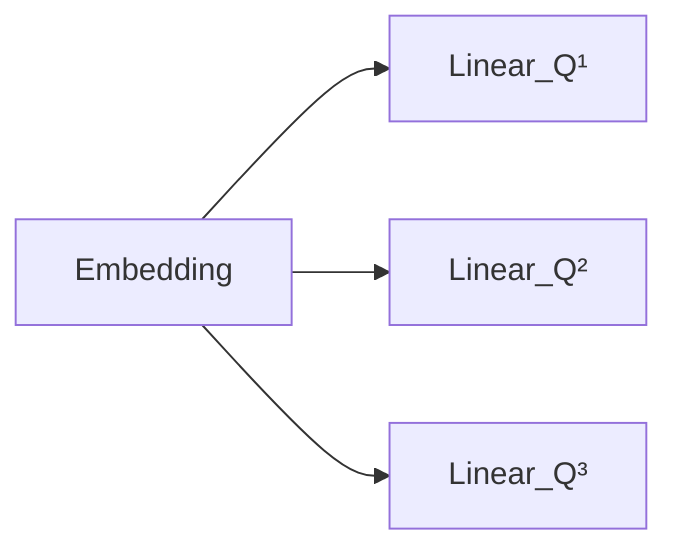
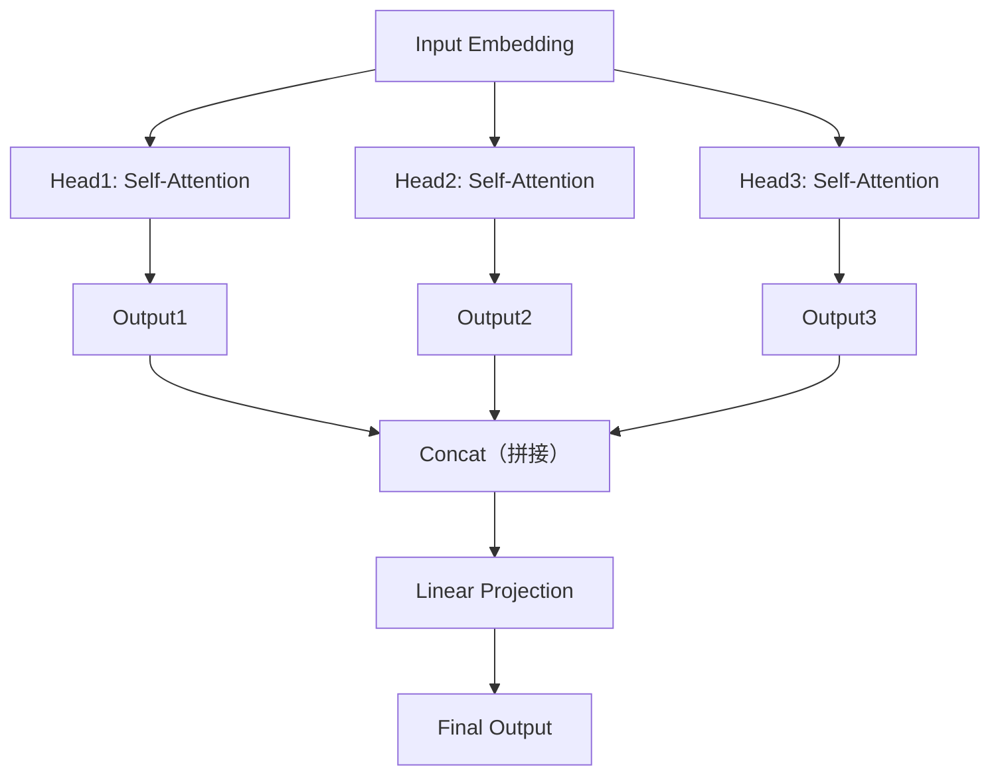

# 10.9 为什么需要 Multi-Head Attention？

上一节，我们学习了 Self-Attention，每一个 Token 都会查看整个句子，得到 Attention Matrix，看起来问题已经解决了。那么 Transformer 为什么还要提出 **Multi-Head Attention（多头注意力）**？

---

# 一个 Head 真的够吗？

看一句话：`Apple released a new iPhone yesterday.`。处理 `Apple` 时，Attention 应该关注谁？可能是 `released`（主谓关系），也可能是 `iPhone`（公司与产品的关系），甚至可能是 `yesterday`（时间关系）。同一个 Token，到底应该关注哪个？答案是：**都应该关注，只是角度不同。**

单个 Head 也可能混合多种模式，但所有匹配与聚合都受限于同一组投影和同一个注意力分布。多个 Head 提供多个并行的表示子空间，使模型能组合更丰富的特征；它们不保证与“主谓”“时间”等人工概念一一对应。

---

# 一个生活中的例子

分析一场足球比赛：教练关注球员站位，解说员关注比赛节奏，裁判关注犯规，球迷关注进球——大家看的是同一场比赛，但关注点完全不同。如果把四个人的信息综合起来，是不是比一个人的分析更全面？这就是 Multi-Head Attention 的思想。

---

# Multi-Head 是怎么工作的？

Transformer 不是重复计算同一个 Attention，而是让每一个 Head 拥有不同的参数：



Key 和 Value 同样使用各 Head 的投影参数。不同 Head 因而可以形成不同的注意力分布和输出特征，但不会预先指定为“语法 Head”或“时间 Head”。

设输入 `X` 的形状为 `(B, T, d_model)`，Head 数为 `H`，通常令 `d_head = d_model / H`：

```
Q, K, V: (B, T, d_model)
reshape + transpose: (B, H, T, d_head)
scores = Q @ Kᵀ / √d_head: (B, H, T, T)
head_output = softmax(scores) @ V: (B, H, T, d_head)
concat: (B, T, H·d_head) = (B, T, d_model)
final = concat @ W_O: (B, T, d_model)
```

---

# 每个 Head 都执行一套 Scaled Dot-Product Attention

每个 Head 都执行 `Q_h K_hᵀ / √d_head → Softmax → 加权 V_h`，但它只处理总通道的一部分。`H` 个结果沿特征维拼接，再经过输出投影 `W_O` 融合；因此不能简单把一个 Head 等同于一种人类命名的语言关系。

10.7 节的二维矩阵是人工 Embedding 与单位投影得到的教学结果，不是训练出的 Head。真实多头模型会用各自的可学习投影产生多张权重矩阵，可能呈现不同偏好，也可能存在冗余。



每一个 Head 都可以学习不同的关注模式，最终模型把所有 Head 的理解融合起来，形成更丰富的表示。

---

# Multi-Head Attention 的作用

相较单头，Multi-Head Attention 为相同输入提供多组独立投影与注意力分布，再通过 `W_O` 联合这些子空间。它增加了表示容量，但具体收益由训练决定；不能保证每个 Head 都形成清晰、互不重叠的人类可解释功能。

---

# 本节总结

本节，我们理解了：✅ 每个 Head 在一个子空间执行 Scaled Dot-Product Attention ✅ 多头张量从 `(B,H,T,d_head)` 拼接回 `(B,T,d_model)` ✅ 不同 Head 可以形成不同或冗余的模式 ✅ 输出投影 `W_O` 负责融合各 Head

到这里，Transformer 的两个核心创新已经全部出现：Self-Attention（每个 Token 都能看到整个上下文）与Multi-Head Attention（从多个不同角度理解上下文）。

---

# 下一节预告

现在我们已经拥有了Embedding、Positional Encoding、Self-Attention、Multi-Head Attention。但 Transformer 并不仅仅只有 Attention，Attention 后面还有两个模块：`Multi-Head Attention → Add & LayerNorm → Feed Forward Network（FFN）→ Add & LayerNorm`。为什么Attention 后面还需要一个看起来很普通的 MLP？下一节，我们将学习 **Feed Forward Network（FFN）**，看看为什么每一个 Token 在完成信息交流之后，还需要进行一次独立的深度加工。
