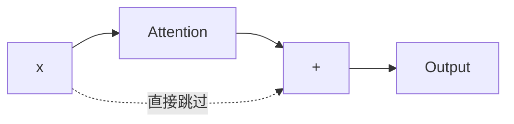
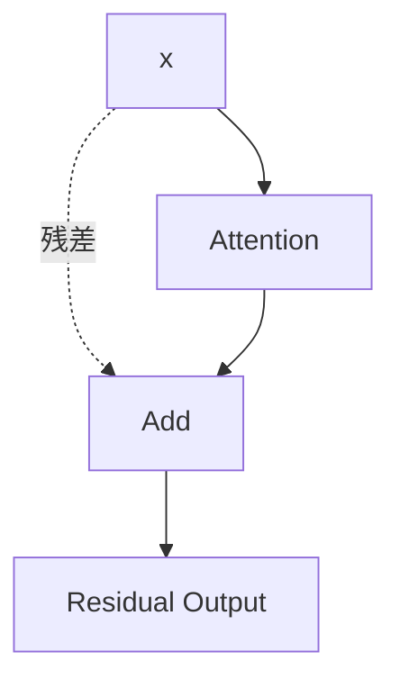
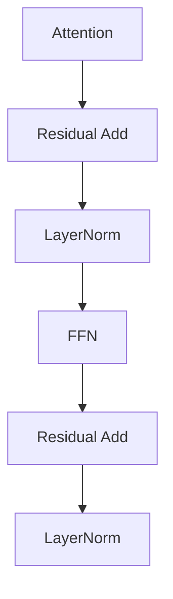
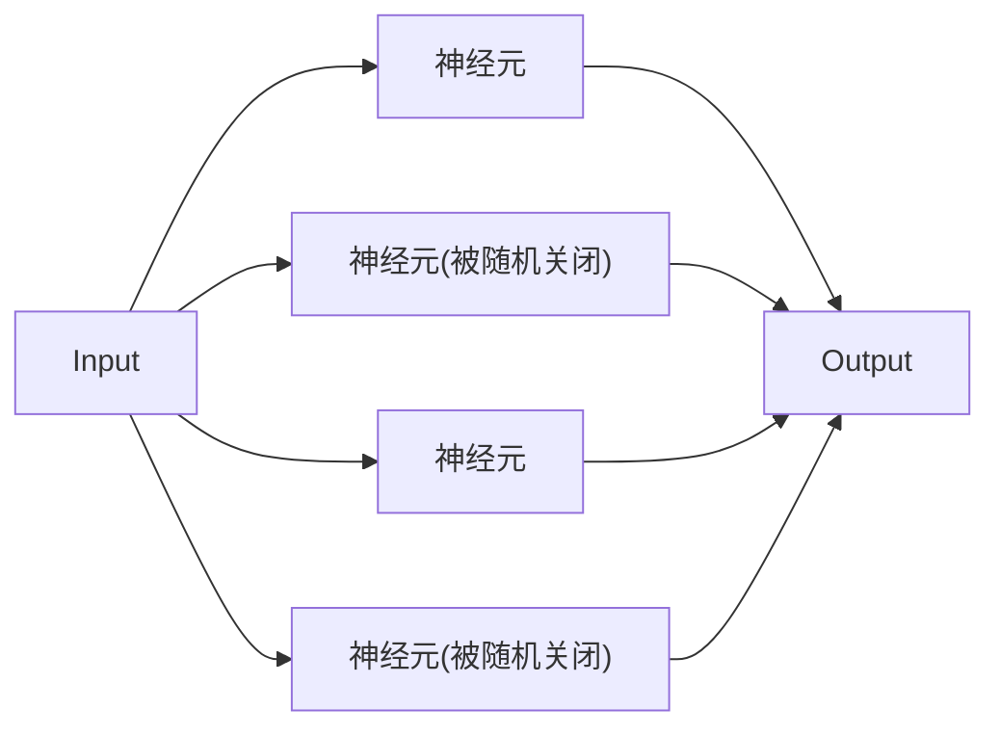
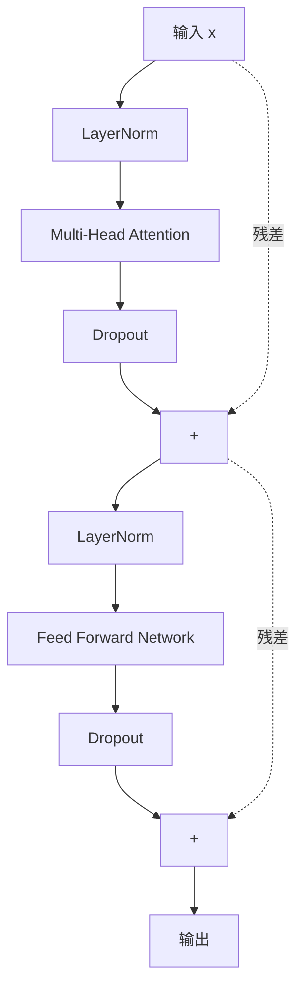
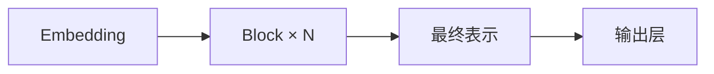

# 11. Transformer Block

## 为什么只有 Attention 还不够？

第 10 章的 Attention 解决的是 **Token 之间的信息交换**：每个位置根据相关性，从其他位置聚合信息。但聚合完成后，每个 Token 还需要对自己的表示做一次非线性变换，才能形成新的特征组合。这个任务由 **Feed Forward Network（FFN）** 完成。

二者分工明确：

- Attention：跨 Token 读取和聚合信息；
- FFN：对每个 Token 的向量独立进行非线性加工。

FFN 对所有位置使用同一组参数，但各位置分别计算，因此也叫 **Position-wise Feed Forward Network**。

---

## Feed Forward Network（FFN）

FFN 本质上是第4章 MLP 的直接应用：`Embedding → Linear → 激活函数 → Linear → 新表示`。它通常先升维，再经过非线性激活，最后降回原维度。

**示例：一个 Token 的加工过程。**

```python
import torch

x = torch.randn(4)  # 一个 Token 的向量
linear1 = torch.nn.Linear(4, 8)
hidden = linear1(x)
print(hidden.shape)         # torch.Size([8])
```

Transformer 首先把维度扩大（例如 4 → 8）。为什么？因为更大的空间能够表示更复杂的组合关系——如果一直保持二维空间，模型能表达的关系非常有限；扩展到八维，模型就可以自动组合出"颜色×速度"、"颜色×时间"等更多隐藏特征。因此 FFN 第一步通常是**升维**。

仅仅 Linear 还不够，因为两个 Linear 连续计算仍然等价于一个更大的 Linear，无法学习复杂关系。因此中间必须加入激活函数：`Linear → GELU → Linear`。现代 Transformer 大多数使用 GELU，而不是 ReLU。

Attention 输入例如 768 维，Transformer 希望输出仍然保持 768 维，这样下一层才能继续处理。因此 FFN 通常采用"先扩展、再压缩"：`768 → 3072 → 768`。

**示例：一个真正的 FFN。**

```python
import torch.nn as nn

ffn = nn.Sequential(
    nn.Linear(768, 3072),
    nn.GELU(),
    nn.Linear(3072, 768)
)
```

整个 FFN 只有三层，却承担了 Transformer 一半以上的计算量。

**FFN 为什么占用大量参数和计算？** 对标准 Transformer，Attention 的投影通常包含 Q、K、V、O 四个 `d_model×d_model` 矩阵；采用 `d_ff≈4d_model` 的普通 FFN，则有两个约为 `d_model×4d_model` 的矩阵。忽略偏置时，FFN 参数量约为 `8d_model²`，Attention 投影约为 `4d_model²`，因此 FFN 往往是参数和计算的重要来源。具体比例会随 SwiGLU、GQA、MoE 等结构变化，不能只用一个固定百分比概括。

Attention 负责建立关系，FFN 负责学习复杂映射，二者缺一不可：删除 Attention，模型失去上下文能力；删除 FFN，模型表达能力大幅下降。Transformer 实际上是在不断重复"交流 → 思考 → 交流 → 思考"，直到完成整个推理。

**本节小结**：✅ FFN 本质上就是一个 MLP ✅ 每个 Token 独立经过同一个 FFN ✅ FFN 的结构通常是：Linear → GELU → Linear ✅ FFN 采用"升维→非线性→降维"的设计 ✅ FFN 负责信息加工，而不是信息交流

---

## 为什么需要 Residual Connection（残差连接）？

Transformer Block 已经拥有 `Attention → FFN`，看起来可以不断堆叠：`Attention → FFN → Attention → FFN → ……`。是不是层数越多，模型越聪明？答案并没有那么简单。

假设你已经训练好一个 Transformer，老板说"再加20 层"，新模型一定更好吗？很多人会说当然，因为层数更多表达能力更强。但真正训练时，结果经常相反——模型不仅没有更好，反而更难训练，甚至准确率下降。为什么？

一个类比：100 个人传话，第一位说"今天下午两点开会"，传到最后可能变成"今天晚上开会"。信息在不断传递过程中会慢慢发生变化。神经网络也是一样：`x → F₁(x) → F₂(F₁(x)) → F₃(...) → ...`，如果有 100 层，最开始的信息还能保留下来吗？越来越困难。

**一个更严重的问题：梯度消失。** 训练需要反向传播，梯度必须从最后一层一路传回第一层。如果每一层都乘上一个较小的数字（例如 0.9），100 层以后梯度几乎变成 0，第一层几乎收不到任何更新——这就是 **Vanishing Gradient（梯度消失）**。

**一个大胆的想法：修一条高速公路。** 既然信息容易丢失，为什么不给它增加一条捷径？



这样原始信息可以直接传到最后，不会丢失。

**示例：有捷径和没有捷径。**

```python
x = 10
f = x * 0.9  # 假设网络做了一点修改

print(f)             # 9，没有残差
print(x + f)# 19，加入残差后，原始信息被保留
```

**Residual 到底提供了什么？** 对残差块 `y=x+F(x)`，分支 `F` 学习的是相对输入 `x` 的增量。若某层暂时不需要明显修改表示，令 `F(x)` 接近 0 就能近似保留输入。残差结构因此为恒等映射提供了更容易优化的路径，但它并不保证“增加层数一定无害”；更深的网络仍受初始化、归一化、优化器和数据规模影响。

为什么Residual 更容易训练？学习"输出=x"和学习"输出=x+Δ"哪个更容易？第二个容易得多，因为什么都不用做时，模型只需要 `Δ=0`。这也是 **Residual Learning（残差学习）** 名字的来源。

## 💡 残差连接的梯度为什么"免费"？(Karpathy nanoGPT 视频)

设残差块输出 $y = x + f(x)$，反向传播时：

$$
\frac{\partial L}{\partial x} = \frac{\partial L}{\partial y} \cdot \frac{\partial y}{\partial x}
= \frac{\partial L}{\partial y} \left(1 + \frac{\partial f}{\partial x}\right)
= \frac{\partial L}{\partial y} + \frac{\partial L}{\partial y}\frac{\partial f}{\partial x}
$$

其中 $\partial L/\partial y$ 这一项**原封不动**地穿过加法（加法的导数是恒等 1），形成一条"梯度高速公路"——无论网络多深，梯度至少能沿这条捷径无损传回浅层，不会因连乘而消失。这就是深层 Transformer 能稳定训练的核心原因之一。

**GPT 风格初始化**（nanoGPT 的实现）：所有参数初始化 $\sim \mathcal{N}(0, 0.02)$，**每个残差块的输出投影层再额外乘 $\frac{1}{\sqrt{2 \cdot n_{layer}}}$**：

```python
std = 0.02 / math.sqrt(2 * n_layer)   # n_layer 是 Transformer Block 的数量
nn.init.normal_(block.mlp.c_proj.weight, mean=0.0, std=std)
```

原理：$n_{layer}$ 个残差块的梯度累加后，方差会随层数增长，乘 $1/\sqrt{2n_{layer}}$ 把整体方差压回 $\mathcal{O}(1)$——与 10.2 节"除以 $\sqrt{d_k}$"是同一个"方差守恒"思路。

Transformer 每完成一个模块都会执行 `x → Attention → + → Residual Output`，然后进入 FFN，同样是 `x → FFN → + → Output`。因此每一个 Block 实际上都有两条高速公路：一条给 Attention，一条给 FFN。



Attention 并不是替代原来的信息，而是在原来的基础上不断补充、不断修正。

**本节小结**：✅ 深层网络容易训练困难 ✅ 信息和梯度都会在多层传播中逐渐衰减 ✅ Residual 为信息提供了一条"高速通道" ✅ Transformer 学习的是"增量修改"，而不是完全重写。一句话：**保留已有知识，再逐步修正。**

---

## 为什么需要 Layer Normalization（层归一化）？

Residual Connection 让 Transformer 终于能够稳定地训练几十层甚至上百层。但新的问题又出现了。

假设输入 `x=10`，经过 Attention 输出 12，经过 FFN 输出 18，再经过 Attention 输出 31，FFN 输出 52……数字越来越大（也可能越来越小，例如 `10→6→2→0.3→0.01`）。那么下一层应该如何学习？

深层网络训练时，不同层的激活尺度可能相差很大；残差不断叠加后，数值也可能逐层放大或缩小。尺度不稳定会让梯度和优化过程更难控制。早期文献常用 **Internal Covariate Shift（内部协变量偏移）**解释归一化的作用，但今天更稳妥的说法是：归一化约束激活尺度、改善数值条件并稳定梯度，从而让深层网络更容易优化。

**一个大胆的想法：每层都重新整理。** 既然每一层输出的数据范围都不同，为什么不每经过一层都重新整理一下？例如 `[103,105,101,104]` 整理成 `[-1.2,0.6,-1.8,0.4]`——数值改变了，但大小关系仍然保持，下一层学习起来会更轻松。

**什么是 Normalization？** Normalization（归一化）可以理解成：**把数据重新调整到一个更稳定、更容易学习的范围**。模型并没有丢失"谁最大、谁最小"这些信息，只是把尺度重新统一了。

**示例：体验归一化。**

```python
import torch

x = torch.tensor([100.0, 120.0, 140.0])
layernorm = torch.nn.LayerNorm(3)
print(layernorm(x))  # 例如 tensor([-1.22, 0.00, 1.22])
```

最大的仍然最大，最小的仍然最小，只是数据范围更加稳定。

**为什么叫 Layer Normalization？** 很多人容易把它和 Batch Normalization 混淆。最大区别是：BatchNorm 会比较不同样本（样本1、样本2、样本3一起计算均值和方差）；而 LayerNorm 只关心**当前 Token 自己的向量**，只对这一组数字进行归一化，不参考其他 Token，也不参考 Batch 中其他句子。因此 Transformer 才能很好地处理不同长度、不同 Batch，甚至推理阶段只有一个样本的情况。

**Residual 和 LayerNorm 为什么总是在一起？** Transformer Block 几乎都是 `Attention → Add → LayerNorm`。Residual 负责把旧信息和新信息相加，但相加后数值范围可能发生明显变化（例如旧信息 `[1.2,0.7,0.5]`，新信息 `[4.8,-2.3,1.9]`，相加后 `[6.0,-1.6,2.4]`）。于是 LayerNorm 马上接手，重新调整，让下一层继续处理。



LayerNorm 真正的重要作用不是让模型更聪明，而是**让训练过程更加稳定**，可以支持几十层、几百层甚至上千层。Transformer 能够不断变深，LayerNorm 功不可没。

**本节小结**：✅ 深层网络的数据分布会不断变化 ✅ LayerNorm 会重新整理每一层的输出 ✅ 它不会改变数据的相对关系，只会调整数据范围 ✅ LayerNorm 与 Residual 通常配合使用。一句话：**Residual 保证信息能够传下去，LayerNorm 保证信息能够稳定地传下去。**

---

## 为什么需要 Dropout？

Transformer Block 已经拥有 Multi-Head Attention、FFN、Residual、LayerNorm，模型已经非常完整。但训练时经常出现一个问题：**模型在训练集上表现很好，换到没见过的数据上却突然变差。** 这种现象叫 **Overfitting（过拟合）**。

一个类比：假设一个学生只背了课本上的10道例题，考试时如果原题重现，他能考100分；但只要换一道新题，他就完全不会做。这个学生并没有真正理解知识，只是记住了答案。神经网络也会出现同样的问题：如果参数量足够大，模型可能会"记住"训练数据里的每一个细节，而不是学习真正的规律。

**为什么会发生过拟合？** 模型中的某些神经元，可能会过度依赖另一些特定的神经元，形成一种"惯性组合"，只对训练数据有效。例如某三个神经元总是一起激活，只要凑齐这个组合，模型就直接给出训练时见过的答案，而不是重新推理。

**一个大胆的想法：训练时故意"捣乱"。** 既然模型会过度依赖某些固定组合，那么训练过程中随机"关闭"一部分神经元会怎样？



因为每次训练，关闭的神经元都不一样，模型没有办法始终依赖某一个固定组合，只能学习更通用的规律。这就是 **Dropout**。

**示例：体验 Dropout。**

```python
import torch

x = torch.tensor([1.0, 1.0, 1.0, 1.0, 1.0])
dropout = torch.nn.Dropout(p=0.4)  # 随机关闭 40% 的神经元

print(dropout(x))
# 可能输出：tensor([1.67, 0.00, 1.67, 1.67, 0.00])
```

多运行几次，你会发现每次被关闭的位置都不一样。

**为什么剩下的数字变大了？** 假设关闭 40% 的神经元，如果不做任何调整，总体信号强度会减少 40%。为了保持训练稳定，PyTorch 会自动放大剩下的神经元（除以 `1-p`），确保输出总量基本保持不变。这也是为什么示例中 `1.0` 变成了 `1.67`（约等于 `1/(1-0.4)`）。

**Dropout 只在训练时使用。** 推理阶段（Inference）不会使用 Dropout，因为预测时应该使用模型的全部能力，而不是随机关闭。因此几乎所有框架都会区分：

```python
model.train()  # 训练模式，Dropout 生效
model.eval()   # 推理模式，Dropout 不生效
```

Transformer 几乎每个模块后面都会加一次 Dropout：Attention Weight 计算完成后、FFN 输出后、Embedding 输出后……目的都一样：**防止某个模块的输出被过度依赖**。

**本节小结**：✅ 过拟合：模型记住答案，而不是学会规律 ✅ Dropout 会在训练时随机关闭部分神经元 ✅ 目的是防止模型依赖固定的神经元组合 ✅ Dropout 只在训练阶段生效，推理阶段会关闭。一句话：**Dropout 通过"随机制造缺陷"，逼迫模型学习更鲁棒、更通用的规律。**

---

## 一个完整的 Transformer Block

前面几节，我们已经分别学习了 Multi-Head Attention（信息交流）、Feed Forward Network（独立思考）、Residual Connection（保留原始信息）、Layer Normalization（稳定训练）、Dropout（防止过拟合）。本节，我们将把它们正式组装成一个完整的 **Transformer Block**。

**完整结构：**



整个 Block 可以概括为两句话：

```
x = x + Dropout(Attention(LayerNorm(x)))
x = x + Dropout(FFN(LayerNorm(x)))
```

**为什么 LayerNorm 放在前面？** 这种写法叫 **Pre-LayerNorm**（先归一化，再计算），是现代 GPT、LLaMA 普遍采用的方式，相比早期 Transformer 论文中的 Post-LayerNorm（先计算，再归一化）训练更加稳定，尤其是在层数很深的时候。本书不深入比较两者差异，只需记住：现代大模型基本都采用 Pre-LayerNorm。

理论上，一个 Pre-LayerNorm Block 的前向过程就是：

```text
attention_output = Attention(LayerNorm(x))
x = x + Dropout(attention_output)
ffn_output = FFN(LayerNorm(x))
x = x + Dropout(ffn_output)
```

标准 Transformer Block 保持输入输出 Shape `(batch, seq_len, d_model)` 不变，因此多个 Block 可以顺序堆叠。实际可堆叠的深度受到显存、计算量、训练稳定性和数据规模约束。完整的 PyTorch 类定义、Causal Mask 和训练循环统一放在 11.1 节实践中，避免在理论章和实践章重复实现同一个类。

## 进入 Mini GPT 实践前：位置信息

Self-Attention 根据 Token 内容计算关联，但公式本身没有位置编号。更准确地说：不加入位置编码时，如果输入 Token 的排列发生相同置换，输出也会跟着发生同样置换；这种性质叫**排列等变（Permutation Equivariance）**。模型因此无法仅凭 Attention 判断一个 Token 原来位于第几个位置。

语言顺序会改变含义，所以完整 GPT 必须注入位置信息。11.1 节先采用最简单的**可学习绝对位置向量**：

```text
模型输入 = Token Embedding + Position Embedding
```

位置 `0,1,2,...` 各自对应一个可训练向量，与同位置的 Token Embedding 相加。第 12 章再系统比较正弦位置编码和现代模型常用的 RoPE。

## 进入 Mini GPT 实践前：Causal Mask

第 10 章为了讲清 Attention，默认每个 Token 都能查看整个输入序列。但 GPT 做 Next Token Prediction 时，位置 `t` 只能使用 `t` 及其左侧的 Token；如果训练时看到右侧未来 Token，就等于提前看到答案。

**Causal Mask（因果掩码）**会把 Attention Score 矩阵中“看向未来”的位置屏蔽掉：

```text
          Key位置
          0   1   2   3
Query 0   ✓   ×   ×   ×
Query 1   ✓   ✓   ×   ×
Query 2   ✓   ✓   ✓   ×
Query 3   ✓   ✓   ✓   ✓
```

实现时通常在 Softmax 之前，把被屏蔽位置的 Score 设为 `-∞`；经过 Softmax 后，这些位置的权重变成 0。这样，训练阶段可以并行计算整段序列，同时保持“只能根据过去预测未来”的因果约束。11.1节会把这个 Mask 接进 `MultiheadAttention`；第 14 章讨论 Transformer 家族时再比较 Encoder 的双向 Attention 与 Decoder 的 Causal Attention。

**堆叠多个 Block。** 一个 Transformer Block 只完成一次"交流 + 思考"。GPT-3 堆叠了 96 层，LLaMA-2 70B 堆叠了 80 层。每多堆叠一层，模型就能学习更深层次的语言规律：浅层可能学习词法、语法，深层可能学习逻辑推理、常识、上下文关联。



不过，这里拼出来的 Transformer Block，用的还是最"朴素"的版本：位置信息还没有讲、LayerNorm 而不是更现代的 RMSNorm、FFN 用的是 GELU 而不是现在更主流的 SwiGLU，Multi-Head Attention里每个 Head 也都有自己独立的 K、V。下一章，我们就来看看：从 2017 年的原始 Transformer 到今天的 GPT、LLaMA、Qwen，这个 Block 到底经历了哪些改造。

**本章总结：Transformer Block 完整清单**

| 组件 | 作用 |
|------|------|
| Multi-Head Attention | 让每个 Token 从多个角度收集上下文信息 |
| Residual Connection | 保留原始信息，避免深层网络退化 |
| Layer Normalization | 稳定每一层的数据分布 |
| Feed Forward Network | 对每个 Token 独立进行非线性加工 |
| Dropout | 防止模型过度依赖固定神经元组合 |

至此，我们已经完整拼出了现代 Transformer 最核心、最基础的构建单元——**Transformer Block**。GPT、BERT、LLaMA、Qwen，几乎所有现代大语言模型，本质上都是由大量这样的 Block 堆叠而成。

不过，本章目前只完成了"能跑通 forward"，还从来没有真正训练过、也没有生成过一个字。下一节，我们将用这个 `TransformerBlock` 从零训练一个真正能生成文字的 Mini GPT：**11.1 从零训练 Mini GPT**。

---

# 参考资料

- Andrej Karpathy《Neural Networks: Zero to Hero》系列（micrograd / makemore / Let's build GPT / nanoGPT）：https://www.youtube.com/@AndrejKarpathy
- 李宏毅《机器学习》（Self-Attention / Transformer 经典入门讲解）：https://space.bilibili.com/3546866876680925
- Sebastian Raschka《Build a Large Language Model (From Scratch)》配套代码与全书资源：https://github.com/rasbt/LLMs-from-scratch
