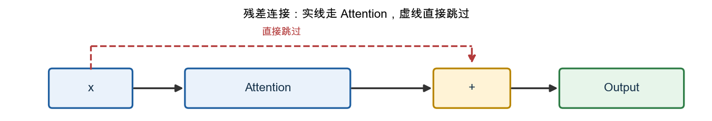
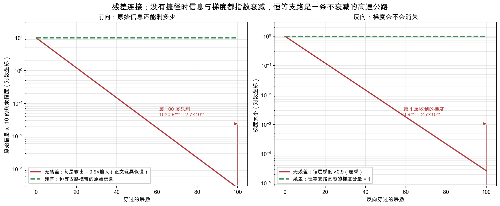
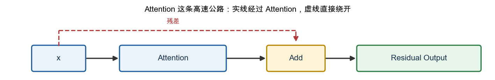
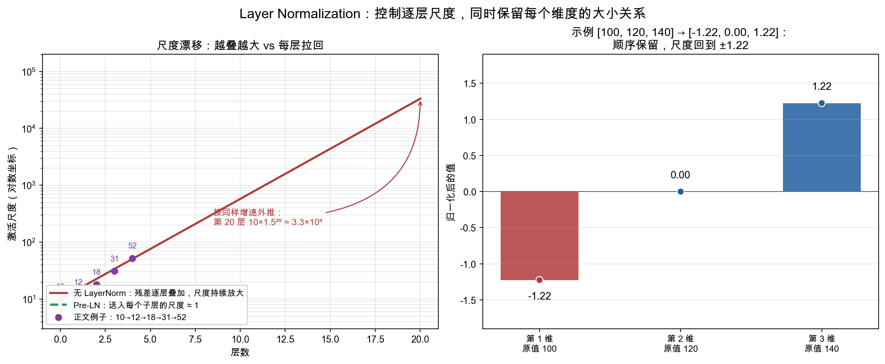
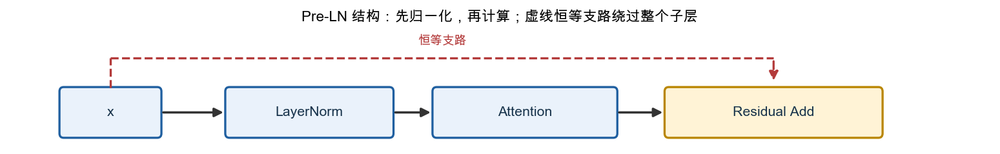
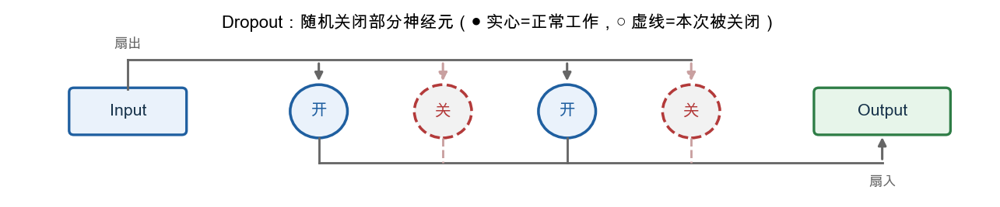
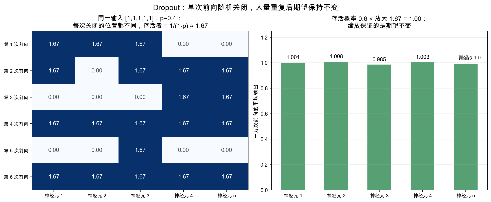
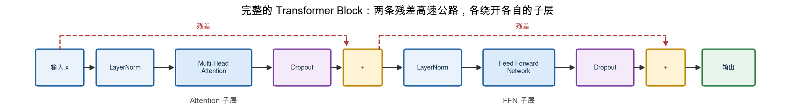
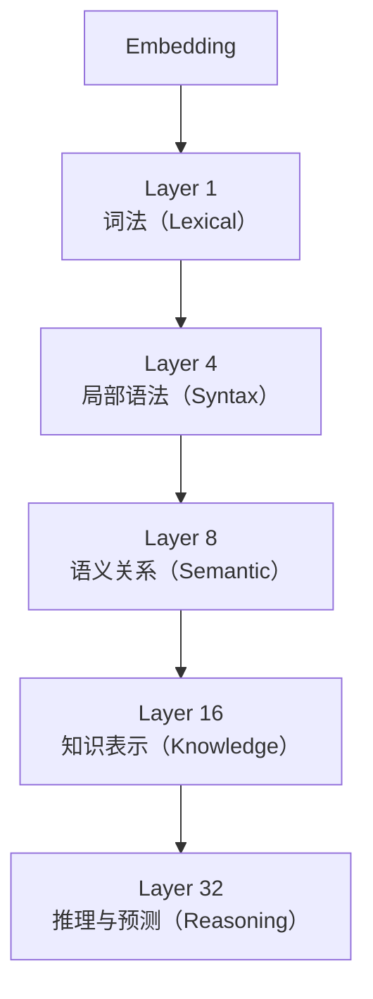

# 11. Transformer 结构与层堆叠

> **本章目标**
>
> 第 10 章讲完了注意力机制（Attention）：每个词元（Token）能够跨位置读取、聚合别的词元信息。但注意力机制只完成了"信息交流"这一半，Transformer 真正的最小可堆叠单元还差几个零件：让每个词元独立"消化"信息的前馈网络（FFN）、防止深层网络退化的残差连接（Residual Connection）、稳定数值尺度的层归一化（Layer Normalization）、抑制过拟合的随机失活（Dropout）。本章会依次讲清这四个零件为什么必须存在，组装成一个完整的 Transformer 模块（Transformer Block），接入位置信息与因果掩码；随后回答更根本的问题——为什么要把它堆叠几十上百层、每一层到底在学什么（表示学习）。理论之后，11.1 节从零训练一个 nanoGPT，11.2 节把每一层的表示"挖"出来验证层次化结论。

---

## 一、为什么只有 Attention 还不够？

第 10 章的 Attention 解决的是 **Token 之间的信息交换**：每个位置根据相关性，从其他位置聚合信息。但聚合完成后，每个 Token 还需要对自己的表示做一次非线性变换，才能形成新的特征组合。这个任务由 **前馈网络（Feed Forward Network，FFN）** 完成。

二者分工明确：

- Attention：跨 Token 读取和聚合信息；
- FFN：对每个 Token 的向量独立进行非线性加工。

FFN 对所有位置使用同一组参数，但各位置分别计算，因此也叫 **Position-wise Feed Forward Network**。这和第 9 章 RNN 的 Parameter Sharing 是同一类思想：不管当前是序列里第几个 Token，都用同一套权重处理——只是 RNN 共享的是"跨时间步"，FFN 共享的是"跨序列位置"。

---

## 二、Feed Forward Network（FFN）

### FFN 的输入是什么？

FFN 的输入是**Attention 的输出**。一个 Block 内部的数据流是 `x → Attention → FFN`：Attention 先让每个 Token 从别的 Token 那里取回信息（交流），得到的新向量才送进 FFN 做加工（思考）。两者处理的其实是**同一批 Token**，区别只在处理方式：Attention 做的是 **Token 之间**的交互（每个 Token 的表示会融合其他 Token 的信息），FFN 做的是**逐 Token 独立**的变换（同一套参数作用于每个位置，Token 之间互不交流）。Attention 的具体计算第 10 章已经讲透，这里只需记住：**FFN 拿到的是 Attention 算完之后的输出，其余内部量都不会传过来**。

### FFN 本质就是一个 MLP

FFN 是第 4 章 MLP 的直接应用：`输入表示 → Linear → 激活函数 → Linear → 新表示`。它通常先升维，再经过非线性激活，最后降回原维度。

**示例：一个 Token 的加工过程。**

```python
import torch

x = torch.randn(4)  # 一个 Token 的向量
linear1 = torch.nn.Linear(4, 8)
hidden = linear1(x)
print(hidden.shape)         # torch.Size([8])
```

Transformer 首先把维度扩大（例如 4 → 8）。为什么？因为更大的空间能够表示更复杂的组合关系——如果一直停留在四维这样的低维空间，模型能表达的关系非常有限；扩展到八维，模型就可以自动组合出"颜色×速度"、"颜色×时间"等更多隐藏特征。因此 FFN 第一步通常是**升维**。

仅仅 Linear 还不够，因为两个 Linear 连续计算仍然等价于一个更大的 Linear，无法学习复杂关系。因此中间必须加入激活函数：`Linear → GELU → Linear`。现代 Transformer 大多数使用 GELU，而不是 ReLU。

每个 Token 的向量例如是 768 维（GPT-2 Small），Transformer 希望经过 FFN 后输出仍然保持 768 维，这样下一层才能继续处理。因此 FFN 通常采用"先扩展、再压缩"：`768 → 3072 → 768`。

**示例：一个真正的 FFN。**

```python
import torch.nn as nn

ffn = nn.Sequential(
    nn.Linear(768, 3072),
    nn.GELU(),
    nn.Linear(3072, 768)
)
```

整个 FFN 只有两个 Linear 层（中间夹一个激活函数），却承担了 Transformer 一半以上的计算量。

### FFN 为什么是 Transformer 的参数大户？

FFN 只有两个 Linear，参数却不少：`d_model` 是 Token 的向量维度，`d_ff` 是 FFN 中间隐藏层的维度（升维后的宽度，即上一段 `768 → 3072 → 768` 里的 3072）。每个矩阵是 `d_model×d_ff`，两个矩阵合计 `2×d_model×d_ff`；经典 Transformer 通常取 `d_ff≈4d_model`（4 倍是经验默认值，不是硬性规定），代入就是约 `8d_model²`。以 GPT-2 Small 的 `d_model=768` 为例，`8×768² ≈ 470 万`，是单层里参数最多的部分，甚至超过 Attention 全部投影参数的总和。所以常有人说"Transformer 的重量级选手是 FFN"；具体比例会随 SwiGLU、GQA、MoE 等结构变化，不能只用一个固定百分比概括。

Attention 负责建立关系，FFN 负责学习复杂映射，二者缺一不可：删除 Attention，模型失去上下文能力；删除 FFN，模型表达能力大幅下降。Transformer 实际上是在不断重复"交流 → 思考 → 交流 → 思考"，直到完成整个推理。

**本节小结**：✅ FFN 的输入是 Attention 处理后的 Token 表示，不是原始 Embedding ✅ FFN 本质上就是一个 MLP ✅ 每个 Token 独立经过同一个 FFN ✅ FFN 的结构通常是：Linear → GELU → Linear ✅ FFN 采用"升维→非线性→降维"的设计 ✅ FFN 负责信息加工，而不是信息交流 ✅ FFN 两个矩阵约 `8d_model²`，是单层里的参数大户

---

## 三、为什么需要 Residual Connection（残差连接）？

Transformer Block 已经拥有 `Attention → FFN`，看起来可以不断堆叠：`Attention → FFN → Attention → FFN → ……`。是不是层数越多，模型越聪明？答案并没有那么简单。

假设你已经训练好一个 Transformer，老板说"再加 20 层"，新模型一定更好吗？很多人会说当然，因为层数更多表达能力更强。但真正训练时，结果经常相反——模型不仅没有更好，反而更难训练，甚至准确率下降。为什么？

一个类比：100 个人传话，第一位说"今天下午两点开会"，传到最后可能变成"今天晚上开会"。信息在不断传递过程中会慢慢发生变化。神经网络也是一样：`x → F₁(x) → F₂(F₁(x)) → F₃(...) → ...`，如果有 100 层，最开始的信息还能保留下来吗？越来越困难。

**一个更严重的问题：梯度消失。**（梯度消失与爆炸的连乘本质在第 7 章已建立、第 9 章 RNN 又详细展开过，这里只回顾与"层数变深"直接相关的一点。）训练需要反向传播，梯度必须从最后一层一路传回第一层。如果每一层都乘上一个较小的数字（例如 0.9），100 层以后梯度几乎变成 0，第一层几乎收不到任何更新——这就是 **Vanishing Gradient（梯度消失）**。

**一个大胆的想法：修一条高速公路。** 既然信息容易丢失，为什么不给它增加一条捷径？

在往下看图之前，先把两个最容易看晕的符号说清楚——**它们其实都不是什么新概念**：

- **`x`**：就是"进入这一步之前的数据"。可以简单理解成一个 Token 当前手里拿着的那份"稿子"。
- **`+`**：就是加法本身，图上专门画一个方框，只是为了让你看清楚"两份东西是在这里被加在一起的"，它不代表任何新的计算模块。

也就是说，一个 Token 的稿子会走两条路：**一条送去给 Attention 修改，另一条原封不动直接送到终点**；到了终点，这两份稿子会加在一起，谁也不会被扔掉。图里的虚线，画的就是"原封不动"这条路：



生成脚本见 [`residual_shortcut_diagram.py`](./assets/residual_shortcut_diagram.py)。

图里三个元素对应关系非常直接：`x` 是稿子本身；`Attention` 是"修改意见"；`+` 是"把稿子和修改意见叠在一起"，而不是"用修改意见替换掉稿子"。这样原始信息可以直接传到最后，不会丢失。

**示例：用具体数字走一遍这张图。**

```python
x = 10         # 图里的 x：进来的稿子，这里就取一个具体数字方便计算
f = x * 0.9    # 图里的 Attention：对稿子做了一点"修改"，算出结果 9

print(f)       # 9   —— 如果没有虚线（没有残差），最终只会剩下这个"修改意见"
print(x + f)   # 19  —— 加上虚线（有残差）以后，"稿子"和"修改意见"都在，19 = 10 + 9
```

**对照一下：** `f` 就是图里 `Attention` 方框算出来的东西；`x + f` 这一步，就是图里那个 `+` 方框在做的事——原始的 `10`（虚线传过来的）和修改出来的 `9`（实线传过来的）加在一起，才是最终的 `19`。没有残差时，`Attention` 的输出会直接**替换**掉原来的 `x`（结果只剩 `9`，原始的 `10` 彻底丢了）；有了残差，`Attention` 只是在原有的 `x` 上**追加**一个修改量（结果是 `19`，`10` 和 `9` 都还在）。

把"没有捷径 vs 有捷径"放到 100 层的链条上看（纵轴取对数，才能同时看到两种数量级）：



**左图（前向）**：无残差的链条每层把输入改写成 `0.9×输入`，原始信息 `x=10` 传到第 100 层只剩 `10×0.9¹⁰⁰ ≈ 2.7×10⁻⁴`——这就是"100 个人传话"在数字上的样子；而恒等支路让原始的 10 一路直通，每一层都完整保留（上面 `19 = 10 + 9` 里的那个 10）。**右图（反向）**：梯度逐层连乘，无残差时传回第 1 层只剩 `0.9¹⁰⁰ ≈ 2.7×10⁻⁵`，梯度消失；而 `y = x + F(x)` 对 `x` 求导得到 `1 + ∂F/∂x`，其中那个 `1` 来自恒等支路、不经过任何连乘——这就是梯度的高速公路。生成脚本见 [`residual_identity_path.py`](./assets/residual_identity_path.py)。

**Residual 到底提供了什么？** 换成前面"稿子 + 修改意见"的说法就很好懂：每一层不再需要自己从头写一份新稿子，只需要在原稿基础上，决定"要不要改、改多少"。如果某一层觉得当前稿子已经不错，不需要大改，它只要让自己的"修改意见"趋近于 0（什么都不改），稿子就会原样传下去——这比"每层都要重新写一份完整稿子才能保持不变"容易得多。写成公式就是：完整输出 `y = x（原稿） + F(x)（这一层的修改意见）`，`F(x)` 只负责学"改多少"，不负责"从零生成"。当然，这只是让训练变容易，并不保证"层数越加越多就一定没坏处"；网络能不能训好，还要看初始化、归一化、优化器和数据量这些其他因素。

**为什么这样更容易训练？** 拿两个任务对比一下：任务 A 是"让模型学会输出和输入完全一样"；任务 B 是"让模型学会输出 = 输入 + 一点点修改"。任务 A 其实更难——模型要精确地把输入原样照抄一遍才能不出错；任务 B 反而更简单，因为什么都不做（修改意见 = 0）就已经能达到"原样保留"的效果了，模型只需要在真正需要改动的地方，慢慢学出一个不为 0 的修改量。这也是 **Residual Learning（残差学习）** 名字的来源——学的是"改动量"，不是从零学"新稿子"。

### 补充阅读：残差连接的梯度路径

主线只需要记住：`y=x+F(x)` 同时保留原输入和变换后的增量。若继续观察反向传播，Loss 对输入的梯度也会分成两条路径：一条经过恒等支路，一条经过 `F`。

标量情形可以写为：

```math
\frac{\partial L}{\partial x}
=
\frac{\partial L}{\partial y}
+
\frac{\partial L}{\partial y}\frac{\partial F}{\partial x}
```

**这个公式的作用**：说明残差加法为什么提供了一条不经过 `F` 内部连乘的梯度路径。

- 第一项：经过 `x→y` 恒等支路的梯度；
- 第二项：经过变换分支 `F` 的梯度；
- 向量情况下，`∂F/∂x` 应理解为 Jacobian，正文不要求展开。

这条恒等路径通常改善深层网络的梯度传播，但两条梯度还会相加或抵消，归一化和初始化也会影响数值，因此不能概括为"无论多深都能无损传回"。

一些 GPT 实现还会缩小残差输出投影的初始化标准差，例如：

```python
std = 0.02 / math.sqrt(2 * n_layer)
nn.init.normal_(block.mlp.c_proj.weight, mean=0.0, std=std)
```

这里 `n_layer` 是 Block 数量，缩放用于控制多层残差相加后的激活方差。它属于具体初始化策略，不是理解残差连接前必须掌握的公式。

Transformer 每完成一个模块都会执行 `x → Attention → + → Residual Output`，然后进入 FFN，同样是 `x → FFN → + → Output`。因此每一个 Block 实际上都有两条高速公路：一条给 Attention，一条给 FFN。



生成脚本见 [`residual_highway_diagram.py`](./assets/residual_highway_diagram.py)。

Attention 并不是替代原来的信息，而是在原来的基础上不断补充、不断修正。

**本节小结**：✅ 深层网络容易训练困难 ✅ 信息和梯度都会在多层传播中逐渐衰减 ✅ Residual 为信息提供了一条"高速通道" ✅ Transformer 学习的是"增量修改"，而不是完全重写。一句话：**保留已有知识，再逐步修正。**

---

## 四、为什么需要 Layer Normalization（层归一化）？

Residual Connection 让 Transformer 终于能够稳定地训练几十层甚至上百层。但新的问题又出现了。

假设输入 `x=10`，经过 Attention 输出 12，经过 FFN 输出 18，再经过 Attention 输出 31，FFN 输出 52……数字越来越大（也可能越来越小，例如 `10→6→2→0.3→0.01`）。那么下一层应该如何学习？

深层网络训练时，不同层的激活尺度可能相差很大；残差不断叠加后，数值也可能逐层放大或缩小。尺度不稳定会让梯度和优化过程更难控制。早期文献常用 **Internal Covariate Shift（内部协变量偏移）** 解释归一化的作用，但今天更稳妥的说法是：归一化约束激活尺度、改善数值条件并稳定梯度，从而让深层网络更容易优化。

**一个大胆的想法：每层都重新整理。** 既然每一层输出的数据范围都不同，为什么不每经过一层都重新整理一下？例如 `[103,105,101,104]` 在不考虑可学习仿射参数时，标准化后约为 `[-0.17,1.18,-1.52,0.51]`——均值接近 0、方差接近 1，下一层学习起来会更轻松。

**什么是 Normalization？** Normalization（归一化）可以理解成：**把数据重新调整到一个更稳定、更容易学习的范围**。模型并没有丢失"谁最大、谁最小"这些信息，只是把尺度重新统一了。

**示例：体验归一化。**

```python
import torch

x = torch.tensor([100.0, 120.0, 140.0])
layernorm = torch.nn.LayerNorm(3)
print(layernorm(x))  # 例如 tensor([-1.22, 0.00, 1.22])
```

最大的仍然最大，最小的仍然最小，只是数据范围更加稳定。

把"逐层尺度漂移"和"归一化"的效果画在一起：



**左图**：残差不断叠加增量时，激活尺度逐层放大——紫色点是本节开头的 `10→12→18→31→52`，按同样的增速外推到第 20 层就是 `10×1.5²⁰ ≈ 3.3×10⁴`（注意纵轴是对数坐标）；Pre-LN 结构在每个子层入口做 LayerNorm，把送入 Attention/FFN 的尺度重新拉回 1 附近。**右图**：本节示例的 `[100, 120, 140]` 归一化成 `[-1.22, 0.00, 1.22]`——三个数的大小顺序原样保留，只是尺度从"上百"回到"±1.22"。还要说明一点：Pre-LN 归一化的是送入子层的张量，残差主干本身的尺度仍会随深度缓慢增长，这正是第三节补充阅读里 GPT-2 缩小初始化标准差的原因。生成脚本见 [`layernorm_scale_control.py`](./assets/layernorm_scale_control.py)。

**为什么叫 Layer Normalization？** 先提一句 BatchNorm：它是卷积网络时代的标配，沿**批（Batch）维度**对每个特征在所有样本上求均值方差，因此对 Batch Size 很敏感。很多人容易把它和 Layer Normalization 混淆。最大区别是：BatchNorm 会比较不同样本（样本 1、样本 2、样本 3 一起计算均值和方差）；而 LayerNorm 只关心**当前 Token 自己的向量**，只对这一组数字进行归一化，不参考其他 Token，也不参考 Batch 中其他句子。因此 Transformer 才能很好地处理不同长度、不同 Batch，甚至推理阶段只有一个样本的情况。

**Residual 和 LayerNorm 为什么总是在一起？** Residual 会把旧表示与新增量相加，归一化则帮助控制送入子层或后续层的数值尺度。两者的先后顺序有两种常见结构：原始 Transformer 使用 Post-LN，现代 GPT/LLaMA 更常使用 Pre-LN。本章后续实现采用 Pre-LN：



生成脚本见 [`preln_residual_diagram.py`](./assets/preln_residual_diagram.py)。

纯标准化阶段会保持同一向量中的线性顺序，但实际 LayerNorm 还有逐维可学习的 `γ、β`，训练后不应概括为"永远不改变各维度大小关系"。它的主要作用是改善数值条件和优化稳定性，而不是保证任意深度都能稳定训练。

**本节小结**：✅ 深层网络各层的激活尺度可能相差很大 ✅ 数值会随残差叠加逐层放大或缩小 ✅ LayerNorm 把每个 Token 的向量归一化到均值 0、方差 1 的稳定范围 ✅ 它只针对当前 Token 自己的向量，不跨 Token、不跨样本 ✅ 现代 Transformer 采用 Pre-LN（先归一化再计算）。一句话：**每层都先把尺度整理好，训练才更稳。**

---

## 五、为什么需要 Dropout？

Transformer Block 已经拥有 Multi-Head Attention、FFN、Residual、LayerNorm，模型已经非常完整。但训练时经常出现一个问题：**模型在训练集上表现很好，换到没见过的数据上却突然变差。** 这种现象叫 **Overfitting（过拟合）**。

一个类比：假设一个学生只背了课本上的10道例题，考试时如果原题重现，他能考100分；但只要换一道新题，他就完全不会做。这个学生并没有真正理解知识，只是记住了答案。神经网络也会出现同样的问题：如果参数量足够大，模型可能会"记住"训练数据里的每一个细节，而不是学习真正的规律。

**为什么会发生过拟合？** 模型中的某些神经元，可能会过度依赖另一些特定的神经元，形成一种"惯性组合"，只对训练数据有效。例如某三个神经元总是一起激活，只要凑齐这个组合，模型就直接给出训练时见过的答案，而不是重新推理。

**一个大胆的想法：训练时故意"捣乱"。** 既然模型会过度依赖某些固定组合，那么训练过程中随机"关闭"一部分神经元会怎样？



生成脚本见 [`dropout_neurons_diagram.py`](./assets/dropout_neurons_diagram.py)。

因为每次训练，关闭的神经元都不一样，模型没有办法始终依赖某一个固定组合，只能学习更通用的规律。这就是 **Dropout**。

**示例：体验 Dropout。**

```python
import torch

x = torch.tensor([1.0, 1.0, 1.0, 1.0, 1.0])
dropout = torch.nn.Dropout(p=0.4)  # 随机关闭 40% 的神经元

print(dropout(x))
# 可能输出：tensor([1.67, 0.00, 1.67, 1.67, 0.00])
```

多运行几次，你会发现每次被关闭的位置都不一样。

把多次运行的结果摆在一起看：



**左图**：同样输入 `[1, 1, 1, 1, 1]`、`p=0.4`，六次前向被关闭的位置各不相同——模型没法依赖任何固定组合；每次存活的位置都被放大到 `1/(1-0.4) ≈ 1.67`。**右图**：每个位置重复一万次再取平均，都回到 ≈1.0——缩放保证的是"期望不变"（存活概率 0.6 × 放大 1.67 = 1.00），单次前向仍然是"随机制造缺陷"。生成脚本见 [`dropout_random_mask.py`](./assets/dropout_random_mask.py)。

**为什么剩下的数字变大了？** 假设关闭 40% 的神经元，如果不做任何调整，总体信号强度会减少 40%。为了保持训练稳定，PyTorch 会自动放大剩下的神经元（除以 `1-p`），确保输出总量基本保持不变。这也是为什么示例中 `1.0` 变成了 `1.67`（约等于 `1/(1-0.4)`）。

**Dropout 只在训练时使用。** 推理阶段（Inference）不会使用 Dropout，因为预测时应该使用模型的全部能力，而不是随机关闭。因此几乎所有框架都会区分：

```python
model.train()  # 训练模式，Dropout 生效
model.eval()   # 推理模式，Dropout 不生效
```

Transformer 几乎每个模块后面都会加一次 Dropout：Attention Weight 计算完成后、FFN 输出后、Embedding 输出后……目的都一样：**防止某个模块的输出被过度依赖**。

**本节小结**：✅ 过拟合：模型记住答案，而不是学会规律 ✅ Dropout 会在训练时随机关闭部分神经元 ✅ 目的是防止模型依赖固定的神经元组合 ✅ Dropout 只在训练阶段生效，推理阶段会关闭。一句话：**Dropout 通过"随机制造缺陷"，逼迫模型学习更鲁棒、更通用的规律。**

---

## 六、一个完整的 Transformer Block

前面几节，我们已经分别学习了 Multi-Head Attention（信息交流）、Feed Forward Network（独立思考）、Residual Connection（保留原始信息）、Layer Normalization（稳定训练）、Dropout（防止过拟合）。本节，我们将把它们正式组装成一个完整的 **Transformer Block**。

**完整结构：**



生成脚本见 [`transformer_block_full_diagram.py`](./assets/transformer_block_full_diagram.py)。

整个 Block 可以概括为两句话：

```
x = x + Dropout(Attention(LayerNorm(x)))
x = x + Dropout(FFN(LayerNorm(x)))
```

**为什么 LayerNorm 放在前面？** 这种写法叫 **Pre-LayerNorm**（先归一化，再计算），是现代 GPT、LLaMA 普遍采用的方式，相比早期 Transformer 论文中的 Post-LayerNorm（先计算，再归一化）训练更加稳定，尤其是在层数很深的时候。本书不深入比较两者差异，只需记住：现代大模型基本都采用 Pre-LayerNorm。

理论上，一个 Pre-LayerNorm Block 的前向过程就是：

```text
attention_output = Attention(LayerNorm(x))
x = x + Dropout(attention_output)
ffn_output = FFN(LayerNorm(x))
x = x + Dropout(ffn_output)
```

标准 Transformer Block 保持输入输出 Shape `(batch, seq_len, d_model)` 不变，因此多个 Block 可以顺序堆叠。实际可堆叠的深度受到显存、计算量、训练稳定性和数据规模约束。完整的 PyTorch 类定义、Causal Mask 和训练循环统一放在 11.1 节实践中，避免在理论章和实践章重复实现同一个类。

## 七、进入 nanoGPT 实践前：位置信息

Self-Attention 根据 Token 内容计算关联，公式本身不含位置编号，因此模型无法仅凭 Attention 判断一个 Token 原来排在第几位。但语言顺序会改变含义——"我喜欢你"和"你喜欢我"用的字完全相同，意思却完全相反。所以完整 GPT 必须额外注入位置信息。11.1 节先采用最简单的**可学习绝对位置向量**：

```text
模型输入 = Token Embedding + Position Embedding
```

位置 `0,1,2,...` 各自对应一个可训练向量，与同位置的 Token Embedding 相加。**为什么 Attention 缺少位置信息、还有哪些方案、现代模型为什么改用 RoPE**，由第 12 章完整展开，本章只先把它接进代码。

## 八、进入 nanoGPT 实践前：Causal Mask

第 10 章为了讲清 Attention 的计算过程，一直默认每个 Token 都能查看整个输入序列。但 GPT 做 Next Token Prediction 时，位置 `t` 只能使用 `t` 及其左侧的 Token；如果训练时看到右侧未来 Token，就等于提前看到答案。

**Causal Mask（因果掩码）**会把 Attention Score 矩阵中"看向未来"的位置屏蔽掉（下表中 `●` = 可看，`×` = 屏蔽）：

| Query \ Key 位置 | 0 | 1 | 2 | 3 |
| --- | --- | --- | --- | --- |
| Query 0 | ● | × | × | × |
| Query 1 | ● | ● | × | × |
| Query 2 | ● | ● | ● | × |
| Query 3 | ● | ● | ● | ● |

实现时通常在 Softmax 之前，把被屏蔽位置的 Score 设为 `-∞`；经过 Softmax 后，这些位置的权重变成 0。这样，训练阶段可以并行计算整段序列，同时保持"只能根据过去预测未来"的因果约束。11.1 节会把这个 Mask 接进 `MultiheadAttention`；第 12 章讨论 Transformer 家族时再比较 Encoder 的双向 Attention 与 Decoder 的 Causal Attention。

## 九、堆叠多个 Block——为什么要堆这么多层

一个 Transformer Block 只完成一次"交流 + 思考"，显然不够。真正的 LLM 是由**许多个 Block 首尾相接**堆出来的：GPT-2 Small 有 12 层，GPT-2 XL 有 48 层，LLaMA-2 70B 有 80 层，GPT-3 更是堆了 96 层。

**一个 Block 能理解什么？** 看一句简单的话 `Tom bought a red car yesterday.`。经过一个 Transformer Block，模型已经知道 `Tom` 是买的人，`car` 是被买的东西，`red` 修饰 `car`。这些关系已经能够建立，但这还远远不够——真正的理解需要逐层深化。

一个生活中的例子：第一次读一本小说，第一遍只知道有哪些人物；第二遍开始理解人物之间的关系；第三遍发现很多伏笔；第四遍终于理解作者真正想表达什么。每读一遍，看到的都是同一本书，但理解越来越深。Transformer 也一样。

**为什么不能用一个超大的 Block？** 既然需要更强能力，为什么不用一个特别大的 FFN 或 Attention？答案是：深层网络能够逐步建立层次化表示。计算机视觉也是类似规律——第一层识别边缘，第二层识别纹理，第三层识别物体，第四层识别场景。语言同样需要逐层抽象，而不是一步完成。

**为什么能一层接一层地堆？** 靠的是第六节末尾已经点明、第 10 章也反复强调的那条性质：**每个 Block 的输入输出 Shape 都是 `(B, T, d_model)`**。于是第 1 层的输出，正好就是第 2 层的输入，一层层的 `(B, T, d_model)` 依次传递，形状始终不变，中间不需要任何维度转换：

```text
Token Embedding            (B, T, d_model)
        ↓
Block 1：Attention + FFN   （输出仍是 (B, T, d_model)）
        ↓
Block 2：Attention + FFN
        ↓
       ……（重复 N 层）
        ↓
Block N：Attention + FFN
        ↓
最终表示 (B, T, d_model)   → 交给输出层（如词表预测的 lm_head）
```


生成脚本见 [`block_stack_diagram.py`](./assets/block_stack_diagram.py)。

## 十、表示学习——Transformer 每一层到底在改什么？

既然要堆很多层，一个自然的问题就来了：**Transformer 到底在学习什么？** 很多初学者以为它学的是 Token，其实不是，它真正学的是 **Representation（表示）**。

**什么叫 Representation？** 看一句话 `Apple released a new iPhone.`。`Apple` 是什么？不同的人可能回答水果、公司、品牌，甚至股票。计算机怎么理解？

Tokenizer 先把 `Apple` 变成编号 `5821`，但编号没有语义，就像身份证号不能说明一个人的性格。Embedding 把 `5821` 映射成向量 `[0.12,-0.38,0.77,...]`，这是 `Apple` 最初的表示。但这里仍有问题：`Apple released a new iPhone.` 和 `Apple tastes sweet.` 里，Embedding 得到的是**同一个向量**，因为 Embedding 不知道上下文。

**Representation 会不断变化。** Transformer 真正神奇的地方就在这里：第一层 Attention 开始阅读整个句子，`Apple` 变成 `Apple'`——科技公司；第二层 FFN 继续加工，变成 `Apple''`——消费电子公司；第三层结合 `iPhone`、`released`，变成 `Apple'''`——正在发布新品的科技公司。Token 始终没变，变的是内部表示。

**为什么第一层 Attention 就能把 `Apple` 区分开？** 关键在于 Attention 的"加权取回"机制（第 10 章）。两个句子里的 `Apple` 向量一开始完全一样，但在计算时，`Apple` 会作为 Query，去和本句每个词的 Key 算相似度：`Apple released a new iPhone.` 里，`released`、`iPhone` 与它语义相关、权重最高；`Apple tastes sweet.` 里，`tastes`、`sweet` 权重最高。接着按这些权重把各词的 Value 加权求和，得到 `Apple` 的新表示——第一句里混进了"发布、iPhone"的信息，于是变成"科技公司"；第二句里混进了"甜、味道"的信息，于是变成"水果"。**上下文不同，加权进来的词就不同，两个原本相同的 `Apple` 向量就被改造成了两份不同的表示**。后面 FFN 再在这份表示上继续加工，让它越来越精确。

**每一层都在修改表示。** Embedding 得到 `v₀`，经过第一层得到 `v₁`，第二层得到 `v₂`……直到最后一层得到 `vₙ`。真正用于预测的是**最后一层表示**，而不是 Embedding。


生成脚本见 [`representation_layers_diagram.py`](./assets/representation_layers_diagram.py)。

**为什么叫 Representation Learning？** 因为模型并没有学习 `Apple` 这个单词，而是在学习"如何用一个向量表示 Apple 当前的含义"。传统方法里一个词只有一个固定向量；Transformer 完全不同——同一个词在不同上下文拥有不同表示。很多人说 LLM 学的是语言，更准确地说，它学的是 **语言在不同上下文中的表示**。

## 十一、不同层到底学到了什么？

既然每一层都在修改表示，新的问题来了：**这些结构完全相同的层，是不是都在做一样的事？** 答案不是——虽然每一层结构一模一样，但它们最终学会了不同层次的知识。

**第一层看到什么？** 例如 `The little cat is sleeping.`，第一层 Attention 最容易学习的是"哪些词经常一起出现"——`little → cat`、`is → sleeping`。因此第一层通常学习局部搭配、拼写模式、简单语法，这些信息离输入最近，也最容易获得。

**中间层开始理解语义。** 随着表示越来越丰富，模型知道 `cat` 是动物、`sleeping` 是动作，于是开始建立更复杂的关系：谁在睡觉？动作属于谁？这一阶段更多学习语义关系，而不是词本身。

**深层开始关注任务目标。** 继续向上，模型拥有整句话的丰富表示，此时更关心"下一步应该预测什么"。例如 `The capital of France is`，最后几层会逐渐聚焦 `Paris`，因为模型已经开始为最终预测组织信息。

**为什么会自然形成这种分工？** Transformer 并没有规定第一层只能学语法、最后一层必须学推理，这些现象完全来自训练过程。原因很简单：第一层距离输入最近，最容易利用字符、单词、局部关系；最后一层距离输出最近，最容易直接影响预测结果。于是训练结束后，自然形成了层次化分工。

**Transformer 像一座工厂。** 可以把整个 Transformer 想象成流水线：第一道工序识别原材料，第二道工序加工零件，第三道工序组装产品，第四道工序质量检测。每个工位的设备几乎一样，但由于输入不同，承担的任务自然不同。



请注意，这不是固定规则，不同模型、不同任务，层的功能可能有所不同，但整体都呈现**由浅入深、逐步抽象**的趋势。研究人员还发现：删掉浅层，拼写、语法受影响；删掉中间层，语义理解、实体关系下降；删掉最后几层，预测能力明显下降——这说明不同层确实形成了不同功能。

## 十二、本章总结

**Transformer Block 完整清单：**

| 组件                 | 作用                                  |
| -------------------- | ------------------------------------- |
| Multi-Head Attention | 让每个 Token 从多个角度收集上下文信息 |
| Residual Connection  | 保留原始信息，避免深层网络退化        |
| Layer Normalization  | 稳定每一层的数据分布                  |
| Feed Forward Network | 对每个 Token 独立进行非线性加工       |
| Dropout              | 防止模型过度依赖固定神经元组合        |

至此，我们完整拼出了现代 Transformer 最核心的构建单元——**Transformer Block**，也理解了它靠什么堆叠成几十上百层、每一层如何在不断深化同一份表示。GPT、BERT、LLaMA、Qwen，几乎所有现代大语言模型，本质上都是由大量这样的 Block 堆叠而成。

不过，这里拼出来的 Block 还是最"朴素"的版本：位置信息用可学习的绝对位置向量、LayerNorm 而非 RMSNorm、FFN 用 GELU 而非 SwiGLU、每个 Head 都有独立 K/V。下一章就来看这些组件如何现代化演进，以及 Transformer 如何分化成 Encoder / Decoder / Encoder-Decoder 三种家族。

本章目前只完成了"能跑通 forward"，还从来没有真正训练过、也没有生成过一个字。接下来先用这个 `TransformerBlock` 从零训练一个真正能生成文字的 nanoGPT：**[11.1 从零训练 nanoGPT](<./11.1%20从零训练%20nanoGPT.md>)**；然后加载一个真实模型，把每一层的表示"挖"出来，验证第十一节"不同层学到不同东西"的结论：**[11.2 Layer Probing](<./11.2%20Layer%20Probing——不同层表示的探测与分析.md>)**。

---

# 参考资料

- Andrej Karpathy《Neural Networks: Zero to Hero》系列（micrograd / makemore / Let's build GPT / nanoGPT）：https://www.youtube.com/@AndrejKarpathy
- 李宏毅《机器学习》（Self-Attention / Transformer 经典入门讲解）：https://space.bilibili.com/3546866876680925
- Sebastian Raschka《Build a Large Language Model (From Scratch)》配套代码与全书资源：https://github.com/rasbt/LLMs-from-scratch
