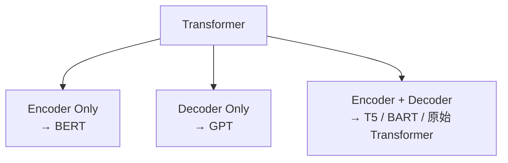
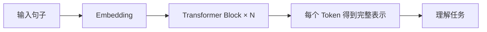
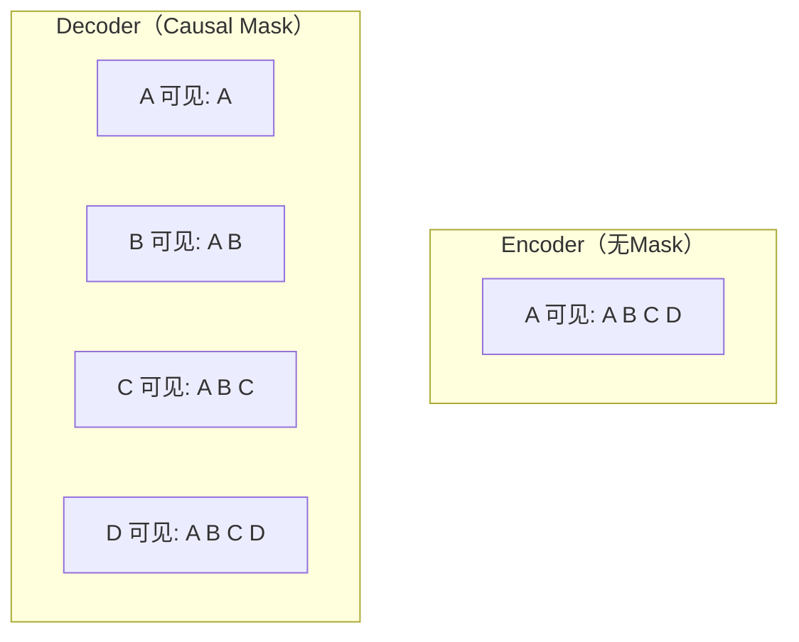
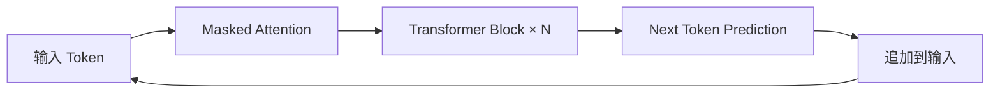
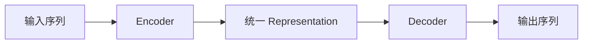
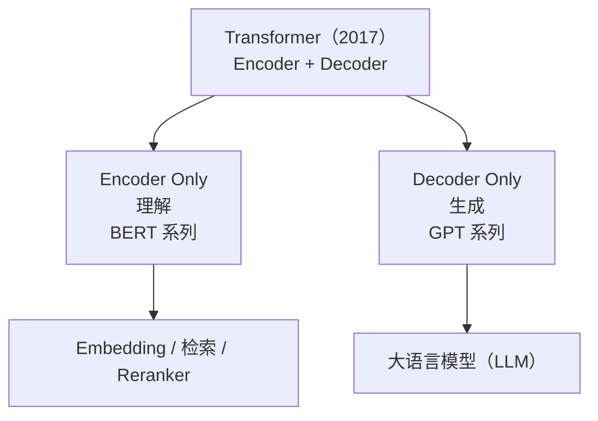
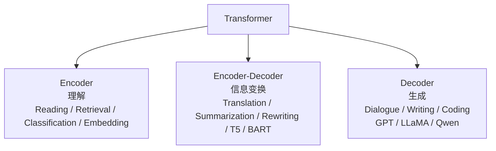

# 12. Transformer 家族

## 一个 Transformer，为什么演化出三种架构？

上一章，我们已经学习了 Transformer Block，知道一个 Transformer 其实就是很多个 Block 不断堆叠。新的问题来了：2017 年 Transformer 论文提出的是 `Encoder → Decoder`，为什么后来却出现了 BERT（Encoder Only）和 GPT（Decoder Only）？难道有人把 Transformer 拆坏了？当然不是，真正原因是**不同任务需要的信息并不一样**。

**回顾 Transformer 原始结构。** 2017 年《Attention Is All You Need》提出的模型是 `输入句子 → Encoder → 上下文表示 → Decoder → 输出句子`。例如机器翻译，输入 `I love AI.`，Encoder 负责理解整句话，Decoder 负责生成中文 `我喜欢人工智能。`。这里输入输出是两句话，因此需要两个模块。

**Encoder 与 Decoder 各自的职责。** **Encoder** 只有一个任务：**理解输入**。它不会预测下一句话，也不会生成文本，只是不断更新 Representation，最后得到整句话最完整、最准确的语义表示。因此 Encoder 更像一位阅读理解专家。

**Decoder** 任务完全不同，它需要一个词一个词不断生成输出：已经生成 `我 喜欢`，下一步预测 `人工智能`，再下一步预测 `。`。因此 Decoder 更像一位写作者——不是理解，而是边理解边生成。

**为什么最初需要两部分？** 机器翻译中，模型必须先理解英文，然后再生成中文，于是自然形成 `英文 → Encoder → 语义表示 → Decoder → 中文`，Encoder 负责"读"，Decoder 负责"写"。

一个生活中的例子：同声传译的工作流程是先认真听，理解意思，再翻译出来。如果直接一边听一边乱说，很容易翻译错误。因此很多输入输出不同的任务，都采用 Encoder + Decoder。

**后来发生了一件事情。** 研究人员发现，并不是所有任务都需要完整的 Encoder + Decoder。例如阅读理解、情感分析、文本分类这些任务只需要理解，根本不用生成——于是有人想到：为什么不保留 Encoder，把 Decoder 删掉？这就是 **BERT**。

另一方面，聊天机器人、写文章、代码生成这些任务只需要不断生成，输入本身就是已经生成的一部分——于是又有人想到：为什么不保留 Decoder，把 Encoder 删掉？这就是 **GPT**。

**三种 Transformer 家族：**

请注意，它们并不是谁更先进，而是针对不同任务进行了不同取舍。

**本节小结**：✅ 原始 Transformer 同时包含 Encoder 和 Decoder ✅ Encoder 负责理解输入 ✅ Decoder 负责逐步生成输出 ✅ 不同任务需要不同能力，因此演化出三种架构。一句话总结：**Transformer 并没有分裂，而是根据任务需求，逐渐演化出三种最适合的组织方式。**

---

## Encoder——为什么 BERT 擅长理解，而不擅长生成？

上面，我们知道 Transformer 后来演化出三种架构，第一种就是 Encoder Only，最著名的代表是 BERT。为什么只保留 Encoder，模型还能工作？

**回顾 Encoder 的职责。** Encoder 从来没有负责生成文字，它一直负责**理解**。例如 `The little cat is sleeping.` 经过很多层 Transformer Block，最后每一个 Token 都拥有完整上下文。例如 `cat` 最终的表示已经知道它被 `little` 修饰、是 `sleeping` 的主体、出现在整个句子中。请注意，Encoder 真正输出的是 Representation，而不是文字。

一个类比：阅读理解考试中，老师给你一篇文章，你的任务不是继续写故事，而是回答问题——为了回答问题，你需要认真阅读、理解全文，但不需要继续写下一段。Encoder 也是一样，它专门负责理解，而不是生成。

**Encoder 为什么能够看到整句话？** 来看 `Tom bought a red car.`。Encoder 处理 `Tom` 的时候，Attention 能够看到整个句子（`bought、a、red、car`）；处理 `car` 的时候，同样能够看到整个句子。因此 Encoder 中每一个 Token 最终都拥有完整上下文，这种方式叫**双向注意力（Bidirectional Attention）**——模型既可以看左边，也可以看右边。

例如 `I sat on the bank.`——看到 `bank` 时不知道是"银行"还是"河岸"，继续往后看到 `I sat on the bank of the river.`，看到 `river`，Encoder 立刻知道这里表示"河岸"。如果不能看右边，模型其实很难判断。

**为什么 BERT 理解能力这么强？** BERT 训练时，每一个 Token 都可以看到左右两侧完整上下文，因此得到的是真正完整的 Representation。例如 `Apple` 在 `Apple released iPhone.` 和 `Apple tastes sweet.` 中，最终会得到完全不同的表示。这也是 BERT 能够完成阅读理解、分类、检索、实体识别等任务的重要原因。

一个例子：`The movie was not good.`——如果只看到 `good`，很多模型都会认为是积极；但 Encoder 还能看到 `not`，于是最终表示变成 `negative`。

**Encoder 能写文章吗？** 既然理解能力这么强，为什么不用 BERT 聊天？原因很简单：Encoder 从来没有学习**如何一个词一个词生成句子**。它训练的目标始终是理解，而不是写作。因此 Encoder 非常适合"阅读 → 理解 → 回答"，却不擅长"阅读 → 继续写"。

**Encoder 擅长哪些任务？** 由于 Encoder 拥有完整上下文，因此特别适合：**文本分类**（这条评论积极还是消极？）、**命名实体识别**（北京属于地点）、**阅读理解**（文章主人公是谁？）、**语义检索**（这两句话是不是表达同一个意思？）。这些任务的共同特点是：**理解，比生成更重要。**

请注意，整个过程中模型从来没有生成新的 Token。

很多初学者认为 BERT 只是Transformer 删掉一半，其实不是。BERT 真正保留下来的，正是 Transformer 最强的理解能力，它放弃的只是逐词生成。因此 Encoder 不是残缺版 Transformer，而是专门为了理解任务优化出来的一种架构。

**本节小结**：✅ Encoder 的核心任务是理解，而不是生成 ✅ Encoder 使用双向 Attention，可以同时利用左右上下文 ✅ BERT 是 Encoder-only Transformer 的代表 ✅ Encoder 特别适合理解类任务，如分类、检索、阅读理解。一句话总结：**Encoder 像一位阅读专家，它的目标不是写下一句话，而是把当前这句话理解得足够透彻。**

---

## Decoder——为什么 GPT 只能看左边？

上面，我们学习了 Encoder，它最大的特点是**每一个 Token 都能够看到整个句子**（双向 Attention）。但如果我们希望模型自己写文章，还能这样做吗？

假设模型正在生成 `The capital of France is`，下一步应该输出 `Paris` 还是 `London`？模型需要自己预测。但如果训练时已经能够看到完整答案 `The capital of France is Paris.`，那它是不是直接看答案就可以了？

一个类比：考试题目是 `1+1=__`，如果试卷直接写着 `1+1=2`，学生只需要抄答案，根本不用思考，考试就失去了意义。神经网络也是一样。

**如果可以看到未来。** `I love artificial intelligence.`，假设训练目标是预测 `artificial`。如果 Attention 允许看到 `intelligence` 甚至整个句子，模型其实已经知道完整答案，它根本不用学习预测，训练就失去了意义。

**Causal Mask（因果掩码）。** 既然模型不能偷看答案，那就给它戴上一副"眼罩"：正在预测第三个 Token 时，只能看到 Token1、Token2，不能看到 Token4、Token5……这就和真正写文章完全一致。这种规则叫 **Causal Mask（因果掩码）**。

计算 `A` 时只能看到 `A`；计算 `B` 时只能看到 `A B`；计算 `C` 时只能看到 `A B C`；永远不能看到未来。

**为什么叫 Causal？** "Causal" 意思是因果——今天不能受到明天影响，原因必须发生在结果之前。语言生成也是一样，已经写出的内容才能影响下一步，未来不能反过来影响过去。因此这种 Mask 叫 **Causal Mask（因果掩码）**。

**Decoder 真正在学习什么？** 很多人第一次学习 GPT，认为模型是在"背句子"，其实不是。模型真正学习的是：**给定历史，下一步最可能是什么？** 例如 `The capital of France is` 预测 `Paris`，再继续预测 `.`，然后 `It`……整个过程都是一步一步向前生成。

**为什么 GPT 可以聊天？** 因为聊天、写文章、写代码、翻译、总结，本质上都是不断生成下一个 Token。例如用户输入 `Explain Transformer.`，模型首先预测 `Transformer`，然后预测 `is`，再预测 `a`……直到整篇回答全部生成。请注意，GPT 从来不知道最终答案，它只是不断预测下一个 Token。

这就是 GPT 真正工作的方式。

很多初学者认为 GPT 理解能力比 BERT 差，其实不能这样比较。GPT 牺牲的是"看到未来"，换来的却是真正的生成能力。因此它不是"弱化版 Encoder"，而是专门为了生成设计出来的一种 Transformer。

**本节小结**：✅ Decoder 不能看到未来 Token ✅ Causal Mask 防止模型偷看答案 ✅ GPT 的训练目标是 Next Token Prediction ✅ GPT 通过不断预测下一个 Token 完成文本生成。一句话总结：**Decoder 并不是理解整个句子，而是在历史信息的基础上，一步一步生成未来。**

---

## Encoder + Decoder——什么时候需要同时理解和生成？

上面，我们学习了 Encoder 负责理解、Decoder 负责生成。为什么 Transformer 最初论文没有选择 Encoder Only，也没有选择 Decoder Only，而是同时保留了两者？

任务 `Hello. → 你好。`，模型应该怎么完成？今天可以直接用 GPT 不断生成中文，但 2017 年大家首先想到的是：模型必须先理解英文，然后再生成中文，于是自然出现两个阶段。

一个类比：同声传译听到 `Artificial Intelligence is changing the world.`，工作方式并不是听一个词翻译一个词，而是先听完整句话、理解意思，然后再组织另一种语言。整个过程分成两个阶段：第一阶段理解（英文 → 真正含义），第二阶段表达（真正含义 → 中文）。请注意，真正传递的不是英文，而是语义。

**Encoder + Decoder 正是在做这件事情。** Transformer 最初设计就是 `输入句子 → Encoder → Representation → Decoder → 输出句子`。Encoder 负责理解，Decoder 负责重新表达。

**为什么不能直接生成？** `The book that I bought yesterday is interesting.`——如果没有理解就开始逐词翻译，很容易顺序混乱。但 Encoder 先完成整句话理解，于是 Decoder 生成中文时已经拥有完整语义，因此能够输出 `我昨天买的那本书很有趣。`。请注意，生成顺序已经完全不同，但表达的意思保持一致。

**Representation 才是真正的桥梁。** 很多人第一次学习 Encoder-Decoder，认为 Encoder 直接把英文传给 Decoder，其实不是——真正传递的是 **Representation**。例如 `Good morning.` 经过 Encoder 变成包含"问候、时间、礼貌"的表示，然后 Decoder 根据这个表示生成 `早上好。`。因此 Encoder 和 Decoder 并不是复制文字，而是在共享语义表示。

例如输入 `How are you?`，Encoder 输出"问候、询问近况、礼貌表达"，Decoder 根据这个表示可以生成 `你好吗？`，也可以生成 `最近怎么样？`，甚至 `近来可好？`。请注意，文字发生变化，Representation 保持一致。

**Encoder-Decoder 擅长哪些任务？** 只要输入输出不是同一种表达，通常都适合 Encoder + Decoder：**机器翻译**（英文→中文）、**文本摘要**（长文章→一句摘要）、**文本改写**（复杂句子→简单句子）、**语音识别**（声音→文字）。很多多模态任务也可以理解成一种信息变换。

整个模型真正学习的是：**如何把一种表示，转换成另一种表达。**

**为什么后来 LLM 很少使用它？** 既然 Encoder + Decoder 这么完整，为什么 GPT、LLaMA、Qwen、DeepSeek 几乎全部采用 Decoder Only？原因很简单：聊天、写作、代码生成这些任务，输入本身就是输出的一部分，模型不需要先完整理解再重新表达，而是不断续写，于是 Decoder 已经足够。

Transformer 最初服务的是 Seq2Seq，后来 GPT 重新定义了语言建模。因此今天大家提到 Transformer，想到的往往都是 Decoder，但不要忘记，最初的 Transformer 其实是 Encoder 和 Decoder 共同组成。

**本节小结**：✅ Encoder 负责理解输入 ✅ Decoder 负责生成输出 ✅ 两者之间共享的是 Representation，而不是原始文本 ✅ Encoder-Decoder 特别适合输入输出不同形式的 Seq2Seq 任务。一句话总结：**Encoder-Decoder 的本质不是"翻译"，而是"信息变换（Information Transformation）"。**

---

## 为什么 LLM 最终选择 Decoder Only？

上面，我们学习了 Transformer 三种经典架构：Encoder（理解）、Encoder + Decoder（信息变换）、Decoder（生成）。新的问题来了：为什么今天几乎所有大语言模型（GPT、LLaMA、Qwen、DeepSeek、GLM、Mistral）都选择了 Decoder Only？难道 Encoder 真的没有价值了吗？答案是当然不是，真正变化的是**任务**。

**Transformer 解决的问题变了。** 2017 年，Transformer 最重要的应用是机器翻译：输入英文，输出中文，这是典型的 Sequence-to-Sequence，因此 Encoder 和 Decoder 缺一不可。到了今天，大语言模型最重要的问题已经变成：**给定已有文本，继续生成后面的内容**——聊天、写代码、写文章，本质上都可以统一成上一节讲过的 Next Token Prediction，因此只需要 Decoder，不再需要一个独立的 Encoder 先"理解"一遍。

**为什么不先用 Encoder 理解，再交给 Decoder？** 原因有两个：

**第一，训练目标一致。** Decoder 训练时学习的就是"预测下一个 Token"，推理时做的也是"预测下一个 Token"，训练和推理完全一致，没有任何切换，这种一致性使得模型更容易扩展。

**第二，更容易扩展数据。** 互联网几乎所有文本（网页、小说、论文、代码、论坛、聊天记录）都可以直接用于"预测下一个 Token"，不需要额外标注。这也是 LLM 能够利用海量互联网数据进行预训练的重要原因。

**Encoder 去哪里了？** Encoder 并没有淘汰。今天很多系统仍然大量使用 Encoder，例如文本检索、Embedding 模型、Reranker、语义搜索、推荐系统、阅读理解。这些任务目标仍然是理解，而不是生成，因此 Encoder 依然非常重要。

**一张图理解 Transformer 的演化：**

请注意，今天并不是 Decoder 取代了 Encoder，而是两者分别服务于不同任务。很多文章喜欢说"GPT 打败了 BERT"，这种说法并不准确。更准确地说，随着生成式 AI 成为主流，**生成任务的重要性快速提升**，因此 Decoder Only 逐渐成为大语言模型最主流的架构，而 Encoder 仍然在搜索、推荐、Embedding、检索增强（RAG）等领域发挥着重要作用。

**本章小结**：✅ Transformer 演化出三种架构 ✅ Encoder 擅长理解 ✅ Decoder 擅长生成 ✅ Encoder-Decoder 擅长信息变换 ✅ LLM 之所以选择 Decoder Only，是因为训练目标与生成任务高度一致，且更容易利用海量无标注数据。一句话总结：**没有最好的 Transformer，只有最适合任务的 Transformer。**

**Transformer 家族总结：**

---

在进入下一章之前，下一节我们将同时加载 BERT、GPT、T5 三种真实的开源模型，用同一批输入亲手体会 Encoder / Decoder / Encoder-Decoder 的行为差异：**12.1 亲手对比 Encoder / Decoder / Encoder-Decoder**。

到这里，Transformer 结构已经全部学习完成。但还有一个问题：Transformer 只是一种网络结构，真正让 GPT 变得聪明的并不是 Transformer，而是**训练方法**。下一章，我们正式进入：**大语言模型（LLM）**，第一节，也是整个 GPT 的起点：**Next Token Prediction——GPT 为什么只做一件事，却学会了世界知识？**
