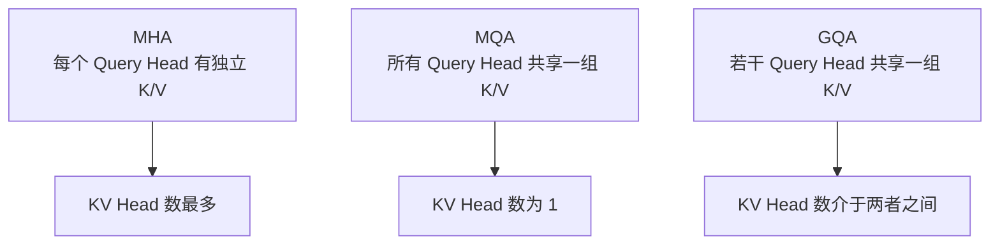
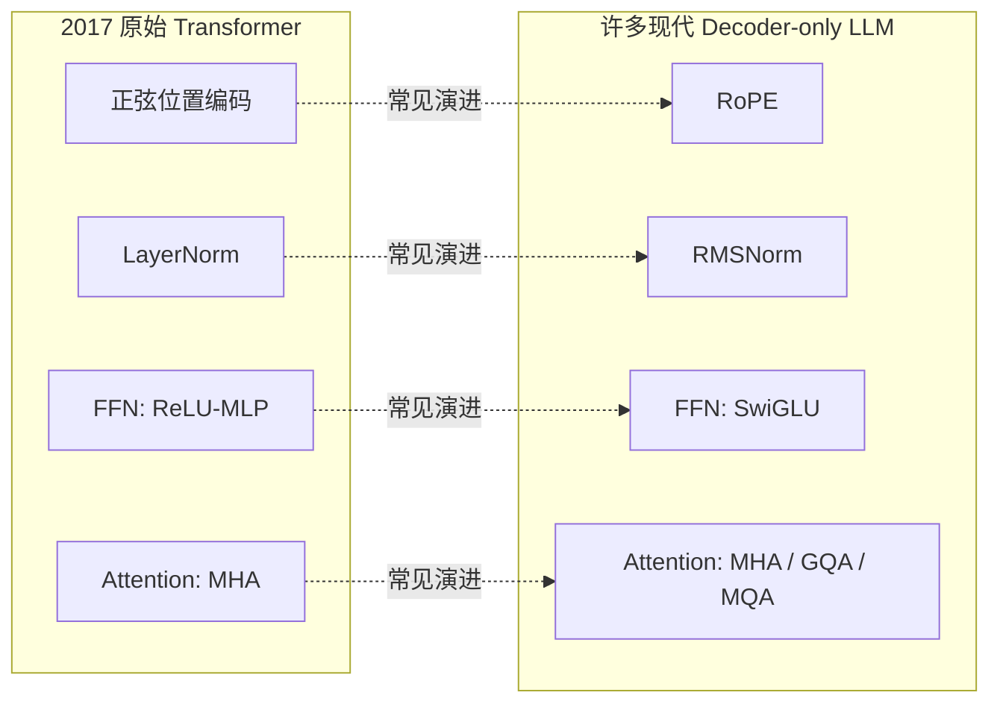
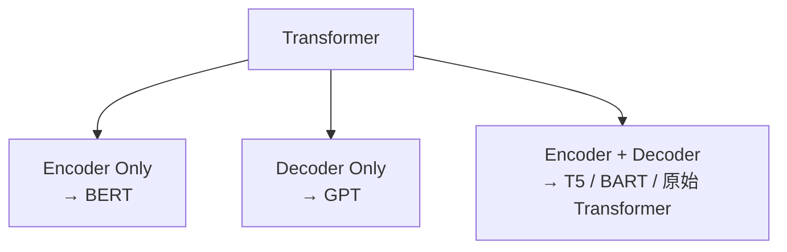
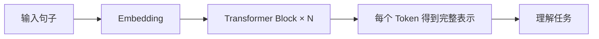
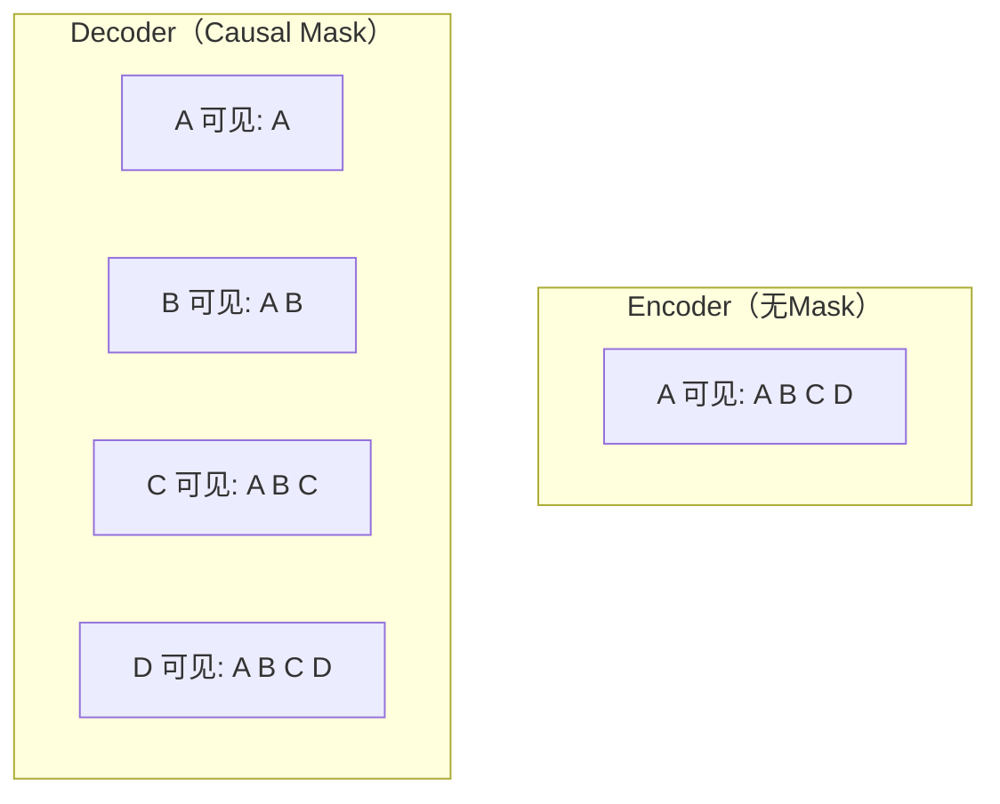
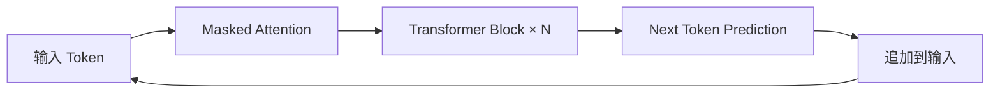
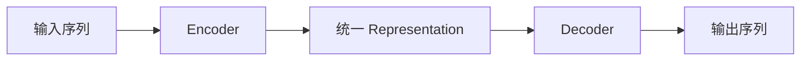
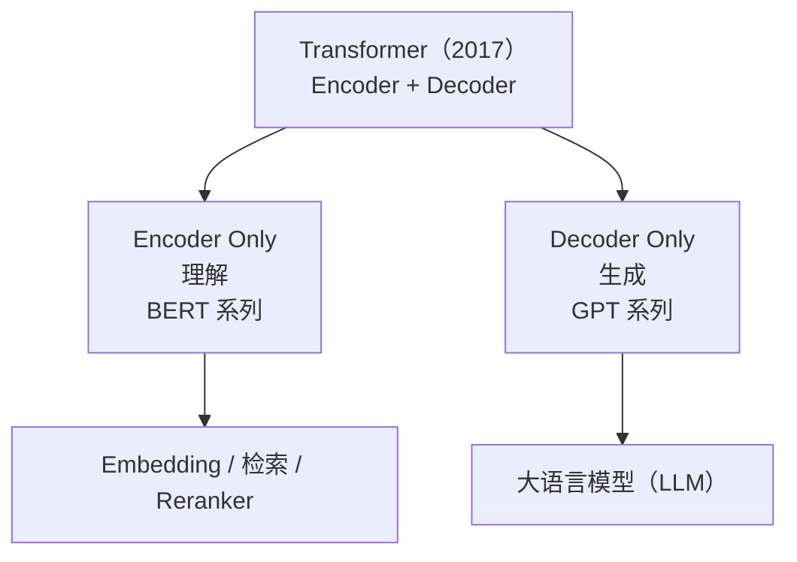
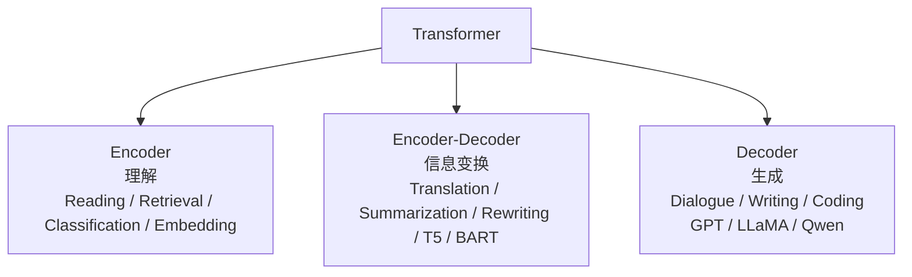

# 12. Transformer 架构演进与家族

## 上一章的 Block，其实是"简化版"

上一章，我们亲手拼出了一个完整的 Transformer Block：`Multi-Head Attention + FFN + Residual + LayerNorm + Dropout`。这个版本已经能跑通、能训练，11.1 节的 nanoGPT 也确实用它学会了续写莎士比亚风格的英文。但如果你去读Llama、Qwen、DeepSeek 这些今天真正在用的模型的源码，会发现它们用的 Block 和我们拼的这一版，有几个地方明显不一样：

| 组件 | 上一章的写法 | 今天主流开源模型的写法 |
|---|---|---|
| 位置信息 | 可学习绝对位置向量（第 11 章已说明，11.1节用于实践） | RoPE（旋转位置编码） |
| 归一化 | LayerNorm | RMSNorm |
| FFN激活 | `Linear → GELU → Linear` | SwiGLU |
| Attention | 每个 Head 都有自己独立的 K、V | GQA / MQA（多个 Head 共享 K、V） |

这一章，我们就把这四处差异一次讲清楚——尤其是第一个：**位置编码到底是什么、为什么 Attention 必须要有它**。第11章只给了结论并在代码里用上了它，本章给出完整原因与四种方案的对比。

---

## 为什么 Attention 需要额外告诉它"顺序"？

先问一个问题：`Attention(Q, K, V) = Softmax(QKᵀ/√d)V` 这个公式里，哪里出现过"谁在前、谁在后"这件事？

答案是：**完全没有出现过。** 回顾一下 Attention 的计算过程——每个 Token 的 Query 和所有 Token 的 Key 做 Dot Product，得到 Score，再 Softmax、再加权求和 Value。这个过程只关心"两个 Token 的内容像不像"，从头到尾都没有用到"这是第几个 Token"这个信息。

这会带来一个真实的问题：**如果对输入 Token 做同一个排列，Self-Attention 的输出也只会跟着做相同排列，而不会凭空产生“原始位置”信息。** 这个性质叫 **Permutation Equivariance（排列等变性）**，不是排列不变性：输出并非完全不变，而是随输入同步换位。因此，不加入位置编码时，模型无法区分同一组 Token 的不同原始顺序，也就无法可靠表示 `"猫追狗"` 与 `"狗追猫"` 的语序差异。

对于语言来说，顺序显然至关重要。因此我们必须**额外**给模型注入一份"位置信息"——这就是 **位置编码（Positional Encoding）** 存在的全部理由。11.1 节的代码里已经用了其中最简单的一种：

```python
# 回顾 11.1 节的代码片段
self.position_embedding = nn.Embedding(block_size, d_model)
```

这行代码给每一个位置（0, 1, 2, ..., block_size-1）分配一个可学习的向量，直接加到 Token 的 Embedding 上。这是最简单的一种位置编码方式，但绝不是唯一的方式，也不是今天主流大模型的选择。

---

## 方案一：绝对位置编码（Learned Positional Embedding）

就是上面11.1 节用的办法：给每个位置学一个向量，`最终输入 = Token Embedding + Position Embedding`。

**优点**：简单、直接、效果够用，GPT-2、GPT-3 都用的是这种方式。

**缺点**：位置表有固定上限。若 `nn.Embedding` 只创建 2048 行，位置索引达到 2048 就会越界，不能直接处理长度 3000 的输入。即使扩展或插值位置表，新位置也没有按原训练分布充分学习，效果需要重新验证。因此绝对位置向量不能仅靠修改一个长度参数就可靠扩展上下文。

## 方案二：正弦位置编码（Sinusoidal Positional Encoding）

2017 年原始 Transformer 论文用的是另一种办法：不学习，而是用固定的正弦/余弦函数直接计算每个位置的编码。对位置 `pos` 和维度索引 `i`：

```math
PE(pos,2i)=\sin\left(pos/10000^{2i/d_{model}}\right)
```

```math
PE(pos,2i+1)=\cos\left(pos/10000^{2i/d_{model}}\right)
```

**这组公式的作用**：为每个位置生成一个确定的 `d_model` 维向量，不需要新增可训练位置表。

- `pos`：Token 的位置编号；
- `i`：维度对编号；
- `2i、2i+1`：一对相邻维度；
- `d_model`：模型向量维度；
- `10000`：控制不同维度频率跨度的固定基数。

例如 `pos=2、d_model=4`：第一对维度使用角度 `2`，得到约 `[sin(2),cos(2)]=[0.9093,-0.4161]`；第二对维度角度为 `2/100=0.02`，得到约 `[0.0200,0.9998]`。低维变化快，高维变化慢，因此不同位置会形成多尺度编码。

公式可以在任意位置计算，不需要为新位置增加参数；但“能够计算”不等于模型在超出训练长度时仍能可靠泛化。12.1 节将转而实现现代模型更常用的 RoPE。

## 方案三：RoPE（Rotary Position Embedding）——现代模型的常见选择

Llama、Qwen、Mistral、DeepSeek……几乎所有 2023 年之后的主流开源大模型，用的都是同一种位置编码：**RoPE（旋转位置编码）**。它的思路和前两种完全不同：**不是把位置信息"加"到 Embedding 上，而是根据位置，把 Query 和 Key 向量"旋转"一个角度。**

**一个直觉：把向量的每两个维度看成一个二维平面上的点。** 一个二维向量 `(x, y)` 旋转角度 `θ` 之后，会变成：

```
x' = x·cos(θ) - y·sin(θ)
y' = x·sin(θ) + y·cos(θ)
```

RoPE 做的事情就是：**Token 位于哪个位置，就把它的 Q、K 向量按该位置对应的角度旋转**。实际模型把向量维度两两分组，每组使用不同频率；位置越靠后，累计旋转角度越大。旋转公式的作用不是改变向量长度，而是改变 Q 与 K 的相对方向，从而影响点积。


图中同一组内容向量分别放在位置 `(2,5)` 与 `(102,105)`。两组绝对角度不同，但有向位置差都为 `+3`，完整 4 维点积都约为 `0.281395`。这说明对固定的未旋转 `q、k`，RoPE 点积显式依赖相对位移，而不分别依赖两个绝对位置。12.1 节会把二维旋转扩展为可运行的多维实现，生成图脚本见 [`rope_rotation_geometry.py`](./assets/rope_rotation_geometry.py)。

但**相对位置性质不等于自动具备长度外推能力**：超出训练长度后，模型可能遇到未充分学习的旋转相位与距离分布，性能仍可能下降。位置插值、NTK-aware scaling、YaRN 等技术正是为改善长上下文扩展而调整 RoPE 频率或位置映射。

---

## RMSNorm——比 LayerNorm 更省一步计算

回顾第 11 章的 LayerNorm：对一个 Token 的向量先减均值，再除以标准差，最后乘可学习缩放参数并加偏置。

**RMSNorm（Root Mean Square Normalization）做了一个简化：不减均值，通常也不使用偏置，只按均方根缩放：**

```math
\operatorname{RMSNorm}(x)=g\odot\frac{x}{\sqrt{\frac{1}{d}\sum_{i=1}^{d}x_i^2+\epsilon}}
```

**这个公式的作用**：把一个 Token 向量的整体均方根尺度调整到稳定范围，同时保留各维度的相对比例。

- `d`：向量维度；
- `x_i`：第 `i` 个分量；
- `ε`：防止分母为 0 的小常数；
- `g`：与输入同维度的可学习缩放参数；
- `⊙`：逐元素相乘。

例如 `x=[3,4]`、暂取 `g=[1,1]` 且忽略极小的 `ε`：均方为 `(9+16)/2=12.5`，RMS 约为 `3.536`，归一化结果约为 `[0.849,1.131]`。公式输出 Shape 与输入完全相同。完整 PyTorch 实现放在 12.1 节。

**为什么可以省掉减均值？** RMSNorm 的出发点是：在许多 Transformer 训练设置中，仅控制向量的整体尺度就足以获得良好的优化稳定性，因此可以省去中心化步骤并简化计算。它不意味着“均值永远不重要”，而是一个经过大量模型验证的架构取舍；实际效果仍取决于模型结构和训练配置。Llama、Qwen 等模型采用 RMSNorm，主要是因为它结构更简单，并能保持良好的训练表现。

---

## SwiGLU——门控式 FFN

上一章的 nanoGPT 使用 `Linear → GELU → Linear`；2017 年原始 Transformer 的逐位置 FFN 则使用 `Linear → ReLU → Linear`。现代 Decoder-only LLM 常进一步改用门控式 FFN。

**SwiGLU 是 GLU（Gated Linear Unit，门控线性单元）的一个变体**，结构上增加一条门控分支：

```math
\operatorname{SwiGLU}(x)=W_{down}\left(\operatorname{SiLU}(W_{gate}x)\odot(W_{up}x)\right)
```

**这个公式的作用**：让一条分支决定“通过多少”，另一条分支提供“通过什么内容”，最后再投影回模型维度。

- `W_gate x`：门控分支；
- `SiLU`：把门控值变成平滑的正负缩放系数，定义为 `SiLU(x)=x·σ(x)`，其中 `σ` 是第4章列过的 Sigmoid；
- `W_up x`：内容分支；
- `⊙`：两条分支逐元素相乘；
- `W_down`：把中间维度投影回 `d_model`。

例如某个 Token 在两条分支上的中间值分别为 `W_gate x=[2,-1]`、`W_up x=[0.5,3]`。按 `SiLU(x)=x·σ(x)` 逐元素计算：`σ(2)≈0.881`，所以 `SiLU(2)=2×0.881≈1.762`；`σ(-1)≈0.269`，所以 `SiLU(-1)=-1×0.269≈-0.269`。门控分支得到 `[1.762,-0.269]`，与内容分支逐元素相乘后约为 `[0.881,-0.807]`。这一步直观展示了门控如何放大、抑制甚至反转不同维度，再由 `W_down` 混合输出。

普通 FFN 只有一条升维通路；SwiGLU 增加门控分支，参数量和计算也随之变化。工程中通常调整 `d_ff`，在模型能力与总参数量之间做折中。完整模块实现放在 12.1 节。

---

## GQA / MQA——推理时怎么省下大量 KV Cache

自回归生成时，模型会缓存历史 Token 的 Key 和 Value，避免每生成一个新 Token 都从头重复计算；这部分缓存叫 **KV Cache**。在标准 Multi-Head Attention 中，各个 Head 拥有独立的 K、V，序列越长、Head 越多，缓存占用越大。**GQA 和 MQA 通过共享 K、V 来压缩这部分显存。**（KV Cache 的原理见第15章，其实测、量化与本地部署的显存账本见第二部分 10.2 节。）



| 方案 | KV Head 数 | 缓存与建模取舍 |
|---|---|---|
| MHA | 等于 Query Head 数 | KV Cache 最大，K/V 投影自由度最高 |
| MQA | 1 | KV Cache 最小，共享程度最高 |
| GQA | 介于 1 与 Query Head 数之间 | 在缓存占用与 K/V 投影自由度之间折中 |

忽略量化、对齐和框架额外开销时，KV Cache 元素数近似为：

```math
2\,B\,L\,T\,H_{kv}\,d_{head}
```

**这个公式的作用**：估算 KV Cache 中需要保存多少个数值元素，而不是字节数。

- `2`：K 和 V 两组；
- `B`：同时缓存的请求数；
- `L`：Transformer 层数；
- `T`：每个请求已缓存的 Token 数；
- `H_kv`：KV Head 数；
- `d_head`：每个 KV Head 的维度。

若要换算字节，还要再乘数据类型字节数，例如 FP16 乘 `2 Byte`。若 Query Head 数为 32，GQA 使用 4 个 KV Head，则主体元素数是 MHA 的 `4/32=1/8`。这只保证缓存下降；质量、吞吐和延迟收益还取决于模型训练、实现内核与硬件。

---

## 一张图总结这次改造



这些组件是常见的架构取舍，不是所有模型都采用同一组合。它们可能改善训练稳定性、参数效率或推理内存，但收益取决于模型规模、训练方案和实现，不能笼统保证“效果不变、速度提升”。

---

对应实践见 **12.1 实现 RoPE、RMSNorm、SwiGLU，并估算 GQA KV Cache**。

---

## 一个 Transformer，为什么演化出三种架构？

前面（第 11 章）我们已经拼出了 Transformer Block，也知道它靠堆叠成几十上百层。新的问题来了：2017 年 Transformer 论文提出的是 `Encoder → Decoder`，为什么后来却出现了 BERT（Encoder Only）和 GPT（Decoder Only）？难道有人把 Transformer 拆坏了？当然不是，真正原因是**不同任务需要的信息并不一样**。

**回顾 Transformer 原始结构。** 2017 年《Attention Is All You Need》提出的模型是 `输入句子 → Encoder → 上下文表示 → Decoder → 输出句子`。例如机器翻译，输入 `I love AI.`，Encoder 负责理解整句话，Decoder 负责生成中文 `我喜欢人工智能。`。这里输入输出是两句话，因此需要两个模块。

**Encoder 与 Decoder 各自的职责。** **Encoder** 主要把输入编码成上下文化 Representation；配合分类、抽取等任务头和相应训练目标，可用于文本理解任务。它本身不定义自回归生成过程，因此更像一位阅读理解专家。

**Decoder** 通过因果自注意力按顺序建模输出：已经生成 `我 喜欢`，下一步预测 `人工智能`，再下一步预测 `。`。原始 Transformer 的 Decoder 还会用 Cross-Attention 读取 Encoder 输出；GPT 一类 Decoder-only 模型则没有这条 Encoder 分支。

**为什么最初需要两部分？** 机器翻译中，模型必须先理解英文，然后再生成中文，于是自然形成 `英文 → Encoder → 语义表示 → Decoder → 中文`，Encoder 负责"读"，Decoder 负责"写"。

一个生活中的例子：同声传译的工作流程是先认真听，理解意思，再翻译出来。如果直接一边听一边乱说，很容易翻译错误。因此很多输入输出不同的任务，都采用 Encoder + Decoder。

**后来发生了一件事情。** 研究人员发现，分类、抽取、检索等任务可以直接使用双向 Encoder 表示，不必为每次输出都保留自回归 Decoder。BERT 是这种 Encoder-only 路线的代表。

另一方面，聊天、写作、代码补全等任务可以统一为条件式续写，Causal Decoder 能用同一个 Next Token Prediction 目标预训练和生成。GPT 是 Decoder-only 路线的代表。这里说的是常见建模选择，而不是任务与架构的一一绑定。

**三种 Transformer 家族：**



请注意，它们并不是谁更先进，而是针对不同任务进行了不同取舍。

**本节小结**：✅ 原始 Transformer 同时包含 Encoder 和 Decoder ✅ Encoder 负责理解输入 ✅ Decoder 负责逐步生成输出 ✅ 不同任务需要不同能力，因此演化出三种架构。一句话总结：**Transformer 并没有分裂，而是根据任务需求，逐渐演化出三种最适合的组织方式。**

---

## Encoder——为什么 BERT 擅长理解，而不擅长生成？

上面，我们知道 Transformer 后来演化出三种架构，第一种就是 Encoder Only，最著名的代表是 BERT。为什么只保留 Encoder，模型还能工作？

**回顾 Encoder 的职责。** Encoder 把整段输入编码为上下文化表示。例如 `The little cat is sleeping.` 经过很多层 Transformer Block，`cat` 的表示可以融合 `little`、`sleeping` 等位置的信息。Encoder 主体输出的是 Representation；最终执行分类、抽取或生成，还取决于接在它后面的任务头、Decoder 与训练目标。

一个类比：阅读理解考试中，老师给你一篇文章，你的任务不是继续写故事，而是回答问题——为了回答问题，你需要认真阅读、理解全文，但不需要继续写下一段。Encoder 也是一样，它专门负责理解，而不是生成。

**Encoder 为什么能够看到整句话？** 来看 `Tom bought a red car.`。Encoder 处理 `Tom` 的时候，Attention 能够看到整个句子（`bought、a、red、car`）；处理 `car` 的时候，同样能够看到整个句子。因此 Encoder 中每一个 Token 最终都拥有完整上下文，这种方式叫**双向注意力（Bidirectional Attention）**——模型既可以看左边，也可以看右边。

例如 `I sat on the bank.`——看到 `bank` 时不知道是"银行"还是"河岸"，继续往后看到 `I sat on the bank of the river.`，看到 `river`，Encoder 立刻知道这里表示"河岸"。如果不能看右边，模型其实很难判断。

**为什么 BERT 理解能力这么强？** BERT 训练时，每一个 Token 都可以看到左右两侧完整上下文，因此得到的是真正完整的 Representation。例如 `Apple` 在 `Apple released iPhone.` 和 `Apple tastes sweet.` 中，最终会得到完全不同的表示。这也是 BERT 能够完成阅读理解、分类、检索、实体识别等任务的重要原因。

一个例子：`The movie was not good.`——如果只看到 `good`，很多模型都会认为是积极；但 Encoder 还能看到 `not`，于是最终表示变成 `negative`。

**为什么标准 BERT 不直接拿来续写？** `BertForMaskedLM` 用双向上下文恢复被遮住的 Token，没有按左到右生成训练，也没有标准 CausalLM 的生成接口。因此这个 checkpoint 不适合直接自回归续写。若增加 Decoder、改变 Mask 或使用迭代 Mask 预测，包含 Encoder 的系统仍然可以生成文本。

**Encoder 擅长哪些任务？** 由于 Encoder 拥有完整上下文，因此特别适合：**文本分类**（这条评论积极还是消极？）、**命名实体识别**（北京属于地点）、**阅读理解**（文章主人公是谁？）、**语义检索**（这两句话是不是表达同一个意思？）。这些任务的共同特点是：**理解，比生成更重要。**



请注意，整个过程中模型从来没有生成新的 Token。

很多初学者认为 BERT 只是Transformer 删掉一半，其实不是。BERT 真正保留下来的，正是 Transformer 最强的理解能力，它放弃的只是逐词生成。因此 Encoder 不是残缺版 Transformer，而是专门为了理解任务优化出来的一种架构。

**本节小结**：✅ Encoder 的核心任务是理解，而不是生成 ✅ Encoder 使用双向 Attention，可以同时利用左右上下文 ✅ BERT 是 Encoder-only Transformer 的代表 ✅ Encoder 特别适合理解类任务，如分类、检索、阅读理解。一句话总结：**Encoder 像一位阅读专家，它的目标不是写下一句话，而是把当前这句话理解得足够透彻。**

---

## Decoder——为什么 GPT 使用因果注意力？

Encoder 的每个位置可以汇聚左右两侧信息；自回归语言模型则要定义 $p(x_t\mid x_{<t})$，用历史 Token 预测下一个 Token。训练时整句可以并行输入，但每个位置的隐藏状态不能读取未来位置。

以 `I love artificial intelligence .` 为例：`love` 位置的 logits 用来预测下一个 Token `artificial`。若 `love` 的隐藏状态能关注右侧的 `artificial`，监督答案就直接泄漏进了输入表示，模型无需学习从 `I love` 预测它。

**Causal Mask（因果掩码）。** 对位置 $t$，Self-Attention 只保留位置 $\le t$ 的 Key/Value，遮住 $>t$ 的位置。这样训练时可以并行计算所有位置，同时保持与自回归因子分解一致。



计算 `A` 的隐藏状态时只能利用 `A`；计算 `B` 时只能利用 `A B`；计算 `C` 时只能利用 `A B C`。这里的"只能看左边"特指同一次前向中的因果自注意力可见性，不表示模型不能处理右侧上下文改写、填空等经过专门格式化或训练的任务。

**训练标签还要右移一位。** Causal Mask 只负责遮住未来，监督目标还需与输入错开：例如目标序列是 `我 喜欢 AI <EOS>`，Decoder 输入通常是 `<BOS> 我 喜欢 AI`，对应标签是 `我 喜欢 AI <EOS>`。也就是说位置 $t$ 的 logits 学习预测位置 $t+1$ 的 Token；实现中常由数据整理器或模型内部完成这一步 shift。若输入与标签没有正确错位，Next Token Prediction 就定义错了。

**为什么叫 Causal？** "Causal"表示当前位置不能依赖未来位置。生成时，只有已经产生的内容能参与下一步预测，因此使用 **Causal Mask（因果掩码）**。

**Decoder 真正在学习什么？** 很多人第一次学习 GPT，认为模型是在"背句子"，其实不是。模型真正学习的是：**给定历史，下一步最可能是什么？** 例如 `The capital of France is` 预测 `Paris`，再继续预测 `.`，然后 `It`……整个过程都是一步一步向前生成。

**为什么 GPT 可以聊天？** 因为聊天、写文章、写代码、翻译、总结，本质上都是不断生成下一个 Token。例如用户输入 `Explain Transformer.`，模型首先预测 `Transformer`，然后预测 `is`，再预测 `a`……直到整篇回答全部生成。请注意，GPT 从来不知道最终答案，它只是不断预测下一个 Token。



这就是 GPT 真正工作的方式。

不能只凭双向或因果 Mask 给"理解能力"排高低；参数规模、数据、训练目标和评测方式同样关键。GPT 的因果拓扑支持自回归生成，但现代 Decoder-only 模型也能完成分类、抽取和问答。它不是"弱化版 Encoder"，而是另一种序列因子分解与训练选择。

**本节小结**：✅ Decoder 不能看到未来 Token ✅ Causal Mask 防止模型偷看答案 ✅ GPT 的训练目标是 Next Token Prediction ✅ GPT 通过不断预测下一个 Token 完成文本生成。一句话总结：**Decoder 并不是理解整个句子，而是在历史信息的基础上，一步一步生成未来。**

---

## Encoder + Decoder——什么时候需要同时理解和生成？

上面，我们学习了 Encoder 负责理解、Decoder 负责生成。为什么 Transformer 最初论文没有选择 Encoder Only，也没有选择 Decoder Only，而是同时保留了两者？

任务 `Hello. → 你好。`，模型应该怎么完成？今天可以直接用 GPT 不断生成中文，但 2017 年大家首先想到的是：模型必须先理解英文，然后再生成中文，于是自然出现两个阶段。

一个类比：同声传译听到 `Artificial Intelligence is changing the world.`，工作方式并不是听一个词翻译一个词，而是先听完整句话、理解意思，然后再组织另一种语言。整个过程分成两个阶段：第一阶段理解（英文 → 真正含义），第二阶段表达（真正含义 → 中文）。请注意，真正传递的不是英文，而是语义。

**Encoder + Decoder 正是在做这件事情。** 原始 Transformer 的每个 Decoder Block 不是只有 masked self-attention，而是依次包含：对已生成目标前缀的 **masked self-attention**、读取 Encoder 输出的 **cross-attention**，以及 FFN。Cross-Attention 中 Query 来自 Decoder 当前隐藏状态，Key/Value 来自 Encoder 的整段输出，因此每个生成位置既遵守目标侧因果约束，又能读取完整源序列。随后 Decoder 输出经线性层与 Softmax 预测下一个目标 Token。

**为什么不能直接生成？** `The book that I bought yesterday is interesting.`——如果没有理解就开始逐词翻译，很容易顺序混乱。但 Encoder 先完成整句话理解，于是 Decoder 生成中文时已经拥有完整语义，因此能够输出 `我昨天买的那本书很有趣。`。请注意，生成顺序已经完全不同，但表达的意思保持一致。

**Representation 才是真正的桥梁。** 很多人第一次学习 Encoder-Decoder，认为 Encoder 直接把英文传给 Decoder，其实不是——真正传递的是 **Representation**。例如 `Good morning.` 经过 Encoder 变成包含"问候、时间、礼貌"的表示，然后 Decoder 根据这个表示生成 `早上好。`。因此 Encoder 和 Decoder 并不是复制文字，而是在共享语义表示。

例如输入 `How are you?`，Encoder 输出"问候、询问近况、礼貌表达"，Decoder 根据这个表示可以生成 `你好吗？`，也可以生成 `最近怎么样？`，甚至 `近来可好？`。请注意，文字发生变化，Representation 保持一致。

**Encoder-Decoder 擅长哪些任务？** 只要输入输出不是同一种表达，通常都适合 Encoder + Decoder：**机器翻译**（英文→中文）、**文本摘要**（长文章→一句摘要）、**文本改写**（复杂句子→简单句子）、**语音识别**（声音→文字）。很多多模态任务也可以理解成一种信息变换。



整个模型真正学习的是：**如何把一种表示，转换成另一种表达。**

**为什么许多生成式 LLM 采用 Decoder-only？** GPT、LLaMA、Qwen 等主流系列把 Prompt 与回答串接起来，用统一的因果语言建模目标训练，数据管线和扩展方式较直接。但 T5/FLAN-T5 等 Encoder-Decoder 模型仍用于生成任务；采用哪种架构是目标、数据、延迟和系统设计的共同取舍。

Transformer 最初服务的是 Seq2Seq，后来 GPT 重新定义了语言建模。因此今天大家提到 Transformer，想到的往往都是 Decoder，但不要忘记，最初的 Transformer 其实是 Encoder 和 Decoder 共同组成。

**本节小结**：✅ Encoder 负责理解输入 ✅ Decoder 负责生成输出 ✅ 两者之间共享的是 Representation，而不是原始文本 ✅ Encoder-Decoder 特别适合输入输出不同形式的 Seq2Seq 任务。一句话总结：**Encoder-Decoder 的本质不是"翻译"，而是"信息变换（Information Transformation）"。**

---

## 为什么 LLM 最终选择 Decoder Only？

上面，我们学习了 Transformer 三种经典架构。新的问题是：为什么 GPT、LLaMA、Qwen 等许多通用生成模型选择 Decoder-only，而 BERT、T5 等路线仍然存在？这反映的是任务、训练目标与工程取舍，而不是一种架构淘汰另一种。

**Transformer 的主流应用重心变了。** 2017 年原始 Transformer 用 Encoder-Decoder 建模机器翻译；这两个模块是该模型设计的组成部分，但翻译任务本身并非只能这样实现。后来，许多通用生成任务被统一格式化为"给定已有 Token，预测下一个 Token"，Decoder-only 因而成为一种易扩展的选择，而不是所有 LLM 的必要条件。

**为什么不先用 Encoder 理解，再交给 Decoder？** 原因有两个：

**第一，目标形式统一。** 预训练与生成都使用 next-token 条件分布，便于复用同一模型和数据格式。但二者并非完全一致：训练常用 teacher forcing，条件中是真实历史 Token；自由生成时条件包含模型自己先前的输出，仍存在 exposure bias。

**第二，更容易扩展数据。** 互联网几乎所有文本（网页、小说、论文、代码、论坛、聊天记录）都可以直接用于"预测下一个 Token"，不需要额外标注。这也是 LLM 能够利用海量互联网数据进行预训练的重要原因。

**Encoder 去哪里了？** Encoder 并没有淘汰。今天很多系统仍然大量使用 Encoder，例如文本检索、Embedding 模型、Reranker、语义搜索、推荐系统、阅读理解。这些任务目标仍然是理解，而不是生成，因此 Encoder 依然非常重要。

**一张图理解 Transformer 的演化：**



请注意，今天并不是 Decoder 取代了 Encoder，而是两者分别服务于不同任务。很多文章喜欢说"GPT 打败了 BERT"，这种说法并不准确。更准确地说，随着生成式 AI 成为主流，**生成任务的重要性快速提升**，因此 Decoder Only 逐渐成为大语言模型最主流的架构，而 Encoder 仍然在搜索、推荐、Embedding、检索增强（RAG）等领域发挥着重要作用。

**Transformer 家族总结：**



---

对应实践见 **12.2 对比 Encoder / Decoder / Encoder-Decoder**。

---

## 本章总结

本章我们理解了：

✅ 不含位置信息的 Self-Attention 对 Token 排列是等变的，必须额外注入顺序 ✅ 正弦位置编码可计算任意位置，但可靠外推仍需验证 ✅ RoPE 把相对位移引入 Q/K 点积，但不自动保证长度外推 ✅ RMSNorm 省略中心化，SwiGLU 引入门控分支；实际效果依赖训练配置 ✅ GQA/MQA 通过减少 KV Head 数，按比例压缩 KV Cache 的理论主体占用 ✅ Transformer 演化出 Encoder / Decoder / Encoder-Decoder 三种架构 ✅ Encoder 擅长理解、Decoder 擅长生成、Encoder-Decoder 擅长信息变换 ✅ LLM 选择 Decoder Only，是因为训练目标与生成任务高度一致，且更容易利用海量无标注数据

> **现代 LLM 延续 Transformer 的基本框架，围绕位置表示、归一化、FFN 和推理缓存做出工程取舍；在架构层面，则按任务需求分化出 Encoder / Decoder / Encoder-Decoder 三种家族，生成式大模型最终主流收敛到 Decoder Only。**

---

# 参考资料

- Andrej Karpathy《Neural Networks: Zero to Hero》系列（micrograd / makemore / Let's build GPT / nanoGPT）：https://www.youtube.com/@AndrejKarpathy
- Sebastian Raschka《Build a Large Language Model (From Scratch)》配套代码与全书资源：https://github.com/rasbt/LLMs-from-scratch
