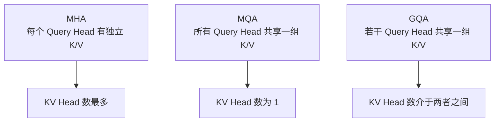
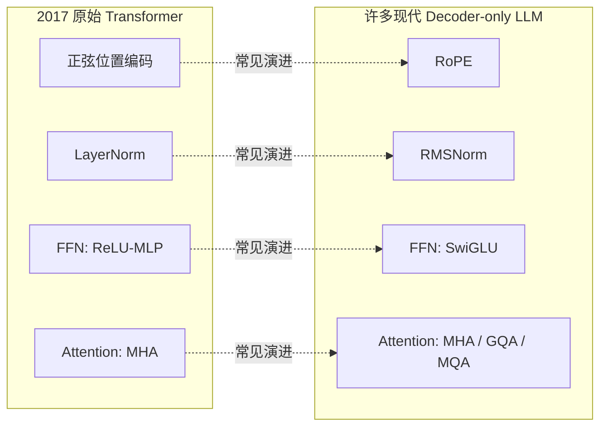

# 12. 现代 Transformer 架构演进

## 上一章的 Block，其实是"简化版"

上一章，我们亲手拼出了一个完整的 Transformer Block：`Multi-Head Attention + FFN + Residual + LayerNorm + Dropout`。这个版本已经能跑通、能训练，11.1 节的 Mini GPT 也确实用它学会了写故事。但如果你去读Llama、Qwen、DeepSeek 这些今天真正在用的模型的源码，会发现它们用的 Block 和我们拼的这一版，有几个地方明显不一样：

| 组件 | 上一章的写法 | 今天主流开源模型的写法 |
|---|---|---|
| 位置信息 | 可学习绝对位置向量（第 11 章已说明，11.1节用于实践） | RoPE（旋转位置编码） |
| 归一化 | LayerNorm | RMSNorm |
| FFN激活 | `Linear → GELU → Linear` | SwiGLU |
| Attention | 每个 Head 都有自己独立的 K、V | GQA / MQA（多个 Head 共享 K、V） |

这一章，我们就把这四处差异一次讲清楚——尤其是第一个：**位置编码到底是什么、为什么 Attention 必须要有它**。第11章只给了结论并在代码里用上了它，本章给出完整原因与四种方案的对比。

---

## 为什么 Attention 需要额外告诉它"顺序"？

先问一个问题：`Attention(Q, K, V) = Softmax(QKᵀ/√d)V` 这个公式里，哪里出现过"谁在前、谁在后"这件事？

答案是：**完全没有出现过。** 回顾一下 Attention 的计算过程——每个 Token 的 Query 和所有 Token 的 Key 做 Dot Product，得到 Score，再 Softmax、再加权求和 Value。这个过程只关心"两个 Token 的内容像不像"，从头到尾都没有用到"这是第几个 Token"这个信息。

这会带来一个真实的问题：**如果对输入 Token 做同一个排列，Self-Attention 的输出也只会跟着做相同排列，而不会凭空产生“原始位置”信息。** 这个性质叫 **Permutation Equivariance（排列等变性）**，不是排列不变性：输出并非完全不变，而是随输入同步换位。因此，不加入位置编码时，模型无法区分同一组 Token 的不同原始顺序，也就无法可靠表示 `"猫追狗"` 与 `"狗追猫"` 的语序差异。

对于语言来说，顺序显然至关重要。因此我们必须**额外**给模型注入一份"位置信息"——这就是**位置编码（Positional Encoding）**存在的全部理由。11.1 节的代码里已经用了其中最简单的一种：

```python
# 回顾 11.1 节的代码片段
self.position_embedding = nn.Embedding(block_size, d_model)
```

这行代码给每一个位置（0, 1, 2, ..., block_size-1）分配一个可学习的向量，直接加到 Token 的 Embedding 上。这是最简单的一种位置编码方式，但绝不是唯一的方式，也不是今天主流大模型的选择。

---

## 方案一：绝对位置编码（Learned Positional Embedding）

就是上面11.1 节用的办法：给每个位置学一个向量，`最终输入 = Token Embedding + Position Embedding`。

**优点**：简单、直接、效果够用，GPT-2、GPT-3 都用的是这种方式。

**缺点**：位置表有固定上限。若 `nn.Embedding` 只创建 2048 行，位置索引达到 2048 就会越界，不能直接处理长度 3000 的输入。即使扩展或插值位置表，新位置也没有按原训练分布充分学习，效果需要重新验证。因此绝对位置向量不能仅靠修改一个长度参数就可靠扩展上下文。

## 方案二：正弦位置编码（Sinusoidal Positional Encoding）

2017 年原始 Transformer 论文用的是另一种办法：不学习，而是用固定的正弦/余弦函数直接计算每个位置的编码。对位置 `pos` 和维度索引 `i`：

```math
PE(pos,2i)=\sin\left(pos/10000^{2i/d_{model}}\right)
```

```math
PE(pos,2i+1)=\cos\left(pos/10000^{2i/d_{model}}\right)
```

**这组公式的作用**：为每个位置生成一个确定的 `d_model` 维向量，不需要新增可训练位置表。

- `pos`：Token 的位置编号；
- `i`：维度对编号；
- `2i、2i+1`：一对相邻维度；
- `d_model`：模型向量维度；
- `10000`：控制不同维度频率跨度的固定基数。

例如 `pos=2、d_model=4`：第一对维度使用角度 `2`，得到约 `[sin(2),cos(2)]=[0.9093,-0.4161]`；第二对维度角度为 `2/100=0.02`，得到约 `[0.0200,0.9998]`。低维变化快，高维变化慢，因此不同位置会形成多尺度编码。

公式可以在任意位置计算，不需要为新位置增加参数；但“能够计算”不等于模型在超出训练长度时仍能可靠泛化。12.1 节将转而实现现代模型更常用的 RoPE。

## 方案三：RoPE（Rotary Position Embedding）——现代模型的常见选择

Llama、Qwen、Mistral、DeepSeek……几乎所有 2023 年之后的主流开源大模型，用的都是同一种位置编码：**RoPE（旋转位置编码）**。它的思路和前两种完全不同：**不是把位置信息"加"到 Embedding 上，而是根据位置，把 Query 和 Key 向量"旋转"一个角度。**

**一个直觉：把向量的每两个维度看成一个二维平面上的点。** 一个二维向量 `(x, y)` 旋转角度 `θ` 之后，会变成：

```
x' = x·cos(θ) - y·sin(θ)
y' = x·sin(θ) + y·cos(θ)
```

RoPE 做的事情就是：**Token 位于哪个位置，就把它的 Q、K 向量按该位置对应的角度旋转**。实际模型把向量维度两两分组，每组使用不同频率；位置越靠后，累计旋转角度越大。旋转公式的作用不是改变向量长度，而是改变 Q 与 K 的相对方向，从而影响点积。


图中同一组内容向量分别放在位置 `(2,5)` 与 `(102,105)`。两组绝对角度不同，但有向位置差都为 `+3`，完整 4 维点积都约为 `0.281395`。这说明对固定的未旋转 `q、k`，RoPE 点积显式依赖相对位移，而不分别依赖两个绝对位置。12.1 节会把二维旋转扩展为可运行的多维实现，生成图脚本见 [`rope_rotation_geometry.py`](./assets/rope_rotation_geometry.py)。

但**相对位置性质不等于自动具备长度外推能力**：超出训练长度后，模型可能遇到未充分学习的旋转相位与距离分布，性能仍可能下降。位置插值、NTK-aware scaling、YaRN 等技术正是为改善长上下文扩展而调整 RoPE 频率或位置映射。

---

## RMSNorm——比 LayerNorm 更省一步计算

回顾第 11 章的 LayerNorm：对一个 Token 的向量先减均值，再除以标准差，最后乘可学习缩放参数并加偏置。

**RMSNorm（Root Mean Square Normalization）做了一个简化：不减均值，通常也不使用偏置，只按均方根缩放：**

```math
\operatorname{RMSNorm}(x)=g\odot\frac{x}{\sqrt{\frac{1}{d}\sum_{i=1}^{d}x_i^2+\epsilon}}
```

**这个公式的作用**：把一个 Token 向量的整体均方根尺度调整到稳定范围，同时保留各维度的相对比例。

- `d`：向量维度；
- `x_i`：第 `i` 个分量；
- `ε`：防止分母为 0 的小常数；
- `g`：与输入同维度的可学习缩放参数；
- `⊙`：逐元素相乘。

例如 `x=[3,4]`、暂取 `g=[1,1]` 且忽略极小的 `ε`：均方为 `(9+16)/2=12.5`，RMS 约为 `3.536`，归一化结果约为 `[0.849,1.131]`。公式输出 Shape 与输入完全相同。完整 PyTorch 实现放在 12.1 节。

**为什么可以省掉减均值？** RMSNorm 的出发点是：在许多 Transformer 训练设置中，仅控制向量的整体尺度就足以获得良好的优化稳定性，因此可以省去中心化步骤并简化计算。它不意味着“均值永远不重要”，而是一个经过大量模型验证的架构取舍；实际效果仍取决于模型结构和训练配置。Llama、Qwen 等模型采用 RMSNorm，主要是因为它结构更简单，并能保持良好的训练表现。

---

## SwiGLU——门控式 FFN

上一章的 Mini GPT 使用 `Linear → GELU → Linear`；2017 年原始 Transformer 的逐位置 FFN 则使用 `Linear → ReLU → Linear`。现代 Decoder-only LLM 常进一步改用门控式 FFN。

**SwiGLU 是 GLU（Gated Linear Unit，门控线性单元）的一个变体**，结构上增加一条门控分支：

```math
\operatorname{SwiGLU}(x)=W_{down}\left(\operatorname{SiLU}(W_{gate}x)\odot(W_{up}x)\right)
```

**这个公式的作用**：让一条分支决定“通过多少”，另一条分支提供“通过什么内容”，最后再投影回模型维度。

- `W_gate x`：门控分支；
- `SiLU`：把门控值变成平滑的正负缩放系数，定义为 `SiLU(x)=x·σ(x)`，其中 `σ` 是第4章列过的 Sigmoid；
- `W_up x`：内容分支；
- `⊙`：两条分支逐元素相乘；
- `W_down`：把中间维度投影回 `d_model`。

例如某个 Token 在两条分支上的中间值分别为 `W_gate x=[2,-1]`、`W_up x=[0.5,3]`。按 `SiLU(x)=x·σ(x)` 逐元素计算：`σ(2)≈0.881`，所以 `SiLU(2)=2×0.881≈1.762`；`σ(-1)≈0.269`，所以 `SiLU(-1)=-1×0.269≈-0.269`。门控分支得到 `[1.762,-0.269]`，与内容分支逐元素相乘后约为 `[0.881,-0.807]`。这一步直观展示了门控如何放大、抑制甚至反转不同维度，再由 `W_down` 混合输出。

普通 FFN 只有一条升维通路；SwiGLU 增加门控分支，参数量和计算也随之变化。工程中通常调整 `d_ff`，在模型能力与总参数量之间做折中。完整模块实现放在 12.1 节。

---

## GQA / MQA——推理时怎么省下大量 KV Cache

自回归生成时，模型会缓存历史 Token 的 Key 和 Value，避免每生成一个新 Token 都从头重复计算；这部分缓存叫 **KV Cache**。在标准 Multi-Head Attention 中，各个 Head 拥有独立的 K、V，序列越长、Head 越多，缓存占用越大。**GQA 和 MQA 通过共享 K、V 来压缩这部分显存。** 第15.4节会进一步实测 KV Cache 对显存和速度的影响。



| 方案 | KV Head 数 | 缓存与建模取舍 |
|---|---|---|
| MHA | 等于 Query Head 数 | KV Cache 最大，K/V 投影自由度最高 |
| MQA | 1 | KV Cache 最小，共享程度最高 |
| GQA | 介于 1 与 Query Head 数之间 | 在缓存占用与 K/V 投影自由度之间折中 |

忽略量化、对齐和框架额外开销时，KV Cache 元素数近似为：

```math
2\,B\,L\,T\,H_{kv}\,d_{head}
```

**这个公式的作用**：估算 KV Cache 中需要保存多少个数值元素，而不是字节数。

- `2`：K 和 V 两组；
- `B`：同时缓存的请求数；
- `L`：Transformer 层数；
- `T`：每个请求已缓存的 Token 数；
- `H_kv`：KV Head 数；
- `d_head`：每个 KV Head 的维度。

若要换算字节，还要再乘数据类型字节数，例如 FP16 乘 `2 Byte`。若 Query Head 数为 32，GQA 使用 4 个 KV Head，则主体元素数是 MHA 的 `4/32=1/8`。这只保证缓存下降；质量、吞吐和延迟收益还取决于模型训练、实现内核与硬件。

---

## 一张图总结这次改造



这些组件是常见的架构取舍，不是所有模型都采用同一组合。它们可能改善训练稳定性、参数效率或推理内存，但收益取决于模型规模、训练方案和实现，不能笼统保证“效果不变、速度提升”。

---

对应实践见 **12.1 实现 RoPE、RMSNorm、SwiGLU，并估算 GQA KV Cache**。

---

## 本章总结

本章我们理解了：

✅ 不含位置信息的 Self-Attention 对 Token 排列是等变的，必须额外注入顺序 ✅ 正弦位置编码可计算任意位置，但可靠外推仍需验证 ✅ RoPE 把相对位移引入 Q/K 点积，但不自动保证长度外推 ✅ RMSNorm 省略中心化，SwiGLU 引入门控分支；实际效果依赖训练配置 ✅ GQA/MQA 通过减少 KV Head 数，按比例压缩 KV Cache 的理论主体占用

> **现代 LLM 延续 Transformer 的基本框架，并围绕位置表示、归一化、FFN 和推理缓存做出多种工程与建模取舍。**

## 下一章预告

理解了单个 Block 内部的现代化改造之后，我们回到一个更基础的问题：一个 Block 已经能够理解上下文了，为什么 GPT、BERT、LLaMA 都要把这样的 Block 堆叠几十层甚至上百层？不同的层到底学到了什么？下一章，我们将进入：

> **第 13 章 Stacking Transformer**

---

# 参考资料

- Andrej Karpathy《Neural Networks: Zero to Hero》系列（micrograd / makemore / Let's build GPT / nanoGPT）：https://www.youtube.com/@AndrejKarpathy
- Sebastian Raschka《Build a Large Language Model (From Scratch)》配套代码与全书资源：https://github.com/rasbt/LLMs-from-scratch
