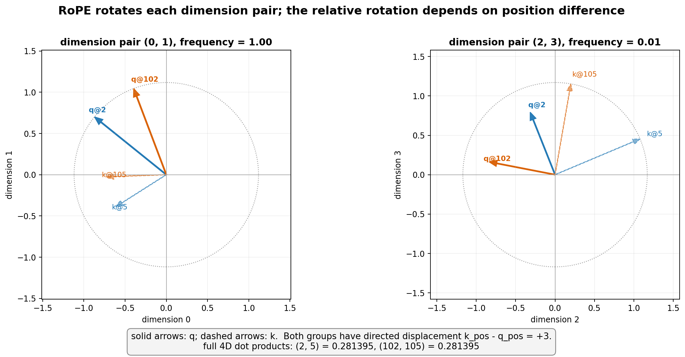

# 12.1 实现 RoPE、RMSNorm、SwiGLU，并估算 GQA KV Cache

> **本节目标**：实现 RoPE、RMSNorm、SwiGLU 的核心计算，并用公式估算不同 K/V Head 数量下的 KV Cache。这里不训练模型，也不实现完整 GQA Attention，因此只验证数学性质、参数量和理论缓存占用，不比较任务效果。

---

## 一、环境准备

```bash
pip install torch
```

```python
import torch
import torch.nn as nn
import torch.nn.functional as F
```

---

## 二、实现 RoPE，验证“相对位置”性质

```python
def build_rope_cache(seq_len, dim, base=10000):
    # 每一对维度用不同的频率，频率随维度增大而降低
    freqs = 1.0 / (base ** (torch.arange(0, dim, 2).float() / dim))
    positions = torch.arange(seq_len).float()
    #位置 × 频率，得到每个位置在每一对维度上应该旋转的角度
    angles = torch.outer(positions, freqs)   # shape: [seq_len, dim/2]
    return torch.cos(angles), torch.sin(angles)


def apply_rope(x, cos, sin):
    # x: [seq_len, dim]，把最后一维两两分组，当成"二维向量"来旋转
    x1, x2 = x[..., 0::2], x[..., 1::2]
    # 标准的二维旋转公式：x' = x*cos - y*sin，y' = x*sin + y*cos
    rotated_x1 = x1 * cos - x2 * sin
    rotated_x2 = x1 * sin + x2 * cos
    # 把旋转后的两组维度重新交错拼接回原来的形状
    out = torch.stack([rotated_x1, rotated_x2], dim=-1).flatten(-2)
    return out
```

```python
seq_len, dim = 106, 4
cos, sin = build_rope_cache(seq_len, dim)

# q 与 k 可以是不同的内容向量；比较相同有向位移 +3 的两组位置
q = torch.tensor([[1.0, 0.5, -0.3, 0.8]])
k = torch.tensor([[0.2, -0.7, 1.1, 0.4]])

q_at_pos2 = apply_rope(q, cos[2:3], sin[2:3])
k_at_pos5 = apply_rope(k, cos[5:6], sin[5:6])
q_at_pos102 = apply_rope(q, cos[102:103], sin[102:103])
k_at_pos105 = apply_rope(k, cos[105:106], sin[105:106])

dot_2_5 = (q_at_pos2 * k_at_pos5).sum()
dot_102_105 = (q_at_pos102 * k_at_pos105).sum()
print(f"位置 (2,5) 的点积: {dot_2_5.item():.6f}")
print(f"位置 (102,105) 的点积: {dot_102_105.item():.6f}")
print("相同相对位移时是否接近:", torch.allclose(dot_2_5, dot_102_105, atol=1e-5))
```

两次点积应在浮点误差内一致。更准确地说：**当未旋转的内容向量 `q、k` 固定时，RoPE 后的点积对二者位置的共同平移不变，只显式依赖有向相对位移。** 这个实验验证的是公式性质，不是在测试超出训练长度时的模型质量。



4 维向量被拆成 `(0,1)`、`(2,3)` 两个二维向量对。左图的旋转频率为 `1`，右图为 `0.01`；实线表示 `q`，虚线表示 `k`。蓝色组使用位置 `(2,5)`，橙色组整体平移到 `(102,105)`。绝对方向发生了变化，但两组的有向位置差都为 `+3`，所以完整 4 维点积都约为 `0.281395`。生成脚本见 [`rope_rotation_geometry.py`](./assets/rope_rotation_geometry.py)。

---

## 三、实现 RMSNorm，并验证归一化尺度

```python
class RMSNorm(nn.Module):
    def __init__(self, dim, eps=1e-6):
        super().__init__()
        self.weight = nn.Parameter(torch.ones(dim))
        self.eps = eps

    def forward(self, x):
        rms = torch.sqrt(torch.mean(x ** 2, dim=-1, keepdim=True) + self.eps)
        return (x / rms) * self.weight


x = torch.randn(2, 3, 8)
rmsnorm = RMSNorm(8)
y = rmsnorm(x)
print("输入/输出形状:", x.shape, y.shape)
print("各 Token 输出的 RMS:", torch.sqrt(torch.mean(y ** 2, dim=-1)))
print("RMSNorm 参数量:", sum(p.numel() for p in rmsnorm.parameters()))
```

当初始 `weight=1` 时，每个 Token 输出向量的 RMS 应接近 1；模块只有 `dim` 个可学习缩放参数。它验证了定义与形状，但**不构成速度基准**。朴素 Python/PyTorch 实现可能比高度融合的 `LayerNorm` 内核更慢；要比较性能，应在同一硬件、dtype、张量形状、预热与同步条件下使用可靠 benchmark。RMSNorm 的实际速度收益取决于所用框架和融合内核。

---

## 四、SwiGLU vs GELU-MLP：参数量对比

```python
class GELUMLP(nn.Module):
    def __init__(self, d_model, d_ff):
        super().__init__()
        self.fc1 = nn.Linear(d_model, d_ff)
        self.fc2 = nn.Linear(d_ff, d_model)

    def forward(self, x):
        return self.fc2(F.gelu(self.fc1(x)))


class SwiGLU(nn.Module):
    def __init__(self, d_model, d_ff):
        super().__init__()
        self.gate_proj = nn.Linear(d_model, d_ff)
        self.up_proj = nn.Linear(d_model, d_ff)
        self.down_proj = nn.Linear(d_ff, d_model)

    def forward(self, x):
        return self.down_proj(F.silu(self.gate_proj(x)) * self.up_proj(x))


def count_params(model):
    return sum(p.numel() for p in model.parameters())

d_model = 768
gelu_mlp = GELUMLP(d_model, d_ff=3072)
# SwiGLU 多了一条门控分支，为了让总参数量接近，通常会把 d_ff 调小（这里用经验值 2/3）
swiglu = SwiGLU(d_model, d_ff=2048)

print(f"GELU-MLP 参数量: {count_params(gelu_mlp):,}")
print(f"SwiGLU 参数量:   {count_params(swiglu):,}")
```

可以看到，只要把 SwiGLU 的隐藏维度调小一些，两者的总参数量可以基本持平——这正是 Llama 等模型在设计 `d_ff` 时的实际做法：用差不多的参数预算，换来 SwiGLU 门控机制带来的效果提升。

---

## 五、GQA vs MHA：KV Cache 显存对比

```python
def kv_cache_size(batch_size, num_layers, num_kv_heads, seq_len,
                  head_dim, dtype_bytes=2):
    # K 和 V 各一份，形状均可视为 [B, L, H_kv, T, d_head]
    total_bytes = (
        2 * batch_size * num_layers * num_kv_heads
        * seq_len * head_dim * dtype_bytes
    )
    return total_bytes / 1024 ** 2


batch_size, num_layers = 2, 32
num_query_heads, head_dim, seq_len = 32, 128, 4096
configs = [
    ("MHA（32个 KV Head）", 32),
    ("GQA（8个 KV Head）", 8),
    ("GQA（4个 KV Head）", 4),
    ("MQA（1个 KV Head）", 1),
]

print(f"{'配置':<24}{'理论 KV Cache (MB)':<20}")
for name, num_kv_heads in configs:
    size_mb = kv_cache_size(
        batch_size, num_layers, num_kv_heads,
        seq_len, head_dim
    )
    print(f"{name:<24}{size_mb:<20.1f}")
```

主体元素数为 `2·B·L·T·H_kv·d_head`。在其余条件不变时，8 个 KV Head 是 32-Head MHA 的 `1/4`，4 个则是 `1/8`。这是忽略量化、内存对齐、分片和框架额外缓冲的理论估算；它不测吞吐、延迟或模型质量，也没有实现 GQA 的投影、分组复制与 Attention 前向。

---

## 本节小结

✅ 用两组不同内容向量验证 RoPE 点积对共同平移不变 ✅ 实现 RMSNorm 并验证输出尺度，而不做不可靠的速度断言 ✅ 对比 SwiGLU 与 GELU-MLP 的参数量 ✅ 用含 Batch Size、层数和序列长度的公式估算 MHA/GQA/MQA 的 KV Cache 主体占用

下一章先解释为什么要堆叠多个 Transformer Block，以及深度如何改变表示；随后在 13.1 节提取真实模型的各层 Hidden State，做探索性表示分析。
