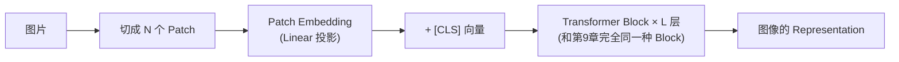
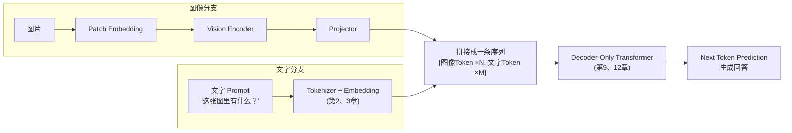
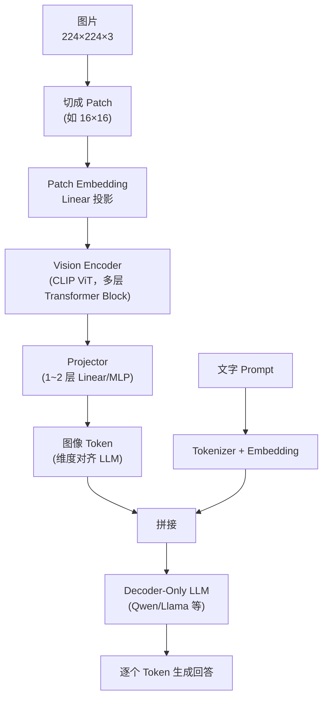
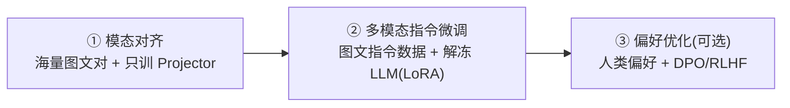

# 14. 多模态大模型——视觉信息编码与语言模型接入

## 一个新问题：GPT 只能读文字，图片怎么办？

到这里，我们已经理解了 GPT 整条技术链路：Tokenizer 把文字切成 Token，Embedding 把 Token 变成向量，Transformer 在这些向量上反复提炼 Representation，最终预测下一个 Token。但今天很多大模型（GPT-4V、Qwen-VL、Gemini）已经能够“看懂”图片：你发一张截图，问它“这张图里有什么 Bug”，它能准确指出来。图片明明不是文字，它是怎么被塞进一个只认识 Token 的模型里的？

答案不神秘：**只要能把图片也变成一串向量，前面学过的 Attention、Transformer 完全不需要改动。** 这一章要解决的问题，本质上和第2、3章一样——只是这次的原材料不是文字，而是像素。

---

## 为什么不能直接把像素塞进 Transformer？

一张 `224×224` 彩色图片包含 `224×224×3 = 150,528` 个标量。若把每个 RGB 像素视为一个序列位置，则序列长度是 `224×224 = 50,176`；若错误地把每个颜色通道也视为位置，才会达到 150,528。无论哪种做法，直接对像素序列做全局 Attention 都很昂贵：

1. **序列长度过长。** 一段普通文字可能只有几十个 Token，逐像素表示却有 50,176 个位置——Attention 的计算量随序列长度呈平方增长（第13章 Long Context 一节讲过这一点）。
2. **单个像素没有语义。** 一个 Token（比如 `cat`）本身携带着完整的语义；而一个像素 `[123, 45, 200]` 只是一个亮度和颜色数值，单独看毫无意义——就像第2章讲过的，字符级 Tokenizer 的问题是“单个字符信息密度太低”，像素比字符还要更低一个量级。

这两个问题，和第2章“字符级 Tokenizer 太细碎”、第3章“One-Hot 维度太高”其实是同一类问题的图像版本。解决思路也高度相似：**先把图片切成更大的、携带更多语义的“块”，再把每一块变成一个向量。**

---

## Patch Embedding——图像的“Tokenizer”

**把图片切成小方块（Patch）。** 假设一张 `8×8` 的灰度图片，按 `4×4` 一块切成 Patch，会得到 `2×2=4` 个 Patch，每个 Patch 内部是 `4×4=16` 个像素值。用一个具体的小例子直观感受：

```
原始图片(8×8) 切成 2×2 个 Patch：

┌────────┬────────┐
│ Patch0 │ Patch1 │   每个 Patch 是 4×4=16 个像素
├────────┼────────┤
│ Patch2 │ Patch3 │
└────────┴────────┘
```

**把每个 Patch 展平、投影成一个向量。** 每个 Patch 的 16 个像素值先展平成一个 16 维向量，再乘一个权重矩阵 `W_patch`（形状 `d_model × 16`），投影成一个 `d_model` 维的向量——这一步和第4章“Linear Layer”讲过的公式完全相同：

```
patch_embedding = W_patch @ patch_pixels + b_patch     # 与第4章的 y = Wx + b 相同
```

**这就是 ViT（Vision Transformer）最核心的一步：Patch Embedding，可以理解成图像世界的"Tokenizer + Embedding"合二为一**——第2章的 Tokenizer 是把文字切成有限词表里的 Token，再查表得到 Embedding；这里没有“词表”，而是直接把每个 Patch 用一个 Linear 层投影成向量，跳过了“查表”这一步，但效果类似：**原始的、信息密度极低的像素矩阵，被压缩成了一小串携带语义的向量。**

一张 `224×224` 的图片，如果用 `16×16` 的 Patch 切分，会得到 `14×14=196` 个 Patch。相对“每个 RGB 像素一个位置”的 50,176 长序列，**序列位置数**减少了 `50,176/196=256` 倍。注意这不是标量存储压缩比：投影后仍有 `196×d_model` 个浮点数；Patch Embedding 的主要收益是缩短 Attention 序列。

---

## Vision Encoder——让 Patch 向量学会"理解"图像内容

**Patch Embedding 之后呢？** 和文字 Token 的 Embedding 一样，刚投影出来的向量还只是"占位"，本身没有携带真正的图像语义——真正的理解，来自后续层层的 Attention 计算。

**关键洞察：Attention 根本不关心输入是文字还是图像。** 回顾第8章的 Attention 公式 `Softmax(QKᵀ/√d)V`，它唯二关心的是 Query、Key、Value 这几个向量——不管这些向量最初是从文字 Token 来的，还是从图像 Patch 来的，Attention 的计算方式完全一样。因此 ViT 的做法极其直接：**把这些 Patch 向量，连同一个额外的 `[CLS]` 向量，整个塞进和第9章讲过的一模一样的 Transformer Block（Multi-Head Attention + FFN + Residual + LayerNorm）里，反复堆叠很多层**：



堆叠很多层之后，每个 Patch 向量都在不断"关注"其它 Patch（这只狗的耳朵关注它的身体、天空关注地面……），逐渐提炼出越来越抽象的图像特征——这正是第11章讲过的"浅层学边缘纹理、深层学语义概念"的规律，在图像上同样成立。

**怎么训练这个 Vision Encoder，才能让它学到"有意义"的特征？** 目前用得最广泛的方法叫 **CLIP（Contrastive Language-Image Pretraining）**，思路和第13章的自监督学习一脉相承——不需要人工标注"这张图是猫"，而是利用互联网上天然大量存在的"图片 + 配文"数据对：

1. 一张图片经过 Vision Encoder，得到一个图像向量 `v_img`；配文文字经过第3、8、9章的 Text Encoder，得到一个文本向量 `v_text`。
2. 把一个 Batch 里所有图文对的向量两两做点积（第8.2节学过的 Dot Product，衡量"像不像"），得到一个相似度矩阵。
3. **这里直接复用了第8.3节的 Softmax 和第6.4节的 Cross Entropy**：先对图文向量做 L2 归一化，再计算余弦相似度，并除以温度 \(\tau\)（CLIP 通常学习等价的 `logit_scale = 1/τ`）；缩放后的 logits 进入 Softmax 与 Cross Entropy。温度控制分布尖锐程度，而不是可省略的实现细节。

```
一个 Batch 里有 3 组图文对：(图0,文0)、(图1,文1)、(图2,文2)
相似度矩阵(点积)：
        文0     文1     文2
图0    0.9     0.1     0.2      ← 图0 应该和 文0 最像
图1    0.1     0.8     0.3      ← 图1 应该和 文1 最像
图2    0.2     0.2     0.9      ← 图2 应该和 文2 最像
```

标准 CLIP 同时计算图→文（矩阵每行）和文→图（矩阵每列）的 Cross Entropy，再取平均；对角线是正样本，其余 Batch 内配对是负样本。大量多样图文对上的训练会让两种模态的表示变得可比较，但是否学到可泛化语义仍需在未见数据上评测。

---

## Projector——把图像向量“翻译”成 LLM 认识的语言

**新的问题来了：CLIP 训练出的图像向量，和 LLM（比如 Qwen、Llama）自己的文字 Embedding，天生就活在两个不同的空间里**——两者的维度可能都不一样（CLIP 常见是 1024 维，LLM 常见是 4096 维），即使维度一样，两个模型也是分别独立训练出来的，向量空间的"朝向"完全对不上。直接把 CLIP 的图像向量塞进 LLM，等于让一个只学过中文的模型突然读到一段英文——字符能进去，但读不懂。

**解决办法极其朴素：再加一层（或几层）Linear，把图像向量"翻译"成 LLM 的语言：**

```
image_token = W_proj @ v_img + b_proj     # 仍然是第4章 Linear Layer 的 y = Wx + b
```

这个专门做"翻译"的模块，就叫 **Projector（投影器）**，有的模型用一层 Linear（LLaVA 最早版本），有的用一个小 MLP，有的用更复杂的 Resampler/Q-Former（先把 196 个 Patch 压缩成更少的几十个向量，减轻 LLM 的负担）。**无论具体结构多复杂，Projector 要做的事情本质上只有一件：把 Vision Encoder 的输出空间，对齐到 LLM 的 Embedding 空间。**

**训练 Projector 时，最省资源的做法是什么？** 在初始模态对齐阶段，可以冻结预训练 Vision Encoder 和 LLM，只更新中间的 Projector，使视觉特征先适配语言模型的输入分布。后续指令微调通常还会更新 LLM 的部分或全部参数；第二部分将介绍 LoRA 等参数高效微调方法。

---

## Projector 的进化：从 Linear 到 Q-Former

上面说 Projector"有的用一层 Linear，有的用 MLP，有的用更复杂的 Resampler/Q-Former"——这三代方案分别解决了什么问题？展开看看：

**第一代：一层 Linear（LLaVA 最早版本）。** 就是 `image_token = W_proj @ v_img + b_proj`，最简单，也够用——这是"能对齐"的最小实现。

**第二代：两层 MLP（LLaVA-1.5 开始）。** 把一层 Linear 换成两层带激活函数的 MLP 后，映射能力得到增强——原因正是第4章“Activation Function”讲过的非线性：图像向量和文字向量之间的映射未必能由一次线性变换充分表达，中间的非线性层可以拟合更复杂的关系。

**第三代：Q-Former（BLIP-2）与 Perceiver Resampler（Flamingo）。** 这一代要解决的，是"196 个 Patch 向量全部塞给 LLM"带来的两个问题：

1. **序列变长**：196 个图像 Token 会占用 LLM 的 196 个位置，计算量随之上升；
2. **冗余**：相邻 Patch 高度相似（一只狗的耳朵 Patch 和身体 Patch 都在表达"狗"），196 个向量里挤着大量重复信息。

Q-Former 使用的是 **Cross-Attention（交叉注意力）**。它与第8章的 Self-Attention 使用同一套 `Softmax(QKᵀ/√d)V` 公式，但 Q、K、V 的来源不同：Self-Attention 的 Q/K/V 来自同一序列；Cross-Attention 中，Q 来自一组可学习 Query，K/V 来自图像 Patch 特征。Q-Former 通常准备若干个可学习 Query（例如32个），每个 Query 从全部 Patch 中加权提取信息，最终把较长的图像特征序列压缩成固定数量的向量。

> 一个直觉：**Q-Former 就像派 32 个代表去 196 个 Patch 的会场开会，每个代表听完所有人的发言后，带回一段精炼的会议纪要。** 代表本身是"可学习的"——训练会教会它们各自该关注什么。


| 方案 | 结构 | 图像 Token 数 | 代表模型 |
|---|---|---|---|
| Linear | 一层线性 | 196（不压缩） | LLaVA（早期） |
| MLP | 两层线性 + 激活 | 196（不压缩） | LLaVA-1.5 |
| Q-Former | 可学习 query + Cross-Attention | 32 | BLIP-2 |
| Perceiver Resampler | 同上思路的变体 | 64 | Flamingo |

**Connector 的进化方向，本质上是"在信息不丢失的前提下，把图像特征压得更紧、翻译得更准"**——但无论怎么进化，它做的事始终只有那一件：把图像空间对齐到 LLM 的空间。

---

## 拼进同一条序列——图文一起送进 Transformer

经过 Vision Encoder + Projector，一张图片变成了 `N` 个和文字 Token 维度完全相同的"图像 Token"。剩下的事情非常简单：**把图像 Token 和文字 Token 拼接成同一条序列，直接送进第9、10章讲过的 Decoder-Only Transformer**：



**这里有一个值得注意的细节：LLM 侧的 Mask 怎么加？** 常见的 LLaVA 式实现把图像特征作为前缀嵌入插入 Decoder-only LLM，并对**整条拼接序列使用标准 Causal Mask**。因此后面的文字 Token 可以看到全部前缀图像 Token 和更早的文字 Token；在 LLM 内部，较早的图像位置并不会看到更晚的图像位置。图像 Patch 的双向交互已经在前面的 Vision Encoder 中完成。也有模型使用 prefix-LM 或定制双向视觉 Mask，让 LLM 内的图像 Token 彼此可见，但那是模型特定设计，不能当作统一规则。

至此，多模态大模型最核心的架构拼图已经完整了：**Patch Embedding 负责"切图"，Vision Encoder 负责"理解图"，Projector 负责"翻译"，剩下的一切都交给我们已经学过的 Transformer。** 这也是为什么第8章说过的那句话在这里依然成立：**Attention 从不关心数据来自哪里，它只关心向量。**

---

## 一张图总结：LLaVA 这类模型的完整架构



在**第一阶段模态对齐**中，常见做法是冻结预训练 Vision Encoder 和 LLM，只训练中间的 Projector；此时确实只有连接模块被更新。但完整多模态模型通常还会进行后续指令微调，届时可能解冻 LLM，部分方案也会调整 Vision Encoder。因此“只训练 Projector”是一个训练阶段的选择，不是整个多模态训练过程的固定结论。

想亲手体验一次 Patch Embedding 和图文对齐是怎么算出来的，可以看这一节实验：**14.1 实现 Patch Embedding 与最小图文对齐模型**。

---

## 一个多模态模型是怎么炼成的：三步训练配方

架构讲完了，还有一个更实际的问题：**这个模型是怎么一步步训练出来的？** 现代多模态大模型（LLaVA、Qwen-VL、GPT-4V 的公开细节）的训练配方高度相似，可以概括为三步：



**第一步：模态对齐（Alignment Pretraining）。** 数据是海量"图片 + 描述"对（LAION 这类几十亿规模的图文数据集），训练时**冻结 Vision Encoder 和 LLM，只更新 Projector**——目标只有一个：让图像 Token 进入 LLM 后不再"看不懂"。这一步成本最低，相当于先让两个已经很强的模型学会"对话"。

**第二步：多模态指令微调（Instruction Tuning）。** 数据换成"图片 + 问题 + 标准回答"的指令数据（如 LLaVA-Instruct），训练时**解冻 LLM（甚至 Vision Encoder），用全量微调或第二部分 2.2 节学过的 LoRA**——目标从"看得懂"变成"会回答"。这一步决定了模型"听话"的程度，和纯文本 LLM 的 SFT 完全同构。

**第三步：偏好优化（可选）。** 数据是人类对多模态回答的偏好排序，用第二部分 3.2 节的 DPO（或 RLHF）让模型学会"答得更好"——和纯文本 LLM 的偏好学习一模一样。

**怎么评价一个多模态模型好不好？** 除了主观体验，学术和工业界有一套专门的图文基准：MMMU（大学多学科考试题）、MMBench（细粒度能力测试）、OCRBench（文字识别）等——它们就像多模态世界的"高考"，把"看得懂图、读得懂题、答得对题"拆成可量化的分数。

> 💡 **Insight：这三步配方，和第二部分要讲的纯文本 LLM 训练流程完全同构——Pretraining → SFT → RLHF。** 多模态并没有发明新的训练范式，它只是把每一步的数据从"纯文字"换成了"图文混合"。

---

## 本章总结

本章我们理解了：

本章建立了完整的数据流：Patch Embedding 把图像切块并投影成向量；Vision Encoder 用 Transformer 提取上下文特征；CLIP 等对比学习方法把图像和文本表示拉到可比较的空间；Projector/Connector 进一步把视觉特征变换到 LLM 可接收的维度与分布；图像向量与文字向量拼接后，由语言模型生成回答。第一阶段可只训练 Projector，后续指令微调则可能继续更新 LLM 或 Vision Encoder。

> **多模态大模型最大的"秘密"，其实是没有秘密：只要能把新的模态变成向量、并对齐到 LLM 认识的空间，Transformer 本身完全不需要改动。**

## 下一章预告

这一章解决的是"理解"：模型能看懂一张图，回答关于它的问题。但反过来呢？能不能让模型自己"画"一张图？图像的生成，和图像的理解，走的是完全不同的技术路线。下一章，我们将进入：

> **第15章 多模态大模型进阶——统一理解与生成**

---

# 参考资料

- Tommy《Multimodal Season 1》（多模态大模型架构、训练配方与评测的系统性博客系列）：https://www.tgltommy.com/p/multimodal-season-1
- MIT《Introduction to Multimodal AI》课程（连接语言与图像、音乐与艺术、感知与行动的多模态原理）：https://mit-mi.github.io/mmai-course/spring2026/
- Coursera《Multimodal Intelligence: Vision, Audio and Language in Action》专业证书（视觉 + 音频 + 语言的多模态实战）：https://www.coursera.org/professional-certificates/multimodal-intelligence-vision-audio-and-language-in-action
- Karpathy《LLM101n: Let's build a Storyteller》（从零构建一个既能写故事又能配图的多模态 LLM）：https://github.com/karpathy/LLM101n
- B 站《多模态大模型》相关视频讲解：https://www.bilibili.com/video/BV1aUSjBtEQu/
- Sebastian Raschka《Build a Large Language Model (From Scratch)》配套代码与全书资源：https://github.com/rasbt/LLMs-from-scratch
