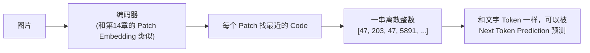
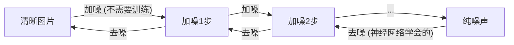
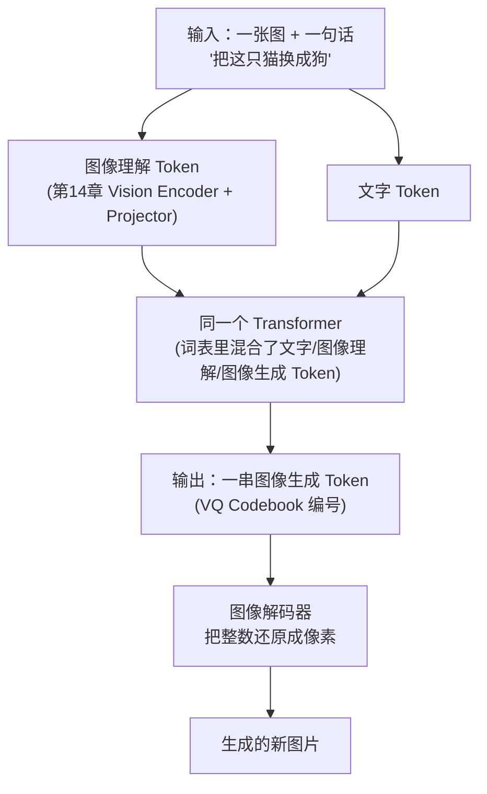
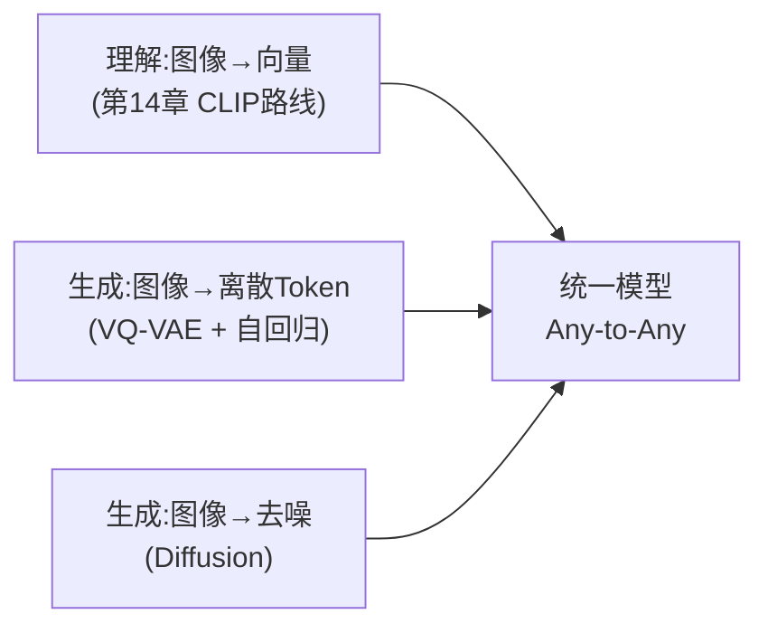

# 15. 多模态大模型进阶——统一理解与生成

## 上一章解决的是"看懂"，这一章要解决"画出来"

上一章，我们让模型学会了理解图像：给它一张图，它能读懂、能回答问题。但今天的多模态大模型（GPT-4o、Gemini）还能做另一件事——**你描述一句话，它能画一张图出来**。这是完全反过来的任务：上一章是"图像 → 向量 → 语言"，这一章是"语言 → ??? → 图像"。

这里有一个关键困难：第14章的图像向量是**连续的**（`v_img` 是一串浮点数），而 GPT 生成文字时用的 Next Token Prediction，本质上是在一个**离散的**词表里做分类（第1.2节讲过，输出是一个概率分布，从几万个候选 Token 里选一个）。图像的向量是连续的，没有"词表"这个概念，要怎么让模型像"预测下一个字"一样"预测下一块图像"？

---

## 图像的"分词"：VQ-VAE，给图像造一个词表

**核心想法：既然文字可以有词表，图像为什么不能？** 第2章我们学过 BPE，是从海量文本里统计、合并出一个几万大小的词表；图像世界的对应方法叫 **VQ-VAE（Vector Quantized Variational AutoEncoder）**，思路异曲同工：

1. **训练一个"图像词表"（Codebook）。** 准备好比如 8192 个向量，随机初始化，这就是图像世界的"词表"，词表里的每一个向量称为一个 **Code**。
2. **把图像 Patch 特征"归入"最接近的 Code。** 一个 Patch 经过编码器变成一个向量后，去词表里找**距离最近**的那个 Code，用这个 Code 的编号（一个 0~8191 的整数）代替这个 Patch——这个过程叫**向量量化（Vector Quantization）**。

```
Patch特征向量 [0.82, -0.31, 0.15, ...]
        ↓ 在词表里找最近的 Code
词表: Code_0, Code_1, ..., Code_8191
        ↓ 假设 Code_47 最接近
这个 Patch 就被替换成整数 47
```

3. **一整张图片，就变成了一串整数序列**——比如 `[47, 203, 47, 5891, ...]`，**这串整数，和第2章 BPE 切出来的 Token ID 序列，形式上完全一样！**

**这一步带来的关键转变是什么？** 图像从"一堆连续的浮点向量"，变成了"一串离散的整数 Token"。一旦变成了离散 Token，**第1章、第13章讲过的 Next Token Prediction 就可以原样套用到图像上**：把图像 Token 也塞进词表（和文字 Token 共用，或者单独开一段编号），训练时预测"下一个图像 Token 是词表里的第几号"，和预测"下一个文字 Token 是哪个词"，用的是同一套 Softmax + Cross Entropy。



这类"把图像离散化、再用自回归方式一个个预测出来"的生成模型，本质上是在做一件事——**用第1章学过的方法，把"写一句话"换成了"画一张图"**：模型不是一次性生成整张图片，而是像写文章一样，一个 Token（对应图像里的一小块）接一个 Token 地"续写"出整张图片。

---

## 另一条路线：Diffusion（扩散模型）

VQ-VAE + 自回归是"一块一块生成"，还有另一条完全不同的技术路线：**Diffusion（扩散模型）**——如果你已经看过第四部分第6章的 Diffusion Policy，这里的核心思路完全一致，只是从"去噪出一段机器人动作序列"换成了"去噪出一张图片"。

**核心想法：先把图片"变脏"，再学怎么"洗干净"。**

1. **加噪过程（Forward Process）**：拿一张清晰的图片，每一步都加入一点随机噪声，重复很多步之后，图片会彻底变成一片纯噪声——这一步不需要训练，就是简单的加法。
2. **去噪过程（Reverse Process）**：训练一个神经网络，让它学会"给定一张带噪声的图片，猜出刚才加的是什么噪声，把它减掉"。



**生成新图片时，怎么用这个训练好的"去噪网络"？** 从一片纯随机噪声开始，反复调用这个去噪网络，一步一步把噪声"洗"成一张清晰、有意义的图片——每一步去掉一点噪声，几十步之后，一张全新的图片就"显现"出来了。

**Diffusion 和"VQ-VAE + 自回归"最大的区别是什么？** 自回归是"一块接一块、按顺序生成"（像写字），Diffusion 是"整张图同时、反复地精细化"（像先画草图再逐步细化），两条路线目前在图像生成领域都有大规模的商用系统（自回归路线如早期的 DALL-E，Diffusion 路线如 Stable Diffusion、Midjourney），谁更好并没有定论，更像是两种不同的工程取舍。

---

## 统一理解与生成：一个模型，既能"看"又能"画"

第14章讲的理解模型（连续向量 + Vision Encoder + Projector）和这一章讲的生成模型（离散 Token + 自回归，或者 Diffusion），原本是两条几乎不相交的技术路线，各自演进了很多年。今天最前沿的多模态大模型，正在尝试把两者**统一进同一个模型**：

**统一的关键，正是回到"一切都是 Token"这个第2章就讲过的朴素想法：**

- **理解输入的图像**：用第14章的方式，连续向量 + Projector，变成"图像理解 Token"。
- **生成输出的图像**：用这一章 VQ-VAE 的方式，离散 Codebook 编号，变成"图像生成 Token"。
- 两种 Token 和文字 Token 一起放进同一个词表、同一个 Transformer，模型看到"画一只猫"这句话的文字 Token 后，接下来预测的不再是文字 Token，而是一串"图像生成 Token"，最后再用一个专门的解码器（Decoder）把这串整数还原成真正的像素图片。



这类模型通常被称为 **Any-to-Any（任意到任意）多模态模型**——输入可以是文字、图像，甚至未来的音频、视频；输出也可以是文字、图像、音频、视频的任意组合，第2章"一切都先变成 Token"这个思想，正在从纯文本的世界，扩展成横跨所有模态的统一框架。

**另一种工程范式：多阶段生成。** Any-to-Any 是"一个模型同时理解与生成所有模态"的联合路线；还有一种更朴素的工程做法——**多阶段生成**：Karpathy 的 LLM101n 课程（"Let's build a Storyteller"）演示的正是这个思路——先用文本流把故事写出来，再让模型根据已写出的文本生成对应的插图，文本 Token 和图像 Token 在同一个模型里**交替出现**。联合生成追求"一步到位"（比如"把这只猫换成狗"直接输出新图），多阶段生成追求"工程可控"（先生成文字、再配图，每一步都能单独检查）。两条路线目前在真实产品里并存，并不互相替代。

**图像 Token 不一定是整数。** 第15.1节实验里我们用 VQ-VAE 把图像变成离散整数；但 LLM101n 走的其实是另一条路：用 VAE 把图像压成**少量连续的隐向量**，模型预测的不再是"词表里的第几号"，而是一个连续向量（或者把它再量化一次）。**"离散 Codebook"是图像 Token 化的一种选择，不是唯一选择**——连续向量 + 回归式预测也能工作，只是"离散整数"和文字 Token 的形式更统一，所以大多数系统选择了 VQ-VAE 这条路。

---

## 音频、视频怎么接入？

**音频**比图像更接近文字：它本来就是一维的"时间序列"。接入 LLM 需要两步——先变成连续向量，再（对生成任务而言）变成离散 Token：

1. **声学特征层：波形 → 分帧 → 频谱向量。** 一段语音先按 20~30 毫秒切成时间帧（语音在这么短的时间内可以看作近似稳定的，这叫**短时平稳**），每帧做 FFT 得到频谱、再映射到 Mel 刻度（人耳对频率的感知不是线性的，Mel 刻度是对数尺度的近似），得到一串连续向量——**这一步和第14章的 Patch Embedding 是同一个思路，只是"切"的对象从二维图像变成了一维时间轴**。
2. **离散 Token 层：神经音频编码器。** 和图像生成需要 VQ-VAE 一样，音频生成也需要"音频词表"。工业界用的是 **EnCodec / SoundStream** 这类**神经音频编码器**：先用神经网络把一段音频压成一个向量，再做**残差向量量化（Residual VQ）**——第一次量化出最接近的 Code，把"剩余误差"再量化一次、再量化一次……层层逼近，最终把整段音频变成一串 0~N 的整数。**这就是"音频的 VQ-VAE"**（想亲手体验分帧 + 量化这条完整链路，见实验 15.2）。

到这里，"音频也有了词表"——音频生成（如 MusicLM、语音合成）就能用 Next Token Prediction 那一套方法了。

**一个重要的区分：声学 Token vs 语义 Token。** EnCodec 这类编码器保留的是**声学信息**（音色、语调，适合生成）；而 Whisper 这类模型把语音直接转成**语义单元**（内容、文字，适合理解）。两者粒度不同、用途不同，但都符合"切成 Token"的统一框架。

- **视频**：可以理解成"图像 + 时间"——一段视频先按帧拆开，每一帧用第14章的方法变成图像 Token，不同帧之间再额外补一份"时间位置编码"（类似第10章讲的位置编码，只是这次要同时表示"空间位置"和"时间位置"两个维度）。

**万变不离其宗**：任何一种新模态，只要能找到一种"切块 + 投影成向量（必要时再量化成离散 Token）"的方法，就能接入我们已经学过的整套 Transformer 框架——这是本章和上一章共同想传达的核心认知。

---

## 一张图总结本章



想亲手体验"图像如何被离散化成 Token"这个过程，可以看这一节实验：**15.1 亲手实现一个最小 VQ-VAE，把图片编码成离散 Token 再重建回来**；音频版的"分帧 + 量化成 Token"实验在 **15.2 亲手把一段音频变成"音频 Token"——分帧、提特征、量化**。

---

## 本章总结

本章我们理解了：

✅ 图像生成的核心困难是"连续向量无法直接做 Next Token Prediction"，VQ-VAE 通过训练一个"图像词表（Codebook）"，把连续特征量化成离散整数，让图像也能被当作 Token 序列自回归生成 ✅ Diffusion 走的是另一条路线——训练网络学会"从带噪图片中猜出并去掉噪声"，生成时从纯噪声反复去噪得到新图片 ✅ 统一理解与生成的多模态模型，本质上是把"理解用的连续 Token"和"生成用的离散 Token"混合进同一个词表、同一个 Transformer ✅ 音频、视频接入 LLM 的方法，本质上都是"找到一种切块方式，投影成向量"，和图像 Patch Embedding 是同一个思路的不同变体

> **从文字，到图像理解，再到图像/音频/视频生成，贯穿始终的只有一个思想：把任何模态都变成 Token，剩下的交给 Transformer。这正是本书从第2章 Tokenizer 开始就在讲的那个道理，只是这一次，它被用在了远比文字更广阔的世界里。**

## 下一章预告

即使拥有了推理能力、超长上下文、多模态理解与生成，现代大模型仍然只能**回答问题、生成内容**——它不会主动打开浏览器，不会操作文件，不会调用真实世界的 API，不会完成一个需要多步骤协作才能达成的真实任务。这也是为什么"Agent"被认为是大模型之后的下一次范式升级：**从会说、会画，到会做。** 而"做"有两层含义：第三部分讲 Agent 在数字世界里做（调用工具、操作系统），第四部分讲具身智能在物理世界里做（驱动真实的机器人）——本章的多模态能力（看懂、听懂），正是通往这两个世界共同的感官入口。

---

# 参考资料

- Tommy《Multimodal Season 1》（多模态大模型架构、训练配方与评测的系统性博客系列）：https://www.tgltommy.com/p/multimodal-season-1
- MIT《Introduction to Multimodal AI》课程（连接语言与图像、音乐与艺术、感知与行动的多模态原理）：https://mit-mi.github.io/mmai-course/spring2026/
- Coursera《Multimodal Intelligence: Vision, Audio and Language in Action》专业证书（视觉 + 音频 + 语言的多模态实战）：https://www.coursera.org/professional-certificates/multimodal-intelligence-vision-audio-and-language-in-action
- Karpathy《LLM101n: Let's build a Storyteller》（从零构建一个既能写故事又能配图的多模态 LLM）：https://github.com/karpathy/LLM101n
- B 站《多模态大模型》相关视频讲解：https://www.bilibili.com/video/BV1aUSjBtEQu/
- Sebastian Raschka《Build a Large Language Model (From Scratch)》配套代码与全书资源：https://github.com/rasbt/LLMs-from-scratch
