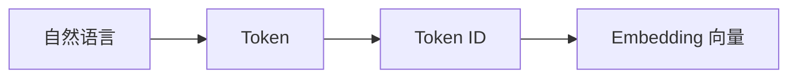
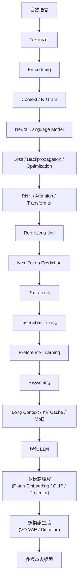

# 16. 总结

经过前面十五个技术主章及配套实验的学习，我们已经走过现代大语言模型（LLM）从纯文本到多模态的基础路线。回顾整条学习路线会发现，所有内容都围绕着一个核心问题展开：

> **模型是如何理解语言（乃至图像），并最终表现出智能的？**

下面用七个阶段，把这条路线重新串一遍。

## 第一阶段：语言数字化

计算机并不能直接理解文字、图片或声音，因此第一步永远是把连续的语言变成模型能处理的数学对象：

Tokenizer 把连续的语言切分成离散的 Token；Embedding 再把每个 Token ID 映射成一个高维向量。至此，文字第一次变成了数学对象，模型才有了"下手"的地方。

## 第二阶段：学习表示（Representation）

有了向量之后，模型开始学习不同 Token 之间的关系——这正是 Self-Attention 的工作：让每一个 Token 都能够"看到"并权衡其它Token 的信息。Transformer 把Attention、Feed Forward、Residual Connection、Layer Normalization 反复堆叠，逐层提炼出越来越抽象的表示（Representation）。这正是 Transformer 真正"学习知识"的地方——知识不是被硬编码进去的，而是分布式地存在于这些层层叠叠的向量表示中。

## 第三阶段：预测下一个 Token

拥有了 Representation 之后，模型的训练目标出乎意料地简单：**Next Token Prediction**（预测下一个 Token）。在数万亿 Token 的互联网文本上反复训练这一个目标，模型却逐渐学会了语言、知识、代码、数学甚至逻辑推理。请注意，模型并不是"为了学习知识而学习知识"，而是为了不断提高预测准确率，这些能力才作为副产品自然涌现出来。

## 第四阶段：从语言模型到智能助手

Pretraining 让模型"知道世界"；Instruction Tuning 让模型"理解用户"；Preference Learning 让模型"符合人的偏好"。三者叠加，GPT 才逐渐演化成今天的 ChatGPT——模型开始真正成为能够协助人类完成任务的助手，而不只是一个知识渊博的续写机器。

## 第五阶段：从回答问题到解决问题

现代大模型已经不满足于"生成语言"，而是开始真正"进行推理"：Chain of Thought 让模型把推理过程展开写出来；Test-Time Scaling 让模型在推理阶段投入更多计算；Reasoning Model 进一步把训练目标从"生成答案"转向"解决问题"。模型的角色，正在从"回答机"向"解题者"迁移。

## 第六阶段：模型越来越大，也越来越高效

为了支撑更复杂的任务，Transformer 仍在持续演化：Long Context 扩大了上下文窗口；KV Cache 避免了自回归生成时的重复计算；MoE 在扩大模型容量的同时控制住了推理成本。现代大模型已经能够支持超长文档、复杂推理、多轮交互，以及越来越专业化的能力分工。

## 第七阶段：从纯文本到多模态

模型能读、能写、能推理，但如果只能处理文字，终究只理解了世界的一部分。Patch Embedding 让图像也能被切成一串向量，就像文字被切成 Token；CLIP 式的对比学习让图像向量和文字向量被拉进同一个语义空间；Projector 把这份对齐"翻译"给 LLM；VQ-VAE 又反过来给图像造了一份离散词表，让 Next Token Prediction 这套核心方法也能用来"画"图；音频则通过分帧 + 神经音频编码器（EnCodec 的残差量化）拥有了自己的 Token（实验 15.2）。至此，"一切都是 Token，Transformer 不关心 Token 来自哪个模态"这条从第2章就开始铺垫的主线，第一次在图像和声音的世界里被完整兑现。

## 第一部分知识地图

## 第一部分最重要的六个认知

| # | 核心认知 | 一句话解释 |
|---|---|---|
| 1 | Token 是大模型理解世界的基本单位 | 模型从未真正"看到"文字或图像，它看到的始终是 Token |
| 2 | Transformer 是现代大语言模型的共同基础架构 | Attention 让模型能够理解上下文，GPT、BERT、Llama、Qwen、DeepSeek、Gemini 无一例外建立在它之上 |
| 3 | 自回归语言模型预训练通常以预测下一个 Token 为目标 | 本部分的 GPT 实验采用这一目标；它不涵盖所有模型与阶段，后训练还有偏好损失、奖励优化，多模态也可能采用对比或扩散目标 |
| 4 | 模型的知识、能力和行为来自多个阶段共同作用 | Pretraining 建立基础，Instruction Tuning、Preference Learning 和推理训练进一步调整；阶段之间并不存在“知识只能在预训练中学习”的硬边界 |
| 5 | 现代 LLM 仍在不断演化 | Long Context、KV Cache、MoE、Reasoning 说明大模型早已不再只是"会聊天"，而是在持续朝着理解、规划、推理、协作的方向发展 |
| 6 | 多模态的本质是"找到一种方式把新模态变成向量" | 无论是图像 Patch、音频片段还是视频帧，只要能对齐进 Transformer 认识的向量空间，架构本身完全不需要改动 |

到这里，我们已经回答了第一部分的核心问题：**大语言模型为什么能够理解语言（乃至图像）？**

不过，无论模型多强，它目前仍然只能**回答问题、生成内容**：它不会主动打开浏览器，不会操作文件，不会调用 API，也不会驱动一台真实的机器人。后面三个部分分别解决这条链上的三个问题：

| 部分 | 回答的问题 |
|---|---|
| 第二部分 Alignment 与训练工程 | 一个只会预测 Token 的模型，如何变成 ChatGPT 这样可用的产品？ |
| 第三部分 Agent | 如何让模型在数字世界里完成任务——调用工具、读写文件、多步协作？ |
| 第四部分 具身智能 | 如何让模型在物理世界里完成任务——感知环境、规划动作、控制机器人？ |

本部分学到的多模态能力（看懂、听懂），正是通往后两个世界共同的感官入口。接下来先进入第二部分：第一部分对 SFT、偏好学习和推理的介绍是路线预览，第二部分将展开它们的数据、目标函数和工程实现。

**实验对象也会随之切换**：nanoGPT 用小模型和小语料展示“参数怎样学会预测”；第二部分借用已有基础能力的开源权重，练习数据处理、指令微调和偏好优化，而不是把莎士比亚小模型直接训练成中文助手。第一部分的手写实现仍是理解这些框架调用的基础。
