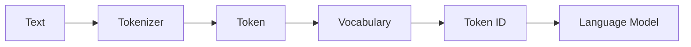
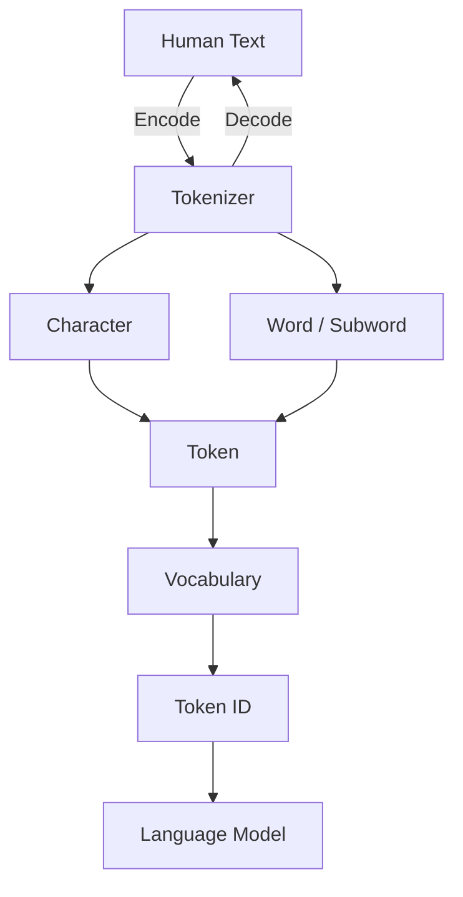

# Chapter 2 Tokenizer —— 大模型为什么看不懂文字？

> **本章目标**
>
> 第一章中，我们实现了一个Character Bigram Language Model，但它有一个明显的问题：
>
> **第一章按字符切分文本，虽然实现简单，但序列较长，也难以复用常见词根和子词结构。现代 LLM 通常采用 Subword 或 Byte-level Tokenizer，在词表规模、序列长度和未知文本处理能力之间折中。**
>
> 本章要回答：**为什么 LLM 不直接处理文字，而要先经过 Tokenizer？** 最终，我们将从零实现一个简化版 Tokenizer，并逐步演进到现代大语言模型使用的 BPE（Byte Pair Encoding）。

---

# 本章学习目标

完成本章后，你应该能够回答：

* 为什么模型不能直接处理字符串？Character、Word 和 Token 有什么区别？
* 什么是 Vocabulary（词表）？什么是 Token ID？Encode 和 Decode 是什么？
* 什么是 `<UNK>`？为什么 GPT、Qwen、Llama 的 Token 数量都不一样？
* 为什么现代 LLM 常采用 Subword 或 Byte-level 方案，而不是纯 Character 或纯 Word？

---

# 2.1 第一章留下的问题

回顾第一章，训练数据是逐字符处理的：`current = text[i]; next = text[i+1]`。看起来没问题，但如果训练数据变成 `I love AI.`，模型实际看到的是：

```text
I · (space) · l · o · v · e · (space) · A · I · .
```

其中 `love` 被拆成 4 个 Token。模型可以通过后续网络学习这些字符的组合规律，并非“永远无法理解单词”；问题在于序列变长，训练和推理成本上升，而且常见词和词根不能直接作为一个可复用单位。中文按字切分也有类似权衡：覆盖范围较好，但“人工智能”等常见词组需要跨多个位置组合。

因此 Character Tokenizer 的主要局限是：

> **单位过细，导致序列较长，并把更多组合工作留给后续模型。**

---

# 2.2 为什么不能直接使用单词（Word）？

既然 Character 太小，很自然会想到直接用 **Word** 切分：`I love AI → I / love / AI`。看起来很合理，但真正训练语言模型时，Word Tokenizer 会遇到三个问题：

**问题一：新词（Out-of-Vocabulary）**——假设训练时词表里只有 `cat`、`dog`，用户输入 `cats` 怎么办？词表里根本没有这个词，模型直接无法处理，这就是现代 NLP 最经典的问题之一：**OOV**。

**问题二：词表容易膨胀**——`play / playing / played / player / players / ...` 若每个词形都作为独立 Word，覆盖更多语料和领域时 Vocabulary 会快速增大；固定词表仍无法收录所有未来输入。

**问题三：浪费训练数据**——`play / playing / played` 其实都来自同一个词根 `play`。如果完全切成不同的 Word，模型就无法共享这个词根，学习效率下降。

Character 太细、Word 太粗，现代 LLM 选择了折中方案：

```text
Character（粒度细）→ 序列通常较长
Word     （粒度粗）→ OOV / 大词表 / 统计共享不足
Subword  （折中）  →  现代 LLM 的常见选择
```

> **多数现代 LLM 使用子词或字节级方法，在词表大小、序列长度与覆盖能力之间折中。**

---

# 2.3 什么是 Token？

很多初学者以为 `Token = Word`，实际上完全不是。Token 的真正定义是：

> **Tokenizer 切分出来、供模型学习的最小语言单位。**

例如 `playing`：

| 切分方式 | 结果 |
| --- | --- |
| Character | `p / l / a / y / i / n / g` |
| Word | `playing` |
| Subword（可能） | `play / ing` |
| Subword（也可能） | `pla / ying` |

具体怎么切完全取决于 Tokenizer，所以 Token 不是固定的，**它是 Tokenizer 的输出**。

---

# 2.4 Tokenizer 的职责

> **Tokenizer 的职责，就是把人类能够理解的文本，转换成模型能够处理的 Token ID。**

整个流程如下：



这一整条 Text → Token ID 的过程叫 **Encode（编码）**；反过来，把模型输出的 Token ID 还原成文字，叫 **Decode（解码）**。从这里开始，Language Model 再也不会看到 `hello world`，它真正看到的是 `[3,2,4,4,5,0,7,5,6,4,1]`。

第二章实验，我们就会亲手实现这条 Text → Token → Token ID 的流水线。

---

# 2.5 本章知识地图



---

# 本章实验预告

本章依然遵循**代码演进**原则，不会推倒重写第一章：

| 实验      | 内容                | 在上一章基础上的变化                                   |
| ------- | ------------------- | -------------------------------------------- |
| **2.1** | Character Tokenizer | 增加 `encode()` / `decode()`，Language Model 不变 |
| **2.2** | Word Tokenizer      | 输入由字符升级为单词                                   |
| **2.3** | `<UNK>` Token | 观察 Word Tokenizer 如何处理 OOV |
| **2.4** | Subword 理论 | 解释 Character 与 Word 之间的折中 |
| **2.5** | 手工执行 BPE 合并 | 理解 BPE 的基本规则 |
| **2.6** | Mini BPE Tokenizer | 训练并运行一个简化的 BPE Tokenizer |

这些章节不修改第一章的 Language Model，重点是在 Text 和 Language Model 之间补齐 Tokenizer 与 Token ID 两个环节。这也是本书始终坚持的原则：

> **Every chapter evolves the previous chapter, never rewrites it.**
