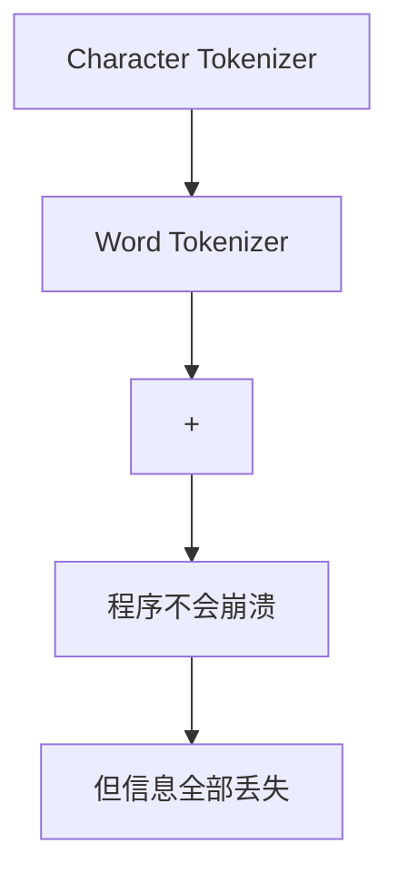

# 2.3 Unknown Token——定义与未登录词处理

> **硬件要求**：CPU 即可运行（普通笔记本可跑）
>
> **实验目标**
>
> 上一节，我们实现了 Word Tokenizer。在示例中它产生的序列更短，但也暴露出一个问题：**遇到词表中不存在的新词时，程序会直接崩溃**。本实验将引入 NLP 中第一个特殊 Token：**`<UNK>`（Unknown Token）**。

---

# 一、回顾上一节的问题

上一节的 `WordTokenizer`，训练数据只有 `I love AI`，如果这样调用：

```python
tokenizer = WordTokenizer("I love AI")
tokenizer.encode("I love ChatGPT")
```

程序会直接报错：`KeyError: 'ChatGPT'`。原因很简单，训练数据中只有 `I / love / AI`，Vocabulary 为 `{AI:0, I:1, love:2}`，当 Tokenizer 遇到 `ChatGPT` 时，它不知道应该映射成哪个 Token ID。这就是 **Out-of-Vocabulary（OOV）**，也就是词表之外的单词。

---

# 二、最直接的解决办法

既然不知道是什么词，那就统一表示成 `<UNK>`，意思是 **Unknown（未知）**。于是 Vocabulary 变成：

```text
{<UNK>:0, AI:1, I:2, love:3}
```

以后所有不认识的词全部映射成 `0`，是不是就不会崩溃了？

---

# 三、升级 build()

修改 `vocab = sorted(set(words))` 为：

```python
vocab = ["<UNK>"] + sorted(set(words))
```

完整代码：

```python
def build(self, text):
    words = text.split()
    vocab = ["<UNK>"] + sorted(set(words))
    self.stoi = {w: i for i, w in enumerate(vocab)}
    self.itos = {i: w for w, i in self.stoi.items()}
```

Vocabulary 变成 `{<UNK>:0, AI:1, I:2, love:3}`。

---

# 四、升级 encode()

上一节 `return [self.stoi[word] for word in text.split()]`，如果词不存在程序就会崩溃。改成：

```python
def encode(self, text):
    ids = []
    for word in text.split():
        ids.append(self.stoi.get(word, self.stoi["<UNK>"]))
    return ids
```

这里第一次使用 `dict.get()`：找到就返回真正 Token ID，找不到就返回 `<UNK>` 对应的 ID。

---

# 五、完整代码

把上面 `build()` 和 `encode()` 的修改，合并回完整的 `WordTokenizer`，得到这一节最终、可以独立复制运行的版本：

```python
#!/usr/bin/env python3
class WordTokenizer:

    def __init__(self, text):
        self.build(text)

    def build(self, text):
        words = text.split()
        vocab = ["<UNK>"] + sorted(set(words))   # 把 <UNK> 固定放在第0位
        self.stoi = {w: i for i, w in enumerate(vocab)}
        self.itos = {i: w for w, i in self.stoi.items()}

    def encode(self, text):
        ids = []
        for word in text.split():
            ids.append(self.stoi.get(word, self.stoi["<UNK>"]))  # 找不到就用 <UNK> 的 ID
        return ids

    def decode(self, ids):
        return " ".join(self.itos[i] for i in ids)

tokenizer = WordTokenizer("I love AI")
print(tokenizer.stoi)
print(tokenizer.encode("I love ChatGPT"))
print(tokenizer.decode([2, 3, 0]))
```

运行结果为:
```
{'<UNK>': 0, 'AI': 1, 'I': 2, 'love': 3}
[2, 3, 0]
I love <UNK>
```

程序终于不会崩溃了。

---

# 六、再测试几句话

```python
for text in ["I love OpenAI", "I love Claude", "I love Gemini"]:
    print(text, "→", tokenizer.encode(text))
```

输出：

```
I love OpenAI → [2, 3, 0]
I love Claude → [2, 3, 0]
I love Gemini → [2, 3, 0]
```

三句话编码结果完全一样——你会发现所有未知词全部变成了`0`。

---

# 七、真的解决问题了吗？

假设下面三句话：`I love ChatGPT`、`I love Claude`、`I love Gemini`，经过 Tokenizer 全部变成 `I love <UNK>`，也就是 `[2,3,0]`。对于模型来说，`ChatGPT`、`Claude`、`Gemini` 已经没有任何区别，所有信息全部丢失了。

---

# 八、为什么 `<UNK>` 不是最终方案？

`<UNK>` 的确解决了"程序不会崩溃"的问题，但它带来了新的问题：`OpenAI`、`ChatGPT`、`GPT-5`、`Claude`、`Gemini` 全部变成 `<UNK>`，模型根本不知道这些其实是不同的词。

因此，虽然 Word Tokenizer + `<UNK>` 已经能够正常运行，但它会把不同的新词压缩成同一个符号，信息损失严重。现代 LLM 通常采用 **Subword**，并常配合 Byte-level fallback：即使整个词没有出现在词表中，也能继续拆成更小的已知单位，从而尽量避免把所有未知文本都映射成同一个 `<UNK>`。这能保留字符组成信息，但不代表模型在切分后就“自然理解”了新词；词义仍需通过后续训练学习。

---

# 实验收获（Takeaways）

✅ 学会了 `<UNK>` 的设计思想，理解了 OOV（Out-of-Vocabulary）。
✅ 学会用 `dict.get()` 处理未知词。
❌ `<UNK>` 会丢失所有未知词的信息。

---

# 代码演进图



---

# Design Discussion（为什么不直接停在 `<UNK>`？）

`I love ChatGPT` 和 `I love Claude` 经过 `<UNK>` 后都变成 `I love <UNK>`，模型已经无法区分两句话。所以我们真正需要的不是"把未知词变成同一个 Token"，而是**"把未知词拆成模型认识的更小单元"**。这就是下一节 **Subword Tokenizer** 的核心思想。

BPE 并不是一种目标，它只是实现 Subword 的一种算法。理解"Character 太细 → Word 太粗 → 需要一个介于两者之间的单位（Subword）"之后，BPE 就会变成一个水到渠成的工程方案，而不是一个需要死记硬背的新算法。
