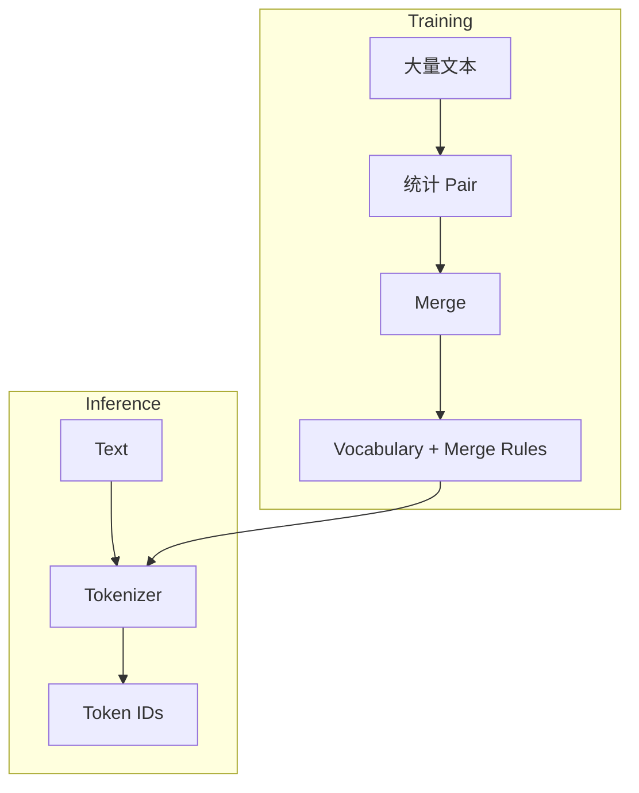
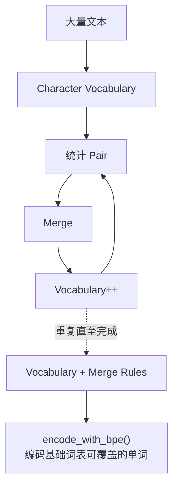
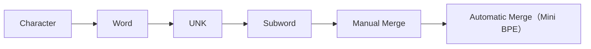

# 实验 2.6：训练一个 Mini BPE Tokenizer

> **实验目标**
>
> 上一节，我们已经手工完成了几次 Merge，但真实 GPT 不可能靠程序员手工决定 `l + o` 应该合并。本实验将让程序自己学习**哪些 Token 应该合并**，这就是 BPE Training。

---

# 一、重新认识 Tokenizer

到目前为止，我们一直把 Tokenizer 看成`Text → Token IDs`，其实这只是**Inference（推理）阶段**。真正的 GPT Tokenizer 在上线之前还有一个 **Training** 阶段：



Vocabulary 不是人工写出来的，而是**训练出来的**。

---

# 二、训练数据

为了方便观察，仍然采用极小数据集：

```python
corpus = ["low", "lower", "lowest", "lowing"]
```

实际 tokenizer 会使用更大语料，并加入预切分、归一化、字节映射、特殊 Token 与并行化等工程规则；下面只保留“统计 Pair 并迭代合并”的核心。

---

# 三、初始化 Vocabulary

这个简化实验把语料预先分成单词，并以语料中出现的字符作为基础 Vocabulary。下面的 `tokens` 表示当前切分结果，不是 Vocabulary 本身：

```python
tokens = []
for word in corpus:
    tokens.append(list(word))
```

输出：`[['l','o','w'], ['l','o','w','e','r'], ['l','o','w','e','s','t'], ['l','o','w','i','n','g']]`。每个内层列表独立处理，因此合并不会跨越单词边界。真实 tokenizer 还会明确空白、标点、归一化和字节回退等规则；本实验暂不实现这些部分。

---

# 四、统计 Pair

```python
from collections import Counter

pairs = Counter()
for word in tokens:
    for i in range(len(word)-1):
        pair = (word[i], word[i+1])
        pairs[pair] += 1
```

输出 `pairs` 得到 `('l','o'):4, ('o','w'):4, ('w','e'):2, ('e','r'):1, ...`，是不是和上一节手工统计完全一致？现在程序已经能够自己统计。

---

# 五、寻找最常见 Pair

```python
max_count = max(pairs.values())
best_pair = next(pair for pair, count in pairs.items() if count == max_count)
print(best_pair)  # ('l', 'o')
```

这里 `('l', 'o')` 与 `('o', 'w')` 都出现 4 次。我们明确规定：并列时选择统计顺序中最先出现的 Pair，所以结果为 `('l', 'o')`。固定 tie-break 规则可以保证相同输入得到相同 Merge Rules。

---

# 六、Merge

```python
def merge(tokens, pair):
    merged = []
    new_token = "".join(pair)
    for word in tokens:
        i = 0
        result = []
        while i < len(word):
            if (i < len(word)-1 and word[i]==pair[0] and word[i+1]==pair[1]):
                result.append(new_token)
                i += 2
            else:
                result.append(word[i])
                i += 1
        merged.append(result)
    return merged
```

执行 `tokens = merge(tokens, best_pair)`，输出：

```
[['lo','w'], ['lo','w','e','r'], ['lo','w','e','s','t'], ['lo','w','i','n','g']]
```

是不是已经完成了一次 Merge？

---

# 七、不断重复：写成一个真正能跑的训练函数

真正 BPE 的训练循环，翻译成代码就是：不断"统计 Pair → 找最高频 → Merge"，直到达到设定的合并次数。把前面几节的代码整理成一个完整的 `train_bpe()` 函数：

```python
#!/usr/bin/env python3
from collections import Counter
"""
完整的 BPE（Byte Pair Encoding）训练算法，核心思想是：
反复合并出现频率最高的相邻字符对，生成新的子词单元。
"""

# 统计相邻 token 对出现频次
# 返回：(token, token) -> count
# 请注意：第一次统计时，tokens 是单个字符列表，第二次统计时，tokens 是双字符列表，以此类推。
def get_pairs(tokens):
    pairs = Counter()
    for word in tokens:
        for i in range(len(word) - 1):
            pairs[(word[i], word[i + 1])] += 1
    return pairs

# 合并函数（核心）
# 在每个单词里，找到所有连续的 pair，把它们替换成一个新的 token。
def merge(tokens, pair):
    # 存放所有处理完的单词
    merged = []
    # 例如：把 ('l', 'o') 拼成 'lo'，把 ('lo', 'w') 拼成 'low'
    new_token = "".join(pair)
    for word in tokens:
        i = 0
        result = []
        while i < len(word):
            # 检查三个条件：
            # 1. i 后面还有元素吗？（防止越界）
            # 2. 当前元素 == pair[0] 吗？
            # 3. 下一个元素 == pair[1] 吗？
            if i < len(word) - 1 and word[i] == pair[0] and word[i + 1] == pair[1]:
                # 匹配，合并成新 token
                result.append(new_token)
                # 两个token已被合并为一个，因此跳过两个位置
                i += 2
            else:
                # 不匹配，保留原 token
                result.append(word[i])
                # 跳过一个位置
                i += 1
        merged.append(result)
    return merged


def choose_best_pair(pairs):
    """选择最高频 Pair；并列时选择统计顺序中最先出现者。"""
    max_count = max(pairs.values())
    return next(pair for pair, count in pairs.items() if count == max_count)


def train_bpe(corpus, num_merges):
    tokens = [list(word) for word in corpus]
    vocab = {char for word in corpus for char in word}
    merge_rules = []

    for step in range(num_merges):
        pairs = get_pairs(tokens)
        if not pairs:
            break
        best_pair = choose_best_pair(pairs)
        tokens = merge(tokens, best_pair)
        merge_rules.append(best_pair)
        vocab.add("".join(best_pair))
        print(f"第{step + 1}次合并: {best_pair} -> '{''.join(best_pair)}'")

    vocab = sorted(vocab)
    token_to_id = {token: token_id for token_id, token in enumerate(vocab)}
    return tokens, merge_rules, vocab, token_to_id


corpus = ["low", "lower", "lowest", "lowing"]
final_tokens, merge_rules, vocab, token_to_id = train_bpe(corpus, num_merges=6)

print("\n最终分词结果:", final_tokens)
print("Merge Rules:", merge_rules)
print("Vocabulary:", vocab)
print("Token IDs:", token_to_id)
```

输出：

```
第1次合并: ('l', 'o') -> 'lo'
第2次合并: ('lo', 'w') -> 'low'
第3次合并: ('low', 'e') -> 'lowe'
第4次合并: ('lowe', 'r') -> 'lower'
第5次合并: ('lowe', 's') -> 'lowes'
第6次合并: ('lowes', 't') -> 'lowest'

最终分词结果: [['low'], ['lower'], ['lowest'], ['low', 'i', 'n', 'g']]
Merge Rules: [('l', 'o'), ('lo', 'w'), ('low', 'e'), ('lowe', 'r'), ('lowe', 's'), ('lowes', 't')]
Vocabulary: ['e', 'g', 'i', 'l', 'lo', 'low', 'lowe', 'lower', 'lowes', 'lowest', 'n', 'o', 'r', 's', 't', 'w']
Token IDs: {'e': 0, 'g': 1, 'i': 2, 'l': 3, 'lo': 4, 'low': 5, 'lowe': 6, 'lower': 7, 'lowes': 8, 'lowest': 9, 'n': 10, 'o': 11, 'r': 12, 's': 13, 't': 14, 'w': 15}
```

和上一节手工合并的过程完全一致，但这一次是程序自己找出来的。
因为合并次数只有6次，lowing 被分成了 `low + i + n + g`，增加合并次数，可以继续合并lowing。

在这个 Mini BPE 中，每次成功合并恰好向词表增加一个 Token，因此 `目标词表大小 = 基础词表大小 + 成功合并次数`。真实 tokenizer 还可能加入特殊 Token，并采用 BPE、WordPiece 或 Unigram 等不同算法，不能把所有模型的词表大小都直接等同于 BPE 合并次数。

---

# 八、用训练好的 Merge Rules，给新词分词

训练结束后，编码需要同时使用基础词表、`merge_rules` 和 Token ID 映射。下面先对**字符均在基础词表中**的单个词应用规则；若出现未覆盖字符，这个简化实现仍会 OOV：

```python
def tokenize_with_bpe(word, merge_rules):
    tokens = list(word)
    for pair in merge_rules:
        tokens = merge([tokens], pair)[0]
    return tokens


def encode_with_bpe(word, merge_rules, token_to_id):
    unknown_chars = [char for char in word if char not in token_to_id]
    if unknown_chars:
        raise ValueError(f"基础词表未覆盖字符: {unknown_chars}")
    tokens = tokenize_with_bpe(word, merge_rules)
    return [token_to_id[token] for token in tokens]


def decode_with_bpe(ids, id_to_token):
    return "".join(id_to_token[token_id] for token_id in ids)


id_to_token = {token_id: token for token, token_id in token_to_id.items()}
for word in ["lowest", "slow", "glow"]:
    pieces = tokenize_with_bpe(word, merge_rules)
    ids = encode_with_bpe(word, merge_rules, token_to_id)
    restored = decode_with_bpe(ids, id_to_token)
    print(f"{word:<6} -> {pieces} -> {ids} -> {restored}")
```

输出：

```
lowest -> ['lowest'] -> [9] -> lowest
slow   -> ['s', 'low'] -> [13, 5] -> slow
glow   -> ['g', 'low'] -> [1, 5] -> glow
```

`slow` 和 `glow` 虽未作为完整词出现在训练语料中，仍可复用已学到的 `low`。这保留了字面组成并缩短了当前示例的序列，但不代表模型已经理解其词义。注意：这里 `s`、`g` 都在基础词表中；若输入含未覆盖字符，代码会明确报错。byte-level tokenizer 可用基础字节词表进一步避免这类 OOV。

---

# 九、保存训练结果

以 GPT-2 的 byte-level BPE 为例，核心持久化结果包含 Vocabulary 与 Merge Rules；完整处理还包括字节映射、预切分和特殊 Token 等约定：

**Vocabulary**（对应 `vocab.json`）：同时包含基础 Token 和合并产生的 Token，例如 `l, o, lo, low, ...`，并为每项保存 Token ID。

**Merge Rules**（对应 `merges.txt`）：`l o`；`lo w`；`low e`；`lowe r`；`lowe s`；`lowes t`……

推理阶段不需要重新统计频次，而是加载词表、合并规则及相同的预处理约定，再按规则编码。上面的 `encode_with_bpe()` 演示了单个已预切分单词的核心步骤。

---

# 十、完整训练流程



这一过程和第一章Language Model 的训练非常相似：第一章学习 Probability，第二章学习 Vocabulary，本质上都是**从大量数据中自动学习规则**。

---

# 实验收获（Takeaways）

✅ 实现了可运行的简化 BPE 训练函数，并明确了最高频并列时的规则。
✅ 基础 Vocabulary 由语料字符构成，新 Token 与 Merge Rules 由频次统计产生。
✅ 为 Vocabulary 分配了稳定 Token ID，并完成了单词级 `encode()` / `decode()` 往返。
✅ 验证了 `slow`、`glow` 可以复用训练得到的 `low`，同时明确了字符覆盖与单词边界限制。

---

# Code Evolution



至此，Tokenizer 系列实验（2.1~2.6）完成了从 Character、Word、`<UNK>` 到 Mini BPE 的核心概念。这个教学实现已有频次统计、Merge Rules、Vocabulary、Token ID 与单词级往返编码，但尚未覆盖完整文本的预切分、空白与特殊 Token、Unicode/字节回退等工程细节。下一章将讨论如何把 Token ID 映射为可学习的 **Embedding**。
