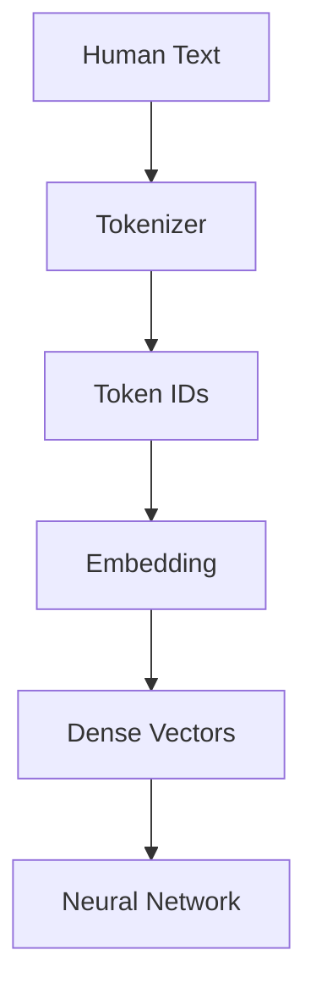
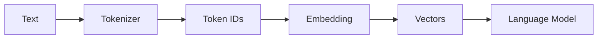

# Chapter 3：Embedding —— 大模型如何理解 Token？

> **本章目标**
>
> 第二章中，我们实现了简化的 Character、Word 和 BPE Tokenizer，能够把文本转换成 Token ID 序列。但新的问题来了：**这些编号到底代表什么？Token ID 是否已经包含词义？**
>
> 本章将回答一个基础问题：**为什么不应把 Token ID 当作具有大小关系的连续数值直接计算？** 随后用查表实现一个最小版 Embedding Layer。

---

# 本章学习目标

完成本章后，你应该能够回答下面几个问题：

- 为什么 Token ID 不能直接输入神经网络？什么是 One-Hot Encoding？
- 什么是 Embedding？Embedding Matrix 是什么？为什么叫 Lookup Table？
- Embedding 如何随训练目标和梯度更新？什么条件下相似上下文可能形成相似表示？
- GPT 的第一层到底做了什么？

---

## 一、第二章留下的问题

第二章最后，Tokenizer 已经完成 `Text → Tokenizer → Token IDs`，例如 `I love AI` 编码为 `[2,3,1]`。很多初学者会觉得 `2,3,1` 已经能够表示 `I, love, AI` 的含义，事实上完全不是。

---

## 二、Token ID 没有任何语义

观察 `cat` 和 `dog` 两个词，Tokenizer 可能得到 `cat → 128`，`dog → 129`。很多人会误以为 `129 > 128` 说明 `dog` 比 `cat` "更大"？当然不是。Token ID 只是**Vocabulary 中的编号**，就像学生学号 `1001, 1002, 1003` 之间没有任何数学意义，Token ID 也是一样。

再看一个例子，假设 Vocabulary 为 `{apple:0, banana:1, car:2, computer:3}`，`computer > banana` 没有语义，因为 `0,1,2,3` 只是编号。若把这些 ID 当作标量输入普通线性层，就会人为引入大小和距离关系；标准做法是把 ID 作为查表索引，而不是数值特征。

---

## 三、神经网络真正需要什么？

神经网络真正擅长处理的是**向量（Vector）**，例如 `[0.13, 0.42, 0.77, ...]`。因为向量之间可以计算距离、方向、相似度、线性组合，这些都是神经网络能够学习的。因此真正的数据流应该变成：

Embedding 就是连接**离散 Token** 与**连续向量**之间的桥梁。

---

## 四、本章知识地图

从这里开始，离散的 Token ID 被映射到可学习的**连续向量空间（Continuous Vector Space）**，后续神经网络将在这些向量上进行计算。

---

# 本章实验安排

本章在第二章 Tokenizer 的基础上补充 Embedding，安排如下：

| 章节 | 内容 | 目标 |
|------|------|------|
| **3.1** | Token ID 与 One-Hot | 解释为什么编号不能直接参与连续计算 |
| **3.2** | Embedding Matrix | 用查表把 Token ID 转成稠密向量 |
| **3.3** | Embedding 如何学习语义 | 说明梯度如何更新向量，以及如何解释相似性 |

---

# 本章最终工程

完成本章后，我们的工程将演进为：

这也是现代 GPT 在进入 Transformer Block 之前的完整数据流。

---

# 本章一句话总结

前两章解决的是**如何把文字变成 Token ID**。第三章解决的是**如何把 Token ID 映射成可学习向量**。从这里开始，数据进入神经网络能够执行线性变换和梯度更新的连续表示空间。

下一章，我们就来看看这些向量如何被真正"用"起来——**神经网络（Neural Network）**会接手它们，完成第一次真正的预测。
