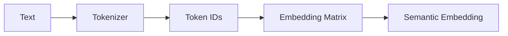

# 3.3 Embedding 是如何学习语义的？

> **本节目标**
>
> 上一节，我们已经知道 Embedding Matrix 是一个可训练的参数矩阵，训练过程中会不断更新，最终不同 Token 会拥有不同的向量表示。但一个重要问题仍然没有回答：**为什么这些向量会逐渐具有语义？** 为什么 `cat` 和 `dog` 最终会越来越接近，而 `apple` 却离它们很远？

---

# 一、语义来自哪里？

观察下面几句话：

```text
The cat is sleeping.
The dog is sleeping.
The cat is running.
The dog is running.
```

`cat` 和 `dog` 是不是总是出现在 `The ____ is` 这样的上下文中？再看：

```text
I eat an apple.
I eat a banana.
She likes apples.
He likes bananas.
```

`apple` 和 `banana` 也总是出现在相似的位置。于是研究人员提出了一个非常重要的思想。

---

# 二、Distributional Hypothesis（分布式假设）

语言学中有一句经典的话：

> **You shall know a word by the company it keeps.**
> **一个词的含义，可以通过它经常出现的上下文来理解。**

`cat` 经常和 animal、sleep、mouse、pet 一起出现，`dog` 也经常和 animal、sleep、pet、owner 一起出现。于是模型会逐渐认为 `cat` 和 `dog` 具有相似的语义。请注意，模型并不知道猫是什么、狗是什么，它只是发现**它们总是出现在相似的位置**。这就是现代词向量学习最重要的思想。

---

# 三、Word2Vec：第一个成功的词向量模型

2013年，Google 提出了 Word2Vec，它第一次证明：**只需要预测上下文，就可以自动学习出具有语义的词向量。** Word2Vec 提供了Skip-Gram 和 CBOW（Continuous Bag of Words）两种训练方式，本书只介绍 Skip-Gram，因为它更容易理解。

---

# 四、Skip-Gram 的思想

假设一句话 `I love AI`，当窗口大小为 1 时，训练数据可以拆成：

| 输入（Center Word） | 输出（Context Word） |
|----------------------|----------------------|
| love | I |
| love | AI |
| AI | love |

模型不断学习"已知中心词 → 预测周围词"。例如输入 `love`，预测 `AI`，预测 `I`。随着训练次数越来越多，Embedding 就会不断调整，最终经常拥有相同上下文的词，Embedding 会越来越接近。

---

# 五、Mini Skip-Gram 实验

用几十行代码模拟 Skip-Gram。语料：

```python
sentences = [
    ["I", "love", "AI"],
    ["I", "love", "Python"],
    ["I", "love", "NLP"]
]
window_size = 1
```

生成训练样本：

```python
pairs = []
for sentence in sentences:
    for i, center in enumerate(sentence):
        for j in range(max(0, i-window_size), min(len(sentence), i+window_size+1)):
            if i != j:
                pairs.append((center, sentence[j]))

print(pairs)
```

输出：`('I','love'), ('love','I'), ('love','AI'), ('AI','love'), ..., ('love','Python'), ..., ('love','NLP')`。请注意，真正训练的并不是句子，而是大量这样的"中心词 → 上下文词"配对。

---

# 六、为什么会学出语义？

训练过程中，模型不断看到 `love → AI`、`love → Python`、`love → NLP`。于是 Embedding 会不断调整 `AI`、`Python`、`NLP`，使它们都能够更容易被 `love` 预测出来。训练几百万次以后，由于 AI、Python、NLP拥有非常相似的上下文，它们的向量也会越来越接近。因此，语义并不是人为设计出来的，而是在预测上下文的过程中自然形成的。

---

# 七、GPT 还是 Word2Vec 吗？

不是。Word2Vec 只是最早证明"上下文可以学习语义"。今天的 GPT 已经不再使用 Skip-Gram，而是直接利用 Transformer 进行端到端训练。但Embedding 学习语义的核心思想直到今天仍然没有改变：

> **拥有相似上下文的 Token，会学习到相似的向量表示。**

---

# 八、Embedding 到底是怎么被"调整"的？和 Weight 是一回事吗？

上面反复说"Embedding 会不断调整"——它和下一章要学的 Weight，是同一回事吗？**是的：Embedding Matrix 里的每一个数字，本质上和 Weight、Bias 一样，都只是模型的参数（Parameter），训练时会被同一套方法一起更新，没有另外一套"专门给 Embedding 用"的机制。** 至于这套方法具体怎么运作（梯度、反向传播），我们还没学到必要的工具，第6章会亲手实现一次真正的训练，到那时你会亲眼看到 Embedding 和 Weight 是怎么被一起改动的。

---

# 本节总结

> **Embedding 的语义，不是人工设计的，而是在预测上下文的过程中学习得到的。**

Word2Vec 只是这一思想最经典、最容易理解的实现。现代 GPT 虽然已经不再采用 Word2Vec 的训练方式，但仍然沿用了这一核心思想。

---

# Code Evolution



下一章，我们将继续向前一步。虽然现在每一个 Token 已经拥有了自己的语义，但 `cat` 仍然不知道前面是谁、后面是谁——Embedding 只能表示单个 Token，却无法理解整个句子的上下文。下一章，我们将构建第一个真正的 **Neural Language Model**，让多个 Token 第一次开始共同完成预测任务。
