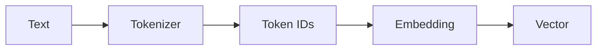
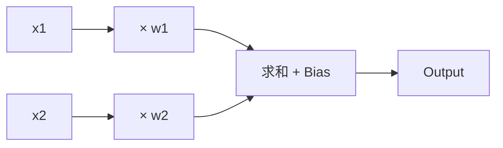
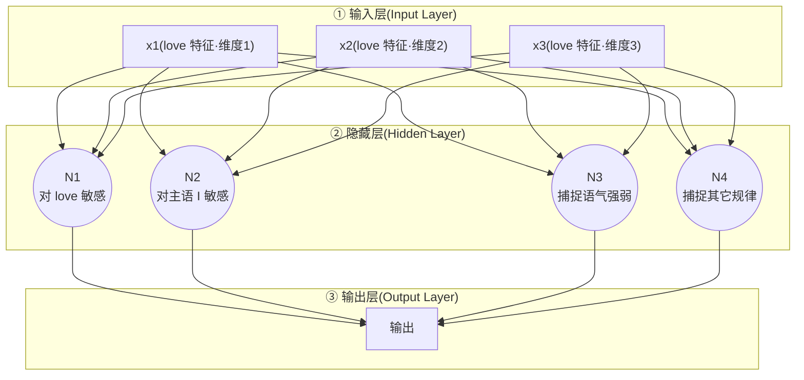
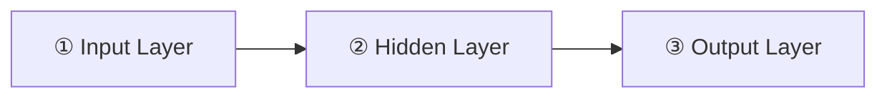
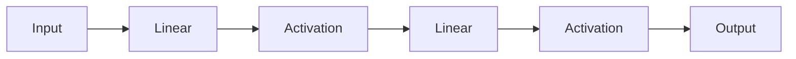

# 4. 神经网络——从神经元到 MLP

> **本章目标**
>
> 前三章,我们已经能把文字变成 Token(Tokenizer),再把 Token 变成向量(Embedding)。但向量本身不会预测:输入 `I love`,模型凭什么说下一个词更可能是 `AI`?本章就来补上这块核心拼图——**神经网络**。
>
> 我们将从一颗神经元(一次加权求和,由 **Weight** 和 **Bias** 决定)出发,把它扩展成一整层(Linear Layer),再通过**激活函数(Activation Function)**堆叠成多层,亲手组装出标题里的主角 **MLP(Multi-Layer Perceptron)**;接上 **Softmax** 让模型第一次能够"输出概率",最后用 **Cross Entropy Loss(交叉熵损失函数)** 给这次预测打一个"差多少"的分数,走完一次完整的**前向传播(Forward Pass)**。
>
> **分工说明**:本章用一份简化的 `love` 特征(3 维向量)认识每个零件——神经元、Linear、Activation、MLP、Softmax、Loss,数字都是手工挑好的,目的是把概念看透。第 6 章会把同样的零件装进真正的 `Context → Next Token` 流水线并完成训练;到那时你会发现,零件还是这些零件,只是接上了真实数据。

## 本章路线图

整本书的主线是一条不断变长的流水线,本章负责把中间这一段补齐:


前面两步是第 2、3 章的内容:`Text → Token IDs` 是 Tokenizer,`Token IDs → Embedding` 是 Embedding 层。本章从 MLP 出发,一路走到 Loss。严格来说,Softmax 和 Cross Entropy 并不属于 MLP——它们是"把 MLP 的输出变成概率、再变成分数"的两块拼图;为了讲完一次完整的前向传播,本章把它们一起讲了。

---

## 4.1 Embedding 为什么还不能预测？

上一章结束时,我们已经完成了:



例如 `I love AI` 中,`I` 变成 `[0.11, 0.42]`,`love` 变成 `[-0.32, 0.84]`,`AI` 变成 `[0.92, -0.17]`(示意数字)。现在每个 Token 都有了自己的语义表示——那么,是不是已经可以预测下一个 Token 了?

**还不能。** Embedding 的职责只有一个:**表示(Representation)**。它负责告诉模型"这个 Token 长什么样",就像字典负责解释单词,但字典不会替你写作文。给模型三个向量,它依然不知道 `I love` 后面该接 `.`、`today` 还是 `very`——"根据输入算出输出"是另一件完全不同的事,需要一个专门的新模块:

> **Neural Network(神经网络)**

顺便回顾一下第 3 章最后的流水线图:Embedding 后面那块写着 "Language Model"——它内部真正负责计算的模块,就是神经网络。

下面,我们从神经网络最小的一颗螺丝钉——神经元——开始,亲手把它组装成真正的 MLP。

---

## 4.2 神经元:一次加权求和

先忘掉"神经网络"这个名字,它没有任何神秘之处。我们的任务只有一个:**预测 `I love ___` 后面最可能出现的词**。模型该用什么做预测?最朴素的想法:给输入的每个维度一个"重要程度",加权求和。

**加权求和(Weighted Sum)。** 假设输入只有两个数字 `x1=0.8, x2=0.3`(可以想象成 `love` 这个词的特征向量,这里先取前两维)。如果第一个维度更重要,就给每个维度配一个权重,比如 `w1=0.9, w2=0.2`。预测值 = 每个输入乘以自己的权重,再全部相加:

```
0.8×0.9 + 0.3×0.2 = 0.72 + 0.06 = 0.78
```

这就是加权求和。

**Weight(权重)是什么？** 权重代表"模型认为这个维度有多重要"。在真实模型里,不同维度拥有不同的 Weight,而且这些 Weight 不是人设计的,而是在训练过程中从数据里学出来的——这一点后面还会反复遇到。

> **Weight 本质就是模型学到的经验。**

这也是为什么训练结束后,我们常说**保存模型参数(Model Parameters)**——这里的参数,主要就是 Weight 和 Bias。

**Bias(偏置)是什么？** 只有 Weight 还不够:万一预测结果整体偏高或偏低呢?于是再加一个固定的偏置,例如 `0.78 + 0.10 = 0.88`。完整公式变成:

```
Output = Weighted Sum + Bias = x₁w₁ + x₂w₂ + b
```

推广到任意多个输入,就得到深度学习中最著名的公式之一:

```
y = wx + b
```

(这里的 `w` 还只是一个向量——因为目前只有 1 个神经元;等到 4.5 节把多个神经元合并成一层,`w` 才会真正变成一个矩阵 `W`,这也是后面为什么"大写 W"和"小写 w"会分别出现的原因。)

**这就是一个神经元(Neuron)。** 一个神经元只做三件事:①每个输入乘以自己的 Weight;②全部相加;③加上一个 Bias。仅此而已:



没有任何神秘的地方。但请注意:我们算出来的 `0.88` 还什么都不是——它不是概率,也不是预测。要让它变得有用,还差两样东西:**更多的神经元**,以及**把数字变成预测的方法**。下面先亲手把这个神经元写成代码,然后再解决"不够用"的问题。

---

## 4.3 亲手实现第一个神经元

> **本节目标**:把上一节的公式变成代码,并理解为什么神经网络必须依赖向量运算。
>
> **统一例子**:从本节开始,所有代码和数字都会围绕同一份输入展开——`x = [0.8, 0.3, 0.5]`,把它理解成 `love` 这个词的一份简化特征表示。我们会拿着这份输入一路演进:神经元 → 层 → 激活 → MLP → Softmax → Loss,每一步的数字都首尾相接。

本实验只需要 Python 3.10+ 和 NumPy:

```bash
pip install numpy
```

先写一个最简版本:两个输入 `x1=0.8, x2=0.3`,权重 `w1=0.9, w2=0.2`,Bias `b=0.1`:

```python
#!/usr/bin/env python3
import numpy as np

x = np.array([0.8, 0.3])   # 两个输入
w = np.array([0.9, 0.2])   # 两个权重
b = 0.1                    # Bias

y = np.dot(x, w) + b       # 神经元输出
print(y)                   # 0.88
```

整个神经元的核心只有一行代码:`y = np.dot(x, w) + b`。其中 `np.dot(x, w)` 就是 `0.8×0.9 + 0.3×0.2 = 0.78`,再加上 `b = 0.1` 得到 `0.88`。

**为什么必须用向量运算？** 手写 `y = x[0]*w[0] + x[1]*w[1] + b` 当然也可以,但真实模型里一个 Token 的向量通常是 768 维甚至 4096 维,手写几乎不可能。`np.dot()` 一次就算完——这也是神经网络能够处理高维数据的根本原因。

神经元不限制输入数量。把 `love` 的特征从 2 维扩展成 3 维 `x = [0.8, 0.3, 0.5]`(这个向量下面会一直沿用):

```python
import numpy as np

x = np.array([0.8, 0.3, 0.5])
w = np.array([0.9, 0.2, -0.4])
b = 0.1

y = np.dot(x, w) + b
print(y)                   # 0.68
```

代码一行没改,只是输入变多了。你可以动手验证两个结论:

- 把 `w` 改成 `[0.2, 0.9, 0.1]` 或 `[-1.0, 2.0, 0.5]` 再运行——**Weight 决定了每个输入的重要程度**;
- 把 `b` 改成 `1.0` 或 `-0.5` 再运行——**Bias 会整体平移输出**,它是神经元的"基础分"。

**本节总结**:神经元 = 一次加权求和,核心代码只有一行:

```python
y = np.dot(x, w) + b
```

其中 `x` 是输入,`w` 和 `b` 是模型学出来的参数,`y` 是输出。训练开始前,这些 Weight 都是随机的(例如 `0.35, -0.17, 0.82`)——它一开始什么都不懂,是训练让这些数字一点点变成好用的参数;至于"随机到什么程度才合适"和"到底怎么一点点改",第 6 章会完整回答。请记住一句话:

> **神经网络并不是神秘的黑盒,它只是由大量"加权求和"组成。**

后面的 MLP、Transformer,甚至 GPT,都建立在这一基础之上。但先别急着前进——一个神经元,还远远不够。

---

## 4.4 为什么一个神经元不够？

回到我们的任务:预测 `I love ___`。一个神经元只能输出**一个数字**,也就是只能表达**一种规律**——比如"`love` 的特征值高 → 下一个词倾向 `AI`"。可真实语言远没有这么简单:前面的主语是 `I` 还是 `we`,后面跟着 `AI` 还是 `cats`,`like` 和 `love` 的细微差别……这些规律是复合的、互相影响的。一个神经元,只能抓住其中一个侧面。

现实问题也一样:房价由面积、楼层、朝向、学区、地铁、建筑年代共同决定,因素之间还会互相影响——一个神经元只能捕捉其中一种关系,显然不够。

**解决办法:让多个神经元一起工作。** 假设输入是 `love` 这个词的一份 3 维特征向量`x1, x2, x3`(这正是下面 4.3、4.5 节会一直沿用的那份输入),让 4 个不同神经元各自学习一种规律——`N1` 对 `love` 本身敏感,`N2` 对主语 `I` 敏感,`N3` 捕捉语气强弱,`N4` 捕捉其它规律——最后把这 4 个神经元各自算出的结论组合起来,送进最后一层,得到最终输出。这张图其实已经暗含了三层结构,先用 `subgraph` 直接标出来:



**Layer(层)。** 层的定义很简单:**处于网络同一深度、横向并列的一组节点**,就构成一层。对应到上面的图:

| 层 | 对应节点 | 节点在做什么 |
|---|---|---|
| ① 输入层(Input Layer) | `x1~x3` | 不做任何计算,只是原始数据 |
| ② 隐藏层(Hidden Layer) | `N1~N4` | 真正的神经元,各自做一次加权求和 + Bias |
| ③ 输出层(Output Layer) | `O` | 汇总隐藏层的结果;这里先简化处理,4.7 节会展开成一层真正独立计算的神经元(第二层 Linear,用权重矩阵 `W2` 把 4 个数字映射成 5 个候选 Token 的打分) |

**神经网络,就是把这样的"层"按顺序连接起来。** 一个最简单的神经网络需要三层:输入层接收数据 → 隐藏层提取规律 → 输出层给出结果,对应上面的图正是 ①→②→③:



其中,输入层和输出层通常各自只有一层;真正可以不断增加的是中间的隐藏层——可以是隐藏层1 → 隐藏层2 → 隐藏层3……一层接一层堆叠下去。**为什么堆叠更多隐藏层,就能表达更复杂的规律?**(4.6 节会用 ReLU 的"折痕"直觉给出具体解释,这里先记住结论:层数越多,能表达的规律越复杂。)这正是"深度学习(Deep Learning)"里"深度(Depth)"的含义:**深度,指的就是隐藏层堆叠的层数。** 所谓神经网络(Neural Network)里的"Network",指的就是:

> **很多层神经元连接在一起形成的网络。**

**MLP(Multi-Layer Perceptron)。** 多个神经元组成一层,多层连接起来,就是 **Multi-Layer Perceptron(MLP)**——现代深度学习最经典的网络结构之一。GPT 中除了 Attention,另一半几乎全部是 MLP。因此,理解 MLP,就理解了一半的 GPT。

**本节总结**:请记住三个概念——一个神经元只能表达一种规律;多个神经元组成一层(Layer);多层连接起来就是 MLP。这一节讲的是"层"在网络结构里的位置和角色(输入层/隐藏层/输出层);但 `N1~N4` 这 4 个神经元的计算,具体要怎么写成一个能一次算完的公式?这是下一节的任务——而且"多层"不等于"多放几层 Linear":直接堆叠会掉进一个陷阱,下一节也会拆穿它。

---

## 4.5 Linear Layer——用矩阵把多个神经元一次算完

> **本节目标**:4.4 节已经说清楚了"为什么"需要多个神经元一起工作;这一节要解决的是"怎么算"——把 `N1~N4` 这 4 个神经元的计算,写成一次矩阵乘法就能算完的形式,并证明 4.4 节结尾埋下的那个"陷阱"——为什么"多层 Linear 堆叠"其实等价于"一层 Linear"。

**给 4.4 节的 `N1~N4` 配上真实数字。** 4.4 节只讲了 `N1~N4` 分别"负责什么"(对 `love` 敏感、对主语敏感……),这里给它们配上真实的 Weight 数字:一个神经元只有一组 `w = [0.2, 0.5, -0.1]`;四个神经元(就是 `N1~N4`),就有四组:

```python
[[0.2, 0.5,-0.1],   # Neuron 1
 [0.8,-0.3, 0.7],   # Neuron 2
 [0.4, 0.1, 0.2],   # Neuron 3
 [0.6, 0.8,-0.5]]   # Neuron 4
```

**矩阵:很多 Weight 放在一起。** 上面这堆数字就是 **Weight Matrix(权重矩阵)**。它没有引入任何新数学,只是把"四个神经元各算各的"写成了一次矩阵乘法。回顾 4.2 节的公式 `y = wx + b`(那时 `w` 只是一个向量,输出 `y` 只是一个数字);现在 4 个神经元一起算,`w` 变成矩阵 `W`(4×3),`b` 也从一个数字变成 4 个数字组成的向量(每个神经元有自己的 Bias),输入还是原来那**同一份** 3 维向量 `x`,但输出 `y` 现在变成了包含 4 个数字的向量:

```
y = Wx + b     (W 是矩阵,x 依然是原来那个向量,y 从一个数字变成了一个向量)

输入 [x1, x2, x3] → Weight Matrix(4×3) → 4 个输出
```

因此:

> **Linear Layer(线性层)其实就是很多神经元一起计算。**

这里"Linear Layer"和 4.4 节的"Layer"说的是同一层(比如 `N1~N4` 这个隐藏层),只是**站在不同角度**:4.4 节的"Layer"关心的是"它在网络里排第几、扮演什么角色"(输入层/隐藏层/输出层);"Linear Layer"关心的是"它具体是怎么算出来的"——答案就是一次矩阵乘法 `y = Wx + b`。

**为什么必须用矩阵？** 假设 GPT 的一层有 4096 个神经元,逐个计算 `y1=…, y2=…, …, y4096=…` 几乎不可能。而 GPU 最擅长的事情恰恰就是矩阵乘法——现代深度学习几乎所有计算最后都会转换成矩阵乘法,这也是 GPU 能够大幅加速 AI 的根本原因。

**NumPy 实现第一个 Linear Layer。** 继续沿用 3 维输入 `x = [0.8, 0.3, 0.5]`:

```python
import numpy as np

x = np.array([0.8, 0.3, 0.5])  # love 的特征(3 维)

W = np.array([  # 四个神经元,各一组权重
    [0.2, 0.5,-0.1],
    [0.8,-0.3, 0.7],
    [0.4, 0.1, 0.2],
    [0.6, 0.8,-0.5]
])
b = np.array([-0.5, 0.2, -0.6, 0.4])

y = W @ x + b
print(y)  # [-0.24  1.10 -0.15  0.87]
```

以前一个神经元输出一个数字,现在四个神经元输出四个数字:`[-0.24, 1.10, -0.15, 0.87]`。注意其中有两个是负数——这个细节下面会用到。

目前这组数字还没有任何实际意义:它们不是概率、不是分类、也不是 Token,只是神经网络中的中间结果,后面的网络还会继续处理它们。

**Linear Layer 的局限。** 很多初学者以为"神经网络就是把很多 Linear Layer 堆起来"。事实上,数学上可以证明:

> **多个 Linear Layer 连续相乘,本质上仍然只是一个 Linear Layer。**

第一层 `y = W₁x + b₁`,第二层 `z = W₂y + b₂`,代入:

```
z = W₂(W₁x + b₁) + b₂ = (W₂W₁)x + (W₂b₁ + b₂)
```

还是 `z = Wx + b` 的形式。用翻译打比方:第一层负责"英语 → 中文",第二层负责"中文 → 法语",如果两层都是 Linear,它们可以直接合并成"英语 → 法语",中间那层没有增加任何新能力。也就是说,**无论堆多少层,Linear 还是 Linear**。

那 GPT 凭什么能学会如此复杂的语言规律?答案就在下一节。

**本节总结**:一个神经元,就是一次加权求和;一层神经元,就是一个 Linear Layer;但多个 Linear 直接堆叠并不会让模型变强。现代神经网络的真正秘密,是夹在 Linear 之间的一种新模块:**Activation Function(激活函数)**。

---

## 4.6 为什么需要 Activation Function？

> **本节目标**:回答"为什么几乎所有神经网络都在 Linear 之间夹一个激活函数",并亲手实现最常用的 ReLU。

**堆叠的陷阱。** 上一节证明了:两层 Linear 可以合并成一层。这意味着,如果整个网络全是 Linear,堆多少层都等价于一个大 Linear——模型没有获得任何新的表达能力。而现实世界的语言、图片、声音,几乎全部都是非线性的。

**经典例子:XOR(异或)问题。** 在平面上画 4 个点,对角的两个点属于同一类:

```
  y
  1 |  ○(0,1)      ●(1,1)
    |
  0 |  ●(0,0)      ○(1,0)
    +----------------------- x
       0             1
```

`(0,0)` 和 `(1,1)` 是 ●,`(0,1)` 和 `(1,0)` 是 ○——两类点正好在对角线上交叉分布。**能不能画一条直线,把所有 ● 分到直线一侧、所有 ○ 分到另一侧?** 试着画几条看看:横线、竖线、斜线,无论怎么画,一条直线最多只能保证把其中一个 ● 和一个 ○ 分开,另外两个点必然会有一个 ● 和一个 ○ 落在同一侧。这个问题在历史上有一个专门的名字——**XOR 问题**,因为这 4 个点正好对应"异或"运算的 4 种输入输出:`0⊕0=0`、`1⊕1=0`(●)、`0⊕1=1`、`1⊕0=1`(○)。1969 年,Minsky 和 Papert 正是用这个例子证明了单层感知机(Perceptron)连"异或"这么简单的逻辑都学不会,这也是神经网络研究一度陷入低谷的原因之一。

无论是 XOR 问题,还是更复杂的图像、语言、语音,这种"任何一条直线(或者说任何一个 Linear 变换)都无法正确分类"的情况,统称为**非线性问题(Non-linear Problem)**。

**Activation 的作用。** 于是研究人员提出:每经过一次 Linear,不要直接进入下一层,而是插入一个 **Activation Function(激活函数)**:



Activation 最大的作用只有一句话:**引入非线性(Non-linearity)**。一旦中间夹了非线性变换,两层网络就再也无法合并成一层——4.5 节证明"两层 Linear 合并成一层"时,关键一步是 `W₂(W₁x+b₁)+b₂` 可以直接展开成 `(W₂W₁)x+(W₂b₁+b₂)`;但如果第一层的输出要先经过 `ReLU(...)`,`W₂ReLU(W₁x+b₁)+b₂` 里的 `ReLU` 卡在中间,没有任何代数恒等式能把它展开、消掉,两层就再也无法被合并成一层。

**但这只说明"合并不掉了",还没说明"为什么就能学复杂规律"。** 直觉上可以这样理解:一个 `ReLU(wx+b)` 神经元,在 `wx+b=0` 这条线的一侧输出恒为 0(拉平),另一侧输出随输入线性增长——相当于在整个平面上"折了一道弯"。**一个神经元只能折一道弯,但很多个神经元的折痕叠加起来,就能拼出任意复杂的分段直线边界**,弯得足够多、足够密,就能逼近任何弯曲的曲线——这正是"表达能力"的来源。

用上面的 XOR 问题亲手验证一下:两个 ReLU 隐藏神经元,加一个线性组合,就能把 XOR 精确解开:

```
h1 = ReLU(x1 + x2)
h2 = ReLU(x1 + x2 - 1)
y  = h1 - 2·h2
```

逐一代入 4 个点验证:

| 输入 `(x1,x2)` | `h1=ReLU(x1+x2)` | `h2=ReLU(x1+x2-1)` | `y=h1-2h2` | XOR 期望值 |
|---|---|---|---|---|
| (0,0) | ReLU(0)=0 | ReLU(-1)=0 | 0 | 0 ✅ |
| (1,1) | ReLU(2)=2 | ReLU(1)=1 | 2-2=0 | 0 ✅ |
| (0,1) | ReLU(1)=1 | ReLU(0)=0 | 1 | 1 ✅ |
| (1,0) | ReLU(1)=1 | ReLU(0)=0 | 1 | 1 ✅ |

四个点全部算对!`h1` 和 `h2` 各自在平面上折了一道弯(分别以 `x1+x2=0` 和 `x1+x2=1` 这两条线为界),`h1-2h2` 把这两道折痕组合起来,恰好拼出了一个"只在对角线区域内取值为1"的分段直线函数——这正是单独一条直线永远做不到的事。如果把 `ReLU` 换成恒等函数(相当于没有 Activation),`h1`、`h2` 会重新变成 `x1+x2` 的线性函数,`y` 也会重新坍缩成 `x1、x2` 的线性组合,XOR 问题就又解不开了。这就是"这是现代深度学习成立的关键"这句话背后真正发生的事。

**更根本的原因:非线性单元的组合,理论上可以拟合任意复杂的函数。** 上面 `h1-2h2` 拼出的,其实是一个"只在中间区域升起、两边为0"的**凸起(bump)**——这个凸起的位置、宽度、高度,完全由 `h1`、`h2` 里的权重和 Bias 决定,想要凸起在哪、多宽、多高,调整参数就能做到。**任何一个连续函数,都可以用很多个这样位置、宽度不同的"凸起"叠加起来近似**(就像用很多块乐高积木,堆得足够密、足够细,就能拼出任何形状的轮廓;或者像小学学过的"用很多个小矩形面积去逼近曲线下面积"——分得越细,越接近真实曲线)。这在数学上有一个正式的名字,叫**万能近似定理(Universal Approximation Theorem)**:只要隐藏层的神经元足够多、带有非线性激活函数,一个神经网络理论上可以逼近任意连续函数,精度要多高都可以。**这才是"非线性让模型拥有复杂表达能力"最根本的原因**——没有非线性,无论多少个神经元叠加,结果依然只是一次线性变换(4.5 节已经证明过);有了非线性,每个神经元都能贡献一个独立可调的"凸起",凸起数量足够多,就能拼出任意形状。

**这也顺便回答了 4.4 节留下的问题:为什么堆叠更多隐藏层,能表达更复杂的规律?** 万能近似定理说的是"一层足够宽的隐藏层就够了",并没有说必须要"深"——但"够用"和"划算"是两件事。一层隐藏层的每个神经元,只能在**原始输入**上折一道弯、贡献一个凸起;如果堆叠第二层隐藏层,新一层的神经元折的不再是原始输入,而是**已经被第一层折过一次的结果**——就像一张纸,先对折一次得到 1 条折痕,再在这条折痕的基础上对折第二次,得到的褶皱形状,远比"多找几个人各自把同一张纸对折一次、再简单叠在一起"复杂得多。层数(深度)带来的褶皱组合数量,比单纯增加同一层里的神经元数量(宽度)增长得快得多——**同样的表达能力,用"深"往往比用"宽"需要的神经元总数少得多**,这正是现代神经网络普遍选择"更深"而不是"更宽"的效率原因。

**最常用的 Activation:ReLU。** 现代 GPT 使用的 GELU、SwiGLU 都是 ReLU 的变体,理解 ReLU 就足够了。ReLU 简单得不像话:

```
ReLU(x) = max(0, x)
```

| 输入 | -3 | -1 | 0 | 2 | 5 |
|------|----|----|---|----|----|
| 输出 | 0  | 0  | 0 | 2 | 5 |

负数全部变成 0,正数保持不变——图形是一条从原点向右上方延伸的折线。

**NumPy 实现 ReLU。** 直接用上一节 Linear Layer 的输出 `y = [-0.24, 1.10, -0.15, 0.87]`:

```python
import numpy as np

y = np.array([-0.24, 1.10, -0.15, 0.87])
hidden = np.maximum(0, y)
print(hidden)  # [0.   1.1  0.   0.87]
```

两个负数 `-0.24` 和 `-0.15` 被直接清零,正数 `1.10` 和 `0.87` 保持不变。整个 ReLU 也只有一行代码。这组 `hidden = [0, 1.10, 0, 0.87]`,下面会继续用到。

**为什么 GPT 不用纯 ReLU？** ReLU 有个小毛病:负数全部变成 0,可能导致部分神经元长期"失活"。因此现代 Transformer 通常采用 GELU(GPT、BERT)或 SwiGLU(LLaMA、Qwen),它们都是 ReLU 的升级版本,思想完全一致:**在线性层之间引入非线性**。理解 ReLU,后面的所有激活函数都会很容易。

**本节总结**:Linear 负责计算,Activation 负责引入非线性;没有 Activation,堆再多层也只是一个大 Linear;有了 Activation,神经网络才开始真正拥有"表达能力"。

---

## 4.7 组装:这就是 MLP

> **本节目标**:把前面所有零件拼起来——一层 Linear、一层 ReLU、再一层 Linear——亲手组装出本章标题里的主角:MLP。

现在零件齐了:第一层 Linear 把 3 维输入变成 4 维;ReLU 把负数清零;第二层 Linear 把 4 维结果映射到 5 个候选 Token 上。词表只有 5 个词:`0:I, 1:love, 2:like, 3:AI, 4:NLP`。

```python
import numpy as np

x = np.array([0.8, 0.3, 0.5])          # love 的特征(3 维)

W1 = np.array([                        # 第一层 Linear:3 维 → 4 维
    [0.2, 0.5,-0.1],
    [0.8,-0.3, 0.7],
    [0.4, 0.1, 0.2],
    [0.6, 0.8,-0.5]
])
b1 = np.array([-0.5, 0.2, -0.6, 0.4])

hidden = np.maximum(0, W1 @ x + b1)    # Linear → ReLU
print(hidden)                          # [0.   1.1  0.   0.87]

W2 = np.array([                        # 第二层 Linear:4 维 → 5 个候选 Token
    [0.1, 0.5, 0.2,-0.3],   # I
    [0.4, 0.9,-0.1, 0.6],   # love
    [0.2, 0.3, 0.5, 0.1],   # like
    [0.6, 1.2, 0.4, 0.8],   # AI
    [0.3, 0.4, 0.2, 0.5],   # NLP
])
b2 = np.array([0.1, 0.2, 0.0, 0.3, 0.1])

logits = W2 @ hidden + b2
print(logits)  # [0.389 1.712 0.417 2.316 0.975]
```

请看着这段代码确认:它完全是由前面两节的零件拼出来的——`W1 @ x + b1` 就是 4.5 的 Linear Layer,`np.maximum(0, …)` 就是 4.6 的 ReLU,`W2 @ hidden + b2` 是第二层 Linear。

**一个值得停下来想清楚的细节:`W2` 算出来的 `logits`,后面为什么没有再套一次 ReLU?** 这不是疏漏,而是一个通用规律:**激活函数只加在"中间层"之间,输出层通常不加。** 原因有两条:

1. **4.6 节讲的"防止合并"这个理由,对最后一层根本不适用。** 加激活函数是为了防止多个 Linear 合并成一个 Linear——但输出层后面已经没有"下一层"了,不存在"和谁合并"的问题,自然不需要激活函数来"隔开"。
2. **ReLU 会直接毁掉 Logits 需要的信息。** ReLU 会把所有负数变成 0——如果 `logits` 也套一层 ReLU,`[-0.24, ...]` 这类负数会全部变成 `0`,意味着"这个 Token 不太可能"和"这个 Token 完全不可能"在数值上会被压缩成同一个 `0`,下一节 Softmax 需要的正是这些负数之间的相对大小关系,来正确计算"到底有多不可能"这个概率。ReLU 一旦把它们全清零,这部分信息就永久丢失了。

所以更准确的说法是:**隐藏层需要激活函数来获得表达能力;输出层要不要激活函数、加哪种激活函数,完全取决于下游任务需要什么样的输出。** 这里的任务是"配合 Softmax 计算概率",所以 `logits` 需要保持成不受限制的实数(可以是任意正数或负数);如果是别的任务,输出层也可能会有自己的激活函数——比如做"是/否"二分类时,输出层常常会接一个 Sigmoid。

> **这就是 MLP(Multi-Layer Perceptron):Linear → 非线性 → Linear。**

你刚刚写出的,正是 GPT 中 Feed Forward Network 的原型——规模小了百万倍以上,结构一模一样。现在我们的流水线变成了:


MLP 输出的 `[0.389, 1.712, 0.417, 2.316, 0.975]` 叫做 **Logits(未归一化分数)**,可以理解成模型对每个候选 Token 的"偏好程度":这里 `AI`(2.316)得分最高,但"高多少"还不知道——它还不是概率。把它变成概率,正是下一节的事。

> 💡 **Insight:Transformer 里的激活函数在哪里？** 阅读 GPT 或 LLaMA 的源码时,经常会看到:
>
> ```python
> self.fc1 = nn.Linear(hidden_size, intermediate_size)
> self.act = nn.GELU()
> self.fc2 = nn.Linear(intermediate_size, hidden_size)
> ```
>
> 现在你已经能够读懂它了:`输入 → Linear → Activation(GELU) → Linear → 输出`。这就是 Transformer 中 **Feed Forward Network(FFN)** 的核心结构。等学到 Transformer 时你会发现:**FFN 本质上就是本章实现的 MLP,只是规模更大、激活函数更先进。**

**本节总结**:MLP = Linear → 非线性 → Linear,它把输入一路变换成对每个候选词的 Logits。但 Logits 还不是概率——`AI 2.316` 到底对应"47.5% 还是 99%"?下一节用 Softmax 回答这个问题。

---

## 4.8 Softmax:把 Logits 变成概率

> **本节目标**:回答"为什么模型输出的是 `AI 47.5%` 这样的概率,而不是原始分数",并亲手实现 Softmax。

延续上面的结果:`logits = [0.389, 1.712, 0.417, 2.316, 0.975]`,对应词表的 5 个 Token:`I, love, like, AI, NLP`。能不能直接选最大的——`argmax → AI`?当然可以,很多分类模型就是这么做的。但 Language Model 需要的不是"唯一答案",而是**整个概率分布(Probability Distribution)**:

```
I love → AI 45%, Python 30%, NLP 15%, you 5%, cats 5%
```

因为后面的 Sampling(采样)、Temperature、Top-k、Top-p 全都需要完整概率。所以,必须把 Logits 变成概率。

一个合法的概率分布必须满足两条:①每个值都 ≥ 0;②所有值加起来等于 1(例如 `0.45+0.30+0.15+0.05+0.05=1.00`)。神经网络的原始输出显然不满足,需要一种转换方法——这就是 **Softmax**:

> **Softmax 的作用只有一句话:把任意一组数字,转换成一组合法的概率。**

**Softmax 怎么做到？** 分两步:第一步,把所有数字做指数运算 `e^x`(例如 `e² ≈ 7.39`)——指数函数永远大于 0,负数也会变成正数,解决了条件①;第二步,除以所有值的总和,于是全部加起来一定等于 1,解决了条件②。仅此而已。

**NumPy 实现 Softmax:**

```python
import numpy as np

logits = np.array([0.389, 1.712, 0.417, 2.316, 0.975])  # 来自上面的 MLP
exp = np.exp(logits - np.max(logits))  # 减去最大值,数值更稳定
prob = exp / np.sum(exp)

print(prob)        # [0.069 0.260 0.071 0.475 0.124]
print(prob.sum())  # 1.0
```

现在模型终于拥有了真正意义上的概率:`I 6.9%, love 26.0%, like 7.1%, AI 47.5%, NLP 12.4%`——`AI` 概率最高,符合我们"预测 `I love ___`"的直觉。这组 `prob`,下面还会用来计算 Loss。

**为什么 Softmax 要减去最大值？** 如果 Logits 很大,例如 `[1000, 1001, 999]`,直接算 `exp(1000)` 计算机会溢出(Overflow)。所以工程实现都会写成:

```python
exp = np.exp(logits - np.max(logits))
```

原来的 `[1000, 1001, 999]` 减去最大值 1001 变成 `[-1, 0, -2]`,Softmax 的结果完全一样,但数值稳定得多。PyTorch、TensorFlow、JAX 全部都是这样实现的。

**本节总结**:MLP 输出的是 Logits;Logits 不是概率;Softmax 把 Logits 转换成概率。请注意,真正决定"下一个 Token 是谁"的,并不是 MLP 本身,而是 Softmax 之后得到的概率分布——后面的 Sampling、Temperature、Top-k、Top-p 都是在这里进行的。

> 💡 **Insight:还记得第一章实验输出的概率吗？** 实验 1.2 里,`predict("l")` 输出的是 `'l' 33.33%, 'o' 33.33%, 'd' 33.33%`——第一章的模型从来不会直接输出"唯一答案",它输出的永远是一整个**概率分布**。这也能解释实验 1.1 的现象:每次生成的结果不一样(有时 `hello world`,有时 `hello worllo`),因为生成阶段做的是随机采样。推理时如果采用 **Greedy Decoding**,会直接选择概率最大的候选;如果采用 **Sampling**,即使某个候选只有 33% 甚至 3% 的概率,它仍然有机会被采样出来——这也是同一个 Prompt 多次询问 ChatGPT,回答会略有不同的原因。Temperature、Top-k、Top-p 等采样策略,会在后面的 **Inference(推理)** 章节详细介绍。

---

## 4.9 Cross Entropy Loss:模型如何知道自己预测错了？

> **本节目标**:模型已经能输出概率了,但它怎么判断自己预测得对不对?本节介绍深度学习中最重要的评价指标之一:**Cross Entropy Loss(交叉熵损失)**。

现在模型能输出概率了:输入 `I love`,它说 `AI 47.5%`。可它怎么知道这个回答好不好?训练需要有人"批改作业"——每预测一次,都要给它一个分数,这个分数就是 **Loss(损失)**:

> **Loss 表示模型这一次预测有多差。**

Loss 越小,预测越好;Loss 越大,预测越差。因此整个训练的目标只有一句话:**不断降低 Loss。**

**什么样的 Loss 才合理？** 假设任务还是预测 `I love ___`,真实答案是 `AI`。这时有两个不同的模型在预测:

- 模型预测 A:`AI 0.73, love 0.15, like 0.07, NLP 0.05`——正确答案概率最高,预测得不错,Loss 应该很小;
- 模型预测 B:`like 0.70, AI 0.15, love 0.10, NLP 0.05`——虽然也是一组合法概率,但正确答案 `AI` 只有 15%,预测错了,Loss 应该很大。

所以一个好的 Loss 必须满足:

> **正确答案的概率越高,Loss 越小;正确答案的概率越低,Loss 越大。**

**Cross Entropy 的思想。** 它有一个特点:**完全不关心其它 Token 的概率,只关心真实答案的概率。** 例如正确答案 `AI` 被预测为 `0.90`,Loss 很小;如果只有 `0.05`,Loss 就会非常大。因此 Cross Entropy 本质上就是**奖励正确答案拥有更大的概率**。

**Cross Entropy 的公式。** 数学上只有一行:

```
Loss = -log(P)
```

其中 `P` 是真实答案对应的预测概率。`P=0.9` 时 `Loss ≈ 0.105`;`P=0.5` 时 `Loss ≈ 0.693`;`P=0.1` 时 `Loss ≈ 2.303`。可以发现:

> **正确答案概率越低,Loss 增长得越快。**

这正是我们希望的效果——差得越远,挨的"批评"越重。

**NumPy 实现 Cross Entropy。** 继续使用上面的概率分布,真实答案就是 `AI`(词表索引 3):

```python
import numpy as np

prob = np.array([0.069, 0.260, 0.071, 0.475, 0.124])  # 来自上面的 Softmax 输出
target = 3  # 正确答案:AI(词表索引 3)

loss = -np.log(prob[target])
print(loss)  # 0.744
```

模型给 `AI` 的概率是 47.5%,Loss 约 `0.744`——"预测得还不错,但仍有提升空间"。

如果模型这次预测得很差,比如 `prob = [0.30, 0.40, 0.20, 0.05, 0.05]`(`AI` 只有 5%),会得到 `2.9957`——Loss 明显变大,说明模型几乎没预测到正确答案。

**训练真正优化的是什么？** 很多初学者以为训练是在优化 Weight 或 Embedding。其实训练真正优化的是 **Loss**,整个流程可以概括成:


模型从来不知道什么是猫、什么是狗,它只知道**怎样才能让 Loss 更小**。随着训练不断进行,模型逐渐学会更准确地预测下一个 Token。Loss 并没有真正"损失"什么,它只是一个数字,衡量模型距离正确答案还有多远——所以它又被称为**目标函数(Objective Function)**或**优化目标(Optimization Target)**。现代深度学习几乎所有训练过程,最终目标都只有一个:**最小化 Loss。**

**本节总结**:Softmax 输出概率;Loss 衡量预测有多差;Cross Entropy 只关心真实答案的概率;训练的目标,就是不断降低 Loss。

> 💡 **Insight:为什么大模型训练日志总是在看 Loss？** 查看 LLaMA、Qwen、DeepSeek 等模型的训练日志,经常会看到:
>
> ```text
> Step 1000  Loss = 2.34
> Step 5000  Loss = 1.78
> Step 10000 Loss = 1.21
> ```
>
> 研究人员真正关心的,不是某一个 Weight 是否变大,而是 **Loss 是否持续下降**——Loss 持续下降,说明模型正在不断提高预测下一个 Token 的能力,这也是训练过程中最重要的指标之一。

---

## 4.10 前向传播:整条流水线

现在把整条流水线展开:


我们已经能够:把文本变成 Token(第 2 章),把 Token 变成 Embedding(第 3 章),用 MLP 得到 Logits,用 Softmax 得到概率,用 Cross Entropy 评价预测质量。从输入一路算到 Loss,这一步叫**前向传播(Forward Pass)**。本章标题里的 MLP,就是中间 `Linear → Activation → Linear` 那一块——你不仅理解了它,还亲手把它组装了出来。

但整条流水线还缺最后一块拼图:前面一直说 Weight 是"训练学出来的",可到底怎么学?具体来说:

> **Loss 已经算出来了,模型到底应该如何修改 Weight,让下一次预测更准确？**

**这里其实还漏了一个同样需要被修改的东西:Embedding。** 回顾第3章——`x = [0.8, 0.3, 0.5]` 这份 `love` 的特征向量,最初也是随机数字。它是不是也要跟着 Weight 一起调整?答案是:**是的,而且调整方式完全一样**——第3.3节已经说过,Embedding 和 Weight 都只是模型的参数(Parameter),没有另外一套"专门给 Embedding 用"的更新方法。具体是怎么改的,同样要等第6章的 Gradient Descent 才能揭晓。

这个问题,是训练(深度学习最核心的部分)的起点。不过在回答它之前,还有一个更基本的问题摆在眼前:本章的 MLP 预测 `I love ___` 时,只看了 `love` 一个词——`I` 去哪了?`I` 和 `love` 的组合,恰恰决定了下一个词该是什么。这正是下一章的主题:

> **Context Matters(上下文)——一个词的意义,来自它周围的词。**

下一章,我们将讨论 Context 与 Context Window;而"Weight、Embedding 到底怎么改"这个问题,将在第 6 章亲手训练第一个真正的 Neural Language Model 时,由 **Gradient Descent(梯度下降)** 来回答。

---

# 参考资料

- 吴恩达《深度学习》课程（神经网络与深度学习基础）：https://www.bilibili.com/video/BV12urfB1E7s
- 李宏毅《机器学习》（Self-Attention / Transformer 经典入门讲解）：https://space.bilibili.com/3546866876680925
- Andrej Karpathy《Neural Networks: Zero to Hero》系列（micrograd / makemore / Let's build GPT / nanoGPT）：https://www.youtube.com/@AndrejKarpathy
