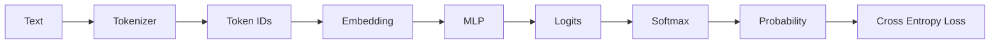
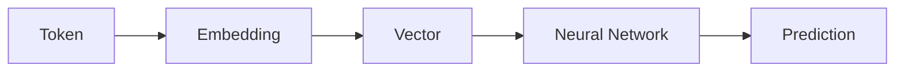
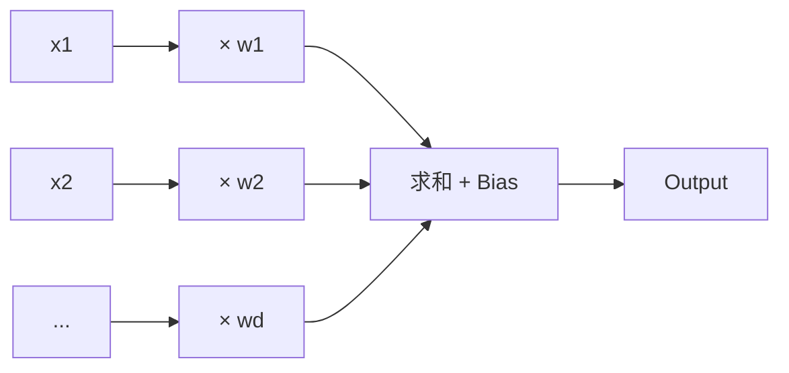
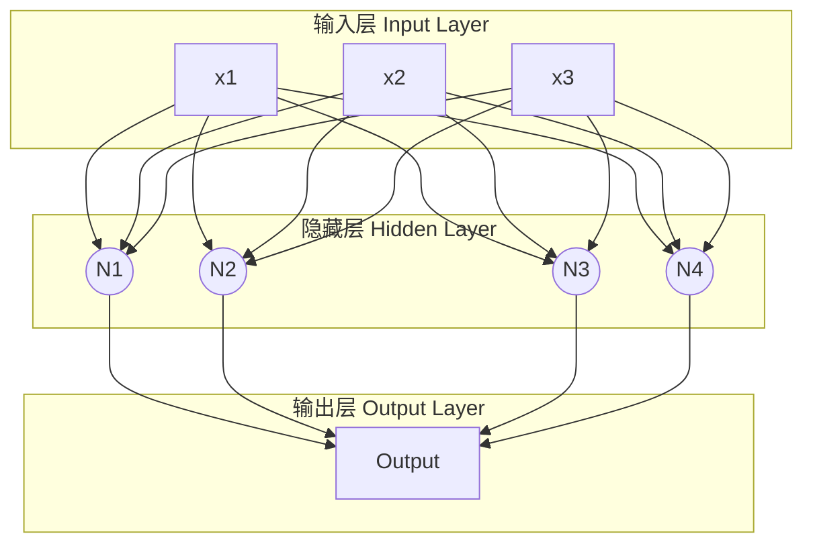
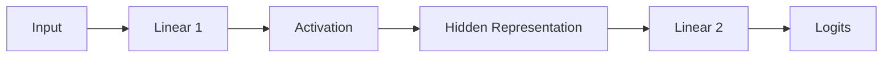
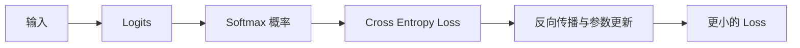
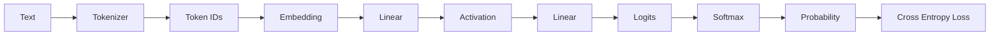

# 4. 神经网络——从神经元到 MLP

> **本章目标**
>
> 前三章已经完成了 `Text → Token IDs → Embedding`。但向量只负责表示，不能自己完成预测。本章从一颗神经元出发，依次理解 **Linear、Activation、MLP、Logits、Softmax 与 Cross Entropy Loss**，建立一条完整的前向传播理论链路。
>
> 本章只讲原理。学完本章后，再进入独立实践 **《4.1 实现一个两层 MLP——从 Linear 到 Loss》**，用同一组数字验证这里出现的每个公式。

## 本章路线图



第 2、3 章分别解决了 Tokenizer 与 Embedding。本章从 Embedding 后面的计算模块开始，走到一次预测的 Loss。严格来说，Softmax 和 Cross Entropy 不属于 MLP；它们分别负责把 MLP 的输出变成概率、再衡量预测有多差。

---

## 一、Embedding 为什么还不能预测？

Embedding 的职责是**表示（Representation）**：它把离散 Token 映射到连续向量，使距离、方向与线性组合成为可能。但它没有定义“怎样根据输入得到输出”。

以 `I love ___` 为例，`love` 的向量可以表达这个 Token 的特征，却不会自动告诉模型下一个 Token 应该是 `AI`、`you` 还是 `NLP`。从表示到预测，还需要一个能够学习输入与输出关系的函数，这就是神经网络。



因此，两类模块的分工是：

- **Embedding**：把 Token 变成神经网络能够处理的向量；
- **Neural Network**：用可学习参数变换向量，产生与任务相关的输出。

本章沿用一份三维玩具输入 `x = [0.8, 0.3, 0.5]` 来解释结构。数字只是为了便于对账，不代表真实语义；可运行计算统一放在 4.1 实践中。

---

## 二、神经元：一次加权求和

神经网络最小的计算单元是**神经元（Neuron）**。它对每个输入维度分配一个权重，把加权结果相加，再加上偏置：

\[
y = \boldsymbol{w}^{\mathsf T}\boldsymbol{x} + b
\]

展开后是：

\[
y = x_1w_1+x_2w_2+\cdots+x_dw_d+b
\]

其中：

- \(\boldsymbol{x}\) 是输入向量；
- \(\boldsymbol{w}\) 是 Weight，表示各输入维度对当前神经元的重要程度；
- \(b\) 是 Bias，允许输出整体平移；
- \(y\) 是一个标量输出。



Weight 与 Bias 不是人工规定的长期常量，而是训练要学习的**模型参数（Model Parameters）**。训练前它们通常随机初始化；训练通过降低 Loss，逐步把这些数字调整为有用的参数。

> **神经元的本质：一次带偏置的加权求和。**

单个神经元只能输出一个数字，也就只能从一个角度描述输入。语言规律往往由许多因素共同决定，因此还需要多个神经元并行工作。

---

## 三、从标量公式到向量计算

神经元展开后的逐项乘加，可以写成向量点积：

\[
x_1w_1+x_2w_2+\cdots+x_dw_d=\boldsymbol{w}^{\mathsf T}\boldsymbol{x}
\]

这个写法不仅更简洁，也使同一公式可以直接扩展到数百或数千维输入。向量化没有改变神经元的含义，只是把重复乘加交给统一的线性代数运算；4.1 实践会用 `dot(x, w) + b` 对账二维和三维输入。

> 输入维度增加时，神经元的公式不变，只需要让 \(\boldsymbol{x}\) 与 \(\boldsymbol{w}\) 保持相同长度。

---

## 四、为什么一个神经元不够？

预测下一个 Token 时，模型可能同时需要捕捉词义、语气、句法角色和上下文线索。一个神经元只有一组权重，只能形成一种打分方式；多个神经元可以各自学习不同的特征。



**Layer（层）**是处于网络同一深度、横向并列的一组节点：

| 层 | 作用 |
| --- | --- |
| Input Layer | 接收原始输入，本身不做参数化计算 |
| Hidden Layer | 用神经元提取中间特征 |
| Output Layer | 把中间特征映射成任务需要的输出 |

多个神经元组成一层，多层依次连接形成神经网络。所谓“深度”，主要指隐藏变换被连续堆叠的程度。但仅仅堆叠加权求和还不够：如果每层都只有线性计算，整个网络仍会退化成一次线性变换。后面的“Linear Layer”与“Activation Function”两节将继续解释这个问题。

---

## 五、Linear Layer：用矩阵并行计算多个神经元

若输入有 \(d_{in}\) 个维度，一层中有 \(d_{out}\) 个神经元，那么每个神经元都需要一组长度为 \(d_{in}\) 的权重。把这些权重按行排列，就得到矩阵：

\[
\boldsymbol{y}=W\boldsymbol{x}+\boldsymbol{b}
\]

Shape 关系为：

\[
W\in\mathbb{R}^{d_{out}\times d_{in}},\quad
\boldsymbol{x}\in\mathbb{R}^{d_{in}},\quad
\boldsymbol{b},\boldsymbol{y}\in\mathbb{R}^{d_{out}}
\]


矩阵的第 \(i\) 行就是第 \(i\) 个神经元的权重，因此 \(y_i\) 仍然只是一次 \(\boldsymbol{w}_i^{\mathsf T}\boldsymbol{x}+b_i\)。Linear Layer 没有引入新的单元计算，它只是把许多神经元的计算组织成一次矩阵运算。

这解释了为什么神经网络大量使用矩阵：模型可能包含成千上万个并行神经元，而 GPU 正擅长高吞吐的矩阵乘法。

> **Linear Layer = 一组神经元的并行加权求和。**

### 只堆叠 Linear 为什么没有用？

假设连续两层都是 Linear：

\[
\boldsymbol{y}=W_1\boldsymbol{x}+\boldsymbol{b}_1
\]

\[
\boldsymbol{z}=W_2\boldsymbol{y}+\boldsymbol{b}_2
\]

代入第一式：

\[
\boldsymbol{z}
=W_2(W_1\boldsymbol{x}+\boldsymbol{b}_1)+\boldsymbol{b}_2
=(W_2W_1)\boldsymbol{x}+(W_2\boldsymbol{b}_1+\boldsymbol{b}_2)
\]

令 \(W'=W_2W_1\)、\(\boldsymbol{b}'=W_2\boldsymbol{b}_1+\boldsymbol{b}_2\)，两层就重新变成：

\[
\boldsymbol{z}=W'\boldsymbol{x}+\boldsymbol{b}'
\]

因此，无论连续堆叠多少个 Linear，只要中间没有非线性，它们都可以合并成一个 Linear。层数增加了，函数类型却没有改变，模型仍无法表达 XOR 这类线性不可分问题，也无法拟合语言中复杂的非线性关系。

解决办法是在 Linear 之间插入 **Activation Function（激活函数）**。

---

## 六、Activation Function：引入非线性

带激活函数的两层计算是：

\[
\boldsymbol{h}=\phi(W_1\boldsymbol{x}+\boldsymbol{b}_1)
\]

\[
\boldsymbol{z}=W_2\boldsymbol{h}+\boldsymbol{b}_2
\]

这里的 \(\phi\) 是非线性函数。它夹在两次矩阵运算之间后，通常不存在代数恒等式可以把 \(W_2\phi(W_1\boldsymbol{x}+\boldsymbol{b}_1)\) 合并为一个 Linear，网络因此获得了新的表达能力。

### ReLU

最直观的激活函数是 ReLU：

\[
\operatorname{ReLU}(x)=\max(0,x)
\]

它把负数变成 0，正数保持不变。几何上，一个 `ReLU(wx+b)` 会沿 \(wx+b=0\) 形成一道“折痕”；多个神经元组合许多折痕，就能构造复杂的分段线性边界。

XOR 提供了一个最小例子。下列极小伪代码可以精确表达异或：

```text
h1 = ReLU(x1 + x2)
h2 = ReLU(x1 + x2 - 1)
y  = h1 - 2 × h2
```

没有 ReLU 时，`h1`、`h2` 与 `y` 会重新坍缩为线性函数；加入 ReLU 后，两道折痕的组合可以区分 XOR 的四个输入点。

这背后对应**万能近似定理（Universal Approximation Theorem）**：隐藏神经元足够多并使用合适的非线性激活时，神经网络可以逼近任意连续函数。理论上，一层足够宽的隐藏层已经具有这种能力；工程上，更深的网络可以在前一层已经形成的特征上继续变换，往往比单纯加宽更高效。

现代 Transformer 常用 GELU 或 SwiGLU。它们的具体形状不同，但核心作用与 ReLU 一致：**在 Linear 之间引入非线性**。ReLU 会把负区间全部压成 0，神经元可能长期失活；更平滑或带门控的激活可以缓解这一问题。

---

## 七、MLP：Linear → Activation → Linear

把前面的零件连接起来，就得到最小的两层 MLP：



对应公式为：

\[
\boldsymbol{h}=\phi(W_1\boldsymbol{x}+\boldsymbol{b}_1)
\]

\[
\boldsymbol{z}=W_2\boldsymbol{h}+\boldsymbol{b}_2
\]

其中：

- 第一层把原始输入重组为 **Hidden Representation（隐藏表示）**；
- 激活函数为隐藏表示引入非线性；
- 第二层把隐藏表示映射为任务所需的输出维度；
- \(\boldsymbol{z}\) 是 **Logits（未归一化分数）**。

### 输出层如何对应词表？

Tokenizer 在建立 Vocabulary 时已经固定了 Token 与 ID 的对应关系。若词表大小为 \(|V|\)，语言模型的最终输出层必须产生 \(|V|\) 个 Logit：第 \(i\) 个位置被约定为词表中 ID 为 \(i\) 的 Token 的分数。

```mermaid
flowchart LR
    H[隐藏表示 d_hidden] --> O[输出层 |V| × d_hidden]
    O --> Z[|V| 个 Logits]
    Z --> V[与 Vocabulary ID 逐位置对应]
```

这种位置对应关系是模型结构的约定，而不是模型自己猜出来的。训练时，真实 Token ID 指出哪个位置应该获得更高概率；Cross Entropy 再把这个监督信号传给输出层参数。

### 为什么输出 Logits 后通常不接 ReLU？

隐藏层需要非线性来提升表达能力，但输出层的激活取决于任务。语言模型接下来要用 Softmax 比较所有候选的相对分数，Logits 因此应保留任意实数。若使用 ReLU，所有负分都会被压成相同的 0，候选之间“有多不可能”的相对信息会丢失。

### 教学 MLP 与真实 GPT 的关系

本章把“提取隐藏表示”和“投影到词表”压缩到一个两层玩具网络中。真实 GPT 会把这两个角色拆开：

- Transformer Block 内的 FFN 通常是 `hidden_size → intermediate_size → hidden_size`，负责反复变换表示；
- 所有 Block 之后只有一个 LM Head，把最终隐藏向量从 `hidden_size` 投影到 `vocab_size`，产生 Logits。

两者都复用 `Linear → 非线性 → Linear` 的思想，但 FFN 的第二层不是词表输出层。第 9、11 章会进一步展开这个区别。

---

## 八、Softmax：把 Logits 变成概率

Logits 只是相对分数，可以为负，也不要求总和为 1。Language Model 的采样、Temperature、Top-k 与 Top-p 需要的是整个概率分布，因此要用 Softmax 做归一化。

对第 \(i\) 个 Logit \(z_i\)：

\[
p_i=\frac{e^{z_i}}{\sum_{j=1}^{|V|}e^{z_j}}
\]

指数函数保证每个值为正，除以总和保证：

\[
p_i\ge 0,\qquad \sum_i p_i=1
\]

Softmax 保留 Logits 的相对顺序：最大的 Logit 仍对应最大的概率，但现在每个候选都有明确的概率质量。Greedy Decoding 可以选择最大概率，Sampling 则可以按整组概率随机抽样。

### 数值稳定性

直接计算很大的指数可能溢出。稳定实现会先减去最大值 \(m=\max_j z_j\)：

\[
p_i=\frac{e^{z_i-m}}{\sum_j e^{z_j-m}}
\]

给所有 Logits 同时减去同一个常数不会改变 Softmax：分子与分母都多出相同因子 \(e^{-m}\)，相除后抵消。于是最大的指数变为 \(e^0=1\)，计算更稳定。

> **MLP 输出 Logits；Softmax 把 Logits 转换为概率分布。**

---

## 九、Cross Entropy Loss：衡量预测有多差

假设真实答案的 Token ID 为 \(t\)，Softmax 给它的概率为 \(p_t\)。单个样本的 Cross Entropy Loss 是：

\[
L=-\log p_t
\]

它具有训练需要的性质：

| 真实答案概率 \(p_t\) | Loss \(-\log p_t\) | 含义 |
| ---: | ---: | --- |
| 接近 1 | 接近 0 | 模型对正确答案很有把握 |
| 中等 | 中等 | 模型仍不确定 |
| 接近 0 | 很大 | 模型几乎排除了正确答案 |

在 one-hot 标签下，完整交叉熵写作：

\[
L=-\sum_i y_i\log p_i
\]

因为只有真实类别位置满足 \(y_t=1\)，其余位置都是 0，所以它化简为 \(-\log p_t\)。“只读取真实答案的概率”并不意味着其它 Logit 不受影响：Softmax 的归一化把所有候选耦合在一起，提高 \(p_t\) 必然需要改变它与其它候选的相对关系。

训练的直接目标不是让某个 Weight 单独变大或变小，而是调整所有可学习参数，使大量样本上的平均 Loss 下降。Weight、Bias 与 Embedding 都属于参数，会沿同一优化过程更新；第 6 章将用梯度下降说明它们具体怎样改变。



---

## 十、理论总结：一次完整的前向传播

从输入一路计算到 Loss，叫作一次 **Forward Pass（前向传播）**：



本章的核心关系可以压缩为七句话：

1. Embedding 负责表示 Token，神经网络负责把表示变成预测。
2. 一个神经元执行 \(\boldsymbol{w}^{\mathsf T}\boldsymbol{x}+b\)。
3. Linear Layer 用矩阵并行计算一组神经元。
4. 连续 Linear 仍等价于一个 Linear，Activation 负责引入非线性。
5. 最小 MLP 是 `Linear → Activation → Linear`。
6. 输出层产生 Logits，Softmax 把它们变成概率。
7. Cross Entropy 用 \(-\log p_t\) 衡量正确答案获得的概率是否足够高。

到这里，`Embedding → MLP → Logits → Probability → Loss` 的理论链路已经完整。接下来请进入 **《4.1 实现一个两层 MLP——从 Linear 到 Loss》**：实践文件会复用本章的三维输入和手工参数，逐步对账神经元、Linear、ReLU、MLP、Softmax 与 Loss，并给出一份可以独立运行的 NumPy 脚本。

本章仍留下两个问题：

- 玩具 MLP 只看了 `love` 一个 Token，`I` 这样的上下文怎样进入模型？第 5 章将引入 Context 与 Context Window。
- Loss 已经得到，Weight、Bias 与 Embedding 怎样修改才能让它下降？第 6 章将引入反向传播与梯度下降。

---

# 参考资料

- 吴恩达《深度学习》课程（神经网络与深度学习基础）：https://www.bilibili.com/video/BV12urfB1E7s
- 李宏毅《机器学习》（神经网络与 Transformer 入门讲解）：https://space.bilibili.com/3546866876680925
- Andrej Karpathy《Neural Networks: Zero to Hero》系列（micrograd / makemore / Let's build GPT / nanoGPT）：https://www.youtube.com/@AndrejKarpathy
