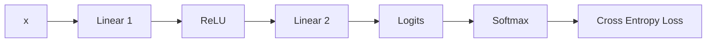

# 4.1 实现一个两层多层感知机（MLP）——从线性层（Linear）到损失（Loss）

> **硬件要求**：CPU 即可运行（普通笔记本可跑）
>
> **实践目标**
>
> 主章已经建立了 `Neuron → Linear → ReLU → MLP → Logits → Softmax → Cross Entropy Loss` 的理论链路。本实践不再重新推导概念，而是用同一组手工数字逐步验证公式，最后得到一份可以独立运行的 NumPy 脚本。

## 1. 环境准备

需要 Python 3.10+ 与 NumPy：

```bash
pip install numpy
```

本实践统一使用三维输入：

```text
x = [0.8, 0.3, 0.5]
```

可以把它理解为 Token `love` 的一份简化特征表示。词表固定为：

```text
0:I, 1:love, 2:like, 3:AI, 4:NLP
```

所有 Weight 和 Bias 都是为了方便手工对账而挑选的固定值。真实训练会随机初始化参数，再用梯度下降更新它们。

---

## 2. 从一个神经元开始

主章“神经元：一次加权求和”一节给出的公式是：

```math
y=\boldsymbol{w}^{\mathsf T}\boldsymbol{x}+b
```

这里公式的作用是把一个输入向量压缩成一个神经元输出：点积完成加权求和，Bias `b` 再整体平移结果。下面用二维数字直接对账。

先验证二维输入：

```python
import numpy as np

x = np.array([0.8, 0.3])
w = np.array([0.9, 0.2])
b = 0.1

y = np.dot(x, w) + b
print(y)
```

运行结果：

```text
0.88
```

它对应手算：

```text
0.8 × 0.9 + 0.3 × 0.2 + 0.1 = 0.88
```

把输入扩展为后面一直使用的三维向量，代码结构不变：

```python
import numpy as np

x = np.array([0.8, 0.3, 0.5])
w = np.array([0.9, 0.2, -0.4])
b = 0.1

y = np.dot(x, w) + b
print(y)
```

运行结果：

```text
0.68
```

`np.dot(x, w)` 会一次完成所有维度的乘法与求和。真实模型的向量可能有数百或数千维，因此神经网络必须依赖向量化计算，而不是手写每一项。

可以修改参数观察它们的作用：

- 把 `w` 改成 `[0.2, 0.9, 0.1]` 或 `[-1.0, 2.0, 0.5]`：Weight 改变各输入维度的重要程度；
- 把 `b` 改成 `1.0` 或 `-0.5`：Bias 整体平移输出。

---

## 3. 用矩阵实现 Linear Layer

四个神经元各有一组长度为 3 的 Weight。把四组 Weight 按行堆起来，就是一个 `4 × 3` 的矩阵：

```python
import numpy as np

x = np.array([0.8, 0.3, 0.5])

W = np.array([
    [0.2,  0.5, -0.1],
    [0.8, -0.3,  0.7],
    [0.4,  0.1,  0.2],
    [0.6,  0.8, -0.5],
])
b = np.array([-0.5, 0.2, -0.6, 0.4])

y = W @ x + b
print(y)
```

运行结果：

```text
[-0.24  1.1  -0.15  0.87]
```

逐行理解：`W` 的一行就是一个神经元的 `w`，四行并行计算后得到四个输出。Shape 的变化是：

```text
输入 (3,) → W (4, 3) → 输出 (4,)
```

这组结果还不是概率，也没有直接对应某个 Token；它只是隐藏层激活前的中间值。

---

## 4. 加入 ReLU

主章“Activation Function”一节定义：

```math
\operatorname{ReLU}(x)=\max(0,x)
```

这里公式的作用是对 Linear 输出逐元素设置一道阈值：负数变成 `0`，正数原样通过。下面直接观察 Shape 不变而数值发生改变。

把上一节 Linear 的输出送进 ReLU：

```python
import numpy as np

y = np.array([-0.24, 1.10, -0.15, 0.87])
hidden = np.maximum(0, y)
print(hidden)
```

运行结果：

```text
[0.   1.1  0.   0.87]
```

两个负数被清零，正数保持不变。现在 `hidden` 是带有非线性的隐藏表示，后面的第二层 Linear 将继续处理它。

---

## 5. 组装两层 MLP

下面把第一层 Linear、ReLU 和第二层 Linear 放在一起：

```python
import numpy as np

x = np.array([0.8, 0.3, 0.5])

W1 = np.array([
    [0.2,  0.5, -0.1],
    [0.8, -0.3,  0.7],
    [0.4,  0.1,  0.2],
    [0.6,  0.8, -0.5],
])
b1 = np.array([-0.5, 0.2, -0.6, 0.4])

hidden = np.maximum(0, W1 @ x + b1)
print(hidden)

W2 = np.array([
    [0.1, 0.5,  0.2, -0.3],  # I
    [0.4, 0.9, -0.1,  0.6],  # love
    [0.2, 0.3,  0.5,  0.1],  # like
    [0.6, 1.2,  0.4,  0.8],  # AI
    [0.3, 0.4,  0.2,  0.5],  # NLP
])
b2 = np.array([0.1, 0.2, 0.0, 0.3, 0.1])

logits = W2 @ hidden + b2
print(logits)
```

运行结果：

```text
[0.   1.1  0.   0.87]
[0.389 1.712 0.417 2.316 0.975]
```

Shape 变化为：

```text
(3,) → Linear 1 → (4,) → ReLU → (4,) → Linear 2 → (5,)
```

第一层把三维输入变成四维隐藏表示；第二层的五行分别对应词表里的五个 Token，因此输出五个 Logit。`AI` 的 Logit `2.316` 最大，但 Logits 还不是概率。

输出层没有再接 ReLU：Logits 需要保留任意正负实数之间的相对大小，ReLU 会把所有负分压成相同的 0。

---

## 6. 用 Softmax 得到概率

稳定版 Softmax 会先把每个 Logit 减去最大值：

```python
import numpy as np

logits = np.array([0.389, 1.712, 0.417, 2.316, 0.975])
shifted = logits - np.max(logits)
exp_values = np.exp(shifted)
prob = exp_values / np.sum(exp_values)

print(prob)
print(prob.sum())
```

运行结果：

```text
[0.06921027 0.2598616  0.07117554 0.4753965  0.1243561 ]
1.0
```

保留一位百分比后：

```text
I 6.9%, love 26.0%, like 7.1%, AI 47.5%, NLP 12.4%
```

原主章用三位小数展示为 `[0.069, 0.260, 0.071, 0.475, 0.124]`，这是对概率的逐项近似；直接从完整精度 Logits 计算时，上面这组完整精度结果更准确。

为什么要减最大值？例如 Logits 为 `[1000, 1001, 999]`，直接计算 `exp(1000)` 会溢出；先减去 `1001` 后变成 `[-1, 0, -2]`，Softmax 结果不变，但指数计算处于安全范围。

---

## 7. 计算 Cross Entropy Loss

真实答案是 `AI`，它的 Token ID 为 `3`：

```python
import numpy as np

prob = np.array([0.069, 0.260, 0.071, 0.475, 0.124])
target = 3

loss = -np.log(prob[target])
print(loss)
```

运行结果：

```text
0.7444404749474959
```

按原章的三位小数概率计算，Loss 约为 `0.744`。若直接使用上一节未舍入的 Softmax 概率，Loss 约为 `0.7436`；两者差异来自展示精度，不影响结论。

再看一次明显更差的预测：

```python
bad_prob = np.array([0.30, 0.40, 0.20, 0.05, 0.05])
bad_loss = -np.log(bad_prob[target])
print(bad_loss)
```

运行结果：

```text
2.995732273553991
```

正确答案概率从约 47.5% 降到 5%，Loss 从约 `0.744` 增大到约 `2.996`，验证了“正确答案概率越低，Loss 越大”。

训练日志通常持续观察 Loss，而不是单独观察某个 Weight，例如：

```text
Step 1000  Loss = 2.34
Step 5000  Loss = 1.78
Step 10000 Loss = 1.21
```

Loss 持续下降，表示模型整体上正在提高预测正确 Token 的能力。

---

## 8. 一份可独立运行的完整脚本

把下面内容保存为 `mlp_forward.py`，直接运行 `python mlp_forward.py`：

```python
#!/usr/bin/env python3
import numpy as np

VOCAB = ["I", "love", "like", "AI", "NLP"]


def neuron(x, w, b):
    return np.dot(x, w) + b


def linear(x, weight, bias):
    return weight @ x + bias


def relu(x):
    return np.maximum(0, x)


def softmax(logits):
    shifted = logits - np.max(logits)
    exp_values = np.exp(shifted)
    return exp_values / np.sum(exp_values)


def cross_entropy(probabilities, target):
    return -np.log(probabilities[target])


def main():
    x2 = np.array([0.8, 0.3])
    w2 = np.array([0.9, 0.2])
    neuron_2d = neuron(x2, w2, 0.1)

    x = np.array([0.8, 0.3, 0.5])
    w = np.array([0.9, 0.2, -0.4])
    neuron_3d = neuron(x, w, 0.1)

    W1 = np.array([
        [0.2,  0.5, -0.1],
        [0.8, -0.3,  0.7],
        [0.4,  0.1,  0.2],
        [0.6,  0.8, -0.5],
    ])
    b1 = np.array([-0.5, 0.2, -0.6, 0.4])

    pre_activation = linear(x, W1, b1)
    hidden = relu(pre_activation)

    W2 = np.array([
        [0.1, 0.5,  0.2, -0.3],
        [0.4, 0.9, -0.1,  0.6],
        [0.2, 0.3,  0.5,  0.1],
        [0.6, 1.2,  0.4,  0.8],
        [0.3, 0.4,  0.2,  0.5],
    ])
    b2 = np.array([0.1, 0.2, 0.0, 0.3, 0.1])

    logits = linear(hidden, W2, b2)
    probabilities = softmax(logits)
    target = 3
    loss = cross_entropy(probabilities, target)

    print(f"2D neuron: {neuron_2d:.2f}")
    print(f"3D neuron: {neuron_3d:.2f}")
    print("Linear 1:", pre_activation)
    print("ReLU:", hidden)
    print("Logits:", logits)
    print("Probabilities:", probabilities)
    print(f"Probability sum: {probabilities.sum():.1f}")
    print("Prediction:", VOCAB[int(np.argmax(probabilities))])
    print("Target:", VOCAB[target])
    print(f"Loss: {loss:.6f}")


if __name__ == "__main__":
    main()
```

完整运行结果：

```text
2D neuron: 0.88
3D neuron: 0.68
Linear 1: [-0.24  1.1  -0.15  0.87]
ReLU: [0.   1.1  0.   0.87]
Logits: [0.389 1.712 0.417 2.316 0.975]
Probabilities: [0.06921027 0.2598616  0.07117554 0.4753965  0.1243561 ]
Probability sum: 1.0
Prediction: AI
Target: AI
Loss: 0.743606
```

这份脚本完成了一次完整前向传播：



---

## 9. 动手验证

在完整脚本上尝试以下改动：

1. 修改神经元的 `w`，观察输出怎样随各维度权重改变；
2. 修改 `b1`，观察第一层输出怎样整体平移；
3. 暂时移除 `relu`，比较隐藏表示与最终 Logits；
4. 把所有 Logits 同时加上 `1000`，确认稳定 Softmax 的概率几乎不变；
5. 把 `target` 改成其它 Token ID，观察相同概率分布对应的 Loss 怎样变化；
6. 把 `W2` 的行数改成 6，并同步扩展 Vocabulary，观察“输出维度必须等于词表大小”的约束。

## 实践总结

本实践用代码逐项验证了主章理论：

- `np.dot(x, w) + b` 是一个神经元；
- `W @ x + b` 是多个神经元组成的 Linear Layer；
- `np.maximum(0, x)` 实现 ReLU；
- `Linear → ReLU → Linear` 组成两层 MLP；
- 第二层输出与 Vocabulary 逐位置对应的 Logits；
- 稳定 Softmax 把 Logits 变成概率；
- `-log(prob[target])` 得到 Cross Entropy Loss。

这里的参数仍是手工固定的。第5章将引入固定 Context，第6章把 MLP 接入语言模型，第7章再用反向传播与梯度下降更新这些 Weight、Bias 和 Embedding。
