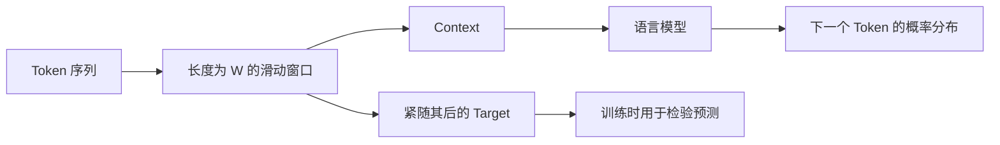

# Chapter 5：Context Matters（上下文为什么如此重要）

> **本章目标**
>
> 上一章结尾，我们留下了一个问题：模型预测 `I love ___` 时，如果只看 `love`，`I` 去哪了？本章先从理论上回答这个问题：**Token 的含义与下一个 Token 的分布，都取决于它所在的 Context（上下文）。**
>
> 本章将学习 Context Window（上下文窗口）、Sliding Window（滑动窗口）、N-Gram 的表示与概率，以及固定窗口为什么会遇到长距离依赖和数据稀疏性。完整实现放在独立实践 [5.1 构建 N-Gram 数据集](./5.1%20构建%20N-Gram%20数据集.md) 和 [5.2 实现第一个 N-Gram 语言模型](./5.2%20实现第一个%20N-Gram%20语言模型.md) 中。

---

# 上一章留下的问题

第 4 章的 MLP 玩具例子只接收一个 Token 的特征。可是对 `I love ___` 来说，只看 `love` 会丢掉 `I`；而 `We love ___`、`They love ___` 又可能对应不同的后续分布。语言模型真正需要学习的关系不是孤立的：

> **单个 Token → 下一个 Token**

而是：

> **一段 Context → 下一个 Token**

这里，被预测的下一个 Token 叫 **Target（目标）**。做 Next-Token Prediction 时，我们只把 Target 左侧已经出现的 Token 当作 Context，不能偷看 Target 或它右侧的内容。

---

# 为什么上下文决定含义？

看单词 `bank`：

- `I deposited money at the bank.` 中，`money` 提示它更可能表示“银行”；
- `I sat by the river bank.` 中，`river` 提示它更可能表示“河岸”。

中文也一样：`苹果很好吃` 中的“苹果”是水果，`苹果发布了新 MacBook` 中的“苹果”是公司。同一个 Token 出现在不同 Context 中，可以承担不同含义。

Embedding 能为 Token 提供一个可学习的基础表示，但仅靠一个固定向量，仍不足以区分它在每个具体句子里的用法。可以先这样理解两者的分工：

- Embedding 回答：**这个 Token 通常和哪些语义有关？**
- Context 回答：**这些语义在当前位置应当如何被解释？**

因此，语言模型学习的不只是“Token 是什么”，而是“Token 在 Context 中如何出现，以及什么 Target 会接在这段 Context 后面”。

---

# Context Window：模型一次能看多远？

上下文可能很长，最直接的做法是规定模型每次只看 Target 前面的固定数量 Token。这个数量记作窗口大小 \(W\)，这段固定长度的输入叫 **Context Window（上下文窗口）**。

句子 `I love AI today` 在 \(W=2\) 时可以形成：

- `[I, love] → AI`
- `[love, AI] → today`

窗口每产生一条样本便向右移动一个位置，所以这种构造方式也叫 **Sliding Window（滑动窗口）**。对于包含 \(L\) 个 Token 的句子，在不添加句首、句尾标记时，可以产生 \(\max(L-W, 0)\) 条完整窗口样本。



这个结构带来两个重要约束：

1. **长度固定**：每条样本都包含 \(W\) 个 Context Token；
2. **顺序保留**：`[I, love]` 与 `[love, I]` 是两个不同的 Context。

---

# N-Gram：把连续局部上下文当作一个整体

**N-Gram** 是序列中连续出现的 \(N\) 个 Token。按照标准命名：

- Unigram 含 1 个 Token；
- Bigram 含 2 个 Token，可用前 1 个预测后 1 个；
- Trigram 含 3 个 Token，可用前 2 个预测后 1 个。

因此，一个标准的 \(N\)-Gram Next-Token 模型使用前 \(N-1\) 个 Token 作为 Context：

\[
W = N - 1
\]

例如 `[I, love] → AI` 合起来是一个 Trigram：Context Window 为 2，整个 N-Gram 的 \(N\) 为 3。日常讨论中，人们有时会把“窗口大小”和“N-Gram 阶数”混着说；后面的实践会明确使用 `window_size` 表示 Context 长度，避免歧义。

N-Gram 模型做了一个强假设：预测当前 Target 时，只依赖最近的 \(N-1\) 个 Token，而忽略更早的历史。若 Context 为 \(c\)，候选 Target 为 \(t\)，统计式 N-Gram 模型会记录二者共同出现的次数 \(C(c,t)\)，再归一化为条件概率：

\[
P(t\mid c)=\frac{C(c,t)}{\sum_{t'}C(c,t')}
\]

直观地说：先数一数某段 Context 后面分别出现过哪些 Token，再用“某个 Target 的次数 ÷ 所有 Target 的总次数”得到概率。

---

# 从训练样本到统计式语言模型

固定窗口先把语料转换为 `(Context, Target)` 样本；统计式 N-Gram 模型再把相同 Context 的 Target 计数汇总成表。训练与预测可以压缩成下面几行伪代码：

```text
对每个连续窗口：
    context = 前 W 个 Token
    target  = 紧随其后的 Token
    count[context][target] += 1

预测时：
    用 count[context] 中的各项计数除以计数总和
```

这张表就是模型参数：它不包含神经网络，只保存语料中观察到的局部统计规律。假设 `I love` 后面 `AI` 和 `Python` 各出现一次，那么两者的条件概率都是 \(0.5\)。如果一个 Context 从未出现过，表中便没有可归一化的计数；在不使用平滑或回退策略时，模型无法给出有效预测。

---

# 固定窗口的优点与局限

固定窗口容易理解、容易生成训练样本，也能捕捉局部词序和短距离依赖。但它有两类根本局限。

## 1. 窗口外的信息不可见

假设窗口大小为 3，在 `The book that I bought yesterday is interesting.` 中预测 `interesting` 时，重要线索 `book` 可能已经落到窗口之外。窗口越小，丢失远距离信息越快；增大窗口虽能看到更多历史，却会带来更多可能的 Context 组合和更高的存储、计算成本。

## 2. 没见过的组合无法共享经验

对统计表来说，`I love`、`I like` 和 `I enjoy` 是三个互不相关的键。即使 `love`、`like`、`enjoy` 语义接近，`I love` 的计数也不会自动帮助模型预测 `I enjoy`。

随着窗口变长，可能的 Context 组合数会迅速增长，而有限语料只能覆盖其中很小一部分。这种“大量可能组合没有足够观测”的现象叫 **Data Sparsity（数据稀疏性）**。它解释了为什么单纯把统计表做大，仍然不能获得可靠的泛化能力。

---

# 从固定窗口走向神经语言模型

本章所在的位置可以概括为：


N-Gram 已经完成了关键升级：模型开始依据一段有序 Context 预测 Target。但它仍把每种 Context 当作孤立符号，既看不到窗口之外，也无法把相似词的经验迁移到未见组合。下一章将用 Embedding 和神经网络取代离散统计表，让模型开始具备泛化能力；再往后，RNN 会继续处理固定窗口的记忆边界。

---

# 本章总结

请记住六点：

1. Token 的具体含义和下一个 Token 的分布依赖 Context；
2. Next-Token Prediction 只使用 Target 左侧的历史；
3. Context Window 用固定的 \(W\) 个 Token 表示模型当前能看到的历史；
4. 标准 \(N\)-Gram 含 \(N\) 个连续 Token，对应 \(W=N-1\)；
5. 统计式 N-Gram 通过计数并归一化得到 \(P(t\mid c)\)；
6. 固定窗口受限于长距离依赖，离散统计表还会遭遇数据稀疏性和未见 Context。

---

# 实践预告

理论已经齐备，接下来用两个独立实验完成从数据到模型的闭环：

- [实验 5.1：构建 N-Gram 数据集](./5.1%20构建%20N-Gram%20数据集.md)：用 Sliding Window 把 Token 序列转换成 `(Context, Target)` 样本；
- [实验 5.2：实现第一个 N-Gram 语言模型](./5.2%20实现第一个%20N-Gram%20语言模型.md)：汇总计数、计算条件概率，并观察未见 Context 为什么会让模型“哑火”。

完成两项实践后，再进入 [第 6 章：从 N-Gram 到 Neural Language Model](./6.%20从%20N-Gram%20到%20Neural%20Language%20Model.md)。
