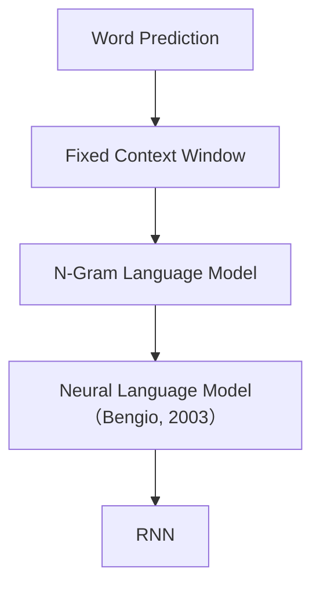

# Chapter 5：Context Matters(上下文为什么如此重要)

> **本章目标**
>
> 上一章结尾，我们留下了一个问题：模型预测 `I love ___` 时，只看了 `love` 一个词——`I` 去哪了？本章回答这个问题：**一个词真正的意义并不来自它自己，而来自它所处的上下文（Context）。**
>
> 本章将学习：什么是 Context、为什么上下文决定语义、什么是 Context Window（上下文窗口）、如何把上下文组织成训练数据，以及第一个真正利用上下文的语言模型——**N-Gram 统计表**（统计版）。顺便看看它为什么注定走不远，为下一章的 Neural Language Model 埋下伏笔。

---

# 上一章留下的问题

还记得第 4 章结尾的那个问题吗？MLP 预测 `I love ___` 时，输入只有 `love` 一个词的特征——`I` 去哪了？

不是我们偷懒，而是当时还没有"上下文"这个概念。可现实是：`I love AI` 和 `I love you` 的下一个词完全不同——`I` 和 `love` 的组合，恰恰决定了后面该是什么。一个词的意义，不是它自己决定的，而是它周围的词决定的。这就是本章的主角：

> **Context（上下文）。**

---

# 5.1 为什么同一个词会有不同含义？

看一句英文 `I sat by the bank.`——这里 `bank` 是"银行"还是"河岸"？仅凭这个单词无法确定。继续看 `I deposited money at the bank.`，因为 `money` 提供了上下文，几乎所有人都会理解 `bank` 表示银行；再看 `I sat by the river bank.`，`river` 又告诉我们 `bank` 表示河岸。

请注意，真正决定 `bank` 意义的，并不是 `bank` 自己，而是它周围出现的其它词，这就是 **Context（上下文）**。

中文也是一样：`苹果很好吃` 中的"苹果"是水果，`苹果发布了新 MacBook` 中的"苹果"是科技公司。同样一个 Token，因为上下文不同，语义完全不同。因此，现代 Language Model 真正学习的并不是"一个 Token"，而是：

> **Token 在 Context 中的含义。**

---

# Token 本身没有意义

很多初学者会认为 Embedding 已经学习到了 `bank` 的语义，实际上 Embedding 学到的是 `bank` 在大量语料中的平均意义。真正使用时，模型仍然需要结合上下文，才能知道当前到底表示什么。因此：

- Embedding 回答的是：**这个 Token 通常是什么？**
- Context 回答的是：**这个 Token 在这一句话中是什么意思？**

---

# 5.2 Context Window（上下文窗口）

既然 Context 如此重要，模型应该看多大的上下文？最简单的方法是规定模型每次只能看前面的几个 Token。例如窗口大小为 2，句子 `I love AI today`，训练样本是 `[I, love] → AI`，接着 `[love, AI] → today`。模型始终只能看到最近两个 Token，这就是 **Context Window（上下文窗口）**。

---

# 为什么叫 Window（窗口）？

可以想象成一个不断向前滑动的小窗口。例如 `I love AI today very much`，窗口大小为 3：`[I love AI] → today`，`[love AI today] → very`，`[AI today very] → much`。窗口不断向前移动，因此又叫 **Sliding Window（滑动窗口）**。

---

# Experiment 5.1：构建 N-Gram 数据集

亲手实现一个固定窗口的数据集生成器。假设语料只有一句 `I love AI today`，窗口大小为 2：

```python
#!/usr/bin/env python3
sentence = ["I", "love", "AI", "today"]
window_size = 2

samples = []
for i in range(window_size, len(sentence)):
    context = sentence[i-window_size:i]
    target = sentence[i]
    samples.append((context, target))

for x, y in samples:
    print(x, "->", y)
```

输出：

```text
['I', 'love'] -> AI
['love', 'AI'] -> today
```

这就是最早期 Language Model 的训练数据。请注意，整个训练集已经不再是 `Token → Next Token`，而变成 `Context → Next Token`——模型第一次开始"看上下文"了。

---

# Experiment 5.2：第一个利用上下文的语言模型——N-Gram 统计表

> **实验目标**：上一节我们只生成了数据，还没有"模型"。本节用最朴素的方式——统计表——把数据变成模型。这是历史上第一个真正利用上下文的语言模型（统计版），也是下一章 Neural Language Model 要取代的对象。

有了 `(Context → Target)` 数据，最直接的想法：数一数每个 Context 后面跟过哪些词、各几次，把结果存成一张表：

```python
#!/usr/bin/env python3
from collections import defaultdict

def build_ngram_table(corpus, n=2):
    table = defaultdict(lambda: defaultdict(int))
    for sentence in corpus:
        tokens = sentence.split()
        for i in range(len(tokens) - n):
            context = tuple(tokens[i:i + n])
            target = tokens[i + n]
            table[context][target] += 1
    return table

corpus = ["I love AI", "I love Python", "I like AI"]
table = build_ngram_table(corpus, n=2)

for context, targets in table.items():
    print(context, "->", dict(targets))
```

输出：

```text
('I', 'love') -> {'AI': 1, 'Python': 1}
('I', 'like') -> {'AI': 1}
```

预测也很简单：查表，按出现次数算概率：

```python
def predict(context):
    counts = table.get(context, {})
    if not counts:
        return None
    total = sum(counts.values())
    return {word: count / total for word, count in counts.items()}

print(predict(("I", "love")))   # {'AI': 0.5, 'Python': 0.5}
print(predict(("I", "enjoy")))  # None —— 没见过，不知道
```

这个模型已经能利用上下文做预测了：看到 `I love`，它知道后面 `AI` 和 `Python` 各占一半；看到 `I like`，它知道后面一定是 `AI`。**这就是历史上第一个真正利用上下文的语言模型：N-Gram 统计表。**

但请注意最后一行：输入 `I enjoy` 时，模型直接"哑火"——因为表里没有这个 Context。`love`、`like`、`enjoy` 意思明明接近，在统计表眼里却是三个毫无关系的 Key，`love` 积累的统计信息一点也传不到 `enjoy` 身上。这个"只认识见过的"的毛病，正是下一章 Neural Language Model 要解决的核心问题。

---

# Context Window 的优点与局限

固定窗口非常简单，容易实现、容易训练、可以并行生成训练样本，能够学习短距离依赖，因此早期很多语言模型都采用这种方式。

但问题也很明显：假设窗口大小为 3，句子 `The book that I bought yesterday is interesting.`，预测 `interesting` 时真正重要的信息是 `book`，但 `book` 距离 `interesting` 已经超过 3 个 Token，窗口已经看不到了，模型失去了最重要的信息。窗口越小，模型遗忘得越快；窗口越大，计算量又快速增长。因此固定窗口很快遇到了瓶颈。

而 Experiment 5.2 的统计表还有第二层天花板：即使窗口大小不变，只要 Context 是训练时没见过的组合（比如 `I enjoy`），模型就一个字都说不出来——这就是**数据稀疏性（Data Sparsity）**。这两个局限，下一章会逐一展开。

---

# Historical Evolution

语言模型的发展，大致经历了下面几个阶段：



这一时期，研究者已经意识到"上下文决定语义"，但如何利用越来越长的上下文，仍然是一个巨大的挑战。

---

# Today's Takeaway

请记住五句话：Token 的意义来自 Context；Embedding 提供的是静态语义；Context 提供的是动态语义；固定窗口第一次让模型能够利用上下文；但无论是窗口大小还是统计表，都无法真正处理"没见过"的组合与长距离依赖。

下一章，我们将先看清 N-Gram 统计表的天花板——数据稀疏性（Data Sparsity），然后用神经网络把它整个替换掉，亲手实现第一个 **Neural Language Model**：把 Embedding、拼接、MLP、Softmax、Cross Entropy 这些模块一步步组装起来，训练出一个真正能感知上下文的模型。再往后，我们会继续追问：固定窗口终究还是"看多远、忘多远"，如果想让模型拥有真正的记忆，又该怎么办？那时我们会正式进入 **RNN（Recurrent Neural Network）**。
