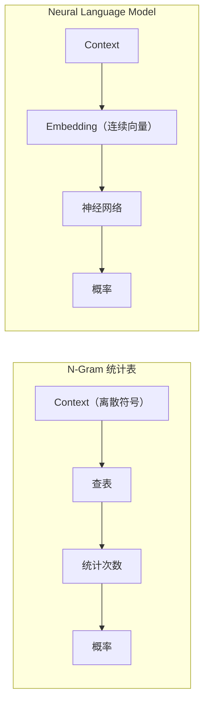

# Chapter 6：从 N-Gram 到 Neural Language Model

> **本章目标**
>
> 上一章，我们学习了 Context Window，并亲手搭了一个 N-Gram 统计表语言模型（Experiment 5.2）。它确实能利用上下文做预测，但本质上仍然只是一张"查表"：它记录的是"某个 Context 后面出现过什么、出现了几次"，除此之外什么都不知道——**查得着的就猜，查不着的就哑火**。
>
> 本章将学习：N-Gram 统计表到底"差"在哪里、什么是数据稀疏性（Data Sparsity）、为什么统计表无法泛化、Bengio 等人在2003年提出的 Neural Language Model 是如何用神经网络取代统计表的，以及这次升级具体改变了训练数据的哪一个环节。
>
> 学完本章你会发现：**Neural Language Model 并不是为了让预测更"花哨"，而是为了让模型第一次具备"举一反三"的能力。**

---

# 本章地图：零件在概念章，组装在本章

第 4 章用玩具例子认识了每个零件；本章把它们装进真正的流水线。下面这张表是每节的"概念出处"和"本节新增"——遇到"这和前面有什么区别"的疑问，回来对照即可：

| 本节 | 零件 | 概念出处 | 本节新增 |
|---|---|---|---|
| 数据集（本章正文，不单独编号） | (Context → Target) 样本 | 第 5 章 Experiment 5.1 | 单词 → Token ID（内容太少，不单开文件，也不占用 6.x 编号） |
| Embedding Lookup（本章正文，不单独编号） | Token → 向量 | 第 3 章 | 一次取出整个 Context 的向量（同样并入本章正文，不占用编号） |
| 6.1 Concatenate | 多向量 → 单向量 | 全新 | 保留词序的合并方式 |
| 6.2 第一次前向 | Linear → ReLU → Linear | 第 4 章 4.5~4.7 | 接到真实 Context 输入 |
| 6.3 第一次预测 | Logits → 概率 | 第 4 章 4.8 | 第一次真正"预测"出一个词 |
| 6.4 第一次打分 | Loss = -log(P) | 第 4 章 4.9 | 真实错误案例 + Perplexity |
| 6.5 | 反向传播（梯度从哪来） | 全新（复用第4章数字链） | 亲手算出每个梯度 |
| 6.6 | 梯度下降（梯度怎么用） | 全新 | 模型如何学会 |
| 6.7 | 第一次端到端训练 | 全新 | 让模型真正学会 |
| 6.8 | Adam、权重初始化 | 全新 | 现代优化器 |
| 6.9 | 阶段性成果：训练 Embedding 模型 | 第1~6章全部零件 | 第一个完整模型（共现矩阵+SVD） |

也就是说：本章正文（数据集、Embedding Lookup）+ 6.1~6.4 是"把已认识的零件装进同一条流水线"，从 6.5 起才是本章真正的新知识：**先亲手算出梯度（6.5 反向传播），再用梯度训练（6.6 梯度下降 → 6.7 完整训练 → 6.8 优化器）**。代码演进的原则不变——每一步都只在前一步的基础上增加一个环节。

---

# 6.0 N-Gram 统计表的问题：查过的才认识，没查过的一无所知

回顾上一章 Experiment 5.2 的那张表：Key 是 Context，Value 是"后面出现过什么 Token、出现了几次"。预测的时候，模型只是拿着当前 Context 去表里查一下，然后按统计到的次数计算概率——**它从始至终没有"理解"过任何一个词，只是在做查表和计数。**

先用一行代码把上一章的 `build_ngram_table` 重新跑一遍，感受这张表长什么样：

```python
# 沿用 Experiment 5.2 的 build_ngram_table 与语料
table = build_ngram_table(["I love AI", "I love Python", "I like AI"], n=2)
for context, targets in table.items():
    print(context, "->", dict(targets))
```

输出：

```
('I', 'love') -> {'AI': 1, 'Python': 1}
('I', 'like') -> {'AI': 1}
```

到这里，模型确实"学会"了一些东西：看到 `I love`，接下来可能是 `AI` 或 `Python`；看到 `I like`，接下来可能是 `AI`。**但现在问一个关键问题**：如果输入一个训练时从未出现过的Context `("I", "enjoy")`，模型会怎么回答？

```python
query = ("I", "enjoy")
print(f"查询 {query}:", dict(table.get(query, {})))
```

输出：

```
查询 ('I', 'enjoy'): {}
```

**模型完全不知道该说什么——一片空白。** 这正是问题的核心：`love`、`like`、`enjoy` 这三个词的意思明明非常接近，一个真正理解语言的模型，看到 `I enjoy` 之后，应该本能地觉得接下来很可能也是 `AI` 或 `Python`。但对 N-Gram 统计表来说，`("I", "love")`、`("I", "like")`、`("I", "enjoy")` 是三个**完全没有关系**的独立 Key，表里查不到 `("I", "enjoy")`，就是查不到，`love` 和 `like` 已经积累的统计信息，一点也传递不到 `enjoy` 身上。

---

# 数据稀疏性（Data Sparsity）

这个问题有一个专门的名字：**Data Sparsity（数据稀疏性）**。Context 越长（N 越大），可能出现的 Context 组合就越多，而训练数据总是有限的，绝大多数组合永远不会被训练数据覆盖到。更麻烦的是，即使加大训练数据规模，这个问题也不会消失——**语言的组合空间几乎是无限的，但真实出现过的句子永远只是其中极小的一部分**。统计表这种"只认识见过的，没见过的一律不认识"的工作方式，天生就撞上了这个天花板。

---

# 一个大胆的想法：如果词本身就有"含义"呢？

问题的根源在于：N-Gram 统计表把每一个 Context 当作一个孤立的符号（Symbol）来处理，`love`、`like`、`enjoy` 对它来说只是三个不同的字符串，彼此没有任何联系。但如果我们能给每一个词分配一个**向量**，让意思相近的词，向量也彼此接近——那么模型只需要从"`love`后面接`AI`"这一条统计规律里，就能自动"泛化"出"`enjoy`后面大概率也接`AI`"，因为 `enjoy` 的向量和 `love` 很接近。

**这正是 Neural Language Model 的核心思路**：不再维护一张离散的统计表，而是用一个神经网络，让相近的词共享相近的向量表示，从而具备统计表永远学不会的能力——**泛化（Generalization）**。



2003 年，Yoshua Bengio 等人正式提出了这一思路，被称为**Neural Language Model**——这是第一个用神经网络取代统计表的语言模型，也是本章接下来要亲手实现的对象。

---

# 这次升级，到底改变了训练数据的哪一步？

对比一下：N-Gram 的训练样本是 `[I, love] → AI`，这一点在 Neural Language Model 里完全不变——**我们要预测的问题没有变，变的是"怎么表示 Context"和"怎么从 Context 算出概率"这两个环节**：

| | N-Gram 统计表 | Neural Language Model |
|---|---|---|
| Context 的表示方式 | 离散的符号（字符串本身） | 连续的向量（Embedding） |
| 从 Context 到概率的方式 | 直接查表、统计次数 | 神经网络前向计算 |
| 能否泛化到没见过的组合 | 不能 | 能（相近的词有相近的向量） |
| 训练得到的是什么 | 一张统计表 | 一组可学习的参数（Embedding + 网络权重） |

接下来几节，我们会把这套神经网络逐块拼出来：**Embedding Lookup**（把 Token 变成向量）→ **Concatenate**（把多个 Token 的向量拼在一起）→ **MLP Forward**（第一次前向计算）→ **Softmax**（算出概率分布）→ **Cross Entropy**（衡量预测得好不好）→ **Gradient Descent**（模型如何从错误中学习）——最终亲手训练出第一个真正意义上的 Neural Language Model。

---

# Today's Question

本章先不急于回答"神经网络具体怎么算"，而是留下一个问题：

> **如果一个词的"含义"可以用一个向量表示，那么这个向量应该从哪里来？是人工设定，还是让模型自己学出来？**

要回答这个问题，第一步是把数据准备好——这也是接下来要做的第一件事。

---

# 构建第一个 Neural Language Model 数据集

## 实验目标

这一步不涉及任何新概念：Vocabulary、Token ID 已经是第 2 章 Tokenizer 讲透的内容；`(Context → Target)` 的滑动窗口构造方式，也已经是 Experiment 5.1 亲手写过的代码。本节唯一要做的事，是把 5.1 那份**单词版**样本，换成神经网络唯一能接受的**Token ID 版**。

## 代码

```python
#!/usr/bin/env python3
sentence = ["I", "love", "AI", "today"]
vocab = {"I": 0, "love": 1, "AI": 2, "today": 3}   # 第 2 章 Tokenizer 的做法
id2word = {v: k for k, v in vocab.items()}
token_ids = [vocab[w] for w in sentence]

window_size = 2                                     # 沿用 Experiment 5.1 的滑动窗口
samples = []
for i in range(window_size, len(token_ids)):
    context = token_ids[i - window_size:i]
    target = token_ids[i]
    samples.append((context, target))

for context, target in samples:
    words = [id2word[i] for i in context]
    print(context, "->", target, f"   ({words} -> {id2word[target]})")
```

输出：

```text
[0, 1] -> 2   (['I', 'love'] -> AI)
[1, 2] -> 3   (['love', 'AI'] -> today)
```

模型真正学习的关系仍然是 `[I, love] → AI`；变化的只是表示方式——从字符串变成了 Token ID。这份 `samples`，就是接下来本章会一直复用的训练数据。

## 思考题

把 `window_size` 改成 3，或把语料换成 `I really love AI today`（窗口仍为 2），会生成多少条样本？先手动推算，再运行代码验证。

---

## 本节总结

数据集已经 ID 化完毕。下一步，我们将把这些 Token ID 转换成向量——正式开始回答本章留下的问题。

---

# Embedding Lookup——把 Token 转换成向量

## 实验目标

Embedding Matrix 是什么、Lookup 为什么只是数组索引，第 3 章（3.1、3.2）已经讲透，这里不再重复。本节唯一要做的新事情：第 3 章的 Lookup 一次只查**一个** Token ID；这里要一次查出**整个 Context**（多个 Token ID）对应的多行向量，为下一节（6.1）的 Concatenate 做准备。

## 代码

```python
import numpy as np

embedding = np.array([        # 沿用上面的 4 个 Token
    [0.2, -0.3, 0.5],          # I
    [0.8,  0.4,-0.1],          # love
    [0.6,  0.1, 0.7],          # AI
    [-0.2, 0.9, 0.3],          # today
])

context = [0, 1]              # 上面生成的第一条样本：[I, love]
vectors = embedding[context]  # 一次查出两行，而不是查一次拿一行
print(vectors)
print(vectors.shape)
```

输出：

```text
[[ 0.2 -0.3  0.5]
 [ 0.8  0.4 -0.1]]
(2, 3)
```

`embedding[context]` 和 `embedding[token_id]` 是同一种数组索引，只是 `context` 传入的是一个列表而不是单个整数，NumPy 会按顺序取出对应的多行，结果 Shape 是 `(窗口大小, Embedding 维度)`——这里是 `(2, 3)`,表示"2 个 Token，每个 3 维"。GPT 里例如 `512 × 4096`，说的正是同一件事，只是规模更大。

## 本节总结

Embedding Lookup 的原理没有变化，仍然是数组索引；本节唯一的新变化是**一次查多行**，得到一个 `(窗口大小, 维度)` 的矩阵。但 MLP 只接受一个向量作为输入，这两行向量该怎么变成一个输入？下一节 **6.1 Concatenate** 来解决。

---

# 参考资料

- 吴恩达《深度学习》课程（神经网络与深度学习基础）：https://www.bilibili.com/video/BV12urfB1E7s
- Andrej Karpathy《Neural Networks: Zero to Hero》系列（micrograd / makemore / Let's build GPT / nanoGPT）：https://www.youtube.com/@AndrejKarpathy
- Sebastian Raschka《Build a Large Language Model (From Scratch)》配套代码与全书资源：https://github.com/rasbt/LLMs-from-scratch
