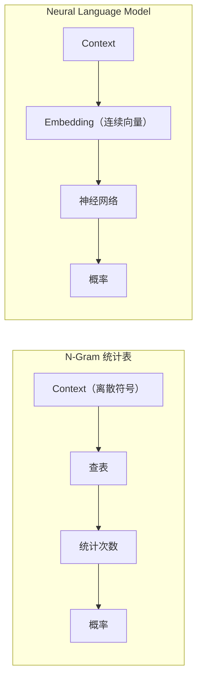

# Chapter 6：从 N-Gram 到 Neural Language Model

> **本章目标**
>
> 上一章，我们学习了 Context Window，把 `Token → Next Token` 升级成了 `Context → Next Token`，模型第一次能够利用前面几个 Token 做预测。但 N-Gram 统计表本质上仍然只是一张"查表"：它记录的是"某个 Context 后面出现过什么、出现了几次"，除此之外什么都不知道。
>
> 本章将学习：N-Gram 统计表到底"差"在哪里、什么是数据稀疏性（Data Sparsity）、为什么统计表无法泛化、Bengio 等人在2003年提出的 Neural Language Model 是如何用神经网络取代统计表的，以及这次升级具体改变了训练数据的哪一个环节。
>
> 学完本章你会发现：**Neural Language Model 并不是为了让预测更"花哨"，而是为了让模型第一次具备"举一反三"的能力。**

---

# 6.0 N-Gram 统计表的问题：查过的才认识，没查过的一无所知

回顾上一章的 N-Gram 数据集：`[I, love] → AI`、`[love, AI] → today`。训练完成后，模型内部其实就是一张表：Key 是 Context，Value 是"后面出现过什么 Token、出现了几次"。预测的时候，模型只是拿着当前 Context 去表里查一下，然后按统计到的次数计算概率——**它从始至终没有"理解"过任何一个词，只是在做查表和计数。**

用一个小例子直观感受这张表到底记录了什么：

```python
from collections import defaultdict

def build_ngram_table(corpus, n=2):
    table = defaultdict(lambda: defaultdict(int))
    for sentence in corpus:
        tokens = sentence.split()
        for i in range(len(tokens) - n):
            context = tuple(tokens[i:i + n])
            target = tokens[i + n]
            table[context][target] += 1
    return table

corpus = ["I love AI", "I love Python", "I like AI"]
table = build_ngram_table(corpus, n=2)

for context, targets in table.items():
    print(context, "->", dict(targets))
```

输出：

```
('I', 'love') -> {'AI': 1, 'Python': 1}
('I', 'like') -> {'AI': 1}
```

到这里，模型确实"学会"了一些东西：看到 `I love`，接下来可能是 `AI` 或 `Python`；看到 `I like`，接下来可能是 `AI`。**但现在问一个关键问题**：如果输入一个训练时从未出现过的Context `("I", "enjoy")`，模型会怎么回答？

```python
query = ("I", "enjoy")
print(f"查询 {query}:", dict(table.get(query, {})))
```

输出：

```
查询 ('I', 'enjoy'): {}
```

**模型完全不知道该说什么——一片空白。** 这正是问题的核心：`love`、`like`、`enjoy` 这三个词的意思明明非常接近，一个真正理解语言的模型，看到 `I enjoy` 之后，应该本能地觉得接下来很可能也是 `AI` 或 `Python`。但对 N-Gram 统计表来说，`("I", "love")`、`("I", "like")`、`("I", "enjoy")` 是三个**完全没有关系**的独立 Key，表里查不到 `("I", "enjoy")`，就是查不到，`love` 和 `like` 已经积累的统计信息，一点也传递不到 `enjoy` 身上。

---

# 数据稀疏性（Data Sparsity）

这个问题有一个专门的名字：**Data Sparsity（数据稀疏性）**。Context 越长（N 越大），可能出现的 Context 组合就越多，而训练数据总是有限的，绝大多数组合永远不会被训练数据覆盖到。更麻烦的是，即使加大训练数据规模，这个问题也不会消失——**语言的组合空间几乎是无限的，但真实出现过的句子永远只是其中极小的一部分**。统计表这种"只认识见过的，没见过的一律不认识"的工作方式，天生就撞上了这个天花板。

---

# 一个大胆的想法：如果词本身就有"含义"呢？

问题的根源在于：N-Gram 统计表把每一个 Context 当作一个孤立的符号（Symbol）来处理，`love`、`like`、`enjoy` 对它来说只是三个不同的字符串，彼此没有任何联系。但如果我们能给每一个词分配一个**向量**，让意思相近的词，向量也彼此接近——那么模型只需要从"`love`后面接`AI`"这一条统计规律里，就能自动"泛化"出"`enjoy`后面大概率也接`AI`"，因为 `enjoy` 的向量和 `love` 很接近。

**这正是 Neural Language Model 的核心思路**：不再维护一张离散的统计表，而是用一个神经网络，让相近的词共享相近的向量表示，从而具备统计表永远学不会的能力——**泛化（Generalization）**。



2003 年，Yoshua Bengio 等人正式提出了这一思路，被称为**Neural Language Model**——这是第一个用神经网络取代统计表的语言模型，也是本章接下来要亲手实现的对象。

---

# 这次升级，到底改变了训练数据的哪一步？

对比一下：N-Gram 的训练样本是 `[I, love] → AI`，这一点在 Neural Language Model 里完全不变——**我们要预测的问题没有变，变的是"怎么表示 Context"和"怎么从 Context 算出概率"这两个环节**：

| | N-Gram 统计表 | Neural Language Model |
|---|---|---|
| Context 的表示方式 | 离散的符号（字符串本身） | 连续的向量（Embedding） |
| 从 Context 到概率的方式 | 直接查表、统计次数 | 神经网络前向计算 |
| 能否泛化到没见过的组合 | 不能 | 能（相近的词有相近的向量） |
| 训练得到的是什么 | 一张统计表 | 一组可学习的参数（Embedding + 网络权重） |

接下来几节，我们会把这套神经网络逐块拼出来：**Embedding Lookup**（把 Token 变成向量）→ **Concatenate**（把多个 Token 的向量拼在一起）→ **MLP Forward**（第一次前向计算）→ **Softmax**（算出概率分布）→ **Cross Entropy**（衡量预测得好不好）→ **Gradient Descent**（模型如何从错误中学习）——最终亲手训练出第一个真正意义上的 Neural Language Model。

---

# Today's Question

本章先不急于回答"神经网络具体怎么算"，而是留下一个问题：

> **如果一个词的"含义"可以用一个向量表示，那么这个向量应该从哪里来？是人工设定，还是让模型自己学出来？**

下一节，我们将从构建数据集开始，一步一步拼出这套神经网络，并回答这个问题：**6.1 构建第一个 Neural Language Model 数据集**。
