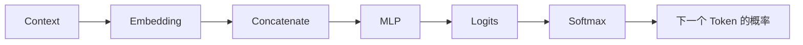

# 6. 神经语言模型——从 N-Gram 到分布式表示

> **本章目标**
>
> 上一章，我们学习了 Context Window，并亲手搭了一个 N-Gram 统计表语言模型（Experiment 5.2）。它确实能利用上下文做预测，但本质上仍然只是一张“查表”：记录“某个 Context 后面出现过什么、出现了几次”。**查得着的就猜，查不着的就哑火。**
>
> 本章将从这个限制出发，理解数据稀疏性（Data Sparsity）与泛化（Generalization），再认识 Bengio 等人在 2003 年提出的 Neural Language Model：它如何用 `Context → Embedding → Concatenate → MLP → 概率` 取代离散统计表。
>
> 学完本章你会发现：**Neural Language Model 的关键升级，是让模型第一次能够通过可学习的连续表示“举一反三”。**

---

# 本章地图：把第4章接入语言模型

第4章已经解释神经网络组件，本章只处理它们在固定窗口语言模型中的连接方式：

| 内容 | 流水线位置 | 本章新增 |
|---|---|---|
| 本章理论 | N-Gram → Neural Language Model | 数据稀疏、泛化与整体结构 |
| 6.1 Concatenate | Context → Embedding → 拼接输入 | 保留固定窗口内的词序 |
| 6.2 前向传播与评估 | MLP → Logits → Probability → Loss → Perplexity | 完成一次预测并量化误差 |

本章结束时，模型已经能够从 Context 计算下一个 Token 的概率和 Loss，但参数还不会改变。第7章再专门解释反向传播、梯度下降与端到端训练；第8章讨论 AdamW、初始化、学习率调度和真实语料训练。

---

# N-Gram 统计表的问题：查过的才认识

回顾 Experiment 5.2：N-Gram 表的 Key 是 Context，Value 是后续 Token 的出现次数。比如训练语料中出现过 `I love AI`、`I love Python` 和 `I like AI`，表里就会留下：

```text
(I, love) → {AI: 1, Python: 1}
(I, like) → {AI: 1}
```

看到 `I love` 时，模型可以根据计数给 `AI` 和 `Python` 分配概率；但如果输入训练时从未出现过的 `I enjoy`，表里没有这个 Key，也就没有任何计数可以使用。

问题不只是“语料还不够多”。对统计表而言，`love`、`like`、`enjoy` 只是三个互不相关的字符串：即使 `I love` 和 `I like` 已经积累了统计信息，也无法把这些经验传递给 `I enjoy`。它记住的是完整组合，而不是词之间可以共享的规律。

---

# 数据稀疏性（Data Sparsity）

这个问题叫做**数据稀疏性**。假设词表大小为 $V$，固定窗口包含 $N$ 个 Token，仅理论上的 Context 组合就可能达到 $V^N$ 种。随着窗口变长，组合数呈指数增长，而训练语料只能覆盖其中很小的一部分。

自然语言还能不断组成新句子，所以“收集更多语料”只能缓解问题，无法让统计表覆盖所有组合。N-Gram 的困境可以概括为：

1. 每个 Context 都是孤立的离散 Key；
2. 没见过的 Key 没有可靠计数；
3. 相似 Context 之间不能共享信息；
4. 窗口越长，稀疏问题越严重。

---

# 从记忆组合到学习表示：泛化

如果每个词不再只是一个字符串，而是由一个可学习向量表示，模型就有机会让用法相近的词获得相近的向量。这样，从 `I love → AI` 学到的参数，也可能对包含 `like` 或 `enjoy` 的相似 Context 有帮助。

这种把已学规律应用到未见样本的能力，叫做**泛化（Generalization）**。这里要注意：Embedding 并非人工写好的“词义坐标”，随机初始化的向量也不会天然理解语义；它会和网络权重一起，在训练误差的推动下逐步调整。相似用法能否形成相似表示，是训练的结果。

N-Gram 与 Neural Language Model 的根本差异因此不在训练样本的形式。两者都可以学习 `[I, love] → AI` 这样的 `(Context → Target)` 关系；变化的是 Context 的表示方式，以及从 Context 得到概率的方式：

| | N-Gram 统计表 | Neural Language Model |
|---|---|---|
| Context 表示 | 离散字符串组合 | 多个可学习的 Embedding |
| 预测方式 | 查表并归一化计数 | MLP 前向计算后转成概率 |
| 未见组合 | 没有对应 Key 时无法共享经验 | 可通过共享参数与相近表示泛化 |
| 学习结果 | 计数表 | Embedding 与网络权重 |

---

# Neural Language Model 的结构

Bengio 等人在 2003 年提出的 Neural Language Model 奠定了一条经典路线：把固定长度 Context 中的词映射为连续向量，再交给神经网络预测下一个词。



每一步的职责不同：

1. **Context**：固定窗口内的多个 Token，例如 `[love, AI]`。
2. **Embedding**：按 Token ID 取出每个 Token 的可学习向量。
3. **Concatenate**：按原顺序首尾拼接多个向量，得到固定长度的单个输入向量。
4. **MLP**：用共享的权重组合 Context 信息，输出词表中每个候选 Token 的分数（Logits）。
5. **Softmax**：把 Logits 转成总和为 1 的概率分布。

因此，完整路线是：

```text
Context → Embedding → Concatenate → MLP → Logits → Softmax → Probability
```

Concatenate 在这里不仅改变 Shape，还保留位置：`[I, love]` 与 `[love, I]` 会拼成不同的输入。6.1 会先完成 Token ID 数据集与 Embedding Lookup 的实验准备，再专门比较拼接、求和与平均；6.2 则把拼接结果送入 MLP。

---

# 从一次预测到真正学会

上述结构只说明“概率怎样算出来”，还没有说明参数怎样变好。一次完整训练还需要后半段：

```text
Probability + Target → Loss → Backpropagation → Gradient Descent → 更新参数
```

Loss 衡量当前预测与正确答案的差距；反向传播计算每个参数对错误负有多少责任；梯度下降据此更新 Embedding 和 MLP 权重。经过许多样本和许多轮更新，模型才可能形成可泛化的连续表示。

至此，本章的学习路线可以压缩成三个问题：

- **为什么换？** N-Gram 受数据稀疏限制，无法在相似 Context 间共享经验。
- **换成什么？** 用 `Embedding → Concatenate → MLP → 概率` 取代查表计数。
- **怎样学会？** 用 Loss、反向传播与优化器联合更新所有可学习参数。

接下来的 6.1 从实验准备开始，把 `[I, love] → AI` 与 `[love, AI] → today` 转成 Token ID 样本，并选择第二条样本接通 `Embedding → Concatenate`；6.2 沿用同一个 6 维输入，完成预测与模型评估。

---

# 参考资料

- Bengio, Y., Ducharme, R., Vincent, P., & Jauvin, C. (2003). *A Neural Probabilistic Language Model*.
- 吴恩达《深度学习》课程（神经网络与深度学习基础）：https://www.bilibili.com/video/BV12urfB1E7s
- Andrej Karpathy《Neural Networks: Zero to Hero》系列：https://www.youtube.com/@AndrejKarpathy
- Sebastian Raschka《Build a Large Language Model (From Scratch)》配套资源：https://github.com/rasbt/LLMs-from-scratch
