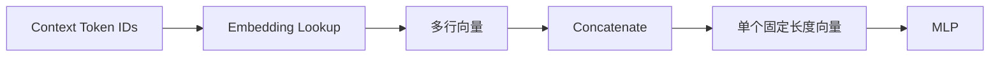

# Experiment 6.1：Concatenate——把多个 Token 合并成一个输入向量

## 实验目标

主章已经给出 Neural Language Model 的理论流水线：

```text
Context → Embedding → Concatenate → MLP → Probability
```

本实验负责接通前三步。我们会先复用第 2 章的 Vocabulary / Token ID、第 5 章的滑动窗口和第 3 章的 Embedding Lookup，完成可独立运行的实验准备；再学习本节唯一的新操作 **Concatenate（拼接）**，把 Context 中的多个向量合成一个保留词序的固定长度输入。

本实验将生成两条样本：

```text
[I, love] → AI
[love, AI] → today
```

随后明确选择第二条 `[love, AI] → today`。这样得到的 6 维输入与 6.2 完全一致。

---

# 一、实验准备：从句子构造 Token ID 样本

神经网络不能直接读取字符串，所以先用 Vocabulary 把 Token 映射为整数 ID。这里没有引入新理论：Vocabulary 和 Token ID 来自第 2 章，固定长度滑动窗口来自 Experiment 5.1。

```python
sentence = ["I", "love", "AI", "today"]
vocab = {"I": 0, "love": 1, "AI": 2, "today": 3}
id2word = {token_id: word for word, token_id in vocab.items()}
token_ids = [vocab[word] for word in sentence]

window_size = 2
samples = []
for i in range(window_size, len(token_ids)):
    context = token_ids[i - window_size:i]
    target = token_ids[i]
    samples.append((context, target))

for context, target in samples:
    context_words = [id2word[token_id] for token_id in context]
    print(context, "->", target, f"({context_words} -> {id2word[target]})")
```

输出：

```text
[0, 1] -> 2 (['I', 'love'] -> AI)
[1, 2] -> 3 (['love', 'AI'] -> today)
```

`samples` 中两条关系都是真实训练样本。本实验和 6.2 使用第二条：

```python
context, target = samples[1]
print([id2word[token_id] for token_id in context], "->", id2word[target])
# ['love', 'AI'] -> today
```

---

# 二、实验准备：一次 Lookup 整个 Context

Embedding Matrix 的每一行对应一个 Token ID。Lookup 仍然只是第 3 章学过的数组索引；区别仅在于 `context` 是包含两个 ID 的列表，因此 `embedding[context]` 会按顺序取出两行。

```python
import numpy as np

embedding = np.array([
    [ 0.2, -0.3,  0.5],  # I
    [ 0.8,  0.4, -0.1],  # love
    [ 0.6,  0.1,  0.7],  # AI
    [-0.2,  0.9,  0.3],  # today
])

vectors = embedding[context]
print(vectors)
print(vectors.shape)
```

输出：

```text
[[ 0.8  0.4 -0.1]
 [ 0.6  0.1  0.7]]
(2, 3)
```

Shape `(2, 3)` 表示“2 个 Token，每个 Token 是 3 维向量”。现在 `[love, AI] → today` 的 Context 已经变成两行向量，但 MLP 接收的是一个向量；这正是 Concatenate 要解决的问题。

---

# 三、为什么不能直接求平均？

一种直觉做法是：

```python
mean_vector = np.mean(vectors, axis=0)
```

`love` 和 `AI` 的向量平均后得到 `[0.7, 0.25, 0.3]`。虽然长度从 6 个候选数字缩成了 3 个，但平均与顺序无关：`[love, AI]` 和 `[AI, love]` 的结果完全相同。模型无法再区分哪个词在前、哪个词在后。

---

# 四、为什么不用相加？

相加同样与顺序无关：

```python
sum_vector = vectors.sum(axis=0)
```

结果是 `[1.4, 0.5, 0.6]`，而 `[AI, love]` 也会得到完全相同的结果。对于依赖词序的语言预测，这会丢失关键信息。

平均和相加并非在所有模型里都不可用；这里只是说，它们不适合充当这个固定窗口 Neural Language Model 的有序 Context 输入。

---

# 五、Concatenate：按顺序首尾拼接

Concatenate 不混合各位置的数值，而是按 Context 顺序把向量首尾相连：

```text
love: [0.8, 0.4, -0.1]
AI:   [0.6, 0.1,  0.7]

Concatenate → [0.8, 0.4, -0.1, 0.6, 0.1, 0.7]
```

于是 `[love, AI]` 和 `[AI, love]` 的前 3 维、后 3 维会交换，模型能够区分两种顺序。

NumPy 中只需一行：

```python
x = vectors.reshape(-1)  # 也可以使用 vectors.flatten()
print(x)
print(x.shape)
```

输出：

```text
[ 0.8  0.4 -0.1  0.6  0.1  0.7]
(6,)
```

如果窗口大小是 $N$，Embedding 维度是 $D$，Lookup 后的 Shape 是 `(N, D)`，拼接后的 Shape 就是 `(N × D,)`。本例是 `(2, 3) → (6,)`。

---

# 六、完整可运行代码

下面的脚本不依赖主章中的任何变量。它从原始句子开始构造两条样本，明确选择 `[love, AI] → today`，完成 Embedding Lookup 和 Concatenate，并打印 6.2 将继续使用的输入。

```python
#!/usr/bin/env python3
import numpy as np

sentence = ["I", "love", "AI", "today"]
vocab = {"I": 0, "love": 1, "AI": 2, "today": 3}
id2word = {token_id: word for word, token_id in vocab.items()}
token_ids = [vocab[word] for word in sentence]

window_size = 2
samples = []
for i in range(window_size, len(token_ids)):
    context = token_ids[i - window_size:i]
    target = token_ids[i]
    samples.append((context, target))

print("All samples:")
for sample_context, sample_target in samples:
    context_words = [id2word[token_id] for token_id in sample_context]
    print(f"  {context_words} -> {id2word[sample_target]}")

context, target = samples[1]  # [love, AI] -> today

embedding = np.array([
    [ 0.2, -0.3,  0.5],  # I
    [ 0.8,  0.4, -0.1],  # love
    [ 0.6,  0.1,  0.7],  # AI
    [-0.2,  0.9,  0.3],  # today
])

vectors = embedding[context]
x = vectors.reshape(-1)

context_words = [id2word[token_id] for token_id in context]
print("\nSelected sample:", context_words, "->", id2word[target])
print("Context IDs:", context)
print("Embedding Lookup:")
print(vectors)
print("Embedding Shape:", vectors.shape)
print("\nConcatenate:", x)
print("Input Shape:", x.shape)
```

运行结果：

```text
All samples:
  ['I', 'love'] -> AI
  ['love', 'AI'] -> today

Selected sample: ['love', 'AI'] -> today
Context IDs: [1, 2]
Embedding Lookup:
[[ 0.8  0.4 -0.1]
 [ 0.6  0.1  0.7]]
Embedding Shape: (2, 3)

Concatenate: [ 0.8  0.4 -0.1  0.6  0.1  0.7]
Input Shape: (6,)
```

---

# 七、实验分析

这一节只新增了 `x = vectors.reshape(-1)`，但它完成了一个关键接口转换：



Concatenate 的价值有两点：

1. 保留每个位置的完整 Embedding，因此保留固定窗口内的词序；
2. 把 `(window_size, embedding_dim)` 转为 MLP 可以接收的一维向量。

它也带来一个限制：输入维度固定为 `window_size × embedding_dim`，因此窗口大小不能在同一个 MLP 中随意变化。后续 RNN 和 Transformer 会用不同结构处理更灵活的序列，但本章先把固定窗口模型学透。

---

# 八、思考题

1. 把 `window_size` 改成 3 时，这句话会生成几条样本？选中的 Context、Target 和拼接 Shape 分别是什么？
2. 如果 `embedding_dim = 8`、`window_size = 2`，MLP 的输入维度是多少？
3. 手动交换 `context` 中的两个 ID，验证平均、相加结果不变，而 Concatenate 结果发生变化。

---

# 本实验总结

本实验完成了三件事：构造 Token ID 版 `(Context → Target)` 样本；一次 Lookup 整个 Context；用 Concatenate 得到保留词序的单个输入向量。

下一实验将沿用同一条 `[love, AI] → today` 样本，把

```text
[0.8, 0.4, -0.1, 0.6, 0.1, 0.7]
```

送入 **MLP（多层感知机）**，并继续计算概率、Loss 与 Perplexity。
