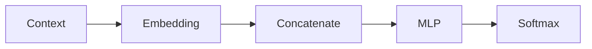

# Experiment 6.1：Concatenate——把多个 Token 合并成一个输入向量

## 实验目标

上一实验，我们已经完成了 `[I, love] → Embedding Lookup → [[0.2,-0.3,0.5],[0.8,0.4,-0.1]]`。现在问题来了：神经网络（MLP）的输入通常是**一个向量**，而不是**多个向量**。因此我们需要把多个 Embedding 合并成**一个固定长度的输入向量**，这一步叫做**Concatenate（拼接）**。

实验结束后，你将理解为什么需要 Concatenate、Concat 与求和（Sum）、平均（Average）的区别、为什么 Bengio 2003 采用 Concat，以及 Concat 后向量 Shape 如何变化。

最终效果：

```text
[0.2,-0.3,0.5] + [0.8,0.4,-0.1]--Concatenate-->  [0.2,-0.3,0.5,0.8,0.4,-0.1]
```

---

# 一、实验原理

假设窗口大小 2，Embedding Dimension 3，Lookup 后得到 Shape `(2,3)`，表示"2 个 Token × 3 维Embedding"。但 MLP 希望输入 Shape 是 `(6,)`，因此需要展开。

---

# 二、为什么不能直接求平均？

很多人会想到 `x = np.mean(vectors, axis=0)`，例如 `[0.2,-0.3,0.5]` 和 `[0.8,0.4,-0.1]` 平均得到 `[0.5,0.05,0.2]`。长度变成 3，但出现了严重问题：原来 `I love` 的顺序已经消失——`I love` 和 `love I` 平均以后结果完全一样，模型再也不知道哪个词在前、哪个在后。因此平均不可行。

---

# 三、为什么不用相加？

`x = vectors.sum(axis=0)` 得到 `[1.0,0.1,0.4]`，仍然存在同样问题：`I love` 和 `love I` 相加后结果完全一样，词序信息再次丢失。

---

# 四、Concatenate（拼接）

最简单的方法是保持每个 Embedding 完整，首尾相连：`[0.2,-0.3,0.5]` + `[0.8,0.4,-0.1]` → `[0.2,-0.3,0.5,0.8,0.4,-0.1]`。这样每一个位置都保留下来，词序自然也保留下来。

---

# 五、NumPy 实现 Concatenate

```python
import numpy as np

embedding = np.array([
    [0.2,-0.3,0.5],
    [0.8,0.4,-0.1],
    [0.6,0.1,0.7],
    [-0.2,0.9,0.3]
])

context = [0,1]
vectors = embedding[context]
print(vectors)
# [[ 0.2 -0.3  0.5]
#  [ 0.8  0.4 -0.1]]

x = vectors.reshape(-1)   # 或 vectors.flatten()
print(x)
# [ 0.2 -0.3  0.5  0.8  0.4 -0.1]
```

已经成功变成一个向量。

---

# 六、观察 Shape

```python
print(vectors.shape)  # (2,3)
print(x.shape)        # (6,)
```

可以理解成 `2 × 3 → 6`，MLP 终于可以接受输入了。

---

# 七、完整代码

```python
#!/usr/bin/env python3
import numpy as np

embedding = np.array([
    [0.2,-0.3,0.5],
    [0.8,0.4,-0.1],
    [0.6,0.1,0.7],
    [-0.2,0.9,0.3]
])

context = [0,1]
vectors = embedding[context]
x = vectors.reshape(-1)

print("Embedding:")
print(vectors)
print("\nConcatenate:")
print(x)
print("\nOriginal Shape:", vectors.shape)
print("New Shape:", x.shape)
```

---

# 八、运行结果

```text
Embedding:
[[ 0.2 -0.3  0.5]
 [ 0.8  0.4 -0.1]]

Concatenate:
[ 0.2 -0.3  0.5  0.8  0.4 -0.1]

Original Shape: (2,3)
New Shape: (6,)
```

---

# 九、实验分析

这一节虽然只有一行代码 `x = vectors.reshape(-1)`，但完成了一件非常重要的事情：**把多个 Token 的表示，转换成了一个固定长度的输入向量。** 因此后面的 MLP 终于可以开始工作。这也是 Bengio 2003 Neural Language Model 的经典结构：



---

# 十、思考题

尝试修改 `context = [0,1,2]`，观察拼接后的 Shape 是否变成 `(9,)`。如果 Embedding Dimension 修改成 8，最终 Shape 又是多少？请先自己计算，再运行程序验证。

---

# 本实验总结

本实验完成了：✅ Embedding Lookup ✅ Concatenate ✅ Shape 变化 ✅ MLP 输入准备

下一实验，我们将把这个向量送入真正的 **MLP（多层感知机）**，完成第一个神经语言模型的前向预测。
